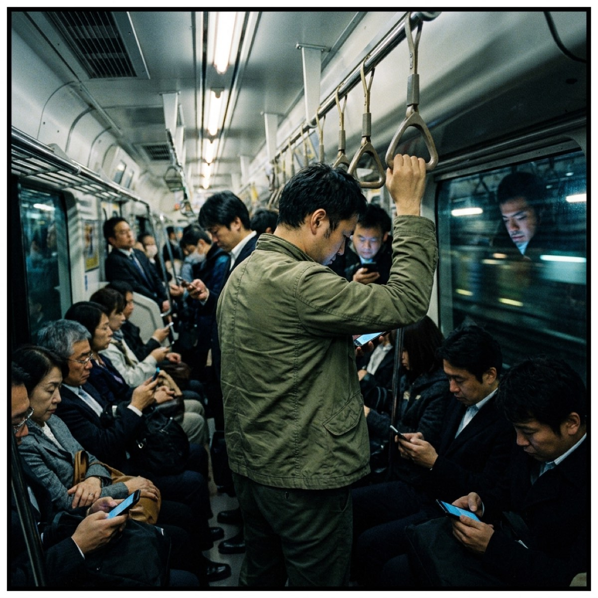

## 第一章：失聯的寄件者

商業大樓中央空調的低頻嗡嗡聲，在深夜十一點半空曠的樓層裡顯得有些多餘。

白川扯鬆了領帶，端起桌上的紙杯。杯裡的冰美式早就融化了，冰塊化成的冷水把咖啡稀釋成一種說不清顏色的液體。喝下去是泥土的味道。他把杯子放回去，沒有喝完。

螢幕中央，數據導出的進度條卡在百分之八十七。

他用指腹用力按了按太陽穴。報表運算極慢，散熱風扇發出高頻的哀鳴，辦公室裡的其他人早已下班，燈光調成了省電的幽暗模式，他的格子間像一個發光的魚缸，把他孤零零地展示在空曠的樓層中央。

在等待的空檔，他點開了瀏覽器的書籤管理員，想清理一些年久失修的連結。滑鼠滾輪緩慢下滑，在「資料庫調研」、「專案看板」、「季報模板」的大片連結末端，有一個沒有圖標的灰底連結。

連結的名字只有四個字：下落不明。

滑鼠游標停了下來。

白川盯著那四個字。記憶的齒輪發出遲鈍的摩擦聲。他輕輕點了左鍵。

網頁加載得很慢。這是一個早已沒落的部落格平台，版面維持著十幾年前的雙欄排版，背景是粗糙的像素灰。標題欄寫著「白川的自言自語」，副標題是「在風平浪靜裡坍塌」。

他想起來了。這是大二那年申請的帳號，二○一一年。

側邊欄原本掛著一個播放獨立樂團音樂的 Flash 外掛，現在只剩一個破碎的紅色十字圖標。他記得那個樂團已經解散了，大概是幾年前的事。

第一篇文章，發布於二○一一年十一月十四日：

『十一點半，剛從 Livehouse 擠地鐵回來。車廂裡的燈光白得發青，每個人都低著頭看手機，像是在對著一塊發光的磚頭祈禱。他們看起來甚至沒有在呼吸。我突然覺得很恐怖，難道讀完書、找份工作、然後像他們一樣在地鐵裡搖晃四十年，就是所謂的「正常生活」？』

白川看著螢幕上的字。

那些句子短促，帶著一種令人發噱的憤慨——他二十歲的自己，用地鐵車廂裡的幾個陌生人，就輕易得出了對整個世界的結論。

他滾動滑鼠，看到了另一篇：

『今天去聽就業說明會。台上的講師一邊調整領帶，一邊教我們怎麼寫履歷，怎麼把自己包裝成一件合格商品。他說，不要在履歷上寫無關的愛好，要把自己修剪得乾淨、聽話、符合市場需求。大家都在拼命抄筆記。真是可笑。每個人都在排隊等著被改掉，還生怕自己改得不夠徹底。』

白川盯著「被改掉」這三個字看了一會兒。

他沒有特別的感受，或者說，他分辨不出那種感受是什麼。他試著回憶寫下這段話時的情緒，記得那年埔里冬天雨水特別多，記得宿舍陽台鏽跡斑斑的鐵欄杆，甚至記得當時在抽的那包菸的牌子。但那種憤怒的質地——對「有用沒用」的強烈排斥——他已經想不起來了。

就像在看一個他不認識的人寫的東西。

這時候，網頁右下角彈出一個黃色公告：

『親愛的用戶您好，本平台因業務調整，將於下個月三十一日起正式終止所有網頁託管服務，屆時所有數據將被永久清除，請各位用戶及時打包備份……』

白川看著那個公告。螢幕的藍光映在他臉上，沒有什麼波動。他切換到後台，滑鼠游標懸在「下載備份」的按鈕上方，停在那裡沒有按下去。

背後辦公軟體發出一聲提示音，銷售報表導出完成。

白川沒有去關閉部落格，也沒有去動那份報表。他就這樣對著兩個並排的視窗坐在那裡，辦公室的冷氣繼續吹，進度條不再顯示任何東西。

---

## 第二章：風平浪靜裡的塌陷

地鐵車門在身後合攏，把秋天早晨的冷雨隔在外面。

車廂裡塞得很滿。空氣裡有潮濕雨傘的氣味，還有某種廉價罐裝咖啡的甜膩。列車起步，黑壓壓的人群像被同一根繩子拉著，向一側整齊地傾斜。

沒有人說話。

白川右手抓著吊環。他看著車窗玻璃上倒映出的自己——剪著整齊短髮、穿深灰色防風外套、背黑色雙肩包的三十五歲男人——隨著列車的節奏機械地搖晃著。

他記得自己二十歲時把這種搖晃寫進了日記，用的字是「恐怖」。

現在他覺得這種搖晃挺平穩的，至少在車廂裡，什麼都不用決定。

出站，刷卡，穿過商辦大樓的旋轉門。保安打著哈欠點了個頭，白川也點了個頭。角度是一樣的，幅度是一樣的，這個互動每天早上進行一次，雙方都很熟練。

「白川，過來一下。」

剛坐下，陳經理就從隔間喊了一聲。

陳經理指著白川昨晚熬夜跑出來的報表，眉頭皺著。「你這個客戶行為分析做得太複雜了。我們是做銷售的，客戶不需要看這些，他們只看轉化率和淨利潤。這些分析沒用。」

「沒用」這兩個字，他說得很順口。

白川看了一眼陳經理的領帶結——歪了幾度，沒有調整。他低下頭，讓臉上呈現出最標準的受教姿態。

「好，我下午前重新調整格式給您。」

「嗯，這樣就對了。做有用的事。」陳經理拍了拍他的肩，轉身去接電話。

白川坐回格子間，點開 Excel。「刪除整列」，那幾頁試圖解釋「人為什麼做這個決策」的分析消失了。他看著刪掉之後變得整齊的表格，甚至感到幾分輕鬆。少了很多字，看起來確實更乾淨。

中午，他跟著老周和小齊走去茶水間。

老周嚼著微波盒飯裡縮水的豬排，嘆氣：「房貸利率又升了，每個月睜眼就是五萬。三十年，我得保證自己這三十年不生病、不失業。」

「能怎麼辦，算了吧。」小齊翻著手機，「踏踏實實，少想那些沒用的事。大家不都是這樣過來的。」

「也是，算了吧。」老周低頭繼續吃。

白川看著便當盒裡升起的水汽，沒有說話。

「算了吧」這三個字，每天在這棟大樓的各個角落被反覆說起，像某種被大家不約而同記住了的口訣。說完之後，事情就不再是問題。

他想不起來，自己是從什麼時候開始，不再覺得這個詞有什麼問題的。

沒有發生過任何大事。沒有哪個早上突然醒來決定變成一個不同的人，也沒有什麼強迫他放棄什麼。一切都很緩慢，甚至談不上「發生」。只是某個加班的夜裡，妥協比堅持省力；只是某個發薪日，帳戶裡的數字比什麼都讓人安心；只是在無數個「算了吧」的瞬間裡，他主動伸出手，讓人把身上多餘的稜角一處處磨掉。

他沒有不快樂。他只是很少想到「快不快樂」這個問題。

下班的時候，秋雨停了。柏油路面濕漉漉的，折射著街燈的暖光。白川走出大樓，沒有直接去地鐵站，而是沿著反方向走了幾條窄巷，在一家有些陳舊的電子材料行前停下腳步。

店裡堆滿了散落的線材和老舊螢幕，老闆靠在躺椅上，手機外放著粗糙的罐頭笑聲。

白川走到玻璃櫃台，指著最角落一個用防靜電袋裝著的黑色塑料盒子。

「那個最便宜的 1TB 行動硬碟，多少錢？」

付了錢，他把硬碟裝進風衣口袋。長方形的硬碟頂著他的大腿，沉甸甸的。

---

## 第三章：綠燈

週六下午的陽光斜照進十坪大小的套房，在地板上投下一道狹長的光斑。

白川坐在書桌前，把昨晚買的行動硬碟插上筆電。硬碟發出微弱的嗡嗡聲，LED 燈閃了一下藍光，然後穩定下來。

他打開瀏覽器，重新登入那個部落格的後台。黃色的公告還掛在網頁中央：下個月底，平台將永久關閉。他點了「導出數據」，讓系統打包文字和照片。

進度圈轉著，他靠在椅背上看窗外。天空有一道飛機劃過的白煙，正在慢慢散開。

大約五分鐘後，下載完成。

`backup_2011.zip`，一百四十二 MB。

他看著下載資料夾裡的那個壓縮檔。帳號設定頁面的某個角落有個「註銷帳號」的選項，他滑鼠移過去，停了一秒，然後移開了。

不需要。反正下個月伺服器就會關閉，網址會變成 404，平台會自己處理掉這一切。沒有必要特地跑去按一下確認鍵，做一個沒有人會知道的正式告別。

他直接關掉了分頁。

`backup_2011.zip` 被複製，貼入行動硬碟的視窗。幾秒後，傳輸完成。白川點了「安全退出裝置」，拔掉數據線，硬碟的藍燈熄滅。

他拉開抽屜，找出一張發黃的空白貼紙，用原子筆在上面寫了幾個字：`2011 網誌備份`。把貼紙貼在硬碟背面，把硬碟放進抽屜最深處。

硬碟壓在幾張舊報稅單、水電費收據，還有一支早就寫不出墨水但沒有丟掉的鋼筆下面。

他把抽屜關上，發出一聲悶響。

白川套上外套拿了鑰匙出門。

外頭的陽光比他預期的刺眼，路面被曬得發白。旁邊的店鋪播著輕快的流行歌，有個小孩正跑過斑馬線，被他媽媽抓住手腕拉了回來。兩個人都在笑。

白川站在路口，等著紅燈變綠。

沒有特別想去的地方。他想了一下，發現確實沒有。他有時間，他可以去任何方向，這條街往兩端都能走很遠。但他站在那裡，這個選項本身讓他覺得有些茫然，像是某個他以為自己會用到但一直沒有打開的東西。

綠燈亮了。

他走進人群，隨著人潮過了馬路。

