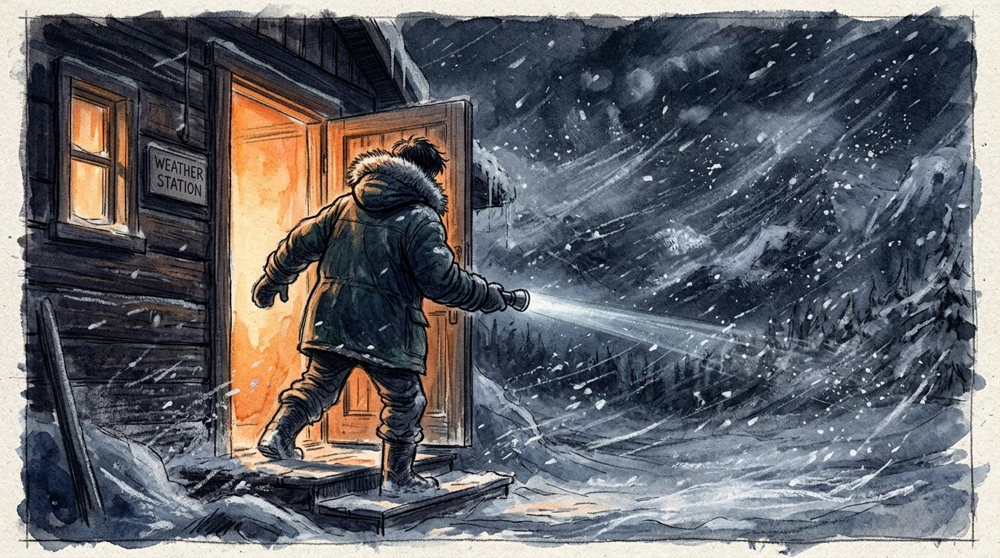
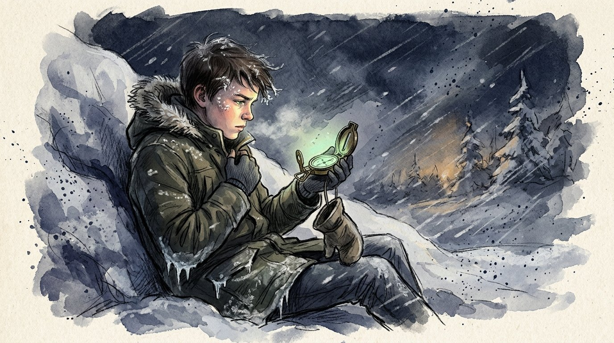
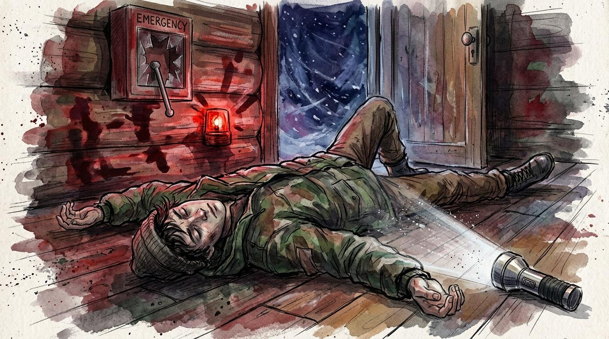

## 第一章：冰封的起點

氣壓計的指針在微弱的煤油燈光下劇烈晃動，像是一隻垂死的甲蟲在冰冷的玻璃罩內掙扎。

亞倫的雙手抖得厲害。他緊緊握著鋼筆，冰涼的鋼筆尖在發黃的日誌本上懸空了很久，卻遲遲不敢落下。窗外狂風裹挾著冰屑尖銳地嚎叫，像無數顆細碎的砂礫瘋狂撞擊在氣象站厚重的雙層玻璃上。

「數值。」

一個低沉、粗獷且毫無溫度的聲音從背後壓了過來。格里高高大的身影籠罩在亞倫上方，像是一座無法逾越的黑色山脊。他身上散發著雪水融化後的冰冷氣息，那雙滿是風霜的眼睛死死盯著亞倫的肩膀。

「我……我大概……」亞倫嚥了口唾沫，喉嚨乾澀得像塞了砂紙，「指針偏向左邊，大約是九百四十百帕……」

格里高一把奪過日誌本，粗暴地將頁面翻得嘩嘩作響。他只看了一眼，便發出一聲沉重的冷哼。那聲音像是一塊重石砸在冰面上，震得亞倫瑟縮了一下。

「九百四十二。」格里高把日誌本重重拍回桌上，鋼筆滾落到地上，發出清脆的響聲，「在這種暴風雪裡，兩個百帕的誤差就足以決定我們是該提前發出雪崩預警，還是等著被埋在雪堆裡。亞倫，你連最簡單的刻度都讀不對。」

「對不起……格里高先生……我只是太緊張了……」亞倫慌忙蹲下去撿筆，手指在冰冷的地板上摸索著，眼角微微發熱。

「山不需要你的對不起，它只要準確。」格里高站在窗前，看著外面漆黑一片的雪幕，聲音冷硬得沒有一絲起伏，「你總是手抖，總是出錯。我說過很多次，你這種風吹就會倒的體格，根本不適合待在雪山上。等開春雪融了，你就收拾東西滾回山下去吧。這裡不養廢物。」

這句話像是一根冰針，狠狠扎進亞倫的心裡。他抓著筆站起來，低著頭，寬大的防寒大衣鬆垮垮地掛在他單薄的肩膀上，讓他顯得更加滑稽而笨拙。他知道格里高說得對，村裡的人也都這麼說——一個有氣喘、連砍柴都會折斷斧柄的病秧子，除了當累贅還能做什麼？

「哐當！」

一聲震耳欲聾的鋼鐵碰撞聲打斷了亞倫的自卑。氣象站頂部的金屬支架在狂風中發出痛苦的呻吟。格里高臉色一變，立刻拉開一旁的窗子，風雪瞬間灌了進來，將桌上的紙張吹得漫天飛舞。

透過手電筒的光束，他們看到主無線電天線的固定鋼索已經斷了一根，巨大的金屬天線在狂風中如同一面失控的鐵旗，瘋狂地左右擺動，狠狠撞擊著觀測台的邊緣。

「天線要斷了。」格里高迅速穿上他那件厚重的熊皮大衣，戴上防寒手套，抓起工具箱，「如果天線毀了，我們就徹底和山下失聯。待在裡面，別碰任何東西。」

「格里高先生，外面風太大……要不我……」

「你？」格里高冷冷地看了他一眼，那眼神充滿了不屑，「你出去只會被風吹下懸崖。老實待著。」

格里高拉開沉重的防風鐵門，整個人瞬間融進了暴風雪之中。鐵門在狂風中劇烈搖晃，亞倫費了九牛二虎之力才將門重新扣上。

他貼在結了霜的雙層玻璃窗前，死死盯著外面的鋼架。手電筒的光束在雪幕中顯得無比微弱。他看到格里高魁梧的身軀正一步步艱難地往天線平台爬去。風雪太大了，格里高的動作顯得無比遲緩。

就在格里高試圖用工具固定天線基座的那一刻，一陣猛烈的暴風呼嘯過。鋼架表面早已結了厚厚的冰層，格里高腳底突然踩空，在劇烈的晃動中，他的安全繩在鋼架邊緣的拉扯下瞬間崩斷。他根本來不及抓住任何支撐物，整個人直接從三米高的鋼架上跌落，重重地砸在下方結冰的鐵質平台上，隨後便一動不動了。

「格里高先生！」

亞倫的大腦一片空白。他尖叫著推開那扇沉重的防風鐵門，恐慌讓他甚至忘了拿上自己的手套。

刺骨的寒風像無數把鋼刀，瞬間割破了他的臉頰。狂風幾乎將他整個人掀翻。亞倫一邊劇烈咳嗽，一邊在齊膝深的雪地裡爬行。冰冷的雪粒灌進了他的脖子，凍得他手指發麻、關節僵硬得像生了銹的鐵鎖，雙腳踩在雪地裡已感覺不到腳趾的存在。

當他終於爬到格里高身邊時，導師的額頭正流著鮮血，在雪地上染出一片刺眼的暗紅，甚至開始微微冒著殘留的體溫熱氣。

「醒醒！格里高先生！」亞倫哭喊著，試圖扶起格里高，但導師高大的身軀重得像一塊花崗岩。亞倫的手指凍得無法彎曲，他只能用手肘死死夾住格里高的熊皮大衣領口，拼命向後拖行。冰封的鐵平台給了些許滑力，但每拖動一寸，亞倫喉嚨深處便發出微弱而尖銳的哮鳴音，像是有個漏氣的風箱在胸腔裡拉動。他全身每一寸肌肉都在抗議，眼淚與汗水流下來，瞬間在臉頰上結成了冰屑。

「動啊……求求你……動啊！」亞倫哭著，頂著胸腔窒息的劇痛，終於把格里高拖進了觀測室，隨後用身體撞上鐵門，顫抖著將鎖扣死。

屋內恢復了死寂，只有亞倫拉風箱般劇烈的喘息聲。

此時他才發現自己的雙手早已凍得紅腫發紫，指關節因為低溫而僵硬，甚至在暖房的空氣中開始傳來針刺般的劇痛，疼得他眼淚直流。他咬著牙，用這雙幾乎失去知覺的手，顫抖著敲擊著無線電台的發射鍵：「喂？喂！這裡是三號觀測站！有人聽到嗎？格里高先生受傷了！」

喇叭裡只有沙啞的電磁雜音。亞倫轉頭看向窗外，主天線已經徹底斷裂，墜入了萬丈深淵。

通訊斷了。

亞倫看著急救箱裡僅剩的幾卷繃帶，又看著體溫正迅速流失、神志不清的格里高。如果沒有醫生，格里高根本撐不到明天早上。唯一的希望，是兩公里外的備用自動哨所。那裡有應急的紅色警報閘刀，一旦拉響，山下的救援隊就會立刻出發。

兩公里。

在平時，這只不過是二十分鐘的散步。但在今晚的超強暴風雪和漆黑的夜色中，這無異於一條通往死亡的道路。

亞倫轉向門口。透過門縫，他能聽到外面風雪如野獸般瘋狂的咆哮。那一瞬間，極度的恐懼讓他胸口猛然收緊，氣喘的前兆如潮水般湧上，壓得他幾乎無法呼吸。

『我不行……我絕對做不到……』

耳邊彷彿又響起格里高粗暴的怒吼：『你連最簡單的讀數都讀不對，還想在山上活下去？這裡不養廢物！』

『我走不出這片雪地……我會死在半路上……我只是個廢物……』他抱緊了頭，任憑淚水滑過發紫的臉頰。只要他閉上眼假裝什麼都不知道，只要他等到明天早上……不，格里高會死。

他的目光落在桌角。那裡整齊地疊放著一雙格里高平時最珍視的備用厚實防寒手套。那雙手套很大，散發著皮革與導師身上特有的粗糙煙草味。

亞倫吸了吸鼻子，忍著雙手的劇痛，先套上自己那雙破舊的薄羊毛手套，接著把格里高那雙大得不合手的皮手套戴上。雖然手指動起來有些笨拙，但那厚實的溫暖讓他顫抖的心稍微安定了下來。他將格里高的備用指南針貼身塞進懷裡，抓起桌上的金屬手電筒。

他走向防風鐵門，手搭在冰冷的鐵把手上。冰涼的溫度透過厚厚的皮手套傳來，激得他全身一顫。

他深吸了一口氣，狂亂的心跳在這一刻竟然奇蹟般地平復了一些。

亞倫猛地拉開大門。

呼嘯的狂風夾雜著冰雪如海嘯般湧了進來。亞倫迎著暴風雪，邁出了他的第一步。

「砰！」

重重的鐵門在身後被狂風猛烈關上。亞倫瞬間被無邊無際的黑暗與冰雪吞噬，視線所及之處，只剩下手電筒射出的一道微弱而顫抖的光束。

---

## 第二章：白色深淵的低語

黑暗是實體的。

防風鐵門在身後關上的那一瞬間，亞倫的視線便被白茫茫的雪幕與漆黑吞噬。狂風裹挾著冰屑尖銳地嚎叫，像無數顆細碎的砂礫瘋狂撞擊在他身上。每一口吸入的空氣都夾雜著細碎的雪粒，順著喉嚨灌進肺部，像是一把把生了銹的鐵銼，割得他胸腔一陣劇烈收縮。

「咳……咳咳！」

亞倫弓下腰，劇烈地咳嗽著。每一次咳嗽，喉嚨深處都發出微弱而尖銳的哮鳴音，像是有個壞掉的風箱在拼命拉動。他不得不將整張臉埋進大衣領口，試圖用體溫將吸入的空氣稍微暖化。

他抬起右手，手電筒射出的一束白光在漫天飛舞的雪幕中顯得無比單薄，只能照亮身前不到兩米的距離。積雪已經沒過了膝蓋，每往前邁出一步，他都必須費力地將腳從冰冷的雪坑裡拔出來。大衣的下擺黏附了厚厚的積雪，在低溫下結成了硬邦邦的冰甲，像兩塊重鐵板一樣在行走時不斷碰撞著防風的皮靴，限制了他本已透支的步伐。

體力流失的速度遠比他想像的要快。寒冷無孔不入地滲透衣物，亞倫的雙腿漸漸失去了知覺，踩在雪地裡像是在拖著兩根沉重的木樁。肺部的撕裂感越來越強，每一次呼吸都像是被鐵箍勒緊了胸口。

終於，亞倫的膝蓋一軟，整個人無力地跌坐在雪地中。

當他停止前進時，那股一直折磨著他的刺骨寒冷竟然開始漸漸遠去。取而代之的，是一種奇異而綿軟的溫暖。那股溫暖從他的四肢蔓延開來，他的大腦因為低溫與缺氧而變得無比遲鈍，時間感拉長，狂暴的風聲也像是隔著幾層厚重的羊毛毯，變得模模糊糊、越來越遠。他的眼皮沉重得像灌了鉛，只想閉上雙眼睡去。

亞倫的眼皮緩慢地合上。大腦殘留的微弱理智在瘋狂警報，但他僵硬的四肢卻像被澆灌了水泥，重得根本不聽使喚。在那半夢半醒的虛無中，村民嘲笑他「病秧子」、「累贅」的雜音漸漸散去。

就在他的意識即將沉入黑暗的那一刻，腦海中猛然浮現出去年秋末的畫面。那時他第一次在觀測台上凍僵手指、哭著想躲回屋裡，格里高一腳踢開他的手套，粗暴地對他吼道：

「躺下？你只要敢躺下，五分鐘雪就會把你埋了！想死就繼續趴著，廢物！」

那一聲粗暴的怒吼像一記重拳，狠狠砸醒了他即將渙散的意識。亞倫的眼皮猛地睜開，失溫帶來的虛假溫暖瞬間退去，冰冷與對死亡的恐懼再度席捲而來。

他大口喘著粗氣，用盡全身最後的理智，迫使大腦向冰凍的四肢下達指令。他像一隻垂死的昆蟲般在雪地裡翻滾、掙扎，好不容易才翻過身。他用牙齒死死咬住左手那隻寬大的防寒皮手套並用力扯下，露出裡面戴著薄羊毛手套的手掌。接著，他咬住大衣領口的拉鍊往下拉開一截，將手伸進懷中，摸出了那枚指南針盒子。

他戴著薄羊毛手套的左手指尖早已凍得失去知覺，像是一排僵硬的木雕關節，費力抓捏了幾次，才勉強扣開指南針的盒蓋。

右手握著的手電筒在漫天雪花折射下反光刺眼，根本照不清指針。亞倫不得不將手電筒夾在腋下，用身體擋住風雪形成一片陰影，同時將左手湊到眼前。盒子打開，一側整齊地插著幾支紅頭的防水火柴，在指南針盤面上那抹微弱的綠色螢光下，紅色的火柴頭顯得格外醒目。夜光指針在黑暗中微微晃動，最終指向東北方。

亞倫將指南針盒子塞回大衣，用牙齒把厚皮手套重新套回左手，僅靠右手撐著雪地，一寸一寸地站了起來。他的肩背與胸腔在嚴寒中控制不住地猛烈哆嗦，雙腿僵硬冰冷，但他雙眼死死盯著東北方那片未知的黑暗。

「動……動起來啊！」

亞倫沒有放棄。氣喘讓他的喉嚨像火燒般劇痛，但他依然混著淚水與結冰的睫毛，對著呼嘯的風雪歇斯底里地哭喊出聲。那沙啞的嘶吼被狂風瞬間撕碎，卻激盪著他的胸腔，「我做得到……！格里高先生……我會走過去的！」

迎著看不見盡頭的暴風雪，他再次將雙腳踩進深及膝蓋的厚雪中，拖著麻木的腳步向前邁進。

---

## 第三章：微光與重新定義

風雪的呼嘯在峽谷邊緣被放大了數倍，如同一萬隻野獸在深淵底部同時怒吼。

亞倫終於看見了那抹若隱若現的紅色光點，那是兩百米外備用自動哨所屋頂的應急信號燈。然而，在被冰雪阻斷的長路末端，橫亙著最後的死路——一條跨越深谷的懸索吊橋。

吊橋在狂風中劇烈地左右擺動，鐵索發出令人牙酸的摩擦聲。窄小的橋面上，木板已經被凍成了一條晶瑩、平滑的冰道。

亞倫試圖站立起來，但他的雙腿早已凍得徹底失去知覺，幾乎無法支撐起身體。他剛踩出半步，整個人便重重摔在橋頭的雪地上。

氣喘的急性發作讓他的肺部像是在被烈火焚燒，每一次吸氣，氣管都發出尖銳而空洞的哮鳴音。他幾乎無法將氧氣送進大腦，視線開始出現一圈圈黑色的暈眩。

走不過去的。亞倫看著那瘋狂晃動的吊橋，心底有個絕望的念頭在反覆折磨他——這條橋他絕對走不過去。

亞倫用牙齒狠狠咬住大衣的領口，以此強迫自己清醒。他沒有再嘗試站立，而是低下頭，膝蓋跪在冰面上。他沒有整個人趴下去，因為那會壓迫本就窒息的肺部。他用雙肘拼命撐起上半身，仰起頭，張大嘴試圖吸入一點點空氣。

他將手電筒夾在腋下，用手肘和膝蓋作為支撐，一寸一寸地往前拖行。手電筒射出的微弱冷白光束隨之在冰面上劇烈晃動，折射出晃眼的白光。狂風從深淵底部席捲而上，吊橋在風中瘋狂搖晃，一次猛烈的劇晃將他整個人拋離橋面，他拼死用雙肘與雙手扣住鐵索。夾在腋下的手電筒死死抵在肋骨間，撞出一片生疼，所幸被厚重的大衣與腋窩緊緊夾住，並未滑落。

在搖晃的光束與頭頂紅色信號燈的雙重指引下，他繼續在橋面上爬行。

亞倫喉嚨深處只能擠出風箱般破裂的殘喘，但他依然死死盯著前方白光照亮的冰面。他的大衣袖口被磨出了棉絮，膝蓋在冰冷的木板上傳來麻木而劇烈的鈍痛，但他沒有停下。在這一刻，沒有高度，沒有距離，只有身前的下一寸冰面。

當亞倫的手指終於摸到谷對岸堅實的凍土時，他的體力已經徹底透支。

哨所的木門就在前方。亞倫手腳並用地爬上覆滿積雪的台階，原本夾在腋下的手電筒落在一旁的雪地中，斜斜地投射出一道微弱的光束，照亮了前方緊閉的木門。亞倫用手腕勉強搭上那柄鐵製門把，冰冷刺骨的金屬隔著防寒手套破損的縫隙黏扯著他的皮膚，帶起一陣針刺般的劇痛。他試了幾次，指尖麻木得根本無法握緊旋轉。

木門被外側的積雪和凍冰死死封住。

「你連最簡單的氣壓讀數都讀不對，根本不該來這裡！」

格里高過去的怒吼彷彿又在咆哮的風雪中炸響。

亞倫咬緊牙關，憋住胸腔中最後一口熱氣。他強撐著站立起來，身體緊貼著牆壁，隨後猛地側過身，將整個肩膀狠狠撞在木門上！

骨頭與硬木碰撞的劇烈震痛順著肩膀直衝大腦，震得他半邊身體酸麻，但他沒有停，反身用另一側肩膀再次猛撞上去！

「砰！喀嚓！」

伴隨著冰層開裂的脆響，門軸發出痛苦的呻吟。亞倫咬緊牙關，用整個身體的重量合身撞向木門——

「哐當！」

木門終於被暴力的撞擊推開，亞倫整個人失去平衡，狼狽地摔進了哨所溫暖的木地板上。

屋內一片死寂，只有暖氣管道發出細微的嗡嗡聲。亞倫趴在地上，大口吸入溫暖的空氣，他一寸寸地挪動著身體，爬到牆角那具紅色的緊急警報裝置前。

他抬起僵硬的右手，用手腕狠狠砸碎了裝置表面的玻璃保護罩。尖銳的玻璃碎片扎進了他的衣袖，但他毫無所覺，將手臂伸進去，手掌抵住粗重的紅色鋼製閘刀，用全身最後的力量往下狠狠一壓。

「咔噠。」

哨所頂部的紅色警報燈在一瞬間劇烈閃爍，將窗外的暴雪染成一片片規律的血紅。刺耳的警報聲在漫天大雪中迴盪，化作穿透暴風雪的電波，直奔山下的救援基地。

亞倫全身一鬆，仰面躺在溫暖的地板上，看著天花板上旋轉的紅色光影，耳邊風雪的咆哮彷彿終於退去。

幾天後，山下的聯邦醫院。

溫暖的陽光透過乾淨的玻璃窗灑在病床上，空氣中瀰漫著淡淡的消毒水香氣。

亞倫躺在病床上，雙手被厚厚的白色紗布包裹得像兩個巨大的棉花球。他轉過頭，看向隔壁的病床——格里高先生正靠在枕頭上，臉上貼著紗布，眼神平靜地看著他。

看著導師那雙嚴厲的眼睛，亞倫本能地感到一陣緊張，下意識地想把紗布包裹的雙手往被子裡縮。他等待著格里高的訓斥，等待著他指出自己撞門時有多狼狽。

格里高默默看著亞倫，風霜刻劃的臉龐上依然沒有絲毫溫柔。他看著亞倫那雙包裹得像棉花球的手，冷哼了一聲，粗聲說道：

「手既然沒廢，就別躺在那裡裝死。等出了院，回去把氣壓表給我讀準，再出錯一次就給我滾蛋。」

亞倫愣了一下，看著格里高那張依舊緊繃的臉，緊繃的肩膀終於放鬆了下來。他微微低下頭，嘴角卻抑制不住地輕輕揚起。

亞倫看著自己纏滿繃帶的雙手，感覺著指尖在紗布下微弱的屈伸，隨後轉頭看向窗外。遠處的雪山依然在陽光下閃爍著刺眼的冷光，但這一次，他看著那高聳的冰峰，緊縮的胸口緩緩舒展開來。他迎著陽光，長長地舒了一口氣。

