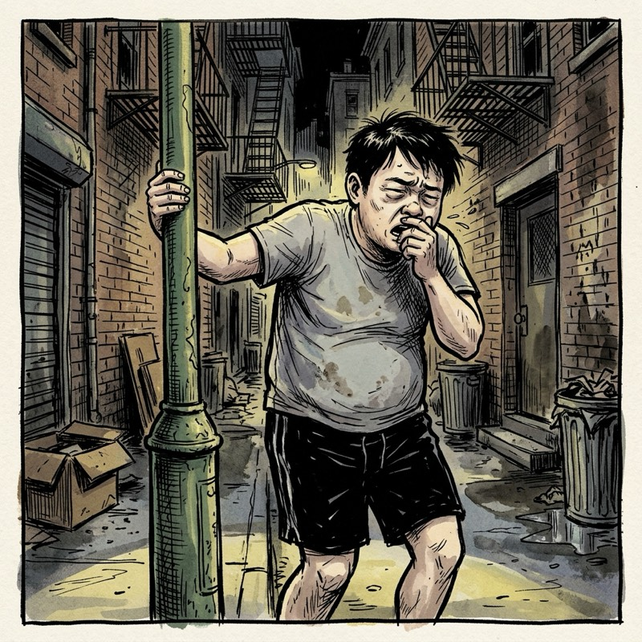
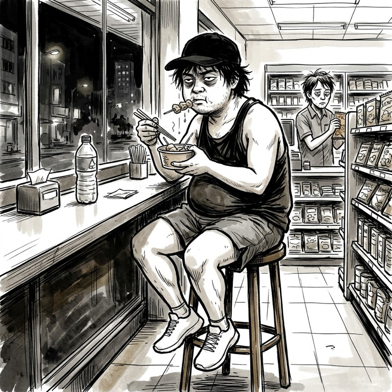
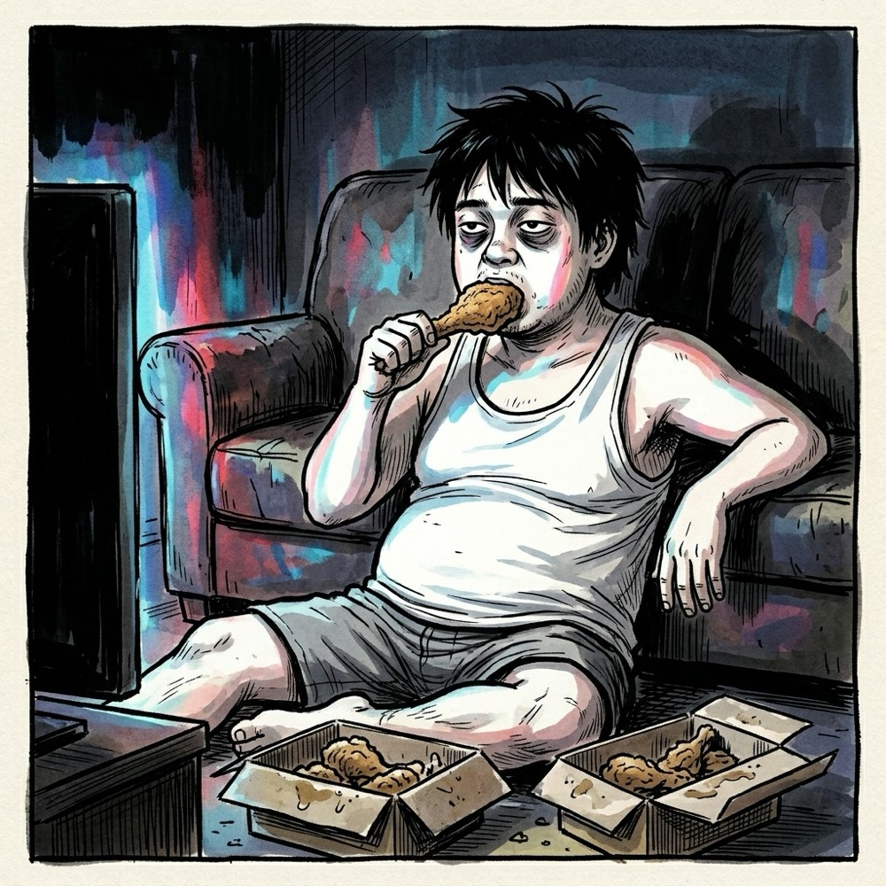
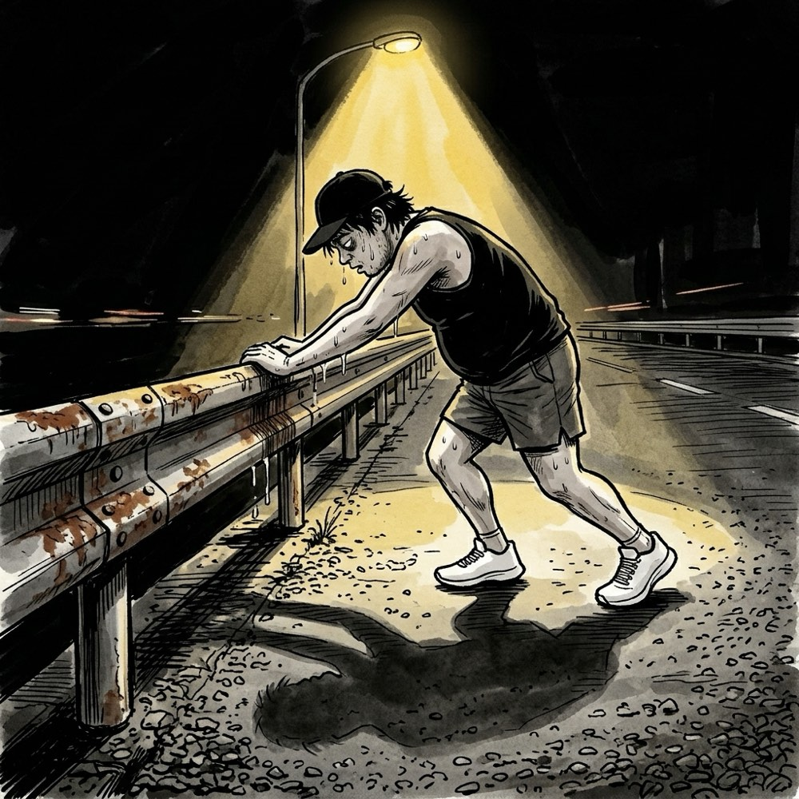
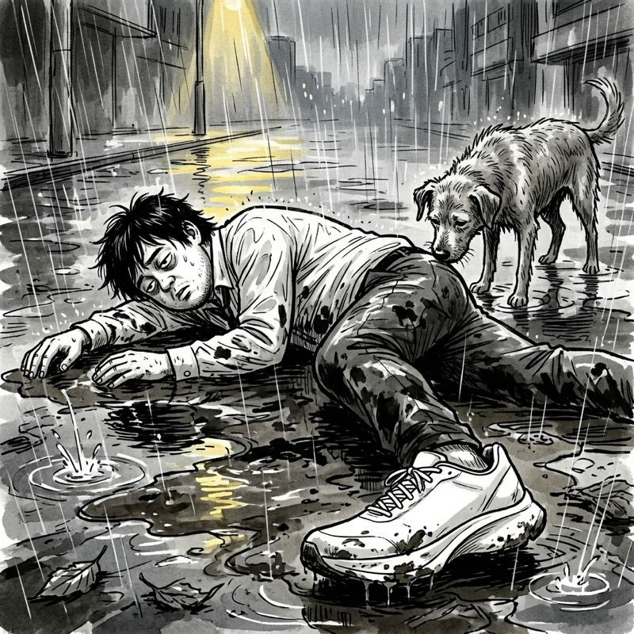

## 第一章：正式賽道之外

影印機吐出的紙張帶著一種令人昏昏欲睡的溫熱。

我把那一疊剛印好的民事抗告狀在桌上用力敲了敲，對齊邊緣，然後塞進重型裝訂機的卡槽裡。用力按下去，卡槽發出沉重的喀噠聲，粗大的鐵釘咬穿了六十多頁的複印紙。

隔壁的主管辦公室裡傳來笑聲。主持律師正跟新來的新人律師說話。那個新人律師今年剛滿二十四歲，上個月剛拿到律師證書，聲音宏亮，帶著一種還沒被客戶與生活折磨過的自信。他正在滔滔不絕地談論昨天剛宣判的一個損害賠償訴訟，語氣裡滿是輕而易舉的優越感。

我低著頭，繼續裝訂下一份副本。

我今年二十八歲。在這間只有三個律師的小型事務所裡，我的名片上寫著「法務助理」。但事實上，我的工作包括訂中午的排骨便當、去郵局寄雙掛號、擦拭會客室的玻璃桌，以及幫所有比我年輕的人裝訂他們親手寫的訴狀。

這是我國考落榜的第五年。

下班的時候，天空正飄著黏膩的細雨。我搭上擁擠的捷運，身旁的人身上散發著混雜了雨水與體溫的酸澀味。捷運車窗倒映著我那張因為長年熬夜而略顯浮腫、黑眼圈深重的臉。我想起半小時前，那位二十四歲的新人律師一邊看著手機一邊對我說：「陸哥，明天早上所長要用這份抗告狀，麻煩你八點半前幫我放在他桌上。」

他叫我陸哥。但在這間辦公室裡，每個人都可以指使我。

回到租屋處已經是晚上九點。我點了最油膩的鹹酥雞，躺在窄小的床鋪上，機械式地滑著短影音。手機螢幕的藍光在黑暗的房間裡晃動。短影音裡跳出一個穿著精緻運動服的網紅，正對著鏡頭展示他深夜在河濱跑步的英姿，配樂激昂，標題寫著：『說走就走，用奔跑奪回人生的掌控權。』

我冷笑了一聲，把鹹酥雞的骨頭吐進塑膠袋裡。奪回人生？真容易。

然而，當我滑到凌晨兩點，看著天花板上因為潮濕而剝落的壁癌時，一股難以名狀的燥熱突然從胸口湧了上來。那是一種夾雜了自我厭惡、羞恥與不甘的混亂情緒。

我想起今天在影印機旁看到的那些年輕律師。他們看我的眼神，就像看著事務所裡那台老舊的碎紙機——雖然在運作，但可有可無。

「如果我其實是個隱藏的跑步天才呢？」

黑暗中，我的大腦開始轉動。這個荒謬的念頭一旦冒出來，就以一種不可思議的速度自我膨脹。

我想，律師國考有錄取率限制，是個被制度與智商壟斷的正式賽道。但沒人說我不能走別的賽道，如果我從今天開始，在沒有人看見的深夜裡默默練習跑步。一個月、兩個月，直到我的速度和耐力達到一個不可思議的境界，這樣是不是可以奪回一些人生的主控權？

然後，在某個偶然的機會下——也許是事務所舉辦的員工旅遊，或者某個緊急需要送遞公文的突發狀況，交通工具全都癱瘓。所有人都在乾著急，而我站了出來。我會以超越常人的速度，在他們震驚的目光中，一路狂奔抵達目的地。

他們會張大嘴巴，看著我這個平庸的、只會裝訂卷宗的打雜助理，露出不可置信的敬畏表情。

這個幻想在深夜的黑暗中顯得無比真實，甚至讓我有些呼吸急促。我翻身下床，打開鞋櫃。

鞋櫃的最底層，放著一雙三年前在特賣會上買的廉價跑鞋。鞋身沾滿了灰塵，鞋底的橡膠早已硬化。我用抹布隨便擦了擦，穿上它，套上一件褪色的防風外套，推開房門走進了深夜的冷空氣中。

凌晨兩點半的無名都市很安靜。只有遠處高架道路傳來的貨車引擎聲，和偶爾閃爍的黃色路燈。

我站在大樓門口，深深地吸了一口冰涼的空氣。我告訴自己，這是一個大師的起點。我必須跑得流暢、跑得看起來毫不費力。

我邁開步伐，跑了起來。

前五十公尺，風吹在臉上的感覺確實讓我產生了某種掌控生命的幻覺。我的腳步落在濕漉漉的柏油路上，發出規律的沙沙聲。我甚至在腦海中模擬起自己被年輕律師們發現時，該用怎樣淡然的表情來回應他們的驚訝。

但到了兩百公尺，幻想開始出現裂縫。

我的呼吸變得粗重，冰冷的空氣像無數根小針一樣刺進我的氣管，引起一陣乾癢。每一次吸氣，喉嚨裡都泛起一股淡淡的、鐵鏽般的血腥味。

到了三百公尺，我的側腹部突然傳來一陣劇烈的絞痛，像是有一根生鏽的鐵絲在裡面用力扭轉。我不得不彎下腰，右手死死按著右腹，腳步開始變得凌亂而沉重。

「這只是起跑太急……情況……還可以控制……」我咬著牙，試圖用大腦說服自己那已經快要散架的身體。

到了四百五十公尺，我的雙腿像灌了鉛，每一次抬起都需要耗盡全身的力氣。我的視線開始模糊，耳朵裡充斥著自己雜亂無章的喘息聲。

我終於停了下來。

我整個人虛脫地靠在路邊一根綠色的斑駁路燈桿上，雙手撐著膝蓋，劇烈地咳嗽起來。我咳得滿臉通紅，眼淚和鼻涕一起流了出來。我把嘴裡那口帶著鐵鏽味的唾沫吐在水泥人行道上，看著它慢慢滲進石縫裡。

馬路的對面，一輛外送機車呼嘯而過，外送員甚至沒有往我這個方向看一眼。

我就這樣在路燈下弓著腰站了足足五分鐘，直到側腹部的劇痛稍微緩解，才拖著發軟的雙腳，一瘸一拐地往回走。

回到租屋處，我脫下跑鞋，鞋底的硬化橡膠在玄關留下了一小片黑色的碎屑。我走到浴室，看著鏡子裡自己滿頭大汗、臉色慘白、黑眼圈深重的狼狽模樣。

「今天的側腹痛是典型的橫膈膜缺氧。」我對著鏡子裡的自己小聲嘀咕，「是因為三年沒跑，起步配速策略錯誤。我的心肺底子其實還在。明天只要調整呼吸節奏，絕對能輕鬆破兩公里。」

我洗了個熱水澡，躺回床上。雖然渾身酸痛，但在大腦編織的「明天就會改善」的藉口中，還有大師踏出了第一步的滿足感，我終於閉上眼睛睡著了。

---

## 第二章：只要不看配速，我就是天才

第一天夜跑的代價，是接下來整整三天的下半身失聯。

我的大腿和小腿像是被注射了水泥，每一次在辦公室站起來去影印機拿紙，大腿肌肉都會發出尖銳的抗議。所幸，這段痛苦的恢復期剛好讓我有時間進行一項更重要的計畫——「重構大師的裝備」。

那雙在玄關掉落黑色橡膠碎屑的舊跑鞋已經被我扔進了垃圾袋。取而代之的，是我在無數個摸魚的上班時間裡，偷偷開著無痕視窗、精心研究後下單的成果。

既然要跑，就必須用最極致的態度。我想，世界上任何一個領域的頂尖大師，在起步時也必然是這樣做足準備的。

首先是鞋子。我刷卡分期買了一雙純白色的頂級碳板跑鞋。那是一雙與馬拉松世界紀錄保持者同款的旗艦跑鞋，鞋底由厚實的前衛泡棉與高強度碳纖維板構成，潔白得不落一絲塵埃。接著是吸汗跑步帽、一條緊緊箍在胸前的專業藍牙心跳帶、一件專業無袖排汗背心，以及一支具備即時配速與心率監測的旗艦 GPS 跑錶。

這件無袖背心布料薄得像一層防蚊紗窗。當我全部穿戴整齊，在租屋處的穿衣鏡前站定時，雖然那件鬆垮的薄背心幾乎是貼在我肚子那圈贅肉上，顯得有些滑稽，但那雙純白碳板鞋的俐落線條與胸前心跳帶的緊繃感，依然帶給我一種強烈的精神麻醉。

我不是一個在小型事務所打雜、連三十歲都不到就開始禿頂的法務助理，我是一個即將接管這座都市黑夜的科學跑者。

然而，當我正式踏上柏油路，雙腳落地的那一刻，現實的引力再次拉扯著我。

這種跑鞋的鞋底厚得像高跟鞋，裡面夾著硬邦邦的碳板。踩下去的時候，腳底會有一種被迫往前彈的怪異力量，讓我有些站不穩，只能歪歪斜斜地往前跨步。啪嗒、啪嗒，純白的鞋底砸在濕瀝青路上，聲音沉重得像是在用巴掌拍打地面。

我邁開步伐，在空無一人的馬路上前進。純白色的鞋身在黑夜裡白得刺眼，我跑著跑著，眼睛忍不住一直往下看。我心裡想著：如果這時候有人路過，看到這雙鞋，應該會覺得我是個每天跑十公里的厲害角色吧。

但跑了不到三分鐘，冷風再次無情地灌進我的氣管。我的心率瞬間飆升到心跳帶監測的紅色警戒區。跑錶發出尖銳的嗶嗶聲，螢幕上顯示的即時配速是：八分十五秒。

這是一個連散步的老太太都能輕鬆超越的速度。

我大口喘著氣，感覺胸腔裡像是有個破風箱在拉扯。為了維持大師的尊嚴，我沒有立刻停下來，而是放慢速度，將腳步落地的聲音壓低，試圖裝出一種「我只是在進行超慢速耐力訓練」的從容感。

回家後，我癱坐在地板上，一邊揉著酸痛的膝蓋，一邊用發抖的手指打開手機，開始在跑步論壇上搜尋關鍵字。

論壇頂部的熱門文章寫著：『新手最常見的錯誤就是跑太快，心率拉到無氧區，不僅無法燃燒脂肪，還容易導致心肌受損和肌肉流失。只有將配速控制在八分速左右，維持在 Zone 2 有氧區間，才是最有效、最科學的耐力訓練。』

我靠著沙發，長長地鬆了一口氣。

難怪剛才跑得那麼痛苦，原來是我跑太快了。八分速，剛好落在科學定義的 Zone 2 黃金區間。至於那些在路上跑得飛快的，大概根本不懂什麼叫最大攝氧量，只會一味摧毀自己的膝蓋。

這一套「Zone 2 理論」瞬間成了我最強大的精神護身符。在科學的背書下，我那連散步老太太都跑得比我快的尷尬速度，突然被賦予了某種高深莫測的專業感。我不再是個三分鐘就快斷氣的廢物，而是一個正在默默進行「有氧基礎打底」的隱世高手。我甚至開始有些期待下一次的訓練，迫不及待地想在夜幕下實踐我那完美、精準的八分速。

於是，星期四晚上，我興致勃勃地換好全套頂級裝備站在窗前。然而，正當我準備推門出發時，卻注意到窗外的異樣。

天空中飄著一絲若有似無的毛毛雨，落在窗台上甚至連水花都激不起來。

我摸了摸下巴。

一千多塊的舊鞋淋雨就算了，這雙是六千多塊、分期付款才買下來的寶貝。要是網面沾了柏油路的髒水和黑泥，這輩子就別想洗乾淨了。再說，碳板鞋底很滑，萬一在濕路上扭到腳，那才是得不償失。

可是，我已經花了十分鐘戴好帽子、勒緊心跳帶，甚至連這雙難綁的鞋帶都繫好了。如果現在把裝備原封不動地脫下來放回去，感覺有點蠢。

我盯著玄關鏡子裡的自己。

「跑步的時候，腳跟往後帶會把地面的泥水往上甩，所以鞋子會髒。」我拍了拍褲子上的灰塵，低頭自言自語，「但如果只是散步，只要我走得足夠慢，並且精準地繞開水窪，水花就根本甩不起來。這只是低強度的恢復性散步。」

我推開門走出去。我沒有跑步，而是穿著那身專業的薄背心、勒著心跳帶、腳踩潔白的碳板鞋，以一種極其緩慢且小心翼翼的步伐，像是在雷區排雷一樣，精準地跨越著柏油路上的積水，慢慢走向巷口的便利商店。

超商裡混雜著茶葉蛋滷汁與關東煮高湯的香氣，在深夜冷冽的空氣中顯得無比誘人。大夜班店員正一邊打著哈欠一邊補貨，連眼皮都沒抬一下，用看著一包衛生紙的眼神掃過我這身吸汗帽和頂級跑鞋的行頭。

我故意挺直脊椎，用手錶計時重設的嗶嗶聲打破沉默，伸手點了兩顆茶葉蛋和一碗關東煮。店員面無表情地用夾子把蛋裝進塑膠袋，掃描條碼的動作機械而冰冷。

一點二公里的散步，平均心率七十。我一邊嚼著溫熱的貢丸一邊心想，肌肉重建需要優質蛋白質和適當的碳水化合物，剛好趁現在補充。如果不吃，肌肉可能會萎縮。

我坐在超商臨窗的吧台高腳椅上，一邊啃著茶葉蛋，一邊看著自己擱在欄杆上的雙腳。那雙潔白無瑕的頂級碳板鞋，在超商冷白的日光燈下顯得無比耀眼。

看著這雙乾淨漂亮的跑鞋，我嚼著食物。明天回事務所，幫隔壁年輕律師裝訂卷宗時，手部肌肉應該會更有力氣了。

---

## 第三章：無雨的晴空與空曠的街

星期二下午五點半，主持律師合上卷宗，一邊穿外套一邊對辦公室宣布今天大家可以提早下班。

辦公區裡傳來一陣輕快的收拾鍵盤聲。隔壁那位二十四歲的新人律師已經關了螢幕，抓起帆布包，步履輕盈地跟同事告別。

我把最後一疊抗告狀複本整齊地碼在檔案夾裡，鎖進鐵櫃。走出大樓時，時間是傍晚六點零五分。

從上週五開始連續下了三天的雨，雨勢大到路面全是積水，這讓我理所當然地在週末和週一睡了個好覺。今天星期二，天空終於徹底放晴，都市的晴空乾淨得不帶一絲陰霾，晚風涼爽，路面乾燥而平整。

我搭上捷運回家。車廂裡不擁擠，甚至還有空位。我坐下來，摸了摸自己的大腿，幾天前的酸痛已經完全消失，膝蓋也結實得很。

回到套房，我照例在玄關坐下，正準備脫掉西裝褲、換上無袖背心。

那雙純白色的碳板跑鞋端端正正地擺在鞋櫃最上層，編織鞋面在日光燈下白得亮眼，沒有一點泥沙。我伸出手，指尖輕輕撫過鞋側堅硬的碳纖維板邊緣，那裡反射著冷冽的微光。

我抬起手腕，看了看戴在手上的專業跑錶。螢幕亮起，顯示著當前適宜的戶外溫度：攝氏二十二度。

我盯著鞋櫃上的跑鞋。

今天沒有加班。天空中沒有下雨，甚至連濕氣都很低。跑鞋乾乾淨淨，我的膝蓋沒有任何不適。

我只需要把手伸過去，穿上襪子，繫上鞋帶，然後推門走出去。

然而，我的手停在半空中。

玄關的瓷磚貼在地板上，透著一陣陣冰涼。我把手收了回來，撐在膝蓋上，就這樣維持著半蹲不蹲的姿勢，定定地看著鞋櫃。

窗外傳來遙遠的捷運駛過軌道的低鳴聲。

如果此時我推開門跑出去，路口只有黃色的路燈和飛快駛過的外送機車。沒有人會停下腳步看我。明天的辦公室裡，所長依然只會把便當菜單丟到我桌上，新人律師依然會用高昂的聲音在隔壁討論訴訟法，沒有人會知道、也沒有人在乎我在街頭跑得有多快。

我把頭靠在玄關的鞋櫃邊緣。

其實我一直在等。等一場突如其來的加班，或者一場暴雨。

這種等待藉口的習慣，我其實很熟悉。

就像這幾年的國考。第一年，我推說民法題目出得太偏；第二年，我說考前急性腸胃炎；第三年，我怪考場的冷氣太吵。我總是能找到一個看起來無可奈何的理由，好讓我顯得像個倒楣的受害者，而不是個不願意拼命的懦夫。

這兩週以來，我把下雨、白鞋太貴、肌肉需要修復當作護身符。

但今天，沒有雨，沒有酸痛，沒有加班。

跑錶上的即時心率顯示為六十二，綠色的光在手腕下方微弱地閃爍。

我盯著鞋櫃上的純白跑鞋，突然無比期盼這時候天空能劈下一道雷，或者突然下一場暴雨。只要有一滴雨水砸在窗玻璃上，我就可以理直氣壯地把鞋子收起來，對自己嘆口氣，推說今天運氣真差。

但窗外乾燥的晚風吹過，連一片落葉都沒帶動。沒有暴雨，沒有地震，沒有加班。

我沒有任何藉口。而我依然只是坐在這裡。

我坐在玄關的冷瓷磚上，屁股漸漸被冰得有些發麻。走廊上的感應燈在靜止中熄滅，黑暗瞬間吞沒了白色的碳板鞋。

我沒有站起來。

我慢慢地伸出手，把那雙純白色的跑鞋推進鞋櫃的深處，關上櫃門。木質櫃門合上時，發出沉悶的碰的一聲。

我解開皮鞋的鞋帶，把腳抽出來，光著腳踩在冷冰冰的室內地板上，走回房間，把公事包扔在地上，整個人呈大字形躺在沙發上。

手機在黑暗中震動了一下，跳出外送 App 的優惠通知。我點開螢幕，滑過一個個綠色健康的沙拉餐盒，最後點了一份雙人份的重口味美式炸雞，備註寫著：『請掛在門把上即可，勿按電鈴。』

三十分鐘後，門外傳來輕微的腳步聲，接著是塑膠袋與把手碰撞的沙沙聲，隨後腳步聲迅速遠去。

我走過去打開門，提起那袋溫熱、散發著濃烈油耗味的塑膠袋。

我坐在客廳的地板上，背靠著沙發，一邊嚼著油膩、乾柴的炸雞胸肉，一邊看著電視螢幕上播放的綜藝節目。螢幕的光線在牆壁上反射出忽藍忽紅的幽暗陰影，照在我那張沒有表情的臉上。

窗外的都市晴空漆黑而深邃，沒有一絲風。我嚼著嘴裡的雞肉，感覺喉嚨乾得像要冒火，卻連站起來去倒杯水的力氣都沒有。

---

## 第四章：我選擇了放棄

客廳垃圾桶裡堆著吃剩的炸雞紙盒，油膩的氣味在封閉的房間裡悶了三天，依然沒有完全散去。

星期四深夜十一點半，我站在玄關，看著被鞋子踩出來的黑色污漬，胃裡彷彿還殘留著三天前那些高熱量油炸物的黏膩感。那股從胃袋蔓延到太陽穴的自我厭惡，沉重得讓我無法入睡。

我打開鞋櫃，把那雙純白色的跑鞋拿了出來。

鞋面上那層透氣網布依舊白得乾淨，鞋底的橡膠甚至沒有磨損的痕跡。我套上襪子，繫緊鞋帶，把那條緊繃的心跳帶勒回胸口，再套上那件薄如紗窗的無袖排汗背心。

門外的風比上週冷了許多。

我跑了起來。純白色的跑鞋落在柏油路上，發出啪嗒、啪嗒的沉重撞擊聲，在寂靜的住宅區小巷裡迴響。

四百公尺。風像薄冰片一樣刮過我的臉頰，吸進肺部的每一口冷空氣都帶著刺痛。我捏緊拳頭，試圖用擺臂來帶動沉重的雙腿，但膝蓋關節處傳來一陣陣生硬的摩擦感。

八百公尺。胸口的心跳帶勒得越來越緊，像是要把我的肋骨勒斷。我的視線開始隨呼吸的頻率上下晃動，路燈的光暈在眼前散開，變成一團團模糊的黃色毛邊。

八百公尺的配速是：八分二十秒。

到了一千兩百公尺，一個上坡路段。我的大腿肌肉像是被灌進了融化的鉛，沉重得無法抬起。氣管裡火燒般乾疼，黏稠的唾液卡在喉嚨深處，每一次呼吸都伴隨著鐵鏽般的腥甜。

我停了下來。

我整個人無力地靠在路邊生鏽的鐵護欄上，雙手抓著冰冷的鋼邊，身體劇烈地起伏。汗水順著額頭滴在鏽蝕的鐵板上，發出輕微的啪嗒聲。

大腦深處那個熟悉的聲音立刻響了起來：『今天的逆風太強，阻力太大。』『這雙碳板鞋在坡道上的避震角度不對，再跑下去會傷到髕骨。』『昨晚只睡了五個小時，身體還沒恢復。』

我抓著鐵護欄，大口地喘氣。

冷風吹過我汗濕的無袖背心，手臂上瞬間激起了一層密密麻麻的雞皮疙瘩。我低著頭，看著自己投射在路面上的影子。影子裡的那個輪廓腰腹臃腫，肩膀無力地垮著，在大腿顫抖的起伏中顯得焦灼而滑稽。

我盯著那個影子。

沒有風阻的問題，也沒有鞋子的問題。

我只是單純跑不動了。我是一個體能極差、考了五年國考都考不上、白天在事務所只能幫年輕律師複印抗告狀的廢物助理。我沒有天賦，也沒有毅力。

「我不跑了。」我盯著地上的影子，小聲地對自己說。

我抬起左手，按下了跑錶的停止鍵。手錶發出短促的嗶的一聲，螢幕上的數字停在一點二公里。

我伸手探進背心下擺，解開了胸前心跳帶的扣環。那條黑色彈性帶被我扯了出來，塑料感測器上沾滿了黏膩的汗水。我把它隨手塞進短褲的口袋裡，隔著薄薄的布料，能感覺到胸口皮膚被勒出來的一圈發癢、微痛的紅印。

我沒有再邁開腳步跑步。

我光著胳膊，在深夜十一點半的冷風中，踩著這雙價值六千多塊的純白跑鞋，一步一步慢吞吞地往回走。鞋底的碳板在步行的重壓下硬得像塊鐵板，每走一步，腳底板都傳來一陣生硬的酸疼。

一路上沒有任何車輛經過，也沒有任何行人。

回到租屋處，我站在玄關脫下鞋子，輕輕地放回鞋櫃最下層。

我走進浴室，扭開熱水閥。當溫熱的水流衝刷過胸口那圈微紅的心跳帶勒痕時，這兩週以來那股緊緊揪著我胸口、逼著我必須去扮演一個「隱藏大師」的窒息感，似乎隨著熱水一起被衝進了排水孔裡。

---

## 第五章：陽台上的碳板跑鞋

桌角那疊國考書最上層的《民法物權論》，已經落了一層薄薄的灰塵。

事務所的日子和平常沒有兩樣。隔壁辦公室的新人律師在打贏第一場官司後，所長在附近的熱炒店請了客。我照例坐在最角落的位置，負責倒啤酒、叫服務生補冰塊，並在最後去櫃檯結帳開發票。

「陸哥，明天早上的卷宗，麻煩你幫我多複印三份。」新人律師一邊揉著太陽穴一邊對我說。

我點了點頭，抱著一疊卷宗走回影印機旁。

我抱著這疊複寫的卷宗回到租屋處時，時間已經接近深夜十二點。

半小時前開始下起的大雨，此時已經演變成暴風雨。粗大的雨滴撞擊著窗玻璃，在小套房裡發出嘈雜、沉悶的啪啪聲。我把公事包放在玄關地上，鞋櫃最下層那雙純白色的碳板鞋依然一塵不染，在日光燈下白得亮眼。

我盯著那雙鞋。

三個星期了，我沒有碰過它。它就跟桌角那疊從來沒翻完的國考書一樣，乾淨、完整，擺在那裡嘲笑著我的無能。

身上的工作襯衫黏著熱炒店的啤酒和油煙味，貼在皮膚上發黏、發癢。

我蹲下身，沒有換上專業排汗背心，也沒有換運動短褲，只是面無表情地把那雙純白跑鞋拿了出來，把腳塞進去。我扯開襯衫的扣子，把那條心跳帶胡亂勒在胸口，戴上防風帽，然後仔細地把鞋帶繫成雙死結。

我不知道自己要幹什麼。我只是看著那雙乾淨得刺眼的白鞋，突然想把它弄髒。

我推開大門，走進了暴風雨中。

冷雨在一瞬間將我淋得通透，襯衫濕答答地貼在脊背上。

我邁開步伐跑了起來。積水漫過了柏油路面，純白色的碳板鞋每踏下一步，都濺起巨大的混濁泥水。冰涼的泥沙順著編織網面的孔洞滲了進來，緊緊貼著我的腳趾。原本潔白無瑕的鞋面，在第一步落地時就沾上了黑色的柏油泥漬。

風從四面八方吹來，把我的雨帽吹得向後翻倒。雨水流進眼睛裡，視線一片模糊。

我只是跑著。沒有配速，沒有目標，甚至連跑錶的 GPS 都沒有連上。

在一個轉角處，積水深得看不見路面。碳板鞋厚實的泡棉鞋底在濕滑的積水裡猛地一偏，我的右腳踩在一個下陷的凹坑上，腳踝一歪，整個人頓時失去平衡，重重地向前摔倒在骯髒的泥水坑裡。

我的雙手手掌擦過粗糙的瀝青路面，傳來一陣火辣辣的刺痛。西裝褲在膝蓋處撕開了一個口子，混合了泥沙的血水緩緩滲了出來。

我整個人趴在泥水裡，冰冷的雨水劈頭蓋臉地砸在我身上。

四周一片漆黑，只有遠處路口黃色的警告信號燈在暴風雨中一閃一閃。

一隻淋得濕漉漉的流浪狗從路邊的騎樓下走出來。它慢吞吞地走到我身旁，低頭用鼻子嗅了嗅我滿是泥沙的西裝褲管，隨後打了個噴嚏，轉身走回黑暗中。

我趴在積水裡，雨水流進我的嘴裡，帶著一股苦澀的泥沙味。我沒有喊叫，也沒有發誓，只是看著混濁的泥水從我的手臂旁流過。

在泥水裡趴了十幾秒，我用擦破皮的手掌撐著地面，慢慢地爬了起來。我低頭看了看雙腳，那雙價值六千多塊的純白跑鞋，此刻已經沾滿了黏稠的黑泥與枯葉，變得斑駁不堪。

我一瘸一拐地往回走。雨水順著我的髮尖、襯衫下擺不斷滴落，在身後的柏油路上留下一道道濕漉漉的痕跡。

回到出租套房，我站在玄關，把脫下來的濕衣服堆在地板上。

我光著膀子，只穿著一條濕漉漉的四角褲坐在客廳的冷地板上。我的身體因為寒冷而輕微地打著冷顫，手指關節凍得有些發白。

我拉過公事包，取出白天從事務所帶回來、明天一早要交給所長的民事抗告狀草案。

我用發抖的右手拿起重型裝訂機，把那一疊文件推進卡槽。

喀噠。

粗大的鐵針咬穿紙張，發出清脆的撞擊聲。

喀噠，喀噠。

我一下一下地按壓著裝訂機，手指的皮膚因為冰冷而有些麻木。

窗外，暴雨漸漸停息。陽台的鐵架上，那雙原本潔白無瑕、如今沾滿黑泥與細沙的碳板跑鞋正靜靜地晾在那裡。水珠順著變黑的編織網面緩緩滴落在陽台的灰色水泥地上，發出微弱的、規律的嗒、嗒聲，隨後融入黑暗中。