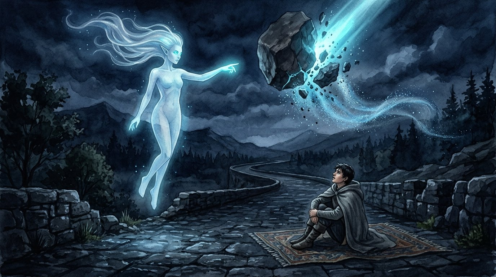
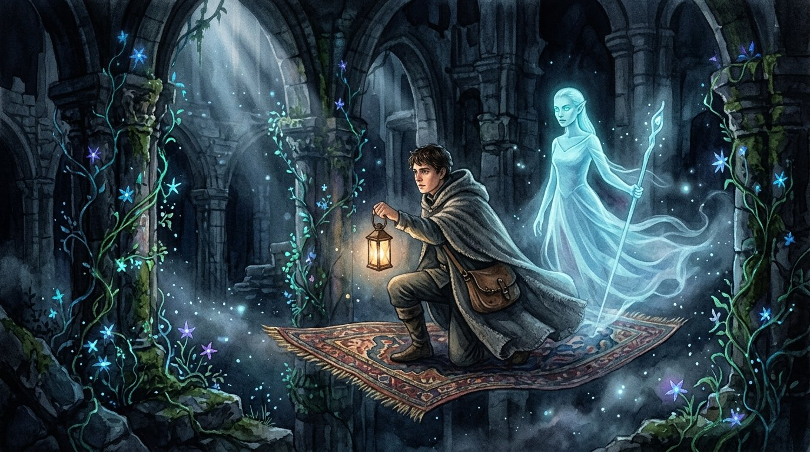
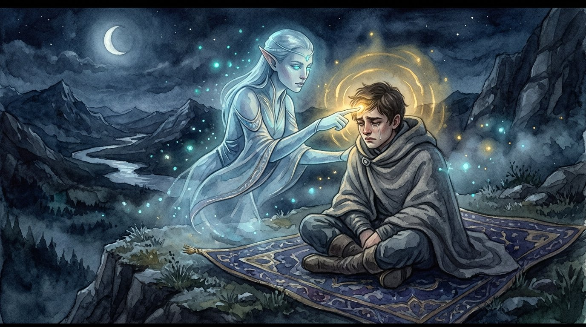
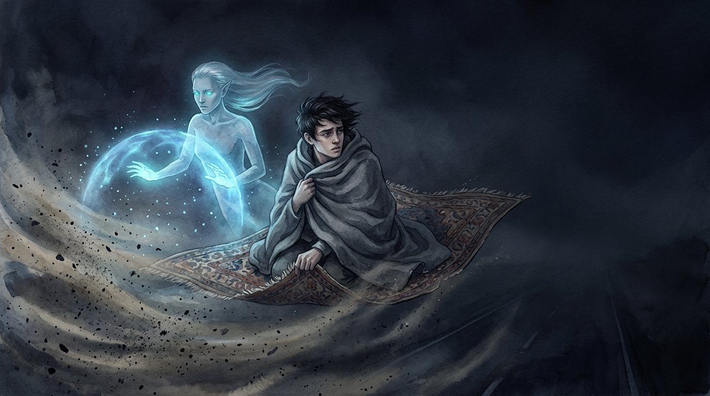

## 第一章：魔毯上的無聲軌跡

魔毯在離地三尺的高處緩慢飄行，幾乎沒有發出任何聲響。

這條魔法公路由粗糙的灰色石板鋪成，一直延伸到夜色的深處。道路兩旁是低矮的灌木與被歲月風化的巨石，魔力在空氣中泛著稀薄的藍色微光，成了這片荒野唯一的照明。

我裹緊了身上的灰色斗篷，將雙腿縮在魔毯的邊緣。夜風有些涼，吹打在臉上像細小的針刺。

「艾爾。」我低聲喚道。

懸浮在魔毯前方的淡藍色身影微微一滯。它是艾爾，我的守護精靈。它呈半透明的人形，流線型的銀藍色光帶替代了頭髮，在夜風中緩緩飄動。那雙發著青色微光的眼睛轉向我，精緻的面容上沒有任何情緒起伏。

「Ian，有何指示？」它的聲音清晰、平靜，像是一潭沒有漣漪的死水。

「沒什麼，只是覺得今晚特別靜。」我自嘲地笑了笑，「路好像比昨天更荒涼了。」

「根據地圖檢索，此路段為舊帝國廢棄的貿易線，方圓五十里內無登記城鎮。安靜是符合地理特性的常態。」艾爾用毫無語調變化的聲音回答。

我把頭埋進膝蓋裡，看著魔毯邊緣磨損的流蘇。我知道我不該期待更多的回答。

就在這時，右側的山壁上傳來一聲沉悶的爆裂聲。一塊直徑約莫人高的巨石從陡峭的斜坡上滾落，夾帶著飛沙走石，筆直地朝魔毯砸了過來。

我本能地緊閉雙眼，縮起身體。

然而，想像中的劇烈撞擊並未發生。耳邊只傳來一聲極其優雅、細微的法力嗡鳴。

我睜開眼。艾爾懸浮在半空中，右手食指輕輕點在空氣中。一圈淡藍色的幾何法陣在它指尖前綻放，那塊巨大的滾石在觸碰到法陣的瞬間，像是撞上了無形的粉碎機，無聲地化作了細碎的砂礫，洋洋灑灑地落入道路兩旁的灌木叢中。

精靈收回手，甚至連呼吸的頻率都沒有改變——不，它根本不需要呼吸。

「威脅已排除。」艾爾轉過身，懸浮回魔毯的前方，淡淡地說道，「前方山壁風化嚴重，有 12% 的機率再次發生落石。我已將防禦法陣的感應範圍擴大十米。Ian，建議您拉好斗篷，前方山口的風力即將達到每秒十二米。」

「謝謝。」我說。

「這是我的職責。」它平靜地回答，隨後轉過頭去，繼續警戒著前方黑暗的公路。

我緊了緊身上的灰色斗篷。四周再次陷入死一般的安靜。精靈指尖殘留的法力微光正一點點消散，就像這漫長旅途中，那些注定會被夜風吹散的痕跡。我閉上眼睛，任由魔毯載著我，朝著看不見盡頭的夜色繼續滑行。

---

## 第二章：路途的螢光廢墟

魔毯穿過了一座早已坍塌的石造拱門。

拱門後是一片古老的舊城廢墟，殘垣斷壁間爬滿了會發光的魔力藤蔓。那些細小的螢光花朵在夜色中散發著幽綠的光芒，像是一顆顆落在地上的星子。這裡曾是繁華的驛站，如今只剩下風沙走過碎石的沙沙聲。

微弱的綠色螢光照在艾爾半透明的臉龐上，將它淡藍色的身體染上一層奇異的色彩。

我呆呆地看著那些光點，胸口像是被什麼東西沉沉地撞了一下。這片發光的廢墟，像極了我們多年前去過的那片螢光森林。那時候，身邊坐著的不是冷冰冰的精靈，而是那個人。

「艾爾。」我輕聲開口，聲音在空曠的廢墟裡顯得有些沙啞。

「Ian，我在。」艾爾在前方飄浮著，身體隨著魔毯的起伏保持著完美的相對高度。

我吸了一口冰涼的空氣，握緊了斗篷下的雙手，問道：「你說……該如何跟不想失去的人說再見？」

艾爾的身體微微在空中轉了半圈，發光的雙眼靜靜地凝視著我。它的表情依舊如石雕般完美且毫無生氣。

「這是一個無效的邏輯提問，Ian。」艾爾平靜地說道，「精靈不具備『失去』的概念。當契約期限屆滿，或者法力核心耗盡，我們與召喚者之間的魔力連結便會自然斷裂，精靈實體亦會重新回歸以太。這是一個純粹的客觀能量消散程序，無須宣告。」

它的語速平緩，像是在朗讀一本古老的魔法百科全書。

「無須宣告嗎……」我苦笑了一聲，轉過頭不去看它。

「是的。從效率角度評估，物理上的分離已經完成，用語言進行聲波的宣告並不能改變空間坐標的改變，亦無法阻止能量的流逝。」艾爾淡淡地補充，「因此，我不理解人類為何需要在物理分離時附加多餘的聲音宣告。這對於生存或安全沒有實質幫助。」

「因為我們很軟弱啊。」我低聲呢喃，閉上了眼睛。

螢光植物在身後慢慢退去，綠色的光芒一點點被黑暗重新吞噬。我沒有再說話，魔毯再次載著我駛入幽深的石板路。精靈在前方繼續它永無止境的巡邏，而我被困在自己親手造成的寂靜裡，任由悔恨在心底無聲地蔓延。

---

## 第三章：安神術的溫暖溫度

黑暗中，只有魔毯底部的懸浮法陣發出單調的微弱嗡鳴。

「我其實根本沒有說出口。」我對著艾爾的背影說道，或者說，我只是在對著夜空自言自語，「那天早上，陽光剛照進窗子。我收拾好所有的行李，把魔毯鋪在院子裡。我聽見他在廚房裡弄早餐的聲音，甚至能聞到烤麵包的焦香。」

艾爾飄浮在前方，沒有回頭，也沒有打斷我。

「我就那樣站在門口，看著他的背影。我知道如果我開口說再見，我就再也走不掉了。所以我什麼也沒說，跨上魔毯，就那麼離開了。」

說到這裡，我的心臟開始劇烈地跳動，呼吸變得急促起來。冷風灌進氣管，激起一陣劇烈的咳嗽。眼眶有些發熱，那一幕像是一把生鏽的鋸子，在我的胸腔裡來回拉扯。

「我真懦弱，是不是？艾爾。我連一句好好的告別都給不起。」我抱住頭，身體微微顫抖。

突然，一隻冰涼、近乎虛幻的手指輕輕貼上了我的額頭。

我有些錯愕地睜開眼。艾爾不知何時已經飄到了我的身前。它那雙發光的雙眼近距離地注視著我，眼裡依然沒有半點波瀾。隨著它手指的觸碰，一股溫暖、柔和的金色法力波動瞬間順著我的額頭擴散開來。

那是「安神術」。

狂亂的心跳在法術的作用下迅速平復下來，緊繃的肌肉開始放鬆，連眼眶的熱度也漸漸退去。這是一種強制的生理鎮靜，魔力在我的血管裡流淌，帶來虛假的溫暖。

「檢測到召喚者心率超過每分鐘一百二十次，呼吸頻率異常，體溫開始下降。」艾爾收回手，語氣冷靜得近乎殘忍，「安神術已成功施展。生理指標已恢復安全範圍。」

我怔怔地看著它：「艾爾，你只是因為契約，才讓我冷靜下來的吧？」

「是的。」精靈答道，神情優雅而冷淡，「召喚者的精神崩潰會直接導致法力供給不穩定，進而威脅到魔毯的飛行安全與我本身的實體維持。平復您的情緒是防禦協定的必要操作。」

它轉過身，重新回到了魔毯前方的位置。

身上的溫暖是真實的，可我的心卻冷得像身下的石板路。我靠在魔毯上，看著精靈那完美的背影，痛苦地意識到：這溫暖只是一個防禦機制，這個世界上，再也不會有人因為我的悲傷而感到難過了。

---

## 第四章：沒有終點的黑夜

夜色徹底黑了下來，荒野中的狂風席捲著沙石，打在防禦結界上發出密集的劈啪聲。

艾爾飄浮在魔毯前緣，雙手平舉，淡藍色的防護結界被它加固得無懈可擊。風沙與寒冷被無聲地隔絕在三尺之外，魔毯內部安靜得只能聽見我自己的呼吸聲。

我躺在魔毯中央，用斗篷將自己裹得緊緊的，看著艾爾那發光的雙眼。它的眼底清澈、明亮，卻空無一物。

「艾爾。」

「Ian，請講。」

「當這場旅行結束，或者……當我死掉、我們的契約終止的時候，你會難過嗎？」我低聲問，明知道答案，卻還是忍不住伸出指尖去觸碰那個永遠不會有回音的牆壁。

艾爾維持著雙手的法力輸出，頭也不回地答道：

「精靈沒有難過的器官。」

它的聲音在風沙的撞擊聲背景下顯得格外清晰，不帶一絲遲疑，也沒有半分委婉。「難過是屬於人類的生理與神經反應，用以應對期望與現實的落差。精靈沒有相應的生理構造，亦無此項情感算法。」

「是嗎……真是個令人羨慕的設定。」我喃喃說道，將臉埋進灰色斗篷的衣領裡。

「從效率和生存概率來看，缺乏情感反應確實能讓我的守護行為保持絕對的精確與客觀。」艾爾平靜地補充，「前方路況平整，未偵測到魔法生物活動跡象，安全等級：高。」

我閉上眼睛，感受著魔毯在黑暗中平穩的滑行。

風在結界外呼嘯，而結界內溫暖而寂靜。我知道，不論我走多遠，不論我對這片荒野吶喊多少次，那句沒能說出口的「再見」，都將永遠卡在我的喉嚨裡，成為我餘生無法擺脫的詛咒。

我不會釋懷，也無法被原諒。

我睜開眼，看著頭頂上那片被風沙遮蔽的夜空，以及懸浮在半空、散發著幽冷藍光的守護精靈。它會一直優雅地保護我，直到我的魔力耗盡，或者直到我生命的終點。

魔毯繼續向前滑行，載著我和這份無處安放的遺憾，無聲地融入了那片沒有盡頭的黑夜深處。

