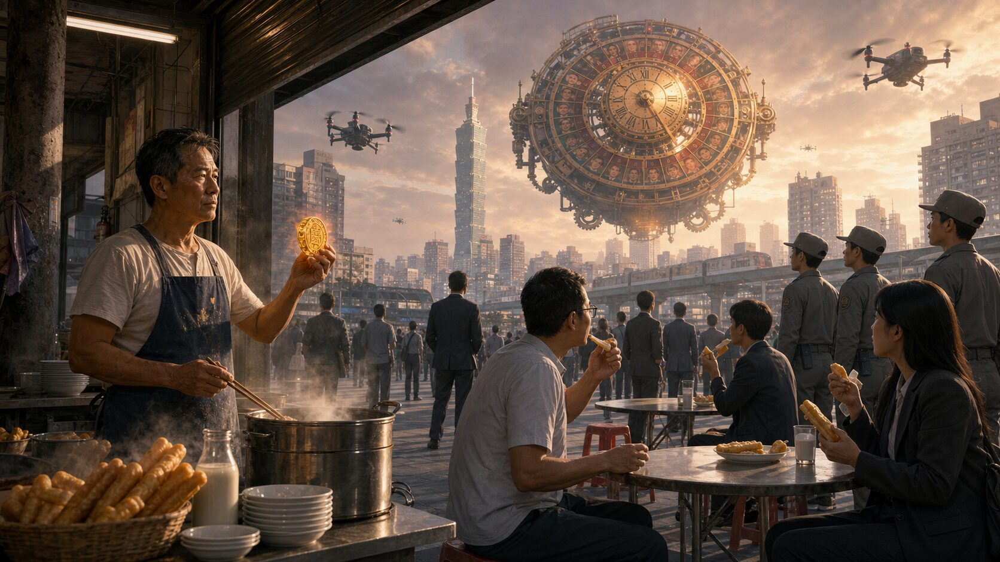
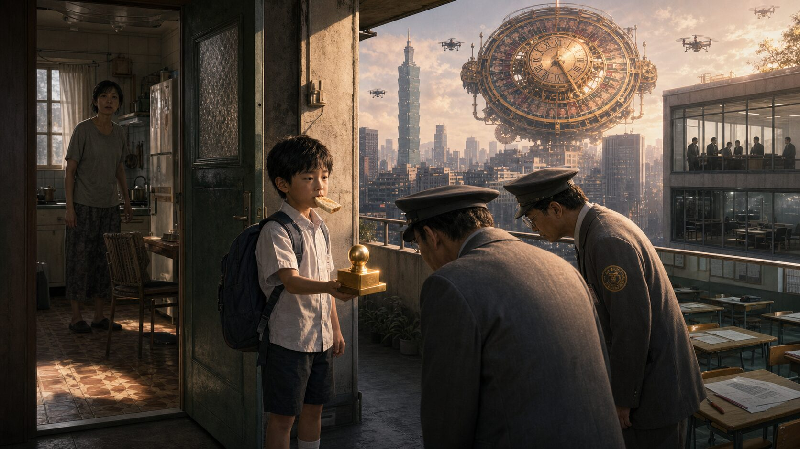
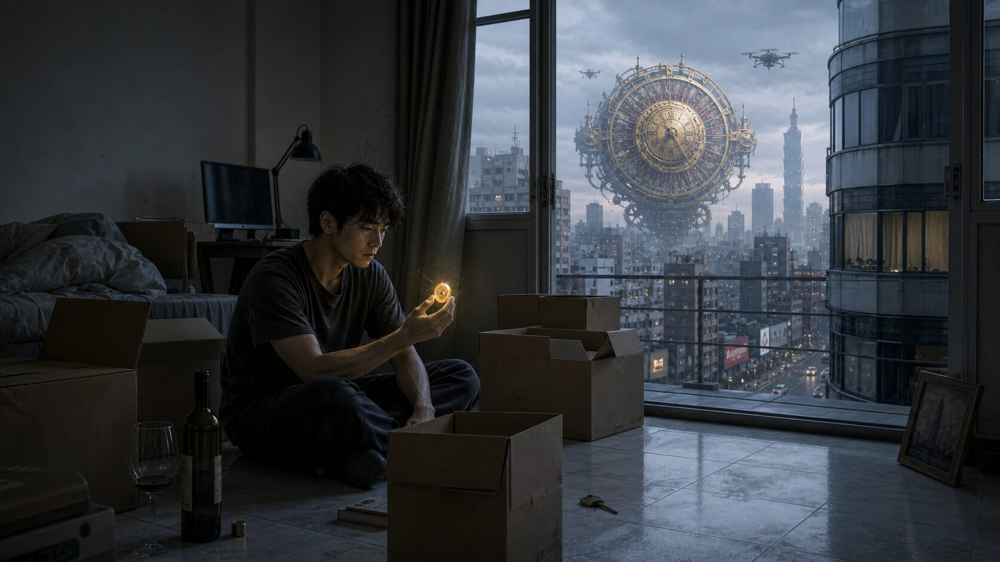
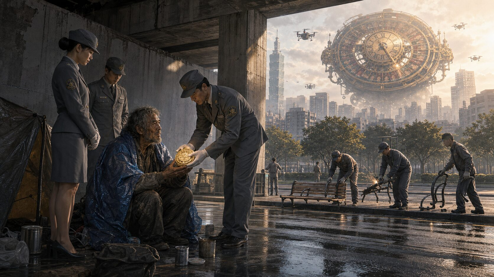
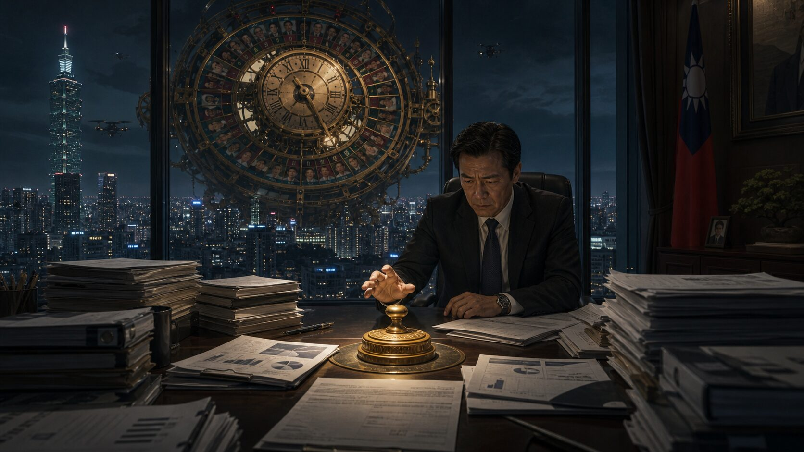
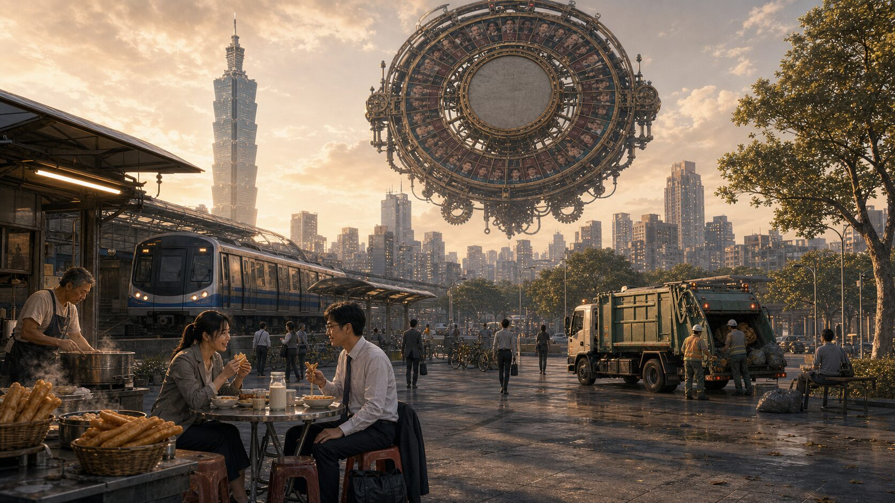

## 第一章：早餐店老闆的政令

晨霧還未完全散去的清晨六點，城市中央的大鐘發出沉悶的齒輪運轉聲。隨後，懸浮在半空中的巨大銅製轉盤開始瘋狂旋轉，數百萬個市民的戶籍編號在金屬碰撞的清脆聲響中交錯。

三秒鐘後，轉盤驟停。指針指向了一個極其平凡的數字。

紅透半邊天的電子螢幕上，顯現出一張滿是汗水與油煙痕跡的臉孔，底下印著一行字：「西區『老廖豆漿店』負責人，廖得旺。」

此時，老廖正站在滾燙的油鍋前，用一雙長竹筷熟練地翻轉著鍋裡逐漸膨脹的金黃色油條。當市政府的授權秘書與兩名身穿鐵灰色制服的儀隊侍從跨進店門時，店裡正瀰漫著豆漿沸騰的香氣。

「廖先生，恭喜您，您是今日的城市主人。」秘書遞上代表至高權力的金色印信，神色恭敬卻帶著一絲程序化的疲憊。

老廖連頭都沒抬，用抹布擦了擦額頭的汗，指著排隊的長龍說：「拿去放桌上吧。沒看我這正忙著？油條老了就不好吃了。」

「廖先生，按照大憲章，您今天有權頒布一條絕對不可違背的政令，全城將會在三十分鐘內透過城市系統強制執行。」秘書耐心地解釋，接著又補上一句例行的官式提醒，「但請注意，根據大憲章的核心規則，有三條硬性限制：第一，政令不得針對或指定特定個人意志；第二，政令效力不得延續到午夜之後；第三，政令不得直接造成任何人身生命或安全的直接殺傷與危害。」

老廖轉過身，看著店門口那些一邊低頭滑手機、一邊把腳踏車踏板踩得飛快的人們。一個穿著筆挺西裝的年輕人衝到櫃檯前，粗魯地拍下一枚硬幣，抓起一杯冰豆漿，甚至沒等封口膜撕開，就一邊咬著吸管一邊往捷運站狂奔。另一個女白領則只點了一杯雙倍濃縮咖啡，臉色蒼白得像是一張沒寫字的紙，一隻手拿著咖啡，另一隻手還在接聽電話，高跟鞋在人行道上敲出焦慮的急促聲響。

老廖嘆了口氣。他看著這些每天早上都在跟時間賽跑，卻連自己嘴裡嚼的是什麼都不知道的市民。

「行了，我想好政令了。」老廖把竹筷擱在油鍋邊，指著手裡的金色印信說。

「今天，所有人早上都得給我好好坐下來吃早餐。不准邊走邊吃，不准在車上吃，更不准只喝咖啡打發肚子。不管你吃的是燒餅油條還是三明治，都得給我坐在椅子上，老老實實地吃夠十分鐘。」

秘書微微一愣，有些遲疑地記錄下來，隨即點了點頭：「明白了。全城執行。」

三十分鐘後，沉睡的城市被清脆的廣播鐘聲喚醒。

「城市主人廖得旺宣告：即刻起至上午十點，全體市民實行『早餐定位令』。所有飲食行為必須在靜止且有椅子的狀態下進行，違反者將面臨城市規則之限制。」

在金融區的一棟商辦大樓前，高級分析師林偉明正一隻手提著公事包，另一隻手拿著剛從便利商店買來的御飯糰。他正準備邁開大步跨進旋轉門，一邊撕開包裝咬了一口，手腕上的個人終端設備隨即劇烈震動起來，亮起刺眼的紅色警示：

「警告：偵測到移動中進食行為。請於三十秒內尋找座位，否則將扣除今日信用點數，並暫停捷運搭乘權限。」

與此同時，半空中傳來低沉的嗡嗡聲，幾隻巡邏無人機亮起溫和卻無法忽視的藍光，在大樓廣場上空盤旋，用合成語音複誦著：「請市民配合今日政令，尋找座位靜止進食。」

不僅是他，整條大街上頓時陷入一片奇異的停滯。數百名穿著整齊的上班族在人行道上硬生生停下腳步。有人張著嘴巴，看著紅閃閃的終端螢幕一臉錯愕；有人拿著保溫杯，在無人機的注視下無奈地縮回腳步。

沒人想為了一個飯糰或一口水被扣除信用點數，進而影響到貸款利率或通勤權限。

「這簡直是胡鬧！」林偉明憤怒地抱怨，但眼看著開會時間就要到了，他不得不妥協。他環顧四周，附近的公園長椅早就被坐滿了，甚至連花圃的石階、路旁的裝飾石球上都擠滿了西裝革履的男女。無奈之下，他只能走到路邊一張空著的石椅旁，心不甘情不願地坐了下來。

當他坐下的那一刻，終端設備上的紅色警示瞬間轉為綠色的十分鐘倒數計時。

林偉明嘆了口氣，拆開御飯糰的包裝。他一邊嚼著海苔，一邊習慣性地用另一隻手點開終端螢幕，準備查看今天的股市開盤數據和未讀郵件。

螢幕運作一切正常，數據如常滾動。然而，當他坐定下來，不再需要一邊躲避行人、一邊提防紅綠燈、一邊拼命往嘴裡塞東西時，他發現自己其實不需要用這種近乎自虐的速度閱讀報表。

早晨的陽光此時正毫無遮擋地灑在石椅上，暖烘烘的，不像辦公室裡的日光燈那樣刺眼。旁邊坐著的是一位平時在電梯裡遇到連點頭都嫌浪費時間的競爭對手，此時對方正一臉無奈地啃著一隻荷包蛋，蛋黃還不小心滴在了昂貴的領帶上。

林偉明忍不住輕笑了一聲。對方看了看自己的領帶，又看了看林偉明，也苦笑了起來。

「這老闆真是瘋了。」對手說。

「是啊，不過這蛋餅看起來挺香的，你在哪買的？」林偉明指了指對方手裡的食物，順口問道。

在城市的各個角落，同樣的一幕幕正在上演。原本像蟻群一樣匆忙挪動的黑色人流，突然在人行道、廣場、公園和餐館裡停滯了下來。人們被迫坐在隨處可見的椅子上，開始看著彼此，或者看著天空。

上午十點半，政令解除，城市重新運轉。

林偉明急匆匆地趕進辦公室。他本以為遲到會帶來一場災難，但當他推開會議室大門時，卻發現氣氛有些反常。

往常這個時候，會議室裡總是瀰漫著焦躁的氣息。每個人都鐵青著臉，胃部因為空腹灌入高濃度咖啡而隱隱作痛，血糖低落導致每個人都像拉滿的弓弦，隨時準備為了一點點數據偏差吵得不可開交。

但今天，桌上居然難得乾淨。大家都坐得端正，臉色因為充分吸收了晨光而顯得有些紅潤。更重要的是，沒有人因為飢餓或焦慮而顯得易怒。

「林經理，」助理遞上報告，聲音比平時輕快許多，「今天的晨會報告已經彙整好了。另外，行銷部那邊剛才主動打來，說昨晚那個爭議案他們願意退讓一步。他們今天早上的口氣聽起來特別溫和。」

林偉明接過報告。在平常，他看到行銷部昨晚的郵件時，一定會立刻升起防衛心理，反射性地寫一封充滿火藥味的覆信。但此時，他的胃暖洋洋的，大腦在充足的碳水化合物支撐下運作得十分清晰。他平心靜氣地看完報告，發現對方的提案確實有其合理之處。

原本預計要在一片爭吵與推諉中拖延兩個小時的跨部門會議，今天居然在四十分鐘內就得出了結論。

那被迫停下來的十分鐘，沒有耽誤任何事情，辦公室裡反而少了一些焦躁的爭吵，多了一點理智的餘裕。

傍晚，老廖結束了一天的營業，坐在自己店門口的塑料椅上，用圍裙擦著雙手。

市政府的秘書再次來到店裡，收回了金色印信。

「廖先生，您的任期結束了。」秘書看著這個依舊一身油煙味的老人，「今天城市雖然有些混亂，但結果出奇的好。大家好像都變得不太一樣了。」

「是嗎？」老廖一邊拿著抹布用力擦著沾滿油漬的桌面，一邊漫不經心地應著，「我只知道，今天的麵粉用得比平常快，燒餅多烤了三爐。明天得早半個小時起來揉麵了。」

秘書微微一愣，隨後笑了笑，收起印信，轉身走入漸深的夜色中。

第二天清晨，大鐘再次響起，旋轉的指針指向了下一個幸運兒。全城的人們揉著眼睛走出家門，習慣性地摸了摸口袋裡的皮夾，準備迎接新主人的新政令。

但當他們經過老廖的豆漿店時，許多人看著門口排隊的座位，腳步不由自主地慢了下來。

今天已經沒有強制執行的城市系統警告了，也沒有無人機在頭頂盤旋。但林偉明走到店門口時，看著手裡的熱咖啡，猶豫了一下，最終還是拉開一張空椅子，坐了下來。

他看著街上依然匆忙的人群，突然覺得，自己今天或許可以多坐五分鐘。

## 第二章：小學生的星期三

晨光穿透薄霧時，城市中央的銅製大鐘再次傳來沉重的齒輪嚙合聲。懸浮在半空中的巨大轉盤轉動得如同飛旋的金屬飛碟，無數市民的註冊編號在光影中交錯重疊。

三秒鐘後，指針在一個帶有學校註冊代碼的數字上穩穩停下。

市中心巨大的電子螢幕上，隨即亮起一張有些睡眼惺忪、頭髮亂翹的男童照片。他嘴裡還咬著半塊塗了草莓果醬的吐司，底下印著一行字：「第四區『向陽國小』四年二班，陳冠宇。」

此時，在老舊公寓的廚房裡，陳冠宇的母親剛把保溫瓶塞進他的書包，電視新聞的播報聲就讓她整個人愣在原地，手中的湯匙清脆地掉落在地磚上。

門口傳來規律而禮貌的敲門聲。打開門，身穿鐵灰色制服的侍從與市政府的授權秘書正微微躬身，手中托著象徵城市最高權力的金色印信。

十歲的陳冠宇背著書包，看著門口排成一列的嚴肅大人，又轉頭看了看廚房裡一臉驚恐的母親。他的腦子此時塞滿了今天第二節課的數學心算抽測，以及第三節課的英文單字聽寫。

「陳先生，您好。」秘書半蹲下身子，儘量讓自己看起來溫和一些，「您是今天的城市主人。在今晚午夜之前，您可以頒布一條全城強制執行的政令。請問您有什麼想改變的嗎？」

陳冠宇吸了吸鼻子，有些緊張地抓緊了書包帶子。他想起每天晚上，爸爸媽媽回到家時那疲憊又焦躁的臉。媽媽總是揉著太陽穴說「今天開了一整天的無聊會議，頭痛得要死」；爸爸則會癱在沙發上抱怨「那些長官自己不工作，只會叫大家開會報告進度」。

而每到星期三，更是他們家氣氛最緊繃的日子。因為這天不僅他要面臨學校的週考，爸爸媽媽也都要回總部參加週報會。

「我……我不想考試。」陳冠宇小聲地說。

秘書點了點頭，在平板上記錄著：「取消今日所有學校的測驗。」

「還有，」陳冠宇大著膽子補充，「大人也不准開會。他們每次開完會回家都很生氣，比我考不好還要兇。既然我們不能考試，那大人的『考試』也應該取消。」

秘書握著觸控筆的手指微微一頓。他看著眼前這個滿臉認真的小學生，隨後點了點頭：「您的意思是，今天全城禁止所有會議與考試？」

「對！都不准！」陳冠宇用力點了點頭。

「明白了，政令即刻生效。」

十五分鐘後，全城的廣播系統響起溫和的提示音：

「城市主人陳冠宇宣告：今日實行『週三禁考禁會令』。即刻起至午夜，本市所有各級學校之考試、測驗、評量，以及所有機關、企業、團體之會議、簡報、協調會，一律禁止舉辦。系統將自動暫停相關預約與硬體功能。」

在向陽國小四年二班的教室裡，導師王老師正抱著一疊剛印好、還帶著碳粉餘溫的數學考卷走上講台。當廣播聲落下時，黑板上方的智慧螢幕閃爍了一下，跳出「今日測驗功能已鎖定」的字樣。

底下的學生們先是一靜，隨即爆發出壓抑不住的低呼。

王老師看著手裡的考卷，無奈地笑了笑。沒有了考試，這堂課的進度頓時空了出來。她把考卷放回桌上，拍了拍手：「好吧，既然不能考試，我們今天來做點別的。大家把抽屜裡那本很久沒看的課外書拿出來，或者，我們來討論一下上次在校外教學看到的昆蟲？」

相較於小學教室裡迅速建立的新秩序，幾公里外的金融區大樓裡，混亂才剛剛開始。

「正道資訊」的專案總監郭振亞剛跨進辦公室，就看到秘書一臉無奈地指著螢幕。今天本來是每週一次的跨部門進度對齊會，但此時行事曆上所有被標註為「會議」的格子，都變成了無法點擊的灰色區塊，並附帶一條系統提示：「因應今日政令，會議功能暫不開放。」

大樓裡的玻璃會議室全都大門緊鎖，原本用來投影簡報的螢幕一律漆黑。

「這簡直是胡鬧！」隔壁部門的經理在走廊上踱步，聲音裡帶著難以抑制的焦躁，「不開會，我們怎麼對齊進度？怎麼確認每個人都有在做事？」

沒有了會議室，幾名主管試圖在走廊上站成一圈，用氣聲進行「快速對齊」。然而，當第四個人加入、郭振亞習慣性地說出「那我們先拉一個 alignment……」時，所有人手腕上的個人終端設備便同時劇烈震動起來，亮起刺眼的紅色警示：

「警告：偵測到多人聚集商討工作。請於三十秒內散開，否則將扣除今日信用點數。」

主管們面面相覷，最後只能悻悻然地散開，回到各自的隔間座。

上午十點，原本是一天中辦公大樓最嘈雜、會議室最緊俏的黃金時間。此時，整棟大樓卻陷入了一種近乎真空的安靜。

沒有了會議，許多人坐在辦公桌前，反而顯得有些無所適從。有些人習慣了在會上聆聽指令或發表意見，此時看著安靜的通訊軟體，竟不知道該如何單獨推進項目；有些人習慣了將一整天的時間塞滿會議來顯得自己重要，現在看著空蕩蕩的行事曆，突然產生了某種被遺棄的恐慌。

郭振亞看著自己乾乾淨淨的桌面。往常此時，他應該抱著筆電在不同的會議室之間穿梭，用一堆充滿術語的投影片向高層報告那些尚未完成的指標，或者在跨部門會議上，用「互利共贏」、「賦能」等詞彙與行銷部爭論責任歸屬。只要會議在開，簡報在播，大家就覺得工作正在推進，自己也正在創造價值。

但現在，他只能坐在這裡。

沒有了會議這個容許模糊與妥協的舞台，原本用來掩蓋問題的漂亮簡報失去了用武之地。郭振亞點開了那份已經被擱置了兩週的專案原始數據。在平時，他只會在開會前半小時匆匆瀏覽摘要，然後在會上跟著大家的討論隨波逐流。

當他真正沉下心來，一行行閱讀那些未經美化、沒有被塞進簡報精美圖表裡的原始數據時，他微微皺起了眉頭。他發現，團隊一直試圖解決的「系統延遲問題」，根本不是研發部效率低落，而是行銷部在前期規劃時，寫錯了核心業務的邏輯需求。

如果今天這個會議照常召開，行銷部大概又會用精心設計的圖表和高亢的發言主導輿論，而研發部則會在主管的施壓下，唯唯諾諾地吞下這個不屬於他們的責任，承諾一個根本做不到的改善期限。

郭振亞沒有寫那些應付會議的報告，而是直接在共用文件上寫下了言簡意賅的技術分析，並標註了行銷部的專案負責人。

此時，在大樓另一端的廣告代理商辦公室裡，資深文案小妤也正面對著這種奇特的空白。

平常的星期三，她大半天的時間都被「腦力激盪會」、「客戶對齊會」和「內部進度會」切得支離破碎。每一次開會，她都得聽著主管們在白板前畫出宏偉藍圖，然後在會議結束後，拖著精疲力竭的身軀加班寫文案。

今天，她難得有了一整段完整的下午時間。沒有了會議的打擾，她泡了一杯茶，聽著耳機裡的輕音樂，在短短三個小時內就寫完了三個不同版本的創意提案。

她看著螢幕上那些流暢且沒有被「會議共識」修剪得平庸的文字，突然感到一絲荒謬。

到了下午三點，這種奇妙的氛圍在整座城市蔓延開來。

在政府機關裡，沒有了冗長的匯報會，公務員們開始動手清理積壓了數週的民眾陳情信；在設計工作室裡，設計師們終於有時間把手從畫布上移開，去看看窗外的街道；甚至在醫院的行政區，沒有了跨科室協調會的醫生們，能夠在值班室裡多閉目養神半個小時。

人們開始在通訊軟體上用極其簡練、精確的文字溝通。

「問題在A點，我已經修正，請確認。」
「收到，確認無誤，已發布。」

沒有了會議室裡的察言觀色、沒有了為了顯得自己重要而刻意延長的發言。事情竟然以一種令人難以置信的速度，在平靜中被一件件解決了。

郭振亞端著咖啡走到窗前。對面金融大樓的玻璃會議室此時漆黑一片。沒有了那些精美的簡報與冗長的發言，剩下的只有工作本身。

傍晚，夕陽將整座城市染成溫暖的橘紅色。

陳冠宇在校門口拉著母親的手。母親今天沒有像往常那樣一邊走一邊用藍牙耳機焦慮地交待工作，而是靜靜地聽著兒子說著今天在學校觀察昆蟲的趣事。

夜幕低垂，城市的限制系統逐漸解除。

郭振亞整理好公事包，關上辦公室的燈。今天他不僅沒有加班，甚至還提早完成了本週的額外進度。

走出大樓時，他碰到了別的部門的經理。那名經理正站在門口，手裡拿著終端設備，似乎想在系統限制解除的第一時間預約明天的會議室。

但經理的手指在螢幕上方懸空了很久，看著那個原本該被會議填滿的星期四上午，最終卻沒有按下去。

經理揉了揉有些酸痛的肩膀，將螢幕鎖定，隨後跨入了回家的夜色中。

## 第三章：失戀者的城市

當週四早晨的銅製大鐘再次發出沉悶的齒輪嚙合聲時，懸浮在半空中的巨大轉盤轉動得有些遲緩。

三秒鐘後，指針在一個登記地址為「東區舊公寓四樓」的編號上停了下來。

巨大螢幕上顯現出一張憔悴的臉孔。那是一個二十八歲的年輕男子，眼眶泛紅，頭髮凌亂，眼神裡透著一種熬夜後的空洞。底下的字樣顯示著：「自由網頁設計師，林哲宇。」

此時，林哲宇的客廳地板上還散落著幾只剛拆開的紙箱，牆角留著膠帶扯落的白色膠痕。他的女友在昨晚搬走了所有的行李，只在玄關鞋櫃上留下一把冰冷的鑰匙和半瓶沒喝完的紅酒。他整夜沒睡，看著天花板由黑轉灰，直到市政府的秘書與兩名侍從敲響了他的房門。

「林先生，您是今天的城市主人。」秘書遞上金色印信。

林哲宇看著那枚印信，沒有立刻接，只是自嘲地問：「我能讓一個人回來嗎？」

秘書安靜地看著他，微微搖頭：「大憲章的權力無法干涉個人的自由意志。您只能修改城市的公共規則。」

林哲宇沉默地接過印信。他走到窗邊，拉開一點百葉窗。街對面的巨大廣告看板正亮起粉紅色的情人節預告；便利商店的戶外螢幕播放著歌手在雨中相擁痛哭的音樂錄影帶；甚至樓下早餐店也傳來聲息俱厲的情歌，歌詞一遍遍重複著沒有對方就無法活下去的宣告。

這明明是個星期四，許多市民還在享受昨天「禁考禁會令」留下來的餘溫，街道上甚至有人習慣性地坐在石椅上慢慢喝完咖啡才準備進辦公室。然而，這座城市依然像是一台巨大的、無孔不入的戀愛宣傳機器，隨時隨地都在向角落裡的人廣播著某種「成雙成對」的標準狀態。

「我想修改幾條規則。」林哲宇轉過身說。

「請說。」

「第一，今天全城所有公共場所，禁止播放任何含有愛情歌詞或戀愛意象的歌曲。只准播放無人聲的器樂演奏，或者乾脆保持安靜。」

「第二，所有餐飲店，服務人員在迎賓時，絕對不准詢問顧客『幾位』這句話。」

「第三，所有夜景餐廳、高空景觀餐廳的靠窗座位，今天一律拉上幕簾，不准任何人入座。」

秘書在平板上快速記錄，沒有多問，隨即微微躬身退出了房間。

早上八點半，捷運站前的廣場。

往常這個時候，街頭藝人小魏早就架好了麥克風，自彈自唱著那些迎合大眾的傷感情歌。但今天，當他剛開口唱出第一個關於「愛與痛」的字時，他手腕上的終端機便劇烈震動起來，巡邏無人機也在空中發出警示：「偵測到戀意歌詞，請立即停止，否則扣除今日信用點數。」

小魏氣得一腳踢開吉他架，對著趕來的巡警大喊：「這是我唯一的收入來源！就因為某個傢伙失戀，我連歌都不能唱了？這算什麼政令！」

圍觀的上班族有人皺眉，有人低頭走過，也有人小聲附和，覺得這政令實在自私。小魏無奈之下，只能收起歌本，憤憤地坐在石階上，隨手撥弄琴弦，彈奏起一首純樂器的吉他獨奏。

沒有了歌詞，只有清脆的吉他旋律在晨風中飄蕩。林偉明經過廣場時，腳步微微一頓。他注意到，平日裡那些總是行色匆匆、對街頭音樂視而不見的行人，竟然有幾個人停下了腳步，安靜地聽完了這首曲子，並在小魏的琴盒裡放下了零錢。小魏愣了一下，看著那幾個駐足的背影，眼中的憤怒漸漸平息，琴聲也變得溫柔起來。

而此時，在捷運車廂內，氣氛同樣奇異地安靜。

一名獨自通勤的女白領站在車廂連接處，看著捷運上特別設計的雙人座椅。那些座椅為了美觀與防滑，表面帶著微微向中間傾斜的弧度。如果是一對情侶坐著，身體會自然而然地往中間靠攏，顯得親密無間；但此時，並排坐著的是兩個互不相識的陌生人。為了不滑向對方、不觸碰到彼此的肩膀，兩個人都不得不繃緊了大腿和核心肌群，拼命往外側撐著。

女白領看著他們彆扭的姿勢，默默轉開了視線。

這種無聲的懲罰，在超市裡變得更加具體。

午休時間，金融區的精品超市裡，剛從辦公室出來的小妤推著購物車，站在生鮮區前發愣。貨架上，鮮嫩的有機蔬菜大多被精緻的塑膠膜兩兩捆綁，貼著「家庭分享包」或「買一送一」的亮麗標籤。

如果她只想買一把青蔥、半顆高麗菜，她就必須支付比雙人份折算下來貴上一倍的單價。而且，那些大包裝的食材帶回家，往往有一半會在冰箱角落地慢慢爛掉。

小妤看著手中的那盒「幸福雙人牛排」，又看了看旁邊單片包裝、卻薄得像紙片且價格不斐的單人肉品。她站在那裡，無聲地放下了牛排。

中午十二點半，商業區的連鎖定食店迎來了人潮。這一天，對於習慣了標準作業流程的服務業來說，簡直比昨天的禁會令還要手忙腳亂。

一家日式定食店的門口，負責迎賓的實習生雙手在身前尷尬地交疊又放開。他習慣了站在門口，用上揚的語調喊出那句「歡迎光臨！請問幾位？」。

此時，一位穿著西裝的男士獨自走進店裡。實習生下意識地張開口：「歡迎光臨！請——」那個「問」字卡在喉嚨裡，他的臉憋得有些紅，最後只能生硬地轉折道：「……裡面請，請隨意找空位坐下。」

男士微微一愣，隨後點了點頭，走進了餐廳。

以往獨自用餐的人，總要在這句「幾位」的詢問下，當眾剖開自己的社交狀態。隨後，服務生會迅速收走對面的碗筷、水杯，只在桌面上留下一個人的餐具，彷彿在無聲地向周圍宣告這張桌子缺了一半。

但今天，店裡的所有餐具都維持原樣。店員不再上前收走多餘的玻璃杯，只是安靜地遞上菜單。

獨自前來的顧客們散落在各個角落。他們沒有像平時那樣，為了掩飾一個人的尷尬而死死盯著手機螢幕，或是戴著耳機裝作與世隔絕。因為沒有人特意去區分他們，坐在這張四人桌上，對面空著的位子不再是「被拋棄的證明」，而只是一個乾淨的、多出來的空間。

傍晚，市中心大樓四十五樓的「星空牛排館」。

厚重的藍色天鵝絨幕簾已經被拉上，將那面可以俯瞰整座城市霓虹夜景的巨大落地窗遮擋得嚴嚴實實。

幾對盛裝打扮的情侶坐在大廳中央的普通座位上。往常，這家餐廳的賣點就是窗外那片璀璨的萬家燈火，那是一層完美的社交面具。當對話陷入尷尬時，情侶們可以看著窗外，用「你看那棟樓的光」來填補空白，或者將注意力投射在遙遠的光影中，逃避對視。

而現在，當幕簾拉上，光線被限制在桌上溫暖的燭光內。

一對交往多年的情侶面對面坐著。男方習慣性地拿著手機翻看，女方則看著藍色天鵝絨幕簾上的紋路。

「今天沒有夜景，好像沒那麼漂亮了。」男方試圖打破沉默。

女方沒有看他，只是用湯匙攪動著湯：「我們以前來，你大半時間也都在拍夜景發動態，不是嗎？」

男方窒了一下，收起手機，看著眼前的女友。在沒有夜景可看的情況下，他注意到她眼角細微的疲憊，以及她看著自己時，那種不再帶有期待的眼神。

「妳今天說話一定要帶刺嗎？」男方壓低聲音，語氣裡有著被剝除面具後的惱怒。

「我只是覺得，沒有了外面的燈光，我們坐在這裡，其實根本沒話可說。」女方平靜地看著他，聲音很輕，卻像錐子一樣扎實。

隔壁桌的一對夫妻也陷入了難堪的沉默。沒有了高空浪漫氣氛的烘托，他們面前精緻的法式餐點顯得有些冷冰冰。妻子看著丈夫不停抖動的膝蓋，丈夫看著妻子微微下垂的嘴角，兩人都意識到，那些平常用「帶妳去吃景觀餐廳」來粉飾的裂痕，在此時狹小而誠實的燭光下，再也無處躲藏。

而在大廳的另一角，一個穿著便服、獨自前來出差的商務客，原本因為被分配在沒有隱私的大廳中央而有些局促。現在，因為沒有了夜景的浪漫光環，大家都一樣被困在小小的燭光裡，他反而放鬆了下來，慢條斯理地切著牛排，享受著許久未有的安靜晚餐。

夜幕低垂。

林哲宇坐在自己公寓的陽台上，看著樓下安靜的街道。沒有了喧囂的情歌，城市的底噪變成了一種溫和的風聲與遠處捷運經過時細微的隆隆聲。

敲門聲再次響起，秘書站在門口，伸手收回了金色印信。林哲宇沒有說話，只是點了點頭。秘書接過印信，朝他微微致意，隨後轉身消失在昏暗的走廊盡頭。

林哲宇關上陽台的門，退回客廳。

他沒有開燈，只是躺回了那張雙人床上。

街對面原本會折射進客廳的粉紅色情人節廣告燈此時已經熄滅，整個房間陷入了純粹而深沉的黑暗。

在這片沒有任何情歌暗示的寂靜中，他睜著眼睛看著黑暗。他身側的空位依然冰冷，喉嚨裡那股失戀的酸澀與痛楚沒有因為這條政令減少半分。

但他感受著自己在黑暗中不規律的呼吸聲，聽著廚房裡老舊冰箱傳來的單調運轉聲，緩慢地閉上了眼睛。

## 第四章：流浪漢的王座

當週五清晨的銅製大鐘再次發出沉悶的齒輪嚙合聲時，懸浮在半空中的巨大轉盤在朝霧中緩緩旋轉。數百萬個市民的戶籍編號在金屬碰撞聲中交錯，最後，指針停在了一個幾乎被城市資料庫遺忘的邊緣編號上。

中央大螢幕上閃爍了幾下，亮起一張有些模糊的照片。那是一張被烈日與烈酒刻得滿是溝壑的臉，灰白的鬍鬚沾著不知名的污漬，眼神渾濁且充滿戒備。底下的字樣顯示著：「無固定居所，戶籍暫設於西區遊民收容所，姓名：吳阿土。」

此時，老吳正蜷縮在東區高架橋下的水泥墩旁。他身上的破爛藍色塑膠帆布蓋不住他發乾發裂的雙腳，一陣冷風吹過，他劇烈地咳嗽了幾聲，揉著關節腫脹的膝蓋，嘴裡嘟囔著含混的髒話。

當兩名身穿鐵灰色制服的侍從與市政府的授權秘書跨過地上的積水與空啤酒罐，站在他面前時，老吳猛地縮回腳，抓緊了身上的帆布，渾濁的眼睛死死盯著他們，語氣防備而粗魯：「幹嘛？這裡不能睡了是不是？我沒偷沒搶，滾一邊去！」

「吳先生，請別誤會，高度自治委員會向您致意，」秘書退後半步，避開地上的一灘爛泥，神色依舊維持著程序化的專業與冷靜，遞上代表最高權力的金色印信，「您是今天的城市主人。在今晚午夜之前，您可以頒布一條全城強制執行的政令。」

老吳看著那枚在晨光下閃閃發光的金色印信，又看了看秘書那身連一絲摺痕都沒有的西裝。他啐了一口唾沫，冷笑了一聲：「城市主人？少來這套，這又是什麼整人節目的把戲？還是你們政府又想出了什麼新法子要把我們趕出這區？」

「這是大憲章規定的程序，吳先生，沒有人能造假。」秘書耐心地將印信往前遞了遞，「只要您蓋下印章，今天整座城市都必須聽您的。」

老吳歪著頭，狐疑地看著那枚金屬印章。他揉了揉僵硬的手腕，翻了個身，朝馬路對面的小公園望去。那裡有一排在樹蔭下的長椅，看起來陰涼又舒服。但老吳知道，那椅面上每隔五十公分就焊死了一道高高拱起的鑄鐵扶手。他上週試圖在那裡躺一會兒，肋骨被那冰冷的鐵疙瘩硌得疼了三天，最後還被巡警以「影響市容」為由用警棍敲醒。

他盯著那道扶手，又摸了摸自己像針扎一樣酸痛的腰。

「把對面那些椅子上的鐵疙瘩給我拆了。」老吳指著公園，聲音沙啞而暴躁，「還有全城所有這種椅子，整天裝些有的沒的，連個躺的地方都沒有。老子今天腰疼得要死，就想平平整整地躺著睡一覺。叫他們全部拆乾淨，今天誰都不准在椅面上裝這些玩意兒。」

秘書微微一愣，隨後點了點頭，在平板上快速記錄：「全城公共空間之長椅，即刻取消防躺臥之設計障礙。」

三十分鐘後，城市的廣播系統傳出溫和的提示音：

「城市主人吳阿土宣告：今日實行『公共長椅平整令』。即刻起至午夜，本市所有公園、廣場、人行道及公共開放空間之長椅，其上所有用以限制躺臥之分隔件、扶手及防範設計，一律解除或收回。系統將自動調整相關硬體模組。」

隨著城市管理系統的指令下達，全城數萬張配備有智能模組的公共長椅內部，電磁鎖無聲地鬆開。那些原本用來分隔座位、防範躺臥的鋼製拱形扶手，在低沉的機械運轉聲中，緩緩縮回了椅面下方，與木條或石板平齊。而那些老舊的、無法自動收回的鑄鐵長椅，則由匆匆趕來的市政工務機器人手持工具，將中間的鐵欄杆一一拆除。

不到一個小時，整座城市的公共長椅，全部恢復成了一條條平整、開闊且沒有阻礙的水平面。

老吳拖著灌了鉛似的雙腿，抱著他的藍色塑膠帆布，大搖大擺地跨過馬路。他走到那張他看中很久的樟樹下長椅旁，伸手摸了摸原本裝著鐵扶手的地方，現在那裡只剩下一塊平滑的木板。他把帆布往椅面上一鋪，整個人直挺挺地躺了下去。

樹蔭遮擋了開始刺眼的陽光，微風吹過，他舒舒服服地閉上眼睛，沒多久就發出了粗重的鼾聲。

中午十一點半，陽光炙熱。

美食外送員阿豪剛送完最後一單午餐，跨在機車上，後背的汗水已經將制服浸得濕透。他的腰椎因為長期騎車而隱隱作痛，雙腿像灌了鉛一樣沉重。在以往，他累了只能坐在機車座墊上，把頭靠在龍頭上打個盹，醒來時往往脖子落枕，痛苦不堪。

他把機車停在路邊，走進旁邊的街心綠地。他驚奇地發現，平日裡那些裝滿鐵扶手的長椅，此時竟然光溜溜的，平整得像是一張張窄床。

阿豪四下看了看，有些遲疑地走過去。他將安全帽墊在腦後當枕頭，整個人平躺在木質椅面上。

當他的脊椎終於呈水平狀態伸展、承受了一整天重力的骨盆完全放鬆下來的那一刻，他聽到了自己關節發出的一聲輕微脆響。阿豪閉上眼睛，頭頂是茂密的樟樹葉，微風吹過，陽光穿過綠葉的縫隙，在他眼皮上投下溫和而斑駁的紅暈。他沉沉地睡了過去，不再需要維持著防備的坐姿。

然而，在金融區的百貨公司廣場前，衝突卻在無聲中升級。

廣場上用進口花崗岩打造的弧形景觀椅上，那些平時用來防止逗留的鍍鉻鋼條已經消失。此時，一個穿著破爛羽絨衣、腳邊放著兩個大塑料袋的老人，正躺在右側那一端，縮著脖子發出粗重的鼾聲；而在他身旁不到一公尺的地方，一個穿著昂貴西裝、皮鞋擦得發亮的商務人士，也正雙手搭在腹部，領帶歪向一邊，毫無形象地沉沉睡去。

百貨公司的樓面經理皺著眉頭走出來，看著這幅畫面，臉上的肌肉微微抽搐。他轉向廣場保全老張，低聲斥責：「老張，怎麼回事？把那個流浪漢趕走，這像什麼樣子？客人都被嚇跑了。」

老張看了一眼手腕上的終端設備，上面正亮著一條綠色的法規保護提示。

「經理，今天不行。」老張指了指螢幕，「系統規定，今天所有人都有權利在長椅上躺臥。如果我動手驅逐，系統會直接認定我違反政令，扣除信用點不說，還可能被起訴。」

經理的臉色陰沉下來，正想再說什麼，路過的一對男女在椅旁停下了腳步。

「這簡直是胡鬧，」牽著小孩的婦人拉緊了孩子的手，快步走過，對身旁的丈夫抱怨，「好好的廣場，弄得跟難民營一樣。公共空間是我們納稅人建的，不該讓這些不繳稅、不工作的人隨便佔用吧？連個坐著休息的地方都沒了。」

「話不能這麼說吧，」旁邊一個坐在石階上的年輕人忍不住插話，他手裡拿著剛買的咖啡，「公共空間不就是給所有人用的嗎？難道不花錢、沒繳那麼多稅的人，連在街上舒服躺一下的權利都沒有？非要把大家都逼得像上了發條的玩具，只能走不能停，這座城市才算體面？」

「但這會影響商業秩序！」婦人轉過身，聲音拔高了幾分，「大家都躺在這裡，誰還想進百貨公司消費？城市要發展，本來就要有規矩。把這裡弄得髒兮兮的，難道就是你想要的尊嚴？」

「規矩是人定的，」年輕人冷笑，「以前裝那些鐵扶手，不就是為了裝作看不見這些人嗎？現在扶手拆了，大家發現自己其實也一樣累，一樣想躺下。你看那個穿西裝的，他今天不也躺在那裡？難道他就不配擁有公共空間了？」

圍觀的人漸漸多了起來，有人點頭，有人搖頭，甚至在市府的線上市民論壇上，這個話題也迅速被頂上了熱門首位。

「公共場所的椅子到底是為了讓人舒服，還是為了讓人快走？」
「如果一個城市連讓人平躺十分鐘的空間都要防範，那我們這些每天加班的上班族，跟流浪漢又有什麼區別？」

爭論在網路和街頭同時蔓延，但長椅上的人們依然在沉睡。炙熱的陽光下，昂貴的石材、精緻的櫥窗，與長椅上那些毫無防備、甚至有些狼狽的睡姿擠在同一個鏡頭裡。

夜幕低垂。

市中心的霓虹燈漸次亮起，將整座城市裝點得如同一顆巨大的發光珠寶。

高架橋下，秘書再度來到了老吳的水泥墩旁。地上的積水反射著遠處霓虹的光影，晃動著冷冽的光斑。

老吳剛從對面公園走回來，一屁股坐回自己的報紙堆上。他揉了揉睡得有些發紅的半邊臉，雖然腰還是有點酸，但比起前幾天已經好得太多。

秘書走上前，伸出雙手，金色印信在微弱的光線中泛著冷白的光芒。

「吳先生，您的任期即刻結束。」秘書的聲音依舊平靜而公式化。

老吳斜眼瞅了瞅那枚印章，隨手摸了摸口袋，掏出那枚印信拋了過去。他連坐都懶得坐直，一邊拉了拉蓋到脖子上的藍色塑膠帆布，一邊翻過身背對著秘書，嘴裡嘟囔著：「拿走拿走，累死人。明天把那些鐵疙瘩裝回去的時候，動作小聲點，別吵著老子睡覺。」

秘書接過印信，收回公事包中，沒有再多說一個字，轉身跨過地上的污水，帶著兩名侍從走入了陰暗的巷弄。

午夜十二點，清脆的系統提示音準時在整座城市上空響起。

「今日政令結束。系統硬體開始復位。」

伴隨著低沉而規律的電機運轉聲，全城數萬張公共長椅上的金屬欄杆、拱形扶手與防臥鋼條，再次緩緩從椅面下方升起，重新將平整的椅面切割成一個個狹窄的、規矩的方格。

第二天清晨，當人們揉著惺忪的睡眼走出家門，匆忙趕往捷運站與辦公室時，街頭的爭吵聲已經散去，城市似乎又回到了那個高效、體面且冷酷的軌道上。

金融區的廣場前，昨日圍觀的人群早已不見蹤影。

一個穿著套裝、行色匆匆的女白領手裡提著一個巨大的紙箱，裡面塞滿了她剛從辦公室整理出來的重型文件夾。她走得有些累了，想在廣場的石椅上暫時放下箱子，揉一揉勒得通紅的手掌。

然而，當她準備將箱子平放在石椅上時，那道重新升起的、亮閃閃的鍍鉻扶手正好卡在正中間。箱子放不平，歪斜了一下，裡面的文件差點散落一地。

女白領手忙腳亂地扶住箱子，看著那道重新升起的金屬扶手。她微微皺了皺眉，有些無奈地低聲自言自語：「真是多此一舉。」

她不得不重新抱起沉重的箱子，在晨光中轉身，走向那條依然沒有留給任何人停留餘地的街道。

## 第五章：市長終於被抽中

週六清晨六點，整座城市還籠罩在稀薄的藍灰色晨光中。市中心那座巨大的銅製大鐘準時發出沉悶的齒輪運轉聲，半空中的金屬轉盤瘋狂旋轉，將數百萬個戶籍編號攪成一片模糊的光影。

三秒鐘後，指針在一行特殊的編號上停了下來。

中央大螢幕亮起，顯現出一張市民極其熟悉卻又感到陌生的照片。那是一張經過精心修飾、帶著標準微笑的政治人物大頭照，底下的字樣清晰寫著：「市政府大樓十樓，市長，梁啟民。」

此時，在市長官邸寬敞精緻的書房裡，梁啟民正站在跑步機上維持著穩定的配速。當電視新聞的頭條畫面突然切換成他自己的照片時，他有些驚訝地按下了停止鍵。

敲門聲響起。

市政府的授權秘書依舊穿著那身熨燙得一絲苟的鐵灰色西裝，帶著兩名儀隊侍從跨進書房。他托著鋪有深藍色絲絨的木盤，上面放著那枚象徵城市最高權力的金色印信。

「梁先生，恭喜您，」秘書的聲音依舊保持著程序化的冷靜與恭敬，「您是今天的城市主人。在今晚午夜之前，您可以頒布一條全城強制執行的政令。」

梁啟民看著那枚金色印信，嘴角微微上揚。

身為這座城市的管理者，他這六年來每天早上都在應付那些隨機抽出的「主人」所留下來的荒謬爛攤子——老廖的早餐定位令讓當天的捷運系統運量大亂；小學生的禁會令讓市府積壓了數百件公文；失戀者的情歌禁令差點引發商業公會的抗議；更不用說昨天那個流浪漢，直接拆掉了全城長椅的扶手，導致工務局漏夜派人重新安裝。

他每天都在晨會上頭痛，在媒體前為這些混亂做公關善後。在他看來，這群普通人根本不懂得什麼叫管治，只會用權力滿足私慾或發洩情緒。

而現在，這枚權力不受任何法規、預算、議會制約的金色印信，終於落到了他這個「專業人士」手中。

梁啟民接過印信，金屬的冰冷感讓他精神一振。他轉頭對身邊的特助下令：「通知所有一級局處首長，半個小時後在第一會議室集合。今天，我們要頒布一條真正能改變這座城市格局的宏大政令。」

上午八點半，市府大樓第一會議室。

長條形的橡木會議桌旁坐滿了各局處的首長。空氣中瀰漫著濃咖啡與緊張的氣氛，每個人面前都擺著厚厚的文件與平板電腦。

梁啟民將金色印信放在桌子正中央，雙手交疊，語氣沉穩：「各位，大憲章給了我們一天的絕對立法權。這是一個難得的契機，可以繞過議會那些無休止的杯葛。我初步擬定了兩個方向：第一，『東區老舊社區強制都市更新令』，徹底解決那塊延宕十年的安全隱患；第二，『全城燃油車全面禁行令』，讓我們的綠能交通覆蓋率直接達到百分之百。這兩項政令，將奠定我們城市未來三十年的基石。」

話音剛落，特助突然神色慌張地推開會議室的大門，在梁啟民耳邊低語了幾句。

梁啟民眉頭微皺，沉吟片刻，站起身說：「諸位稍等，我下去一下。」

他帶著特助下到一樓大廳。此時，大廳接待區正站著兩名被警衛攔下的市民。一位是東區自救會的代表謝媽媽，雙手因為長年勞動而粗糙不堪；另一位是戴著袖套、神色疲憊的物流司機阿強。聽說市長被抽中且打算頒布宏大政令的傳言早已在網上傳開，他們是特地趕來的。

看見市長走過來，謝媽媽激動地跨前一步，聲音有些顫抖：「梁市長，我們聽說您今天打算強拆東區！我老伴癱瘓在床，我們在那老房子住了四十年，那是他唯一熟悉的地方。如果您今天用大憲章下一條強制令，拆遷機器人半個小時後就會把我們的床推倒，我們今晚連個睡覺的地方都沒有啊！」

阿強也忍不住大聲喊道：「市長，還有燃油車禁令！我開的是老貨車，如果九點整系統把我的引擎鎖死，我車上載的十箱新鮮蔬菜當場就會爛掉。我們不是您簡報上的那些百分比，我們是活生生的人，指望著這台車養家活口啊！」

梁啟民看著他們，張了張嘴，往常那些「研議中」、「依法辦理」的官腔卡在喉嚨裡。這不是公聽會，也沒有發言時間限制的盾牌，他就站在這兩個活生生的人面前，面對著他們眼中無比真實的恐懼與憤怒。

「我……我明白兩位的訴求，市府會通盤考量。」梁啟民有些狼狽地避開了他們的視線，轉身快步走回專用電梯。

回到十樓會議室，梁啟民看著桌上那枚金色印信，手心隱隱出汗。

都發局局長此時也推了推眼鏡，開口道：「市長，都更雖然是好事，但如果今天強制執行，東區自救會……」

「不用說了。」梁啟民打斷他，聲音有些乾澀。他深吸了一口氣，伸手握住了桌上的金色印信。他將印信懸在擬好的都更政令公文上方，手卻有些顫抖。

「梁先生，提醒您，」坐在一旁的授權秘書此時冷冷地開口，聲音不帶一絲溫度，「大憲章系統一旦受理，三十分鐘內將由市政工程機器人強制進駐執行拆遷。系統會直接凍結所有反對拆遷者的個人帳戶，以強制手段排除障礙。這意味著，所有的反彈、怒火與肢體衝突，不會被繁複的行政訴訟和協調會稀釋，而是會在一瞬間爆發，並且全部由您個人承擔。」

梁啟民的手指猛然僵在半空中。

他的腦海中瞬間閃過一個具體的畫面：電視新聞的連線直播中，東區那些白髮蒼蒼的老人抬著棺材抗爭，工程機器人粗暴地推倒老舊瓦房，而老人在廢墟中指著他的名字嚎啕大哭。接著，是無數個自媒體和反對黨議員召開記者會，痛斥他「專制暴君」、「強奪民產」。

冷汗從他的手心滲了出來。那枚印信此時像是一塊燒紅的鐵，讓他幾乎握不住。他悻悻然地把手收了回來，將印信重新放回桌面上。

「那麼，全城禁行燃油車呢？」梁啟民轉向交通局長，試圖掩飾自己的失態。

交通局長一臉為難地看著他：「市長，系統一旦執行，全城所有燃油引擎將在九點整被系統強行鎖死。到時候，不僅是物流公會和計程車工會，甚至連運送病患的非緊急救護車、運送新鮮食材的菜車，都會直接癱瘓在路中央。這不是數據上的癱瘓，而是真實的、混亂的車禍與堵塞。市民積壓的怨氣會像海嘯一樣，直接衝著您來。」

梁啟民盯著那枚金色印信，耳邊迴響著局長們的勸阻。他突然感到一陣窒息。

他看著這些平日裡由他一手建立的「防禦機制」——首長們正反射性地用他最愛的「風險評估」和「利益衝突分析」來勸阻他。在以往，他最讚賞這種謹慎，但此時，這些報告和數據卻像是一條條無形的鐵鏈，將他的雙手死死扣在桌面上。

他想做決定，但他體制內的爪牙們正用他自己最擅長的方式，精準地閹割他的決心。

「那麼，」梁啟民有些焦躁地用手指敲擊著桌面，「推動『中小企業低利貸款特別補助令』？這對產業有直接幫助，反對聲浪應該很小。」

他再次伸出手，指尖觸碰到印信的邊緣。

「市長，這會嚴重破壞本年度的財政平衡。」財政局長立刻反對，神色焦慮，「明年的預算缺口，我們必須從社會福利預算裡挪用，這會激怒中低收入選民。更嚴重的是，反對黨一定會以『圖利特定廠商』為由對您提出彈劾。」

梁啟民的手又一次在印章上方懸空。他腦海中浮現出另一個畫面：監察機關的調查員走進他的辦公室，反對黨用放大鏡檢視他過去與任何企業負責人的合照，而他將無法用「經議會審查」或「依法行政」來當作擋箭牌。因為在大憲章系統下，這沒有集體決策的灰色地帶，這就是他梁啟民個人的絕對命令。

他再次收回了手。這一次，他甚至不敢去直視那枚印信。

下午三點。

會議室裡的冷氣依舊乾冷，桌上堆滿了沒吃完的精緻便當盒。大螢幕上顯示著紅綠交錯的民調預測曲線。

「市長，」公關總監指著螢幕上交纏的線條彙報，「目前的三個方案，無論執行哪一個，都會在特定族群中引發極端的負面情緒。輿情監控顯示，市民對於您今天可能頒布的任何『宏大政令』都抱持高度戒備，反對黨的側翼也已經準備好彈劾和抗議的文案了。」

梁啟民看著那些繁複的數據和百分比。他當了多年的政客，最擅長的就是在這些數據之間尋找平衡點，用妥協的政策來討好大多數人。

「市長，要不我們把政令的文字修改一下？」特助湊上前，遞上一份修改後的草案，「我們可以寫：『市政府宜在財政許可與保障市民權益之前提下，積極倡導東區更新與綠色交通之推廣。』」

梁啟民看著那行疊床架屋、充滿了「宜」、「積極倡導」、「之前提下」等字眼的句子。這是他最熟悉的公文語言，完美的官僚修辭。

然而，秘書的聲音此時冷冷地響起，宛如系統的警示音：「梁先生，大憲章系統是二進位的強制邏輯。如果您的政令中包含『宜』、『倡導』或『在前提下』等模糊詞彙，系統將判定該政令不具備可執行性而拒絕受理。系統需要的是絕對指令，比如『禁止』、『強制』、『即刻實施』。您無法在系統面前逃避立場。」

這句話像是一記無形的耳光，重重地打在梁啟民臉上。

他看著那枚金色印信，突然想起了前幾天那些「主人」。

早餐店老闆廖得旺，想都沒想就頒布了「必須坐著吃早餐」；那個十歲的小學生，因為不想考試，直接禁止了全城的考試和會議；失戀的年輕人，因為自己痛苦，就拉上了景觀餐廳的幕簾；流浪漢老吳，因為腰疼，就拆掉了全城的長椅扶手。

那些普通人在得到權力的那一刻，想的都是自己真實的痛苦、真實的渴望。他們從來不看民調，從來不評估預算，也從來不在乎明天之後會不會被投訴。因為他們是活生生的人，他們知道自己要什麼。

而他，這個這座城市名義上「最熟悉權力」的管理者，此時卻像一隻被困在數據蛛網裡的蒼蠅，被無數的法律條文、財政預算、民意指標死死釘在原地，動彈不得。他發現自己甚至不如一個小學生果斷。

他一直以為自己是在審慎決策。

但現在，當所有的程序限制都被大憲章系統掃平，他才發現，那些繁複的程序、無盡的會議、雪片般的評估報告，並非做決定的工具。

那是他的盾牌。

只要流程在走，責任就屬於集體。如果都更案出了問題，那是顧問公司的評估不夠詳盡；如果政策引發抗議，那是公關處溝通不足。而今天，沒有了這些盾牌，只要他蓋下印章，一切怒火都將由他個人承擔。

他害怕了。

而今天，沒有了這些盾牌。只要他把那枚印信蓋下去，系統就會無情地、瞬間地將他的意志化為現實。隨之而來的混亂、痛苦、謾罵，都將毫無遮擋地、精準地落在他梁啟民這個人的身上。

他害怕了。他沒有勇氣去承擔哪怕是一丁點的、毫無包裝的個人責任。

夜幕低垂。十一點五十分。

市長辦公室裡只剩下一盞檯燈。幕僚們已經被他遣散，只剩下大憲章系統的授權秘書安靜地站在辦公桌前。

金色印信在微弱的燈光下泛著冷白的光芒。

秘書看著手腕上的終端設備，指針即將走向十二點。

「梁先生，還有十分鐘。」秘書的聲音比白天的冷氣還要冰冷，「如果您不蓋章，今天將成為大憲章實施以來，第一個沒有任何政令頒布的主人天。」

梁啟民坐在寬大的辦公椅上，看著空蕩蕩的案頭。

他的一生都在追求這個位子，追求統治這座城市的權力。但這一天，當權力毫無保留地交到他手上時，他卻發現自己除了一堆被美化過的數據、幾百場沒有結論的會議，以及一份份推諉責任的公文，什麼都沒有留下。

他把手伸向印信，手指觸碰到那冰冷的金屬表面。

他可以蓋下去。蓋下去，哪怕隨便下一條無關痛癢的命令，至少能證明他統治過這一天。

但他看著自己的手，那隻習慣了在公文上寫下「送研議」的手，此時竟顫抖得連一枚印章都拿不穩。他害怕明天的報紙，害怕市民的電話，害怕失去那個完美的、不犯錯的政客形象。

「梁先生，還有最後一分鐘。」秘書的聲音毫無起伏，如同倒數的定時炸彈。

梁啟民緩緩收回了手。他無力地靠回椅背上，閉上了眼睛，發出一聲疲憊的嘆息。

「不蓋了。」他說。

秘書微微抬頭，看著這個在權力中心站了一輩子的男人，眼神裡沒有驚訝，只有一種早已預見的冷漠。

十二點整。城市中央的大鐘發出沉悶的鐘聲。

秘書上前，將金色印信收回鋪著深藍色絲絨的托盤中。

「梁先生，您的任期結束了。」

秘書微微躬身，轉身走出了辦公室。

辦公室裡只剩下梁啟民一個人。他站起身，走到巨大的落地窗前。

窗外是繁華的夜景，霓虹閃爍，車流如織。這座城市依然在按照它的習慣運轉著，沒有因為他一整天的焦慮而停下一分一秒。

他感到一種解脫，但隨之而來的是更深的悲哀。他發現自己雖然厭惡這種被數據和流程綁架的無力感，明知這是懦弱的逃避，但他已經離不開它了。他已經習慣了在無數個會議中隱藏自己，習慣了用「再研議」來換取安全感。

週日早晨八點。

梁啟民準時回到了這間辦公室。他換上了乾淨的西裝，臉上帶著標準的微笑。

特助抱著一疊新的公文走了進來，神色有些緊張：「市長，關於東區自救會昨晚提出的新訴求，媒體已經在樓下等候了，我們該怎麼回覆？」

梁啟民坐在辦公椅上。他看著公文，深吸了一口氣，心中那股盤桓了一整天的焦慮和挫敗感在這一刻奇蹟般地煙消雲散。

他拔開那支熟悉的紅色原子筆，熟練地在公文右上角批下了幾個流暢的字：

「送都發局研議，並邀集相關局處召開專案協調會後呈。」

他合上公文，交回特助手中，靠回椅背上，端起熱咖啡喝了一口。

溫熱的咖啡流進胃裡，他的心臟重新恢復了平穩的跳動。在這座城市無形卻強大的官僚習慣裡，他終於重新找回了安全感。

## 第六章：沒有人抽中

週一清晨六點，空氣中帶著入秋後的微涼。城市中央的巨大銅鐘再次發出低沉的齒輪嚙合聲，半空中的金屬轉盤瘋狂旋轉，將數百萬個戶籍編號攪成一片模糊的光影。

然而，三秒鐘過去了，五秒鐘過去了。轉盤沒有發出往常那種清脆的驟停聲，而是發出了一種空洞的、失去阻力的空轉聲。

指針在慣性中緩緩慢了下來，最後，停在了一個完全空白的格子上。那個格子上沒有任何數字，沒有任何戶籍編碼，只有一片虛無的灰色。

懸浮在半空中的巨幅電子螢幕閃爍了幾下，隨後亮起一行沒有任何圖像的系統提示：

「本日抽籤結果：無。未抽出城市主人。」

市政府大樓的地下控制室內，授權秘書看著托盤裡的金色印信。這枚印章在冷光燈下反射著寂寞的光芒。秘書站在那裡，雙手托著盤子，維持著那個恭敬的姿勢。這是大憲章實施三十年來，他第一次不知道該走向哪裡。沒有地址，沒有名字，甚至沒有那張需要他躬身迎接的臉。他站了許久，最後緩緩將印信收回保險櫃裡，落鎖的聲音在安靜的控制室內顯得格外清晰。

林偉明在公寓裡被清晨六點半的廣播鐘聲喚醒。然而，今天廣播裡沒有傳來熟悉的「城市主人宣告」，也沒有那句程序化的政令公告。只有一聲乾淨的電子音，隨後是長久的安靜。

他有些疑惑地拿起個人終端設備。螢幕上沒有亮起紅色的警告，也沒有任何倒數計時，只有一行灰色的系統狀態：「無特殊政令」。

他坐在床沿，看著這行字，手指習慣性地在螢幕上滑動，卻沒有找到任何需要規避的紅區。

在東區捷運總機廠，數十名列車駕駛員站在調度室門口，看著一片空白的派車指令螢幕。沒有主人的政令，意味著系統沒有給出今天的優先級權限，也沒有強制性的調度邏輯。

「怎麼辦？要開車嗎？」一個年輕的駕駛員看著空蕩蕩的螢幕，聲音裡帶著遲疑，「萬一今天系統不記錄工時，出了事誰來簽字？」

「別瞎猜了，等市府的通知吧。」另一個人說，「沒有命令就擅自開車，違規了算誰的？」

大家開始小聲爭執，有人回了休息室，有人焦躁地踱步。

一位兩鬢斑白的老駕駛員老張默默看著窗外。月台上已經站滿了焦慮等待的乘客，他們的臉貼在玻璃門上，眼裡滿是焦急，有人不停地看手錶，有人在打電話。老張沒參與爭論，他看了看手錶，指針已經指向六點四十分。他的身體彷彿比大腦更早做出決定，右手自動伸向腰包，確認了鑰匙的位置。他拿起保溫杯，拉了拉制服拉鍊，朝著車廂走去。

「老張，你幹嘛去？還沒有派車單呢！」後面有人喊。

老張沒回頭，他的腳步踩在防滑地磚上，發出沉悶的聲響。他只是習慣性地走向駕駛室，拉開門，坐上那個已經磨損的皮椅。他的右手推動了控制桿，儀表板上的綠燈次第亮起。隨後，幾名老員工也陸續回到了各自的列車。第一班列車緩緩駛出機廠，軌道上的綠燈次第亮起，月台上的騷動在列車進站的風聲中平息了下來。

而在西區的垃圾轉運站，同樣的遲疑也在蔓延。沒有命令，意味著今天就算不收垃圾，也不會有系統的強制扣分。

「今天放假一天怎麼樣？」一個年輕隊員吐了口煙霧，靠在車輪旁。

隊長沒說話，他看著後方堆積如山的廚餘桶，又看了看轉運站外已經開始探頭探腦的幾隻流浪狗。他習慣性地把菸蒂踩熄，手已經伸進口袋摸到了冰冷的車鑰匙。引擎的轟鳴聲在下一刻響起，他踩下油門，將垃圾車開出了轉運站。

老廖豆漿店裡，滾燙的油鍋滋滋作響。老廖像往常一樣，用長竹筷翻轉著金黃的油條。

林偉明排在隊伍裡。今天沒有無人機在頭頂盤旋，也沒有終端設備的倒數計時。他身邊的幾個年輕人一邊小跑一邊往嘴裡塞三明治，試圖把前幾天失去的時間補回來。

林偉明走到櫃檯前，遞上零錢，有些遲疑地問：「老廖，今天沒抽中任何人，你還開門啊？」

老廖連頭都沒抬，用抹布擦了擦額頭的汗，長竹筷精準地夾起一根滾燙的油條：「麵糰昨天半夜就發好了，今天不炸就酸了。讓開點，別擋著後面拿豆漿。」

林偉明提著熱豆漿和燒餅，看著店裡那些空著的塑料椅。他原本可以像旁邊的年輕人一樣，一邊往捷運站跑一邊撕開包裝。但他看了看手錶，又看了看那張洗得有些發白的塑料椅。

他走過去，拉開椅子坐了下來。而此時，郭振亞正站在旁邊，手裡提著飯糰，神色有些遲疑。兩人的目光在空中對上，隨即認出了對方——那是星期三在辦公大樓走廊上，試圖站著對齊工作卻被無人機驅散的隔壁部門同僚。

「郭總監？」林偉明打招呼。

「林經理，早啊。」郭振亞笑了笑，拉開了對面的椅子坐下。

「今天……沒有警報了。」林偉明喝了一口豆漿。

「是啊，本來可以一邊走一邊開個小會，但……」郭振亞看著自己手裡的飯糰，搖頭笑了笑，「算了，吃完早餐再說吧。」

沒有了罰款的威脅，也沒有了無人機的監視，但兩人在這張油亮的小折疊桌前，卻頭一次在清晨坐滿了十分鐘。

正道資訊的辦公大樓裡，專案總監郭振亞踩著九點的鐘聲跨進辦公室。今天所有的會議室都恢復了預約功能。他看著行事曆上空出來的星期一上午，手指在預約按鍵上懸空了很久。

總經理的秘書從身旁走過，提醒他：「郭總監，今天早上沒抽中主人，十點的週會要照常開嗎？我幫您預約大會議室？」

郭振亞看著行事曆，腦袋裡浮現出那些沒有重點的討論。他的手指最終縮了回來，沒有按下預約鍵。

「不用了。今天不開會，有問題直接在共用文件上標註，下午三點前我會看完。」

他回到辦公桌前，點開了那份未經美化的原始數據，開始一行行閱讀。

午後，街心公園裡，那些重新裝上扶手的長椅在陽光下泛著冷光。

外送員阿豪把機車停在路邊，走到長椅旁。他的腰依舊酸痛，他看著那道鐵扶手，自嘲地笑了一下，然後坐了下來，將疲憊的後背靠在椅背上。

這時，流浪漢老吳抱著他的藍色塑膠帆布蹣跚地走了過來。老吳看著長椅上的扶手，啐了一口，有些不滿地嘟囔了幾句。

阿豪看了看老吳，默默地往旁邊挪了挪，把自己的安全帽和保溫瓶收進包裡。老吳擠著坐了下來。

那道冰冷、亮閃閃的鍍鉻扶手橫在他們中間。老吳將頭靠在石柱上閉上眼，阿豪則抱著雙臂看著前方的車流。

過了一會兒，阿豪從外送箱裡拿出一瓶多買的冰礦泉水，越過那道金屬扶手，遞給了老吳。

老吳睜開眼，有些警惕地看著他，隨即接過水，用粗糙的手擰開蓋子灌了一大口。

「這鐵疙瘩，裝回去真快。」老吳沙啞著嗓子嘟囔。

「是啊，」阿豪拍了拍自己酸痛的腰，「不過那天，真好睡。」

老吳咧開嘴，露出一顆缺了的牙齒，笑了笑。兩個人隔著那道金屬扶手，在樟樹的樹蔭下，各自維持著疲憊的姿勢，但那一刻，冰冷的鐵扶手似乎沒那麼刺人了。

市府大樓十樓，市長梁啟民站在辦公室的落地窗前。

他的一整天都在等待。桌上那支象徵緊急狀況的紅色電話一直靜靜地躺在底座上。

他在辦公桌前坐下，點開一份關於都更案的例行公文。他盯著第一頁的文字，將「宜在財政許可之前提下積極倡導」中的「宜」字塗掉，改寫成「應」，過了一會兒，他又覺得不妥，用立可帶將其塗抹掉，重新寫回「宜」。

他放下筆，再次拿起手機，確認信號是否滿格，接著刷新了幾次市府內部的行政管理系統。系統後台安靜得像是一潭死水，沒有任何報警，也沒有任何突發的政策變更請求。

下午四點，特助抱著一份例行的行政報告走了進來。

「市長，今天的市政數據彙整出來了。」

梁啟民接過報告，手指有些機械地翻動著頁面：捷運運量正常，垃圾清運完成度百分之百，各區治安狀況平穩。

「沒有人打電話進來問嗎？」梁啟民看著特助，聲音有些沙啞。

「沒有，市長。」特助顯得有些輕鬆，「大家都像平時一樣。甚至因為今天沒有新政令，我們還省去了宣導和系統調整的人力。」

特助退了出去，輕輕關上門。

梁啟民靠在寬大的椅背上，看著桌上那支依然沉默的紅色電話。他拿起咖啡杯，裡面的咖啡已經冷透了。他沒有讓秘書換一杯熱的，只是平靜地喝了一口，隨後將物理目光移回那份塗改了多次的公文上，再次拔開原子筆的筆蓋。

夜幕低垂，霓虹燈漸次亮起。

城市中央的巨幅螢幕依然漆黑，沒有任何主人的頭像。

一輛垃圾車在街道轉角緩緩駛過，隊員們熟練地將分類好的垃圾袋扔進車斗，伴隨著液壓壓縮的沉悶聲響，地面上留下一道被水清掃過的濕痕。

路旁的餐廳裡，只剩下餐具碰撞的清脆聲響與人們低聲的談笑。窗外的霓虹光影在玻璃上交織，照亮了那些獨自用餐的人，也照亮了並肩坐著的情侶。

捷運列車在軌道上發出平穩的呼嘯聲，載著滿車疲憊的乘客，穿過城市的夜空，駛向各自的目的地。

夜深了，城市的大鐘指針依然指向空白的灰色格子。而在大鐘下方，人行道上的落葉被風吹起，又靜靜地落回地面。

