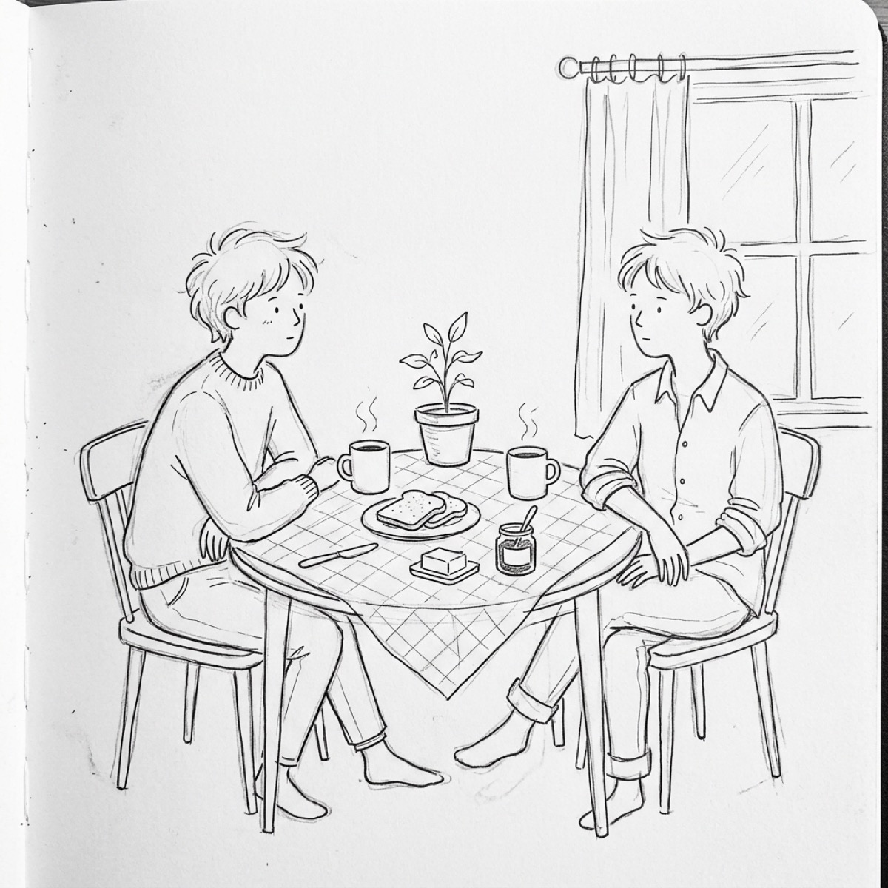
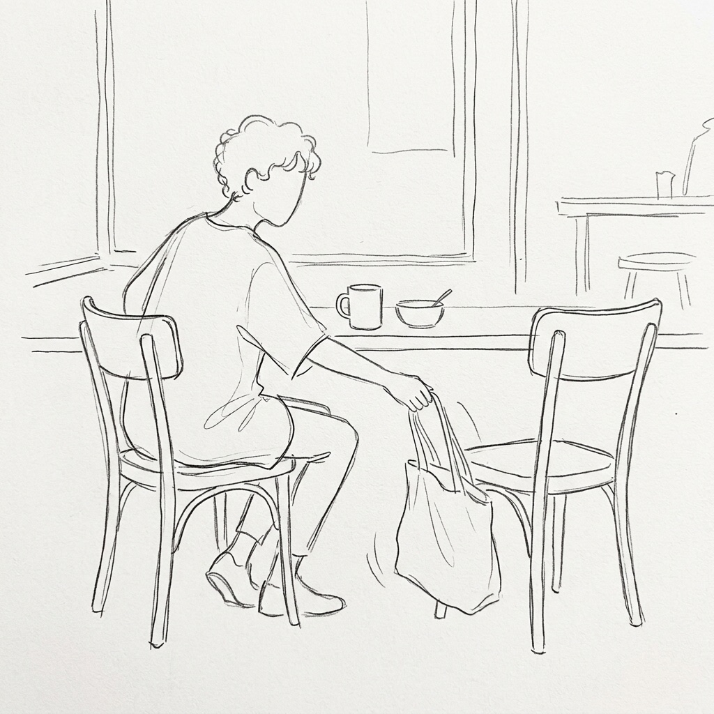
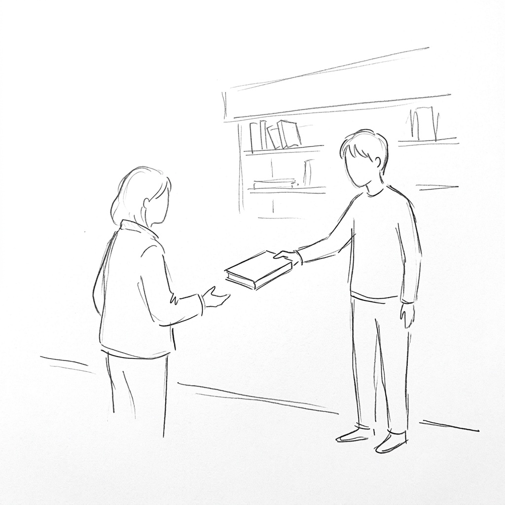
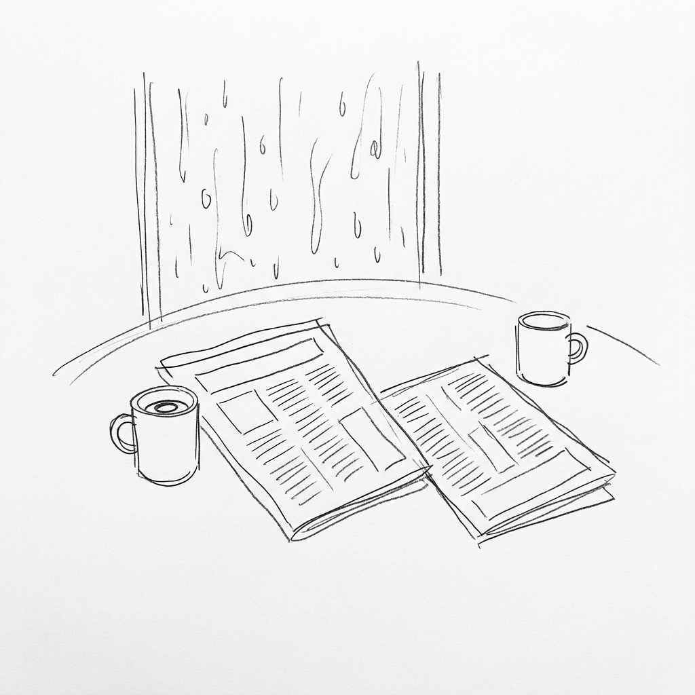
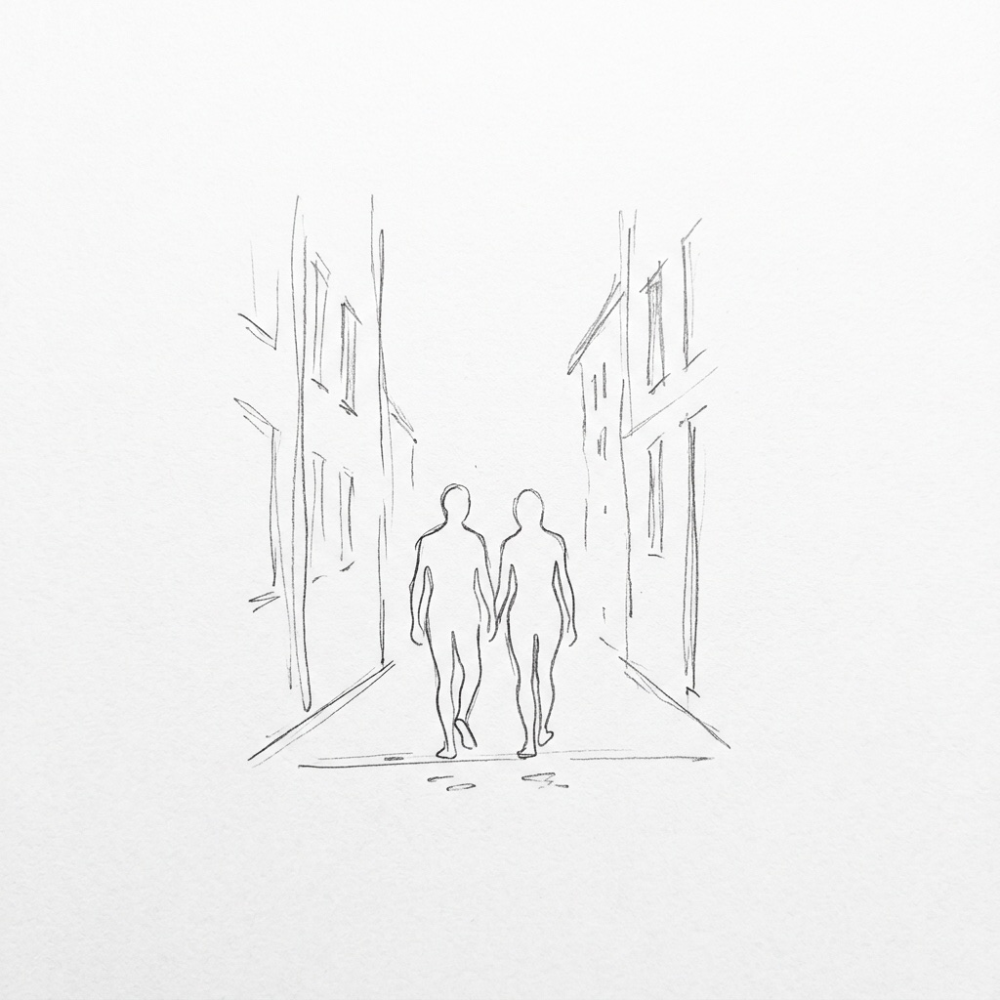
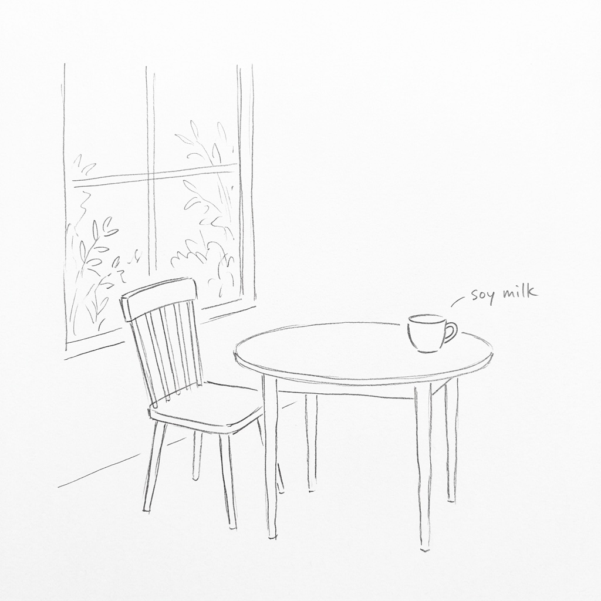

## 第一章：共桌

那天早上我第一次去那家店。

門口沒有什麼特別的，就是一扇玻璃門，門上貼著菜單，有點舊。我推開門進去，裡面比外面暖，有油鍋的氣味，廣播在一個角落很小聲地播著什麼。

位子不多。靠窗那張桌子坐了一個人，對面空著。他面前放著豆漿和蛋餅，擺得很整齊。

我走過去，問可不可以坐。

那個人抬起頭，說可以。

我坐下，叫了熱紅茶和厚吐司，把包包放在腳邊。

窗外的行道樹開始落葉。有一片黃的貼在玻璃上，待了一下，又滑下去。

東西來了，我吃。對面那個人也在吃，豆漿在左，蛋餅在右，各在一邊，他吃的時候輪流，有個順序，不快也不慢。桌子中間有一盆小植物，葉子是深綠的，長得很直。

店裡有廣播，聲音很小，聽不清楚說什麼。有碗盤碰桌子的聲音，有人進門帶進一陣涼的風，很快就散掉了。

我先吃完，把碗疊起來，把椅子輕推回去，站起來走出去。

對面那個人還沒吃完。豆漿還剩一點，蛋餅最後一塊放在盤邊。

---

## 第二章：留位子

那天我去早餐店，裡面差不多全坐滿了。

靠窗那張桌子只坐了一個人，背對著門。對面的桌面上放著一個提袋。

我站在門口看了一下，以為那裡有人，正要轉身。

那個人側過臉，看了我一眼。是上次那個人。他把提袋拿下來，放回腳邊。

「坐，」那個人說。

我走過去坐下，叫了東西。等的時候看窗外，天色有點陰，窗玻璃上有之前下雨留下來的水痕。

東西來了。我吃，對面那個人也在吃。我們沒有說什麼。這次沒有上次那麼安靜。

吃到一半，那個人說，「今天的蛋餅比較乾。」

我說，「是嗎。」

就這樣。

我吃完，把盤子疊起來，說聲謝謝，站起來走了。

---

## 第三章：書

那天我在附近的一家書店裡翻書。

不是舊書攤，是一家小書店，裡面有點暗，木頭架子排得很密，書放得滿但整齊。我走進去，在一個靠牆的架子前站了很久，沒有特別要找什麼。

「那本不錯。」

旁邊傳來很輕的聲音。

我轉過頭。是早餐店那個人，不知道什麼時候站在那裡，正看著我斜上方的位置。

他伸出手，從木架上抽出一本薄薄的書，直接遞到我面前。

封面是素色的，字體很小，排得很密。

「從第三章開始看，」他說。

我接過來。還沒說話，他已經收回手，轉身走到別的架子去了，背對著我，繼續看他的書。

我低頭翻到第三章。開頭第一句我讀了兩遍。

我把那本書買下來。出門的時候他還在店裡，我看著他的背影，沒有過去，也沒有說再見。

書拿在手上，比想像中重。

---

## 第四章：報紙

下雨了。

我到早餐店的時候，靠窗那個位子已經坐了人。是那個人，面前放著一份報紙，翻開來，左邊一半、右邊一半，各自攤在桌上。兩個杯子，一個在左，一個在右。

我坐下，把濕漉漉的傘靠在椅腳。水順著傘尖，在乾淨的地板上滲出一小灘。

那個人抬起頭看了一眼，說，「傘放那邊，等一下出去比較方便。」

他指了指門口旁邊的傘架。

我站起來，把傘拿過去插進架子，走回來坐下。我說，「謝謝。」

他沒有說話，繼續看他的報紙，偶爾喝一口杯裡的東西。

叫的東西送上來了，我開始吃。過了一會兒，他用手指按著報紙右半邊的邊緣，慢慢推到桌子中間，斜向我這側。

我接過來，翻了翻。是昨天的。頭版在講颱風，我沒有認真看。

我們一人看一半，各自吃，雨聲一直在窗外。

我吃完站起身。走到門口，從架子裡抽回我的傘，推門走出去。外面的雨還在下。

---

## 第五章：走路

早上的陽光很淡。

我們吃完了，桌上的盤子空著，杯裡的熱氣已經散得差不多。那個人沒有像往常那樣立刻起身。他看著窗外，看了一會兒，轉過頭看著我。

「要不要走一段。」

我說好。

我們走出早餐店，一起往前走。那條路我沒有走過，是窄的，兩側樓很高，抬頭只有一條細長的天。

我們並肩走，影子貼在地上。那個人偶爾說話，說這裡以前有什麼，後來沒了。說一家賣早點的攤，說一棵被砍掉的樹，說一戶以前住了一個老人的人家。說的時候語氣很平。

我走在旁邊，沒有說很多，就聽著。

走到某個地方，那個人停下來。是一個普通的路口，四個方向，沒有特別的。

站了一會兒，那個人說，「好了。」

我們走回來。在早餐店門口，各自轉身，走不同的路回去。

---

## 第六章：平常那樣

我比平時早到了十分鐘。

店裡沒什麼人，靠窗的位子空著。我坐下來，叫了熱紅茶和厚吐司。

過了一會兒，門被推開，那個人走進來。他看了我一眼，坐到對面，點了豆漿和蛋餅。

東西送上來，我們像平常那樣吃。我的熱紅茶還在冒煙，他的豆漿放在左邊，蛋餅在右邊，擺得很整齊。

廣播在播一首很慢的歌，聲音依然很小，夾雜著油鍋的氣味。窗外的行道樹樹枝已經全禿了，灰濛濛的。

我先吃完。我把盤子和杯子疊在一起，站起來，把椅子輕推回去。

「我走了，」我說。

那個人抬起頭看我，點了點頭。

「嗯。」他嘴裡嚼著東西，說得含糊。

我多停了一拍，才轉身往門口走。

---

隔天早晨。

我推開門進去，裡面比外面暖，有油鍋的氣味。

靠窗的位子空著。

我坐下來，點了豆漿和蛋餅，在面前攤開報紙。

東西送上來。豆漿在左，蛋餅在右，各在一邊，擺得很整齊。

對面的位置是空的。平常那個人坐在那裡，都是點熱紅茶和厚吐司。

我吃著。吃到一半，我用手指按著報紙右半邊的邊緣，習慣性地往桌子對面推。

報紙在深綠色的小植物旁停下來，斜斜地攤在空著的那一側。

沒有人接。

我的手在半空中懸了一會兒，才慢​​慢收回來。

我繼續吃，豆漿和蛋餅輪流，不快也不慢。外面的行道樹幾乎掉光了葉子。

又過了幾天，那個位子還是空的。

有時候有別人坐，吃完就走了，椅子被推開，桌面清空。有時候沒有人，就那樣空著。

店裡的飲料單換了，加了一款冬季限定的熱飲。

