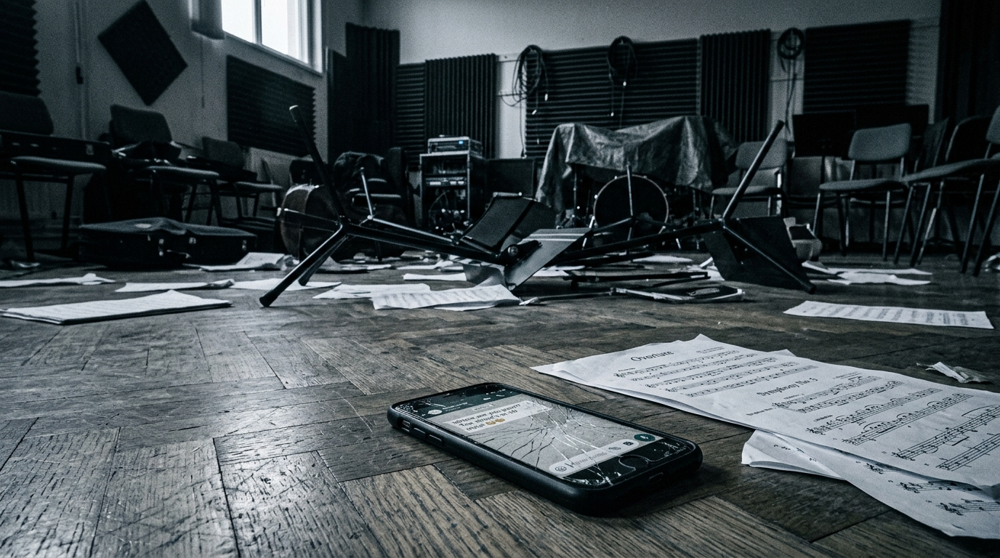
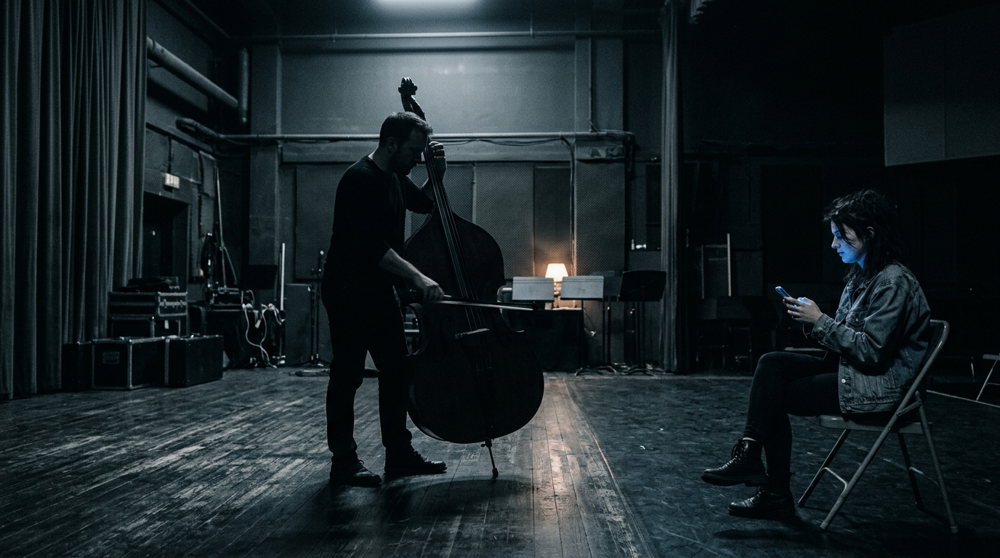
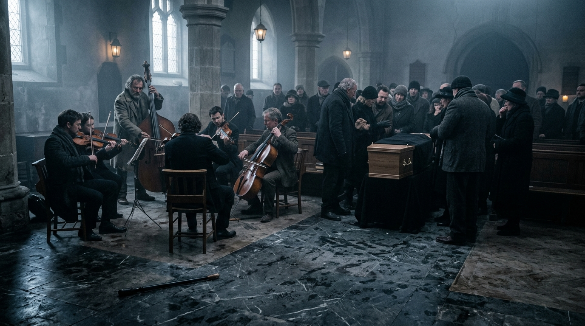
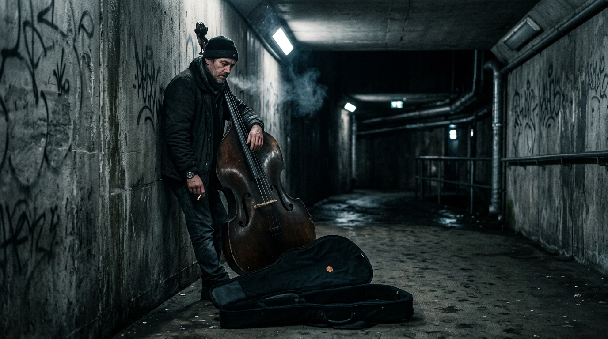

## 第一章

梁廣死在排練室的沙發上，手裡還捏著半支沒抽完的煙。

當戴祈馱著他那把碩大的低音提琴走進排練室時，空氣裡除了殘留的劣質菸草味，還有一股死一般的沉寂。其他團員已經圍了一圈，沒有人哭，大家只是看著那具逐漸冰冷的身體，以及地板上散落的一疊樂譜。

戴祈沒有像其他人那樣手忙腳亂地掏手機或退後半步。他卸下肩膀上沉重的琴包，順手將旁邊桌上一隻歪斜的紙杯扶正，免得裡頭剩餘的隔夜茶水滴落到地上的琴譜上。接著，他才退到一旁，默默看著那具縮在沙發上的屍體。

「醫生說是心肌梗塞。」年輕的指揮周律一隻手按著額頭，指縫間夾著的鉛筆不安地轉動，「但問題是，文化局的年度補助審查就在下週五。如果這時候讓那幫官員知道團長死了，樂團群龍無首，補助款肯定泡湯。」

女高音宋嫣用一條真絲手帕捂著鼻子，眼角乾巴巴的，聲音卻掐得極有戲劇張力：「廣哥走得太突然了。我們應該為他辦一場風光的葬禮，至少……要讓文化局看到我們的凝聚力。」

下午，文化局的科長親自打來了電話。周律特地開了免提，把手機放在排練室中央的譜架上。

「梁團長一生奉獻給音樂，這是我們局裡都高度肯定的。」科長的聲音隔著揚聲器顯得有些失真，伴隨著紙張翻動的沙沙聲，「本來下週的審查，我們還有些擔心。不過，若是樂團能在這關頭辦好梁團長的告別式，用音樂展現出『團隊精神』和『藝術傳承』……呵呵，大家也知道，這審查指標裡啊，精神面貌也是重要的一環。」

電話掛斷後，排練室陷入了一種充滿希望的沉靜。

「我們必須在靈堂上演奏《深淵之歌》。」周律在緊急團員會議上拍著譜架，雙眼發亮，「這是最穩妥的方案。」

在樂團過去的宣傳手冊上，這首曲子被大肆吹捧為「梁廣團長生前最鍾愛的藝術傑作，以極致的無調性語言，象徵著他對生命與命運的深刻思索」。

周律轉向角落，目光如炬地盯著戴祈：「這首曲子的核心是低音提琴的獨奏，用來模擬心臟停跳前最後的震顫。梁團長生前每次聽這首曲子都會落淚，戴祈，你必須在葬禮上把它拉出靈魂。」

戴祈下意識地伸手摸了摸自己那把低音提琴的琴頸，指尖觸碰到略帶磨損的木質紋理，粗糙而真實。

三年前的一個雨夜。巡演結束後的路邊攤上，只剩下他和梁廣兩個人喝得爛醉。梁廣把滿是油膩的酒杯重重砸在桌上，指甲裡還庫著黑色的泥垢，一邊噴著帶著大蒜與廉價白酒的氣味，一邊指著戴祈的鼻子破口大罵：

「那首《深淵之歌》簡直是狗屎！每次聽我都想吐！要不是因為寫這首歌的傢伙是今年補助審查委員會的召集人，我連看都不會看一眼。戴祈，你給我記住，以後要是我死了，千萬別在我的墳頭拉這首鬼曲子，我怕我會氣得從棺材裡爬出來掐死你！」

當時梁廣笑得前仰後合，眼角甚至擠出了幾滴眼淚，隨後又點起一支煙，猛吸了一口。

「戴祈，你沒問題吧？」周律見戴祈久久沒有回應，眉頭微微皺起，語氣帶上了幾分催促。

排練室裡的所有目光瞬間都集中在戴祈身上。宋嫣的手帕仍捂在鼻尖，幾名管樂手抱著手臂，默默地看著他。

戴祈看著周律那雙焦慮得發紅的眼睛，又轉頭看了看沙發上已經蓋上白布的梁廣。他感覺喉嚨裡有些發乾，像吞了一口松香粉末。他動了動嘴唇，卻沒有發出聲音。

「戴祈？」周律的語氣裡多了一絲警告。

「……可以。」

戴祈移開視線，緩緩拉開琴袋的拉鍊。

## 第二章

接下來的幾天排練，氣氛壓抑得令人窒息。

周律對《深淵之歌》的修改越來越極端。為了迎合文化局的「先鋒審美」，他開始大幅削減低音提琴的旋律。

「戴祈，低音部太厚重了，把整個樂團的現代感都拉跨了。」排練廳裡，周律用指揮棒指著戴祈所在的角落，「你的座位再往後挪，對，靠牆。還有，第三樂章的獨奏，你不用拉基音了，只做拉弓的動作，手在琴弦上虛晃就行。我們要在這個樂段製造無聲的死亡張力。」

「假拉？」戴祈握著琴弓的手僵住，看著周律。

「這是藝術處理，叫無聲的震顫。」周律冷冷地轉開臉，不再理他。旁邊的陳克用手肘碰了碰小提琴，發出一聲輕浮的哨音。戴祈看著被擠到陰暗角落的譜架，手指在粗糙的琴弦上按了按，胸口像是塞了一團吸飽了冷水的棉花。

樂團辦公室裡，臨時靈堂散發著百合花與劣質香紙的混合氣味。梁廣的遺照掛在正中。

宋嫣踩著尖細的高跟鞋走了進來，穿著黑色蕾絲旗袍，精緻得沒有一絲褶皺。「戴祈，」宋嫣用沙啞但圓潤的聲音低聲說，「梁團長生前最看重我。我打算在葬禮上加一首《聖母頌》獨唱。你身為老團員，幫我在周律面前說說，讓你的低音提琴在開頭幫我拉八個小節的弱音前奏，這對你來說再合適不過了，是不是？至於你的獨奏，反正周律都讓你假拉了，不如把時間讓給我。」

戴祈端著紙杯，看著杯子裡漂浮的半片茶葉。他注意到宋嫣口口聲聲說著哀悼，眼角卻乾爽無比，連眼影都沒有花。

就在這時，周律抱著總譜推門進來。他臉上帶著熬夜後的灰青，把總譜重重砸在辦公桌上：「宋嫣，這都什麼年代了？文化局要看的是『探索精神』！我連夜重新編配了《深淵之歌》，中間有兩個樂段，所有樂手只做集體的默哀與深呼吸。戴祈，你的低音提琴聲部我改了，不要發出聲音，只用琴弓摩擦琴碼下方的弦段，製造出尖銳的噪聲。」

「你要是敢在我的獨唱前面拉那些刮鐵皮的聲音，我今天就退團！」宋嫣尖叫道。

就在辦公室裡的爭吵達到頂點時，黑色布簾被一隻戴著磨損皮手套的手粗暴地扯開。

梁廣的女兒梁沫走了進來。她穿著寬大的牛仔外套，眼神冷得像冰。她站在門口，眼神在宋嫣那身精緻的旗袍上停留了一瞬，又掃過周律那本空洞的總譜，最後落在桌腳那盒紙錢上。

「吵完了嗎？」梁沫出聲。

「梁沫啊，我們正在商量最體面、最能展現樂團凝聚力的方案……」周律強笑著說。

「不用體面了。」梁沫從帆布包裡掏出一疊發黃的紙張甩在桌上，壓在周律的總譜上，「這是我爸這三年來，以樂團名義向我母親家親戚借的私人借款，一共八十萬。我媽被他逼得離了婚，生病到死他都沒還一分錢。現在他人死了，樂團得把這筆錢還了。如果不還，下週文化局審查的時候，我會直接把這些複印件送到科長的辦公桌上。」

「梁沫，這筆錢……」周律臉色在日光燈下顯得更加灰青。

「三天之內，我要看到第一筆十萬塊的還款。」梁沫面無表情地說，「否則，大家一起死。」

周律一言不發地把借據塞進包裡，匆匆走了出去。宋嫣冷哼一聲，快步跟了出去。

辦公室裡只剩下戴祈和梁沫。

戴祈走進內室，內室是梁廣生前的辦公室。梁沫正在用塑料袋裝梁廣生前用過的遺物，動作粗暴，保溫杯在塑料袋裡發出沉悶的撞擊聲。

戴祈蹲下身，幫忙撿起地上散落的排練日誌。當他撿起最後一本時，手指碰到了一個硬邦邦的窄長手冊。那是一本黑色真皮手冊，塞在最底下的夾縫裡，封皮有一道用指甲生生刻出來的深溝。

戴祈翻開，第一頁是梁廣那潦草的鋼筆字：
*「陳克。3月14日，市交響樂團商業錄音，私活。他用的是胃痛請假。拿了兩萬二，給錄音室小劉分了三千。已拿到小劉的微信截圖。年終獎金談判時可用。」*

他往後翻了一頁：
*「宋嫣。6月2日，新劇目角色分配。酒店。錄音已存檔，存在保險櫃藍色U盤裡。此人虛榮且蠢，只要給她舞台，什麼都能答應。注意控制曝光度，免得起反作用。」*

他慢慢地翻開第三頁：
*「周律。10月19日，假造排練場地租賃發票三筆，共計四萬八千元。發票底聯已複印。年輕人有野心，但底子不乾淨，好用，可壓榨。」*

筆記本裡密密麻麻，記滿了樂團裡每一個人的名字。這不是一個普通的本子，這是梁廣用來操控和壓榨每一個人的韁繩。

「你在看什麼？」梁沫不知何時停下了手裡的動作，正站在他身側，面無表情地看著他手裡的黑皮本子。

## 第三章

戴祈沒有立刻回答，只是用大拇指按住本子的邊緣。

「梁團長留下來的本子。」戴祈把本子遞過去。

梁沫接過，隨手翻了幾頁，冷笑了一聲：「難怪我媽到死都拿不到他一分錢。他把所有的心思都用在怎麼算計你們身上了。」

「梁沫，這本子……」

戴祈話音未落，走廊上突然傳來一聲尖銳的瓷器碎裂聲，緊接著是宋嫣憤怒的尖叫：「是誰？到底是哪個生了沒屁眼的東西發的！」

排練室那邊傳來一陣雜亂的腳步，金屬譜架被撞倒在地上，發出當啷的脆響。

戴祈和梁沫走到排練室。小提琴首席陳克正指著手機屏幕向周律大吼：「這是在群裡發的！梁廣這個老東西，連我去年錄私活的金額和分配都知道！他是不是把定時群發的郵件設置錯了時間？人都死了，郵件自動發到了所有人郵箱裡！」

「不是發錯時間。」周律一隻手按著太陽穴，臉色鐵青，「他本來每個月底都要手動延期一次。這次他突然死了，時間一到，備份自動發送了。」

宋嫣衝了進來，把碎裂的手機摔在桌上，胸口劇烈起伏，眼眶通紅。屏幕上亮著那一頁寫著她名字的截圖。

「這根本是造謠！我要去告他！」宋嫣尖叫著。

周律的目光在排練室裡所有人臉上掃過，最後落在了梁沫手裡的黑皮本子上。他走上前，伸出手：「梁沫，把它給我。這本子要是落到文化局手裡，樂團全完了，妳爸欠的錢，妳一分也拿不到。」

陳克也跨步上前：「拿過來！銷毀它！」宋嫣也踩著高跟鞋逼近，尖銳的指甲幾乎要戳到梁沫的臉上。

戴祈看著眼前的這三個人，他們此刻的焦慮與怨恨，比梁廣死在沙發上時要真實得多。他走上前，試圖勸阻，但梁沫卻往後退了一步，將黑皮本子死死護在懷裡。

「戴祈，你當了十幾年好人，到現在還想和稀泥？」梁沫盯著戴祈，嘴角帶著自嘲的冷笑，「我爸操控了這個樂團一輩子，他死了，你們想拍拍屁股裝作什麼都沒發生過，繼續拿著文化局的錢過安穩日子？這本子是我唯一能拿到錢的籌碼，也是我媽被他折磨十幾年的證據。誰要是敢碰它，我現在就把剩下的內容全部發給文化局。」

她深深看了戴祈一眼，將黑皮本子塞進帆布包裡，轉身快步走了出去。

排練室裡一片死寂，半盆沒有燒完的紙灰散發著乾枯的熱氣，慢慢融入空氣中那股百合花香裡。

## 第四章

週四下午，靈堂的布置已經基本完成。三家本地媒體的攝影記者已經架好了機位。

「位置再往左挪十公分。」周律穿著熨平的黑襯衫，站在大理石譜架前指揮。

戴祈馱著他那把磨損嚴重的舊低音提琴，默默走到排練廳。

「戴祈，你坐那兒。」周律用指揮棒點了點最右側、幾乎要被百合花牌淹沒的角落。那是一個完全的死角。

「那裡收音不好，而且木地板是空的，會起共鳴音。」戴祈低聲說。

「我們這是在做先鋒行為藝術彩排，懂嗎？」周律猛地轉過身，指著大理石譜架，聲音尖銳，「但你那把琴太大了，漆面斑駁得像個老舊棺材，媒體的特寫鏡頭切過來時，會直接破壞整個畫面！這首曲子到時候你不用拉基音了，只做拉弓的動作，手在琴軌上虛晃就行。只做動作，不發聲音，別讓畫面看起來太空。」

宋嫣坐在第一排，淡淡地說：「周指揮說得對，戴祈，你那大塊頭往我身前一擋，我連調息的鏡頭都沒了。文化局的科長可是說過，要讓媒體拍到我們在悲痛中團結一致的『面部細節』。」

陳克坐在一旁調音，小提琴發出幾聲尖銳的揉弦聲，像是在隨聲附和。

戴祈看著這三個人。他從第一章答應演出以來，內心的壓抑與荒謬感在這一刻終於達到了頂點。他被逼到了最陰暗的角落，被要求在靈堂上「假裝演奏」，他的聲音被徹底取消，只為給這場滑稽的審查秀留出完美的畫面。

「這首曲子，梁廣本來就討厭。」戴祈說，聲音在空曠的靈堂裡撞出了沉悶的迴音。

周律的腳步一頓，眉頭擰成了一個疙瘩：「你說什麼？」

「我說，梁廣活著的時候，親口跟我說過，這首曲子簡直是狗屎。」戴祈平靜地看著周律，一字一句地說，「他說他每次聽這首歌都想吐。他還說，如果他死了，誰要在他的墳頭拉這首鬼曲子，他會氣得從棺材裡爬出來掐死那個人。」

排練室裡瞬間死一般寂靜。

戴祈沒有再看其他人一眼。他緩緩放下巨大的低音提琴，拉鍊與琴袋摩擦的沙沙聲無比清晰。他把琴放倒，馱起琴包，大步穿過那些金屬架和花圈，推開排練室的木門，逕直走了出去。

當晚，排練室的門半敞開著。戴祈推門進去時，大燈都關著。

梁沫坐在旁邊的木椅子上，頭深深地埋在膝蓋裡。聽到腳步聲，她緩緩抬起頭，看著戴祈背後的琴包。

戴祈沒有去開大燈。他把琴包靠在沙發旁，拉下拉鍊，將琴取了出來。在黑暗中，他憑著肌肉記憶摸索著調音。

戴祈拉起琴弓。他沒有拉《深淵之歌》。弓毛搭在粗大的弦線上，緩緩帶出了一首旋律極其簡單的調子。

那是三年前那個雨夜，梁廣喝得爛醉，躺在路邊攤的竹椅上，用沙啞的破鑼嗓子哼唱的民謠《小河水》。琴聲很慢，粗糙而真實，木質琴箱的共鳴在黑暗中微微搖晃著那一箱箱沒有封口的遺物。

梁沫默默看著黑暗中戴祈的剪影。

一點微弱的藍光在角落裡亮起。梁沫拿出手機，將錄音界面點開，伸長手臂把手機對準了低音提琴的方向。屏幕上的綠色音波隨着琴聲的起伏，在黑暗中規律地跳動著。

## 第五章

告別式早晨，禮堂被一場突如其來的海霧籠罩得又濕又冷。

文化局的科長提早了十分鐘到場，坐在第二排正中央。周律穿著黑襯衫，站在大理石譜架前，指尖焦慮地敲擊著金屬指揮棒。

戴祈馱著他那把舊低音提琴，在儀式開始前半小時就來到了靈堂。他默默走到大理石指揮台前，看著那本整齊擺放著的《深淵之歌》總譜。

他深吸了一口氣，伸出滿是松香粉末的手，將那本精裝總譜抽了出來，隨手塞進了自己的大琴包裡。然後，他從口袋裡掏出一疊昨晚用粗黑簽字筆手寫的簡陋樂譜——《小河水》，平整地鋪在了譜架上。

做完這一切，他馱著琴，走回了最右側的角落裡坐下。

儀式即將開始。周律快步走上指揮台。當他的目光落在譜架上那疊手寫的《小河水》時，整個人瞬間僵在了原地。他的額頭滲出一層細密的汗珠，手指因用力而指甲發白。他想找出是誰幹的，但台下的攝像機鏡頭和科長正死死盯著他，他根本沒有退路。

宋嫣在助理的扶持下走上台。她今天化了極濃的妝，遮蓋住了蒼白的臉色。

然而，當她站在麥克風前準備發聲時，她的目光越過人群，突然看到了靈堂最後排站著的梁沫。梁沫穿著那件褪色的牛仔大衣，手裡抱著一個老舊的磁帶錄音機，而她的另一隻手裡，正揚著幾張印著酒店名稱和開房記錄的紙張複印件。

宋嫣的瞳孔驟然收縮。她知道，只要自己唱出第一個音符，梁沫就會當著所有媒體和文化局科長的面，將她最不堪的秘密徹底撕開。

恐懼與絕望像一隻無形的手，死死扼住了她的喉嚨。宋嫣張了張嘴，胸口劇烈起伏，卻因為極度緊張引起了聲帶痙攣，喉嚨裡只能擠出幾聲如砂紙摩擦般的氣流聲，連一個音符都唱不出來。她雙腿一軟，扶住麥克風架，在台上無聲地崩潰了。

周律的指揮棒懸在半空，冷汗濕透了他的黑襯衫。

就在這窒息的沉默中，角落裡傳來一聲沉悶的嗡鳴。

戴祈低著頭，指尖按在最粗的E弦上。他拉動琴弓，馬尾擦過琴弦，拉出了《小河水》的第一個小節。琴聲乾癟、粗糙，甚至帶著幾分調音不準的沙啞，在濕冷的靈堂裡慢吞吞地爬行。

陳克看著台上的混亂，又看著角落裡的戴祈。在科長那漸漸沉下去的目光中，他別無選擇，只能硬著頭皮搭上弓子，順著低音提琴那緩慢的節奏拉了起來。其他樂手也陸續跟了進來。

整支樂團沒有了指揮，只能像瞎子摸象一樣，死死貼著戴祈那條沉重、單調的低音線前行。音符稀稀拉拉，節奏緩慢笨重，毫無美感。宋嫣在台前無聲地張著嘴，像一條缺氧的魚。

然而，原本有些浮躁的禮堂卻漸漸安靜下來，只有低音提琴那有些跑調的、單調的摩擦聲，在濕冷的靈堂裡一下一下地刮著木地板。

一曲終了，最後一個低音在潮濕的空氣中裊裊散去。周律的手無力地下垂，指揮棒掉在大理石地板上，發出清脆的響聲。

梁沫走上了講台。她站在麥克風前，冷冷地掃視了一圈，隨後按下錄音機那清脆的塑料按鍵。

錄音機裡傳出了梁廣那含糊不清、帶著濃烈酒氣的怒罵：
「周律……那小子……天天給我裝大師。他那幾張租場地的發票，老子全扣著呢！不聽話老子一巴掌拍死他……」
「宋嫣？給她個角色就飄了。蠢貨一個，在酒店裡聽話得像條狗……錄音我收著呢……」

台下的科長臉色鐵青。身為體制內的官員，他此時唯一的盤算就是如何迅速切割，避免這場醜聞波及文化局的聲譽。他猛地站起身，低聲對身旁的助手說：「立刻通知新聞辦，壓下今天所有媒體的報導！另外，暫緩撥付這個樂團的所有補助款，馬上立案調查他們的財務問題！」

科長說完，大步流星地朝大門走去，看也不看台上的樂團成員。

梁沫關掉了錄音機，看著台下那些僵立在原地的樂團成員。

「這才是梁廣。」她說完，轉身走下講台，逕直走進了外頭濃重的海霧之中。

## 第六章

文化局的公文送達時，裝在一個印著紅色「暫緩撥付」印章的牛皮紙袋裡。

沒有人對這個結果感到意外。解散通知書貼出來的那天下午，排練室的大門敞開著。

戴祈去排練室拿自己的私人物品時，正好撞見宋嫣在打包她的化妝箱。她戴著一副巨大的墨鏡，遮住了半張臉。她身邊站著一個穿西裝的男人，正用手指著宣傳單上的商場開業剪綵字樣。宋嫣的喉嚨顯然還沒完全恢復，但她極力對著鏡子拉扯嘴角，試圖露出一個在相機前演練過無數次的假笑。

周律則去了一家社區的兒童音樂啟蒙班。戴祈路過那家亮黃色裝潢的店面時，看見周律正套著一件印有粉紅豬圖案的圍裙，神色木然地看著一群滿地亂滾的小孩敲擊彩色木琴。

梁沫是最後一個清理梁廣遺物的人。戴祈在排練室樓下的垃圾桶旁看見她時，她正站在一輛廢品回收站的三輪車旁。梁廣生前視若珍寶的十幾箱手稿，此時正被廢品站的老闆一疊疊地扔上車。

她那只洗得褪色的帆布包扁扁地垂在身側。

「本子呢？」戴祈問。

「燒了。」梁沫轉頭看著那輛裝滿樂譜的三輪車，聲音被海霧熏得有些乾澀，「在火化爐旁邊的鐵桶裡，連同他的紙錢一起。我本來想用它逼他們還錢，但我突然發現，如果我用那本子上的秘密去控制他們，那我跟我爸又有什麼兩樣？這本子對我沒用，只會讓我變得跟他一樣髒。」

她拍了拍空蕩蕩的帆布包，扯了扯嘴角，轉身走向公交車站，單薄的肩膀很快消失在濕冷的人群中。

戴祈回到排練室，裡面已經被搬得空無一物，只剩下那把團裡集體採購的舊低音提琴。因為沒有人願意馱著這個沉重而派不上用場的龐然大物，它被當作無用資產留了下來。戴祈收了收自己口袋裡僅剩的五百塊錢給了清算科員，便把這把琴背了出來。

戴祈馱著這把琴，順著台階走進了地鐵站旁的地下道。

他拉開琴包，將低音提琴靠在水泥牆上，把空琴包隨手鋪在腳邊的地板上。

戴祈撥了撥弦，粗重的基音在狹窄的通道裡激起乾澀的共鳴。他拉起了那首《小河水》。琴聲緩慢、黏稠，在狹窄的通道裡慢吞吞地爬行，隨著地鐵進站時灌進來的熱浪和轟鳴聲，一下下地摩擦著水泥地面。

「叮咚。」

一枚硬幣落進了黑色的琴包裡。投錢的是一個牽著小孩的婦人，她拉著孩子快步往前走。

戴祈沒有看那枚硬幣。他手裡的弓子拉到一半，突然毫無徵兆地停了下來。

他沒有把曲子拉完。他把琴弓收回右手，當著幾個正走過來的行人，在樂句最不該中斷的地方停了手。

在樂團裡，他被要求在規定的地方拉響，在規定的地方「假裝演奏」，他的聲音、他的節奏都屬於那個體制和樂團的補助審查。而現在，在這個陰暗、布滿塗鴉的地下道裡，這首曲子是他自己的。他想拉就拉，不想拉，就在最突兀的地方停下來。他不需要向任何人完成這場表演，也不再是任何演出的工具。

戴祈看著腳邊那枚躺在傳單底下的硬幣，將琴弓往腋下一夾，從口袋裡摸出一包壓癟的煙，慢條斯理地點了起來，任由地鐵駛過時帶來的狂風，將他的頭髮吹得凌亂不堪。

