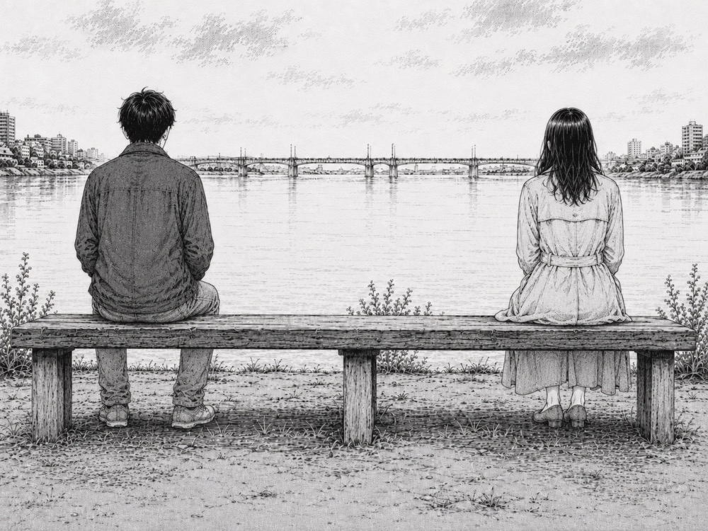
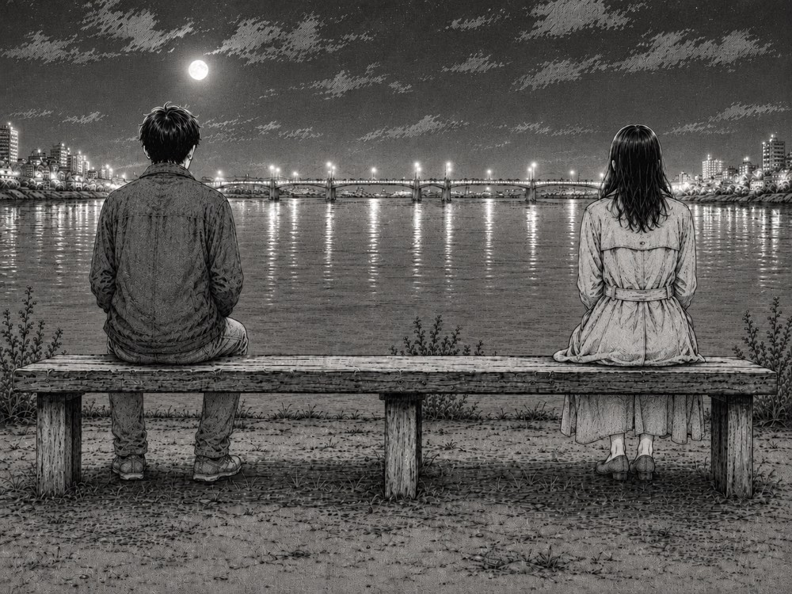

## 第一章：河邊長椅

下午五點半，河面的顏色開始變深，從白日裡的灰藍漸漸沉入一種混濁的橘黃。遠處那座鋼筋混凝土的大橋上，下班的車流已經排成了緩慢挪動的紅黃色光帶，喇叭聲被風吹得稀稀落落，傳到河邊時只剩下微弱的嗡嗡聲。

正值下班散步的時間，河堤邊的長椅大多坐了人。我拉了拉外套的拉鍊，在靠河道的一張還有空位的木質長椅上坐了下來。木板被白天的太陽曬得有些發溫，但金屬扶手是涼的。

長椅的另一端已經坐了一個人。

她穿著一件米色的風衣，領子豎著，雙手插在口袋裡。她的頭髮在腦後隨意地紮著，幾縷碎髮在耳邊被風吹得微微拂動。她沒有看我，只是看著河對岸那排已經開始亮起零星燈光的辦公大樓。

我們之間空著大約兩個人的距離。

起初，我們誰也沒有說話。河水在石堤下發出低緩的流動聲，風吹過柳樹，帶來些微的涼意。我靠著木椅，看著天邊的暮色一點點沉下去；她也只是安靜地坐在那裡，雙手插在口袋裡，目光散落在對岸的燈光中。

我們就這樣在沉默中坐了許久。直到一艘運沙船慢吞吞地從橋洞下鑽出來時，她才開始說話。她的聲音很低，沒有什麼起伏，像是自言自語，又像是在跟眼前這條平緩的河流說話。

「第一封信是用淺藍色的信封裝的。」她說，「不過在窗台上放得太久，被太陽曬得發了白，變成了一種像石灰一樣的顏色。信紙很薄，是那種小學生寫字用的綠格紙。」

我轉過頭看了她一眼。她依然看著前方，側臉的輪廓在落日的餘暉中顯得有些單薄。

我沒有說話，只是把手縮進口袋，繼續聽著。

「信裡沒寫什麼特別的事。」她繼續說，聲音輕得像是一陣掠過河面的風，「他說他住的地方樓下有一隻黃色的流浪狗，每次看見他騎腳踏車回來，就會跟著跑一段。他說北方的天亮得特別早，四點多陽光就照進房間裡，照得人眼睛發痛。那時候，他連一張像樣的書桌都沒有，只能把信紙貼在牆上寫，所以字跡歪歪斜斜的，有些筆畫還戳破了紙。」

她說得很慢，中間常常有很長的停頓。每當她停下來，河水拍打石岸的「沙沙」聲就會補上那個空檔。我們維持著一種很微妙的平衡，我不去問她這些信是寫給誰的，也不問她為什麼要坐在這裡說這些。我就像是一個碰巧路過的容器，接著她那些無處安放的話語。

「到了第七封信的時候，信紙換成了鐵路局的專用便箋，上面印著紅色的雙軌標誌。」她看著河面上運沙船留下的波紋，說道，「他說他終於買了一輛二手的腳踏車，但是鏈條總是掉。有一次在路上鏈條又斷了，他滿手是黑色的機油，沒地方洗，只能用路邊的野草隨便擦擦，最後在信紙的邊緣留下了兩個黑色的指印。那個指印很大，邊緣毛糙糙的。」

太陽一點一點地沉下去，天邊的晚霞從金黃過渡到一種壓抑的紫紅。河對岸的大樓燈光亮得更多了，倒映在水面上，隨著波浪碎成無數條晃動的金色光線。

她提到了第九封信，提到了第十一封信。她記得每一封信的日期，記得信封上郵戳的形狀，甚至記得某一張信紙折疊了幾次、折痕在哪裡斷開。

「第十二封信是在一個特別冷的星期三寫的。」她把頭微微低下，看著自己的鞋尖，聲音更輕了，「信封是用牛皮紙糊的，上面蓋了三個郵戳，最後一個郵戳因為墨水不足，只剩下半個圓圈。那時候北方下大雪，他在信的結尾寫道：『這裡的冬天比想像中冷得早。今天早上醒來，窗戶上結了厚厚一層冰花。我用手指在上面畫了一隻貓。祝好。』」

她說完這句話，河邊陷入了長久的安靜。

風漸漸大起來，吹得河邊的柳樹枝條發出沙沙的聲響。我轉過頭，看著她長椅旁邊那個空蕩蕩的位置，突然覺得有一種說不出的情緒在空氣中瀰漫。

我忍不住輕聲說了一句：「你記憶真好。」

她沒有立刻回答。她看著河面，過了好一會兒，才微微扯了扯嘴角。

「不是記性，」她轉過頭，黑色的眼睛裡亮著對岸大樓折射過來的微光，「是真的喜歡過。」

我沒有繼續追問。我不知道那個寫信的人後來去了哪裡，不知道那隻在冰花上畫的貓有沒有融化，也不知道他們之間最後是怎麼結束的。

她也沒有再繼續講下去。她把風衣的領子又往上拉了拉，遮住了半邊臉。

我們就這樣繼續坐在長椅上。

過了一會兒，她轉過頭去，看著逐漸暗下來的河面，又開始用那種平緩的調子，繼續講起第十三封信的故事。她講到信封裡夾著的一片已經乾枯呈褐色的楓葉，講到信紙上因為眼淚乾涸而留下的微微起伏的皺褶。

我們待得很晚。

太陽徹底落了下去，天空中最後一絲紫紅色被無邊的墨藍吞噬。身後水泥路面上的路燈在一瞬間集體發出「啪噠」的一聲，接著亮了起來，散發出溫暖而有些刺眼的橘黃色光芒。

光線照亮了長椅周圍的一小片地方。在長椅上方的路燈罩下，不知道什麼時候聚集了一大群小飛蚊。它們在昏黃的光暈裡毫無規律地旋轉、徘徊，撞擊著溫熱的燈罩，發出極細微的嗡嗡聲。

那隻運沙船早就看不見了，只有河水在黑暗中依舊不緊不慢地流著，發出沉悶的聲響。

她還在講著，我還在聽著。

---

## 第二章：深夜的餘溫

我們在長椅上坐了很久。在路燈亮起後的幾個小時裡，她斷斷續續地講著，夜風漸漸帶上了冰涼的濕意。

十一點過後，河對岸那些辦公大樓的燈光熄滅了大半，只剩下幾盞零星的白光在黑暗中守著。河水在長椅下方撞擊著石階，發出規律而低沉的「嘩啦、嘩啦」聲。

風開始冷了。柳樹的枝條拂過我的外套，發出沙沙的聲響。
她縮了縮肩膀，再次拉高風衣的領子，將雙手深插在口袋裡。

「第二十四封信是從他工作的港口辦公室寄來的，」她說，說話時嘴邊呵出一團極其淡薄的白氣，「那時候他找到了一份記錄貨櫃號碼的臨時工作。信裡沒寫幾個字，只說港口的風很大，吹得人耳朵疼。他隨手在信封裡放了一張過期的渡輪船票。那張船票是綠色的，邊角因為磨損而有些發白，背面還用原子筆畫了一個歪歪扭扭的笑臉。」

她停頓了一下，眼神動了動，像是看見了那張多年前的綠色船票。

「第二十五封，還有第二十六封信……」她低聲數著，「字數越來越少。有些時候只有三兩行，說他今天吃了什麼，或者今天港口來了一艘很大的外籍貨輪，桅杆漆成刺眼的鮮紅色。他說，他買了一盞檯燈，晚上終於不用再把信紙貼在牆上寫字了。」

我沒有說話，看著路燈下飛舞的蚊蟲。它們圍繞著燈罩打轉，軌跡凌亂。

「第二十七封信，是最後一封。」她的聲音依然平靜，沒有起伏，「是在第二年的初春寄來的。信裡只有一句話：『這裡的草開始發芽了，明天我就要出發。』」

「他說要去哪裡嗎？」我問。

「沒有，」她看著黑暗的河面，微微搖頭，「信紙裡只夾了一片極小的、乾枯的綠色草葉。那片草葉很細，邊緣還帶著一點點泥土的黃色。信的最後寫著：『明天見。』」

「明天見，」她輕聲重複了一遍，像是在品味這三個字，「但那是我們最後一次聯絡。」

我轉頭看她。她的神情在燈光下顯得很坦然，嘴角帶著一抹極淡的笑意，那是一種對往事釋懷後的溫柔。

「沒有爭吵，也沒有告別，」她說，「就只是自然而然地，沒有了第二十八封信。生活就是這樣，在某個你沒注意到的星期二，或者星期四，某些事情就已經悄悄結束了。」

一陣風吹過，柳葉落了幾片在我們腳邊的水泥地上。她微微打了一個冷顫，把雙手抱在胸前。

我站起身。「我去買杯飲料。你要熱咖啡嗎？」

她抬起頭看著我，黑色的眼睛裡閃過一絲意外，隨後點了點頭。「謝謝，熱的就好。」

我順著河堤步道往後走，長椅後方十公尺處有一台老舊的自動販賣機，在夜色中散發著幽藍的光芒。我投進幾枚硬幣，金屬碰撞的「哐啷」聲在寂靜的深夜顯得格外清脆。我按了兩罐熱咖啡，鐵罐滾落的聲音隨之響起。

拿出來的時候，罐子很燙手。我走回長椅，將其中一罐遞給她。

她接過咖啡，用雙手緊緊握著，將鐵罐貼在臉頰旁，深深吸了一口氣。「好暖和。」

我們都沒有立刻喝。我們只是握著那兩個散發著熱氣的咖啡罐，看著黑暗中奔流不息的河水。金屬罐的熱度順著掌心傳上來，一點點驅散了深夜的寒氣。

「謝謝你聽我說這些，」過了一會兒，她輕聲說，拉開了鐵罐的拉環。一聲輕微的「嗤」聲在空氣中散開。

「沒事，我也只是剛好坐在這。」我拉開自己那一罐，喝了一口。微甜而溫熱的咖啡流進喉嚨，整個人都暖了起來。

大約二十分鐘後，她喝完了咖啡。她站起身，將空鐵罐拿在手裡。

「我要回去了，」她拍了拍風衣上的灰塵，看著我說。

「好，慢走。」我說。

她向我輕輕點了點頭，沒有留名字，也沒有問我的名字。她轉過身，踩著被路燈拉得長長的影子，沿著河堤步道慢慢走遠。她的步伐很平穩，身影逐漸融入遠處那排路燈交織的陰影與夜色中，再也看不見。

我依然坐在長椅上。

我伸出手，觸摸了一下她剛剛坐過的那一端木板。微涼的木頭表面上，還殘留著一絲淡淡的、幾乎難以察覺的餘溫。

風又吹了過來。我握著手中已經變溫的咖啡罐，看著眼前這條在夜色中靜默流淌、不知疲倦地奔向遠方的河流。

路燈依然亮著，微小而細碎的蚊蟲在橘黃色的光暈裡繼續打轉。整個城市依然在遠處嗡嗡作響。

我坐了一會兒，把空罐子扔進旁邊的垃圾桶，整理好外套，也朝著相反的方向走去。

