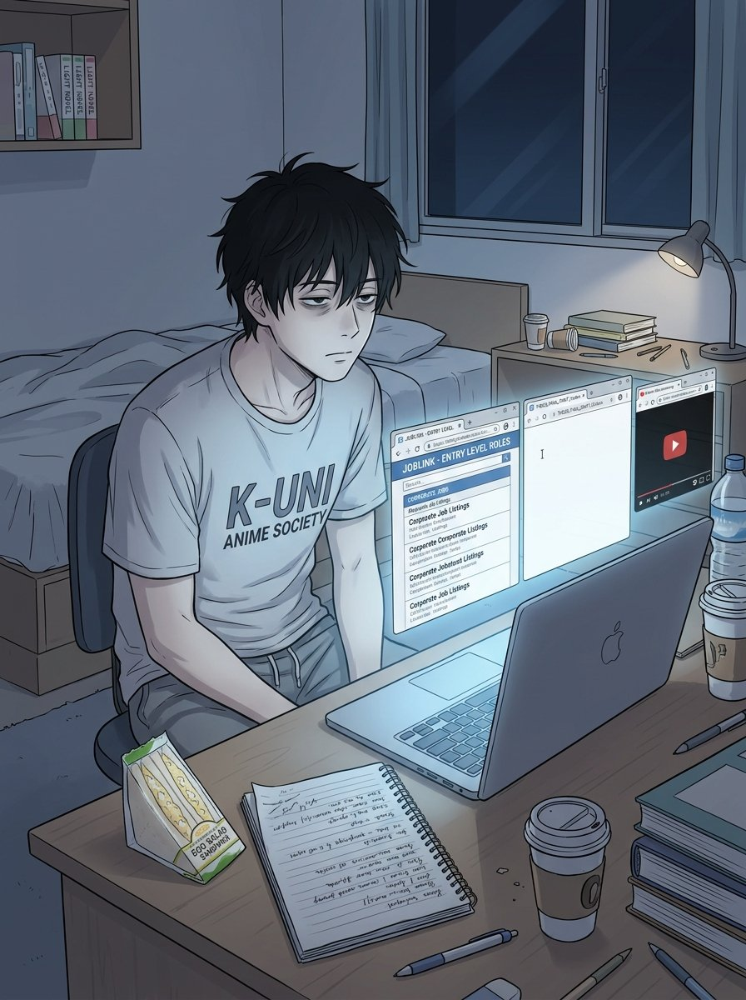
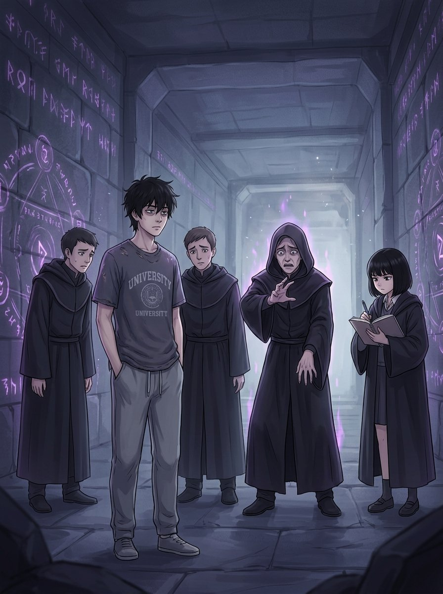
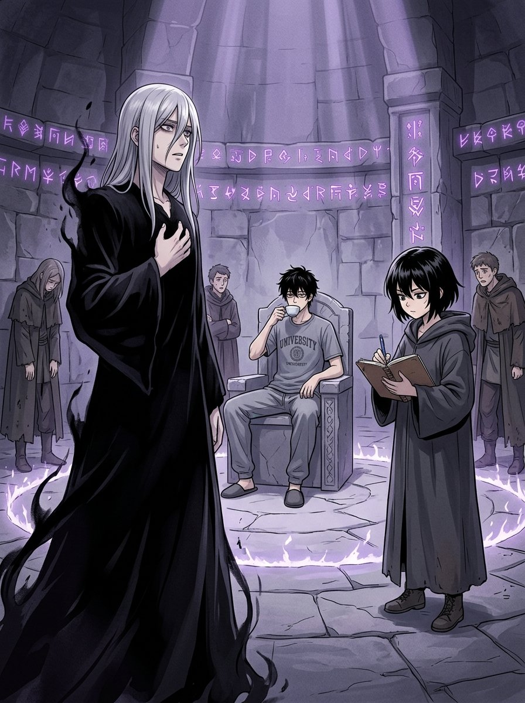
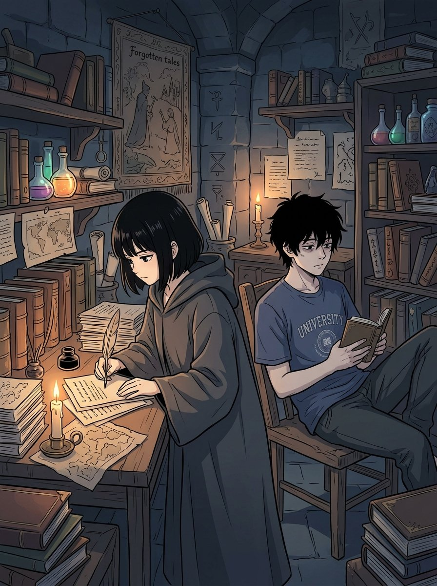
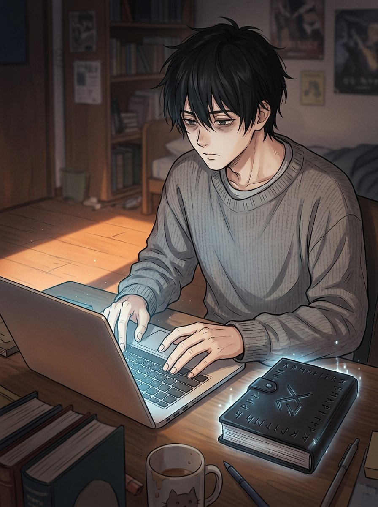

## 第一章：正常的地獄

手機螢幕亮了一下，又滅了。

陳哲宇瞥了一眼。論文群組。他把手機翻過去，繼續盯著天花板上那塊黃漬——那塊漬在他大一入住時就存在了，他從來不知道是什麼，也從來沒有要查清楚的意思。

*五點四十七分。*

他不知道自己是幾點睡著的。大概是三點。大概是四點。「大概」這個詞最近用得很頻繁——大概會找到工作，大概論文還來得及，大概這學期過得去。這些「大概」他都不太相信，但也沒有力氣換一個詞。

他坐起來，頭髮往右邊塌著，完全不打算管它。

冰箱裡還有半瓶醬油和一顆不知道什麼時候買的蛋。他看了三秒，關上冰箱，拿起桌上那個7-ELEVEN的袋子——昨晚打工順手帶回來的，快要到期的三明治，折扣後十二塊。他一邊吃一邊打開筆電，論文系統的視窗還開著，停在他昨晚最後看的那一行：

「第三章研究方法（待補）」

「待補」這兩個字已經在那裡待了六個禮拜。

*指導教授上次回信是在四月三號，說他下週有空討論。*

*那一週過去了。*

*然後又過了幾週。*

哲宇關掉論文視窗，打開104人力銀行。這是他每天早上的儀式，跟刷牙同等地位——不是真的有期待，只是一種習慣，像是告訴自己「你看，我有在努力」。他掃了一眼新職缺，滑了下去，又滑回來。有一個「內容行銷專員（需三年經驗，具社群操作能力，薪資面議）」在他昨天投過的同一間公司。應該是重複貼的。也可能不是。他無法區分這件事有沒有意義。

手機震動了一下。打工群組。

**「本週班表更新，哲宇你改到週四，原本週六的班取消了」**

他看著這行字。

*週六那班本來是他的。*

*沒差。*

他這樣想，然後才意識到「沒差」這個詞現在已經等於什麼都沒有了。他以前說「沒差」是因為真的覺得無所謂，現在說是因為差了也改變不了什麼。這兩種「沒差」是不一樣的東西，但說出來的聲音一樣。

他去洗了臉，鏡子裡的人看起來像一個還差一口氣才睡著的人。他把臉上的水用毛巾拍乾，沒有用力，只是放上去吸一下，像在處理一件不急的事。

下午他去了一趟圖書館。

帶了筆記本和電腦，坐在角落靠窗的位置，把論文資料夾打開，在那裡坐了兩個小時，字數從六千一百二十三跳到了六千一百五十一，成功新增了二十八個字，其中十六個字是方法論章節的小標，不算正文。旁邊的女生在哭，用耳機塞著，肩膀一抖一抖的。他知道那個感覺，哭是因為還有感覺。他不確定自己現在有沒有。

他收拾包包，離開圖書館。

外面六月的陽光把整條路燒成白色，他把眼睛瞇成一條縫，頭微微低著，走進那個熱氣裡。宿舍管理員坐在玻璃屋裡開著冷氣，抬頭看了他一眼，沒說話。他按了電梯，等了一分四十秒（他沒有在計時，只是時間就是這麼長），上樓，開門。

宿舍裡有室友昨晚訂的炸雞盒，擺在桌上，旁邊是喝到一半的飲料。室友不在，大概去圖書館或去打球。哲宇在自己的椅子上坐下來，把筆電打開，把104打開，把論文打開。

他看著這三個視窗，沉默了一會兒。

*這是今天。*

*昨天也是這樣。*

*明天也會是這樣。*

他沒有特別的感覺——不難過，不憤怒，不覺得委屈。如果一定要說，大概是那種長時間搭夜車之後的感覺，景色一直在動，你一直看著窗外，但你已經不記得自己是要去哪裡了。

他拉開抽屜，拿出那本筆記本——不是論文用的，是普通的A5黑色筆記本，買了快一年，前面幾頁有一些他自己都看不懂的記錄，後面是空的。他翻到空白的那一頁，拿起筆，把筆放下，又拿起來。

他在上面寫了一行字：

「今天新增二十八個字。」

他看著這行字。

*這是一件值得記錄的事嗎。*

他不知道。但他把筆記本合起來，放回抽屜。站起來，打算去倒杯水。

然後，眼前一黑。

不是暈眩，不是燈泡壞掉——是那種非常確切的「空間換了」的感覺，就像一個聲音突然被調成靜音，所有的感官輸入在零點幾秒內全部歸零。他感覺到地板消失，然後有什麼東西接住了他，溫度不對，空氣不對，連氣壓都有點不對。

有風。

風很冷，帶著一種他從沒聞過的味道，像是很深的地底、很古老的石頭，還有某種隱約像是燒焦的東西。

*我是不是沒關瓦斯。*

意識消失了。

---

## 第二章：歡迎來到剛奪之城

意識回來的方式很奇怪。

不是那種「睜開眼睛，發現自己躺在陌生的地方」——是那種感官一個一個交回來，先是皮膚感覺到冷，然後是鼻子聞到某種哲宇完全無法命名的氣味，像是古老的石頭被潮濕浸透了幾百年之後，又被什麼東西烤過一遍。再來才是聲音。

有人在說話，說的是他聽得懂的語言，但那個語氣——

*那個語氣像是有人在等下雨之前念咒。*

他慢慢坐起來。

地板是石頭，粗糙、微涼，貼著他的手掌。四周是石壁，石壁上有雕刻，雕刻的紋路在昏暗的光線裡發著極其微弱的光，像是有什麼東西還活著，蟄伏在那些線條裡。頭頂是拱形的石頂，沒有燈，光源哲宇找了半天，最後放棄，大概是那些紋路本身。

正前方，三個穿著黑袍的人排成一排，都比哲宇高了半個頭，袍子遮住了大半張臉，只露出下巴。中間那個正舉著雙手，手指比著某個複雜的姿勢，正對著哲宇的方向，嘴裡嚕嚕囉囉念著什麼。

哲宇看了一下，確認他們在念，然後看了一下自己的手，確認手還在，然後摸了一下口袋。

筆記本還在。手機還在。學生證應該也在，但他懶得確認。

*好。*

他把視線移回那三個人。那個中間的還在念，另外兩個站在旁邊，一臉肅穆，大概是在輔助什麼。哲宇等了一下。

*應該是在對他做什麼。*

*感覺不出來。*

他站起來，活動了一下腰。地板這麼硬，不知道躺了多久，腰有點僵。他往右轉了轉脖子，發出了一聲輕響。

中間那個突然停下來。

三個人同時看向他。

哲宇看了他們一眼。「廁所在哪裡？」

沉默。

很長的沉默。

三個黑袍守衛面面相覷，中間那個的手還停在空中，保持著那個複雜的姿勢，像是被時間暫停了。

*呃。*

「沒有廁所，」其中一個終於說，聲音有點不穩，「你——你是剛被歡迎詛咒到了嗎？」

哲宇想了一下。「什麼詛咒？」

「就是……」那個守衛指了指中間那個，「克洛斯大人剛剛釋放了等階最高的歡迎詛咒，奪走了你一切的勇氣、希望，以及對未來的信念。你應該——」他停了一下，「你應該現在在地板上哭。」

哲宇看了一眼地板。

「喔。」

又是沉默。

「你……現在有什麼感覺？」

哲宇想了一下，比較認真地想了一下。勇氣、希望、對未來的信念。這些東西——

*是原本就有嗎。*

「還好，」他說，「跟剛才差不多。」

克洛斯大人終於把手放下來，整個人的氣勢像是一個被針戳破的氣球，慢慢、安靜地洩氣。「不……可能。」

「失去了什麼，就會知道失去了什麼，」另一個守衛低聲說，「他不可能感覺不出來，除非——」

「除非他本來就沒有，」一個新的聲音從哲宇左側說。

哲宇轉頭。

一個女生。黑袍，過大，遮住了她的半個身子，袍子上的紋路和石壁上的有點像，但更細、更密。短黑髮。眉頭微微皺著，那個皺法不是在生氣，是那種看到一個公式對不上的時候、認真在想原因的表情。她手上拿著一本筆記本，翻到新的一頁，提筆的姿勢很正式。

「我是見習詛咒師絲蒂娜，」她說，「奉城主之命，對異常個體進行觀察與記錄。」

她說「異常個體」的時候，眼神是朝向哲宇的。

哲宇點了點頭。「嗯。」

絲蒂娜在頁面上方寫下：**受試者：異界來客。詛咒反應：零。**

然後她頓了一下，往下寫：**原因：不明。**

哲宇瞄了一眼她的筆記本。

「你的欄位設計有問題，」他說。

絲蒂娜的筆停了。她抬起頭，那個「公式對不上」的表情變成了一個新的版本——這個版本裡多了一點「這不在我的預期反應清單裡」。

「什麼？」

「受試者、詛咒反應、原因，這三個應該用表格，不要用條列，」哲宇說，「如果你後面要對比多個受試者的數據，表格比較好處理。你現在這樣，之後整理很麻煩。」

沉默。

克洛斯大人和另外兩個守衛同時看向絲蒂娜。

絲蒂娜看著自己的筆記本，又看向哲宇，眉頭皺得更深了，但那個表情裡有什麼東西在悄悄轉向，從困惑轉向另一個更複雜的東西。

「……我只是在記，不是在做數據分析，」她說，語氣有點硬。

「那你的標題欄為什麼要放『原因』，」哲宇說，「原因如果還不明，就是一個變數，你應該用假設欄，不是直接寫原因。」

絲蒂娜看著「原因：不明」這四個字。

*他說的有道理，但她不打算承認。*

「我自己知道怎麼記筆記，」她說。

「好，」哲宇說，完全沒有繼續爭論的意思，「那廁所真的在哪裡？」

克洛斯大人深吸了一口氣，用一種他這輩子從未使用過的聲調，非常謹慎地開口：「……在走廊盡頭，右轉，第二個門。」

「謝謝，」哲宇說，然後往那個方向走過去。

石壁上的紋路隨著他經過，微微發出了一點光，像是在本能地嘗試觸發什麼，然後又安靜地熄滅。

絲蒂娜站在原地，看著他的背影，把那一行「原因：不明」劃掉了。

在旁邊的空白處，她重新寫下：

**觀察假設一：受試者可能本來就一無所有。**

她停了一下，又在下面補了一行：

**問題：那他還剩下什麼？**

她合上筆記本。封面是空白的，沒有名字，只是一本很普通的黑色本子，但她每次合上它的時候，動作都比她自己意識到的要輕一點點。

---

## 第三章：你是怎麼做到的

消息傳到試驗場的時候，已經有七個詛咒師在走廊外排隊了。

哲宇不知道這件事。他正坐在試驗場中央的一張椅子上——不知道是誰搬來的，石頭椅，有點硬——喝著絲蒂娜沉默地遞給他的一杯茶。那個茶的味道很奇特，像是把某種草藥泡在礦泉水裡，再加了一點他說不清楚的東西，但比白開水好喝，他就喝了。

絲蒂娜坐在他旁邊的石台上，翻開筆記本，頁面已經密密麻麻地寫了兩頁，但「原因」那欄一直是空的。她把欄位標題改成了「假設」，哲宇掃了一眼，沒有說什麼。

「第一位，」一個穿著深藍色袍子的中年人走進場，他的頭髮向後梳得很整齊，下巴蓄著短鬚，整個人的氣場像是某種高等學術機構的院長，「我是幻象詛咒首席，奧斯汀大人。」

哲宇點了一下頭。「喔。」

「我的專長，」奧斯汀停了一下，「是剝奪目標對過去美好記憶的感知能力。」

他的手指動了一下，空氣裡有什麼東西輕輕顫動，像是一根無形的弦被撥了。

哲宇感覺到什麼了嗎？

*感覺到椅子有點太低，腰在輕微抗議。*

「……你現在感覺如何？」奧斯汀謹慎地問。

「還好，」哲宇說，「美好記憶這個，你確定你施對了？」

「……確定，」奧斯汀說，那個「確定」說得很輕，「問題是，這招的前提是目標有美好記憶。如果沒有——」

「我有，」哲宇說，「只是不多。」

奧斯汀退場了。他走路的速度比進場的時候慢了一點點。

---

第二位是個年輕女性，扎著馬尾，袍子上繡著火紋，叫做薇薇安，是「剝奪對未來一切期待」的專門詛咒師，在城中排名前十。

她的詛咒施放了。

哲宇感覺到什麼了嗎？

*感覺到茶杯快見底了。*

「……我已經施放了，」薇薇安說，聲音裡有一絲裂縫，「你對未來真的沒有任何期待嗎？」

「有，」哲宇想了一下，「我希望手機能再撐久一點。」

*電量十一趴了。*

「這不算，」薇薇安說。

「那沒有了。」

薇薇安退場。她的馬尾已經有點亂了。

---

第三位、第四位、第五位來得很快，像是有人在趕進度。

第三位剝奪的是「對人際連結的渴望」——哲宇沉默了三秒，然後說：「這個……說實話，本來就沒多少。」第三位詛咒師的眼鏡掉在地上，他沒有撿起來就走了。

第四位剝奪的是「對自身存在的意義感」——哲宇喝了一口茶，說：「你試試我論文指導教授。」第四位詛咒師回去之後，請了三天假。

第五位剝奪的是「對世界的好奇心」——哲宇抬頭看了一眼他，「你這個好像有點用，」他說，然後頓了一下，「不，沒有。我只是在看你袍子上那個紋路，設計得很奇怪。」第五位詛咒師看了一眼自己袍子，然後也走了。

絲蒂娜的筆記本翻到了第四頁。「假設」欄依舊空著。她把「結論」欄也畫掉了，改成了「更多問題」。

「你不覺得很累嗎，」她問哲宇，那個語氣不是關心，是陳述句的格式，「他們一直對你施法。」

「他們在施法嗎，」哲宇說，「我以為他們在表演。」

絲蒂娜看了他一會兒，在「更多問題」欄寫下：**受試者是否具備感知詛咒的基礎能力？還是根本連「詛咒在運作」這件事都感知不到？**

---

試驗場的石門打開了，聲音很重，迴盪在空曠的圓形空間裡。

所有人的視線都轉過去。

連哲宇也轉了一下頭——不是因為有什麼特別的感覺，是因為那個開門的聲音比較大，本能反應。

走進來的人很高，大概比哲宇高了快半個頭，銀白色的長髮把半張臉遮住了，只露出一隻眼睛，那隻眼睛的顏色是極淡的灰，像是深冬的天空，什麼溫度都沒有。袍子是黑的，材質不像布料，像是把某種絕對的虛無縫成了衣服穿在身上。他走路的時候沒有聲音，但空氣裡有什麼東西在他到達之前就先改變了。

場內的幾個助理詛咒師全部低下頭。

絲蒂娜站起來，合上了筆記本，動作比平時快了一點。

哲宇不知道為什麼注意到這件事。她平時拿筆記本的方式很隨意，放在台上、塞進口袋、往手上丟都行，但現在她把它抱進袍子裡，壓著，用了兩隻手。

「城主大人，」她說。

哲宇打量了一下那個人，然後把視線移回茶杯。*茶見底了。*

虛主在哲宇的正前方停下來。兩人之間的距離大概是三公尺。他沒有擺出任何施法的姿勢——只是站著，看著哲宇。

那種感覺在哲宇的皮膚上動了一下，像是被某種看不見的手輕輕觸碰，非常輕，輕得幾乎——

*幾乎。*

哲宇抬起頭，看了虛主一眼，然後低回去，把茶杯翻過來扣在石台上。

在整個場內，所有的助理詛咒師都清楚地看到了那一刻：城主的終極剝奪——那個被稱為「奪走一切存在意義的虛空觸碰」——在這個穿著褪色T恤的年輕人身上輕描淡寫地滑過去了，像水流過一塊已經乾了很久的石頭。

沒有停留。

沒有滲透。

沒有任何地方可以著力。

虛主沒有移動，只有那隻露出來的眼睛，在沉默了很長一段時間之後，出現了一個哲宇沒辦法完全讀懂的表情。那個表情不是憤怒，不是輕蔑——更接近那種站在一個本來應該有東西的地方、卻發現什麼都沒有時，感到的那種，有點像失落、有點像恐懼的東西。

「你……」虛主開口了，聲音比哲宇想像的要低，低得像是從很遠的地方傳來，「到底擁有什麼？」

哲宇想了一下。

真的想了一下，不是在裝思考——他在認真清點。手機，快沒電。筆記本，磨損，最後一行寫的是「今天新增二十八個字」。學生證，過期了，但沒有換。

*就這些。*

「一個過期的學生證，」他說。

試驗場陷入了非常徹底的寂靜。

虛主看著他。哲宇也看著虛主，沒有特別的表情，就是在等對方說下一句話。

絲蒂娜緩緩地打開筆記本，在「更多問題」欄的最下面，非常工整地寫下了新的一行：

**問：城主大人今天還好嗎。**

她想了一下，用線把這行字劃掉，但劃得不夠用力，還是看得出來。

哲宇從自己的筆記本旁瞥了一眼。這本本子寫到第四頁了，每一行都很滿。

---

## 第四章：其實這裡還不錯

虛主宣布這件事的方式很正式。

他讓一個助理詛咒師把命令傳達給絲蒂娜：「不可剝奪者，自由通行，全城效力，不得侵擾。」絲蒂娜把這八個字抄在筆記本的最上方，在旁邊備注了一個括號：（實際上是城主想不出辦法所以放棄了），又想了一下，把括號的部分劃掉。

她去找哲宇，哲宇在廁所外面的走廊站著，盯著石壁上的一塊詛咒紋路。

「你在看什麼，」她說。

「這個紋路，」哲宇說，「左邊第三個符號跟右邊第七個符號是同構的，但方向反了，理論上應該會互相抵消。」

絲蒂娜看了一眼。「這是古詛咒結構，三百年前的設計，沒有人研究過。」

「那是因為沒有人數過，」哲宇說，「你有筆嗎？」

他借了她的筆，在石壁上比劃了一下（沒有真的刻），指出了三個他說「不對稱」的位置。絲蒂娜站在旁邊，看著他比，然後在自己的筆記本上把那三個位置的符號默默重描了一遍，在旁邊標了問號。

她不打算說「你說得有道理」，但她把問號標得很認真。

---

城主宣布了「自由通行」，消息在城裡傳得很快。

第一個問題是：異界來客到底是什麼等級的存在，才能讓城主親自出手、結果還是什麼都沒發生？

答案是：沒有人知道，這讓他們非常不安，同時又非常想靠近。

第一天，哲宇走在市場的石板路上，有三個居民隔著一段距離跟著他，不靠近，只是跟著。哲宇轉頭看了他們一眼。他們立刻低下頭，假裝在看地板。

哲宇繼續走。

市場賣的東西很奇怪——不是食物，是各種詛咒相關的材料：發光的礦石粉末、裝在玻璃瓶裡的黑色液體、一卷一卷寫滿符文的羊皮紙。有一個攤子的老人看到哲宇走過來，非常緊張地把攤子上最貴的東西藏到桌子底下，然後用一種混合著敬畏與惶恐的眼神看著他。

哲宇在那個攤子前停下來，看了一眼。「那個藍色的是什麼？」

老人猶豫了一下，把藍色的東西拿出來。是一塊半透明的礦石，裡面有細細的光在流動。

「這是記憶礦，」老人說，聲音很輕，「吸收的是被剝奪的記憶碎片，如果你……如果你對它說話，有時候能聽到那些記憶在裡面。」

哲宇拿起來看了一下，然後放回去。「多少錢？」

「不……不用錢，」老人說，有點被這個問題驚到，「你是不可剝奪者，你不需要……」

「那謝謝，」哲宇說，「但我不需要。」

他繼續走。老人在後面很長時間都沒有動，然後才慢慢坐回攤位後面。旁邊的攤主探過頭來：「他買了什麼？」

「什麼都沒買，」老人說，「但他說謝謝。」

兩個人都沉默了一下，覺得這件事非常不可思議。

---

下午，絲蒂娜帶他去了她的研究室。

那是一個比她的袍子還要亂的空間——書和瓶罐佔據了每一個架子，地板上有摞起來的羊皮紙，桌上有三個不同的墨水瓶，全都開著，其中一個快要乾了。中間有一張很窄的桌子，桌上攤開著她最近在研究的東西：一個古詛咒系統的重建工程，她已經做了六個月，現在卡在第四個方程式上。

「你研究這個多久了，」哲宇坐在她對面，看著桌上的紙。

「六個月，」她說，「第四式的變數定義有衝突，我一直解不開。」

哲宇看了一會兒，拿起一張紙，指了兩個位置。「這兩個變數你用同一個符號表示，但它們的定義域不同，所以解到這一步就會出現悖論。你需要拆開。」

絲蒂娜接過那張紙，看了很久。

*他說得對。*

她知道他說得對，她之所以知道，是因為她其實隱約感覺到這個地方有問題，但她沒有從這個角度思考過——她一直在試圖在既有框架內解決，而不是質疑框架本身。

她沉默地把那兩個符號拆開，重新定義，推演了三行，然後停下來，確認方向沒有錯。

「你怎麼看得出來，」她說，沒有看他，「你懂詛咒語言？」

「不懂，」哲宇說，「但邏輯結構跟我學過的東西一樣。」

「你學過什麼？」

哲宇想了一下。「社會學研究方法。」

絲蒂娜停下筆，抬起頭，用一種他在這個世界見過最複雜的表情看著他。那個表情裡有困惑，有不服，也有某種她自己還沒來得及分類的東西。

「……那是什麼，」她說。

「很無聊的東西，」哲宇說，「你不用知道。」

他拿起桌上一本翻開的書，開始看。不是因為有興趣，是因為就在眼前，看一下也無妨。絲蒂娜在旁邊繼續改她的方程式，研究室裡安靜下來，只有偶爾的翻頁聲和她在紙上寫字的聲音。

*這個氛圍，*哲宇想，*有點像圖書館。*

不是那個讓他每次去都覺得壓力很大的圖書館。是那種假設一個圖書館不需要考試、不需要寫論文、什麼期限都沒有，只是一個地方，可以坐著，可以看字，可以存在的圖書館。

他有點驚訝地意識到這個感覺。

---

傍晚，他們從研究室出來，絲蒂娜的古詛咒重建工程推進了三個方程式，是她六個月來最快的一次。她沒有說謝謝，但她把哲宇指出的那個問題用紅色墨水重新標注了，標得很清楚。

在她把筆記本合起來之前，哲宇無意間看到最後幾頁——頁面幾乎全滿了，連邊角都有字。那些字很密，是那種不是在抄、而是在追著什麼思緒寫的密。

走廊上，有一個居民遠遠看到哲宇，立刻把懷裡的詛咒材料緊緊抱住，然後非常快速地往反方向走。

「他在怕我嗎，」哲宇說。

「是，」絲蒂娜說，「他們都怕你。城主出手都沒用，你對他們來說是……不知道的東西。不知道的東西最可怕。」

哲宇看著那個居民的背影，消失在走廊轉角。

然後他笑了。

不是那種放鬆的笑，不是那種溫暖的笑——是一個非常短暫、幾乎可以忽略不計的笑，嘴角動了一下就停了，但那一下是真實的。是那種「太荒謬了、荒謬到某個程度就變得有點好笑」的笑。

*世界最強的詛咒城，大家都在怕一個電量快沒了、身上帶著過期學生證的大四生。*

絲蒂娜看到了那個笑，沒有說什麼，但她在心裡把「他還剩下什麼」這個問題的答案欄，悄悄地加了一個還沒想好怎麼填的空格。

他們在走廊的末端站了一會兒。這個城沒有窗，看不見天空，光是那些恆常的紋路發出的冷白光。哲宇靠著石壁，隨意地，沒有目的。

「你不想回去嗎，」絲蒂娜說。

她把這句話在心裡排演了很多遍，不知道從什麼時候開始的。問的原因她自己也說不清楚——是研究觀察的一部分，還是別的什麼。她說出口的時候，語氣是平的，比她預期的平很多，她不知道這是好事還是壞事。

哲宇沒有立刻回答。

沉默了很久。久到絲蒂娜以為他不打算回答了，開始想要說「沒關係，這不是必要的問題」——

「……不知道，」他說。

不是「不想」。不是「想」。

是真的不知道。

絲蒂娜看著他，他也沒有看她，只是看著走廊遠端某個不存在的地方。她想記下什麼，但筆記本的頁面不知道要寫什麼——這個「不知道」不是一個可以被分析的答案，它更接近一個很重的東西，被非常輕地說了出來。

她把筆記本合起來，放進袍子口袋。

「那，」她說，「我們去吃晚飯。這裡有東西可以吃，雖然不是你那個世界的東西。」

「好，」哲宇說。

---

## 第五章：帶走一點點

傳送陣是在第三天出現的。

沒有任何預兆——哲宇和絲蒂娜在走廊上走著，往研究室方向，絲蒂娜說她今天想繼續試第七個方程式，然後走廊盡頭的牆上突然出現了一個圓形的光。那個光不是紋路的冷白，是另一種白，稍微暖一點點，邊緣的形狀很不穩定，像是某個東西在那個位置扎了一個洞，那個洞正在慢慢合上。

哲宇停下來，看著它。

絲蒂娜也停下來。她看了一眼，然後看了一眼哲宇，沒有說話。

「這是回去的，」哲宇說。不是問句。

「看起來是，」絲蒂娜說，「我沒有研究過異界傳送，但這個光的結構跟你進城的詛咒紋路……不一樣。是另一邊的東西。」她停了一下，「可能是限時的。」

哲宇繼續看著那個光。

*宿舍。手機充電線。論文還在第三章第一行卡著。104視窗一定還開著，可能已經自動更新了新職缺。打工群組裡面可能還有新訊息，班表可能又改了。*

*還有一顆不知道什麼時候買的蛋在冰箱裡，不知道有沒有壞。*

他沒有動。

絲蒂娜站在他旁邊，她的視線在光和哲宇之間移動了幾次，最後沒有停在任何一個地方。

她把筆記本從口袋裡拿出來，翻到最後一頁，看了一眼那行字——

**問：他還剩下什麼？**

空格還是空著。

她把筆記本合上，遞過來。沒有說任何理由。

哲宇看著那本本子。「那是你的研究。」

「我記得了，」她說。

哲宇接了。那個本子很重，比他自己的磨損筆記本重很多。他低頭看了一眼封面——空白的，沒有名字，就是一本很普通的黑色本子。他把它放進口袋。

傳送陣的光邊緣又收縮了一點。

「那我走了，」哲宇說。

「嗯，」絲蒂娜說。

他往前走，走到光的邊緣，停了一下。那個光很近，近到他可以感覺到溫度——不是熱，是那種另一個空間的氣息，帶著他三天前已經很陌生的熟悉感：台灣的空氣，有一點悶、有一點溼，混著某種說不清楚的塑膠味和電風扇的聲音。

他回頭看了一眼。

絲蒂娜站在走廊裡，兩手放在身側，袍子太大，遮住了她的手。她的表情是那個「公式對不上時」的表情，但這次裡面有什麼東西不一樣，哲宇看不太清楚，他也沒有特別去讀它。

他沒有說再見。她也沒有說。

他走進光裡。

---

宿舍的地板是木頭的，比石頭暖，比石頭軟，踩上去有一種很細微的彈性。

哲宇站在原來他站的地方——椅子和床之間，就是他站起來要去倒水的位置。窗外是夜晚，路燈把一塊長方形的橘光投在地板上，室友不在，宿舍很安靜，只有隔壁樓在放什麼歌，很輕，幾乎聽不清楚。

他看了一眼手機。

電池關機了，插上充電線，等了一分多鐘，螢幕才亮起來。日期沒有變。時間往前走了不到五分鐘。

*三天，換算過來，不到五分鐘。*

他坐回椅子，把筆電打開，螢幕是之前的樣子：論文視窗開著，停在「第三章研究方法（待補）」；104視窗開著，新職缺的小紅點跳到了九十七個；打工群組有新訊息，是另一個人的排班問題，和他無關。

哲宇盯著這個畫面。

*一切都一樣。*

他沒有大徹大悟。沒有什麼東西在他心裡重新排列。他只是想起在那個試驗場裡，世界上最強的詛咒對他全部無效的那個下午，他靠著石椅，喝著一杯沒有名字的茶，感覺到的那件事——

不是快樂。不是希望。

只是，*還活著*。

他把論文視窗拉大，把游標放在「待補」前面，停了兩秒。

然後他開始打字。

不快，一個字一個字地。

桌上，筆電旁邊，放著那本黑色筆記本。封面空白，沒有名字，符文在宿舍燈光下什麼光都沒有，只是普通的刻痕，安靜地待在那裡。

手指繼續動著。

