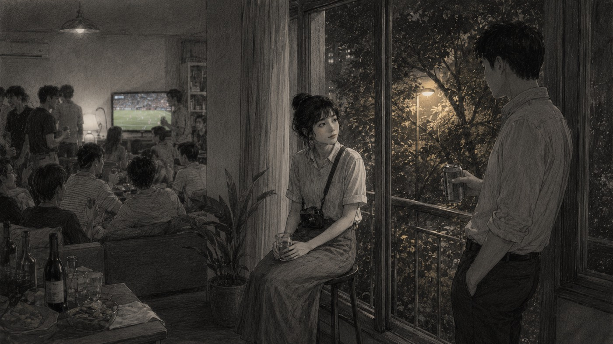
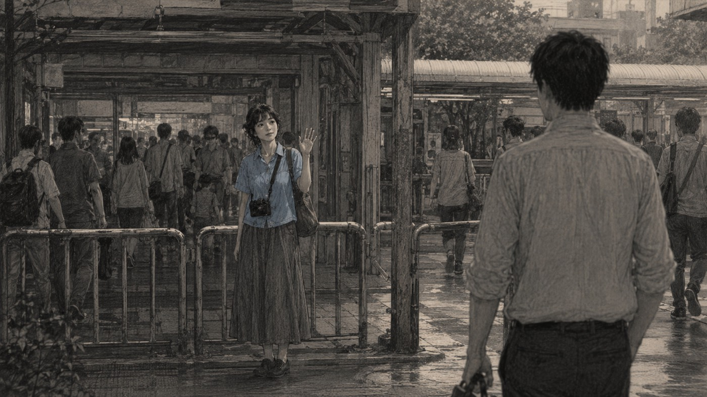
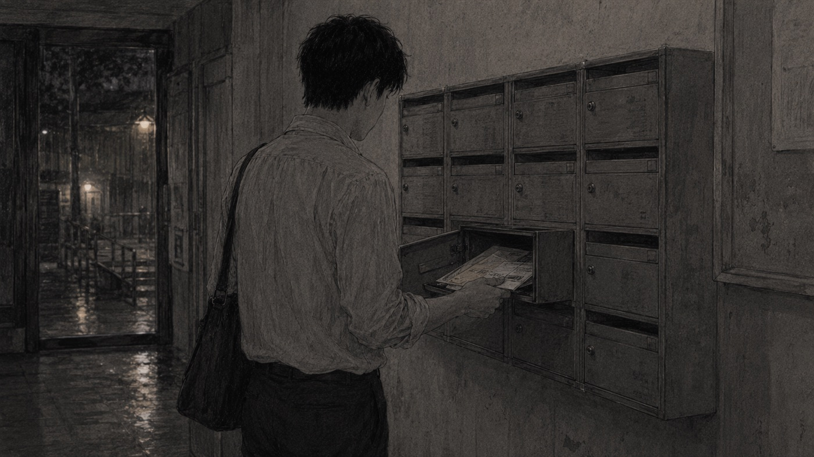
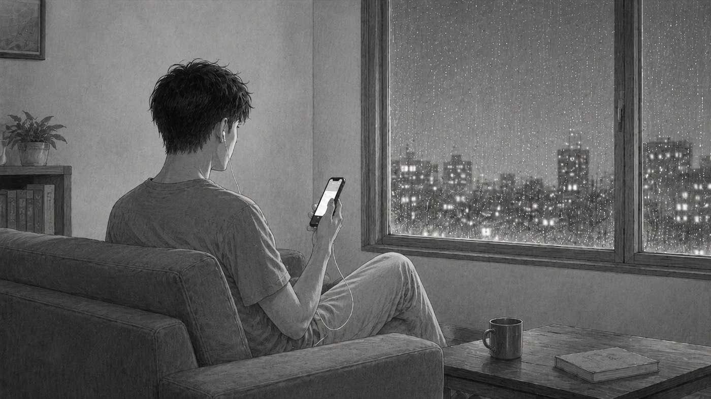
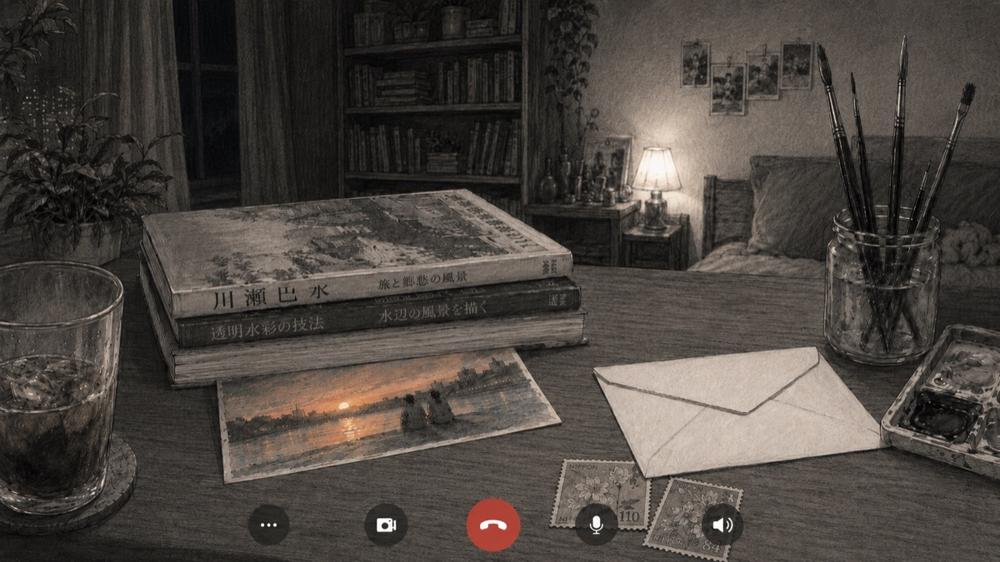
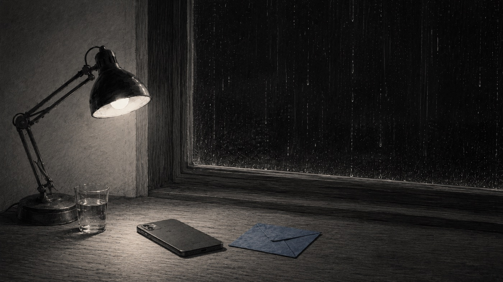
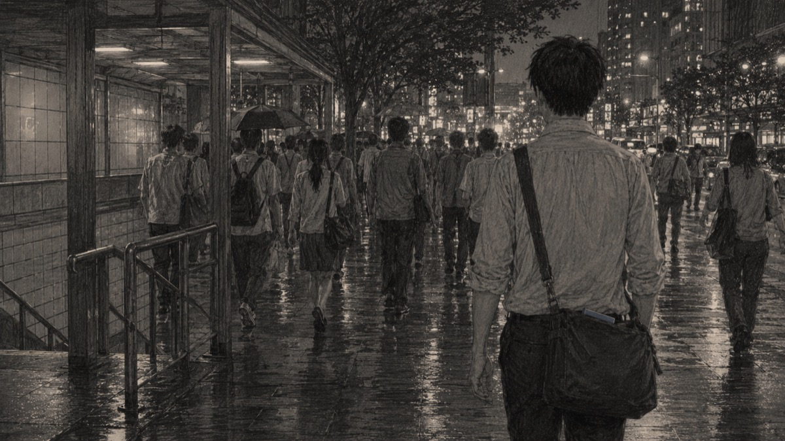

## 序章：那年夏天

那時候，我們在朋友的聚會上見過一次。

客廳裡擠滿了人，冷氣開得很強，嗡嗡作響。電視螢幕上播放著一場無聲的體育賽事，綠色的草皮和奔跑的人影在螢幕上無休止地閃爍。沙發區擠了六七個人，正高聲聊著我不感興趣的金融話題、房價，以及職場上的升遷與八卦。空氣中瀰漫著外送披薩和啤酒的味道，混合著密閉空間裡特有的黏熱。我因為覺得發悶，拿了一罐剛從冰箱取出的可樂，撥開人群，走到靠陽台的落地窗旁。

她就坐在那裡。

那裡放著一個高腳凳，是客廳裡最偏僻的角落。她手裡捧著一杯已經不冒熱氣的溫水，偶爾轉頭看看外面被黃色路燈照亮的梧桐樹葉。風吹過來，樹影在玻璃窗上晃。我拉開易開罐拉環時，發出了清脆的「喀噠」聲，氣泡湧上來。她聽到聲音，轉過頭來看了我一眼，然後笑了一下。

那是很輕、很不張揚的笑，嘴角微微往上提，又很快地收了回去，像是不想打擾到客廳裡那陣正熱烈的討論。

「裡面太吵了。」我靠在窗框上，對她晃了晃手裡的可樂罐。

「嗯，」她看著手中的玻璃杯，指甲輕輕刮著杯壁，「這裡比較涼快。」

我們就這樣在陽台邊聊了起來。聊了這座城市夏天總是停不下來的梅雨，一下就是半個月，衣服永遠曬不乾；聊了附近哪條巷子的牛肉麵最道地，湯頭是用牛骨熬了十二個小時的；還有早上搭地鐵時，那條繁忙的二號線有多難擠上去。

中途，我不經意地提到自己最近因為家人生病而有些焦慮，這幾天都睡得不太好。她聽著，身體微微前傾，黑色的眼睛看著我，輕聲問了兩句關於病情和醫院的事。她的表情很溫柔，讓人有一種被理解的錯覺。但當我試圖多說一些細節，比如深夜在醫院走廊看著點滴瓶滴落時的無力感時，她輕輕把杯子放在窗台上，轉身指了指客廳裡的人群，笑著說：「對了，你看過最近上映的那部電影嗎？他們現在聊得正開心的那個，裡面的配樂很好聽，我最近一直在循環播放。」

我把到嘴邊的話吞了回去，順著她的話聊起了那部電影的配樂。她說得很有興致，用詞輕快，但我發現她其實並沒有深入談論電影的情節，只是在重複一些影評網站上常見的句子。

後來聚會散了，已經是深夜十一點多。大夥在公寓路口各自搭計程車。那晚的空氣很熱，沒有風，路燈下的霧氣顯得有些厚重，吸進肺裡都是黏膩的濕意。

在排隊等車的空檔，她拿出手機，螢幕的白光照亮了她的臉。她抬頭看著我說：「加個聯絡方式吧，以後有空再聯絡。」

我點了點頭，掃了她的條碼。

計程車來了，她拉開車門坐進去，隔著車窗對我揮了揮手。車尾燈的紅光很快消失在街角的轉彎處。

那時候，我們都覺得這只是一次普通的見面。

---

## 第一章：重逢在她的城市

七年後的某個星期六下午，外面下著暴雨。

雨水像無數條白色的線，重重地撞擊在窗玻璃上，發出嘈雜的聲響。我待在家裡無事可做，把音響關掉，開始整理書桌最底層那個好幾年沒打開的舊抽屜。在一疊過期的發票和舊收據中間，我翻出了一個發黃的記事本。夾頁裡，躺著一張已經有些褪色的便條紙，上面寫著一個很久以前用過的通訊帳號。

我抱著無聊且有些懷舊的心態，重新下載了那個舊軟體。登入後，在聯絡人名單的角落裡，我看到了她的頭像。

那是一張像素很低、有些模糊的半身照，她在某個不知名的景點前，微微側著頭笑著。

我坐在書桌前，看著窗外的雨水順著玻璃凹槽匯聚成溪流，鬼使神差地打下了一行字發送過去：「嗨，妳還在原來的城市嗎？」

原以為這條訊息會像石沉大海一樣沒有回音，畢竟七年過去了，誰也不確定那個帳號是否還在使用。但僅僅過了五分鐘，螢幕就亮了起來：「在啊，一直都在。你怎麼突然上線了？」

我們沒有立刻聊得熱火朝天，而是像兩個久別重逢的陌生人一樣，有些生疏地詢問著對方的近況。但隨著對話的繼續，那些封存的記憶開始慢慢復甦。我們聊到了當年那個聚會的共同朋友，聊到有人已經結婚生子，有人去了國外，有人徹底失去了音訊。在接下來的三個星期裡，我們的聊天逐漸變成了生活的一部分。我會發給她辦公室外陰沉的天空，她會發給我她下班路上買的烤地瓜，或者是被雨水打濕的街道。

她偶爾會發來一條語音，聲音隔著網絡，依然輕柔，帶著一種不緊不慢的節奏。在這些零碎的對話中，我能感覺到我們之間那座隔了七年的冰山正在緩慢融化。

那時我剛結束一段漫長且疲憊的專案工作，累積了大把的補休假期。在我們重新聯繫的第四個星期，她開玩笑地說：「既然你現在放長假，不如來我這裡走走？我請你吃冰，我們這裡的芒果冰很有名，而且這幾天正好不下雨了。」

這一次，我沒有猶豫，當天下午就買了火車票。

三個小時的車程裡，火車穿過無數個隧道和翠綠的丘陵。我靠著窗戶，看著玻璃上倒映出自己有些疲憊但難掩興奮的臉，心裡有一種說不出的期待。

當火車緩緩滑進她那座城市的舊火車站時，車廂外瀰漫著南方特有的潮濕與熱氣。我在出站口擁擠的人群中見到了她。她剪了短髮，穿了一件洗得有些發白的藍色襯衫，看起來比以前成熟了一些，但站在欄杆旁朝我揮手時，那種溫柔的氣息一如往昔。

那三天，我們逛了當地的歷史街區，在落日餘暉中走過泥土氣味濃重的河堤。我們並肩走著，影子被夕陽拉得很長，重疊在路旁的雜草上。我們聊起了這七年來各自的生活起伏，聊到工作上的挫折、人際關係的疲憊，以及那些深夜裡獨自面對的焦慮。在這些對話中，我發現她依然習慣在話題變得沉重時，轉向一些輕鬆的細節，但這一次，我沒有像以前那樣感到挫敗，而是學會了配合她的步伐。

在一個過馬路的瞬間，一輛機車突然按著喇叭擦身而過，我下意識地拉了她的手臂一下，她順勢靠向我。當危險過去，我們的手指自然地交纏在一起，她的手心有些微的出汗，很暖。那一刻，我們都沒有放手，就這樣牽著走完了整條街。

在一家人氣很旺的街角餐廳裡，冷氣冷得讓人起雞皮疙瘩。服務生送錯了我們點的菜，把她點的奶油培根麵送成了海鮮義大利麵。

她看著那盤鋪滿了蛤蜊和蝦子的麵，邊角輕輕皺了一下，有些遲疑地抬起手準備招手。

一位端著髒盤子的服務生從我們桌旁匆忙走過。她張了張嘴，聲音很低：「不好意思……」

服務生沒有聽到，腳步不停地走開了。

過了一會兒，另一位服務生端著托盤路過。她再次抬了抬手，上身稍微前傾，聲音依然很輕：「你好……」

此時，隔壁桌的客人正好爆發出一陣響亮的笑聲，將她的聲音完全蓋了過去。服務生急匆忙忙地走進了廚房。

她慢慢把手放了下來，平放在桌面上。

我說：「要不我來叫吧，妳對海鮮過敏，不能吃這個。」

「不用了，」她看著那盤海鮮義大利麵，有些自嘲地笑了一下，把手收回口袋裡，「算了，人家看起來很忙。我吃旁邊的麵條就好，挑一挑就過去了。」

她沒有看那盤送錯的麵，也沒有再試著尋找服務生的身影。她拿起掛在脖子上的相機，對著窗外被雨水淋濕的街景拍了起來，一邊調整焦距一邊說：「你看，那個路燈下的影子很好看，剛好投在水窪裡。」

在我們相處的最後一天傍晚，我們站在火車站月台的黃線後面，看著即將進站的火車車燈在軌道上拉出長長的光影。空氣有些悶熱，夾雜著金屬與機油的氣味。

「我回去了。」我轉身看著她。

她微微低下頭，手指輕輕拉著自己襯衫的下擺，隨後抬起頭，看著我的眼睛說：「這幾天……我很開心。我很久沒有這樣跟人聊天了。」

我正想說點什麼，火車進站的轟鳴聲將一切蓋了過去。我上了車，穿過擁擠的走道找到我的座位。火車緩緩啟動時，我透過車窗看著月台上的她，她依然站在那裡，朝我揮著手，身影逐漸變小，最終被夜色吞沒。

火車駛入第一個隧道時，我的手機劇烈震動了一下。是她的訊息。

「我們要不要試試看？雖然很遠。」

我握著手機，看著屏幕上的那行字，心跳得很快。那一刻，車窗外黑漆漆的隧道牆壁彷彿也變得溫暖起來。我敲下了回覆：

「好，我們試試看。」

---

## 第二章：遠距離與未寄出的卡片

我回到了我的城市。

高聳的灰色公寓樓群在陰天裡顯得有些冷清，從陽台望出去，只能看到遠處交錯的高架橋和緩慢移動的車流。我的生活迅速回到了朝九晚五的軌道上，重逢時那溫暖潮濕的南方空氣，漸漸被辦公室裡冰冷乾爽的冷氣所取代。

我們正式開始了遠距離的戀愛。

剛開始的半個月，距離似乎反而激發了我們的情感。每天中午吃飯時，我們會互相傳送午餐的照片；下班路上，看著地鐵窗外飛逝的廣告牌，我也會隨手拍下發給她。

每天晚上十一點，不論加班到多晚，我的手機螢幕都會在床頭櫃上準時亮起。接通電話後，耳機裡會傳來一陣微弱的電流沙沙聲，然後是她的呼吸聲。雖然隔著數百公里，她的聲音聽起來有些單薄，但我依然習慣聽她分享的所有日常：今天中午在便利商店買的三明治裡美乃滋太多了、辦公室那台老舊的印表機又卡紙了，或者下班回家路上有一隻斷了尾巴的流浪貓跟著她走了一段路。在這些夜深人靜的時刻，她的聲音穿過耳機線，彷彿就貼在我的耳邊，讓我有一種她並未離去的幻覺。

「我今天去買了水彩紙和明信片卡，」在交往的第二個星期，她在電話那頭說，聲音裡帶著一絲難得的興奮。那時候的她聽起來非常有活力，像是在計劃一件宏大的藝術工程，「我想親手畫一張卡片給你。就畫我們在河堤看落日的那天，我會用藍色和橘色調出那天的天空，把我們兩個人的背影也畫進去。這星期畫好就寄給你。」

「是嗎？」我靠在床頭，心裡被一種溫暖的期待填滿，「那我每天下班回家，第一件事就是要去開信箱了。」

「嗯，我一定會畫好寄過去的，你等著看吧。」她答應得很快，甚至在電話裡發出銀鈴般的笑聲。她還仔細地跟我討論了畫畫的細節，比如她要用哪種粗糙紋理的水彩紙，才能表現出防波堤的質感，還有她想在落日邊緣塗上一層淡淡的金粉。

然而，一個星期過去了，我的信箱裡除了水費帳單和幾張廣告傳單，什麼都沒有。我每天下班轉進公寓大廳時，都會下意識地停在金屬信箱前，掏出鑰匙打開那扇小門，但每次迎來的都是一片空蕩。

第三個星期的週末晚上，天空又下起了雨。我坐在客廳看著雨滴打在防盜窗上，在電話裡聊著聊著，我再次問起了那張卡片。

「妳寄出了嗎？」我盡量用輕鬆的口氣笑著問。

電話那頭突然安靜了兩秒，隨後傳來她有些疲憊的聲音，中間夾雜著微弱的嘆氣：「最近公司接了新案子，我天天加班到九點，回家累得只想躺在沙發上睡覺。前天晚上我卸妝時差點在浴室睡著。卡片我已經打好草稿了，這週末我一定會抽空畫完寄出去，你再等我一下好不好？」

「沒關係，工作重要，別太累了。」我安慰她。我努力克制住心底那一絲小小的失落，告訴自己要體諒她的辛苦。

但自此之後，情況發生了微妙的變化。每當電話接通，只要我問起「這週過得怎麼樣」或者「週末有什麼計畫」，她就會立刻開始語速極快地抱怨主管的無理要求、合作廠商的拖延，或者辦公室同事之間的摩擦。她會詳細地描述某個同事是怎麼在開會時搶了她的功勞，或者主管如何在最後一刻推翻了她做了一整週的企劃案。她說得很專注，說得很多，中間甚至夾雜著滑鼠清脆的點擊聲和鍵盤的敲擊聲。

我默默地聽著，偶爾發出一兩聲應和。我發現，只要她說得越多，我們之間關於「卡片」或者「下一次見面」的話題就越沒有空間被提起來。有幾次我試圖在話題的空隙裡問她「週末要不要出門走走」，或者是「我們下個月要不要見個面」，她都會很快地打斷：「不行啊，我這週末可能還得在家加班，對了，那個案子的修正版我明天早上得交……」

我握著手機，看著天花板上日光燈管散發出的慘白光線。電話那頭的抱怨還在繼續，但我卻覺得那個聲音越來越遙遠。她似乎把所有的工作壓力和生活瑣事都當成了防波堤，將我擋在她的生活之外。而那張答應要寄出的卡片，也像是一個被無限期擱置的合約，沒有人再提起。

我心想，那我就等著吧。

---

## 第三章：防備的哲學

進入第三個月，她接電話的次數明顯變少了。

很多時候我打過去，電話會一直響到自動掛斷。半小時或一小時後，她會傳來一條簡短的文字訊息：「剛剛在洗澡」、「手機開靜音沒聽到，今天太累了想先睡，明天再說」。有時是一整天都沒有消息，直到隔天中午，她才會發來一張她午餐吃的沙拉照片，附帶一句「今天好忙」。

我們之間的通話，從以前的每天晚上，變成了每週一兩次，而且每次都匆匆結束。我開始在撥出號碼時感到遲疑，甚至會看著屏幕發呆，猜測此時的她是否又在加班，或者是否只是單純不想聽到我的聲音。

那幾天，我的城市一直在下小雨。灰濛濛的天空壓得很低，空氣中帶著一股潮濕的土腥味。我常常坐在客廳的沙發上，看著手機螢幕，等待那個熟悉的名字亮起。但通常，我只能看著時間一分一秒流逝，直到深夜。客廳的冷光照在白牆上，投下我孤零零的影子，那種寂靜開始在房間裡蔓延。

好不容易撥通電話時，她的聲音總是顯得有些飄忽和疲倦，彷彿我們隔著的不是幾百公里的鐵軌，而是不同維度的空間。

有一次，我們聊到週末的計畫，我提到自己想去獨立書店買幾本書。

她突然在電話那頭說：「我最近在看一本關於極簡生活和關係的書。作者說，承諾其實只是人類因為害怕孤獨，而建立的一種自我暗示。我們用『女朋友』或『男朋友』這樣的標籤來要求對方，本質上就是一種軟弱的綁架。你不覺得如果我們都不去定義彼此，會比較輕鬆嗎？沒有期望，就不會有失望。」

我沒有立刻回答。

因為我突然發現，她最近說的很多話，都像是在為某個結局預作準備。她說得那麼平靜、那麼客觀，像是在探討一個與自己無關的學術課題。但那些字句落在這間安靜的客廳裡，卻像是一層輕飄飄的沙土，正一點點掩埋掉我們在月台上牽手時的溫度。

我們之間的通話陷入了很長的沉默。我聽著耳機裡傳來她指甲輕輕敲擊手機背殼的「噠噠」聲，那聲音在安靜的夜裡顯得格外清晰，像是一個精準的計時器，在倒數著我們所剩無幾的默契。我靠在廚房的窗台旁，看著水龍頭緩慢地滴下一滴水，在不鏽鋼水槽裡發出微弱的聲響。每一次水滴落下的聲音，都像是在提醒我時間的流逝與感情的消耗。

「你不覺得嗎？」她見我沒說話，又輕聲問了一句，聲音裡帶著一種近乎冷漠的理智。

「我不知道，」我說，感覺喉嚨有些乾澀，「我只是覺得，如果不去期待任何事，好像就沒有必要開始了。如果『女朋友』只是一個綁架的標籤，那當初我們在月台上說的試試看，到底算什麼？」

電話那頭又是一陣漫長的安靜，隨後傳來她一聲極輕的嘆息，帶著一種防備的疲倦。那一瞬間，我隔著數百公里的電話線，感覺到有一扇原本敞開的門，正被她緩慢而堅決地關上。她不再試著向我解釋，也不再試著拉近我們，她只是退回了她那個安全的防護罩裡，把我留在外面。

我想，這本書的作者想法挺特別的。

---

## 第四章：卡片的謊言

事情的爆發，往往比我想像的還要安靜，也更讓人措手不及。

那是一個週五的深夜，已經接近十二點。我們在通電話，她剛下班回到家，正一邊脫高跟鞋一邊跟我說著今天地鐵上有個醉漢有多討厭。在閒聊的空隙裡，她突然換了一種稍微輕快、但顯得有些刻意的語調，告訴我卡片已經寄出去了。

「我昨天下午去郵局寄了，掛號寄的，」她說，聲音在空曠的客廳裡有些回音，「郵局的人說大概三到四天會到。我想著你每天下班去開信箱的樣子，就覺得挺有意思的。希望你收到之後會喜歡。我還特地選了個好看的郵票貼在上面呢。」

我當時真的很開心。那股累積了兩個月的焦慮與不安，似乎隨著這封「寄出」的信，瞬間消散了大半。我甚至開始計劃，等收到卡片後，要買一個精緻的木質相框把它裝起來，放在書桌最顯眼的位置。我跟她說了謝謝，聲音裡帶著掩飾不住的笑意，她在電話那頭輕聲笑著說「傻瓜，這有什麼好謝的」。那晚我睡得無比香甜，彷彿重新找回了在南方城市和她牽手時的溫度。

兩天後的星期天晚上，我們在視訊通話。

她正拿著手機在房間裡走動，螢幕有些擺動，光線有些暗。她穿著寬鬆的棉質睡衣，頭髮隨意地用夾子夾在腦後。她拿著一個小灑水壺，一邊幫陽台上的龜背芋澆水，一邊跟我說著今天去超市買了什麼牌子的燕麥片。她一邊說，一邊將手機鏡頭在房間裡隨意移動。

「對了，我昨天買了一本新書，放在桌上還沒看……」她說著，把鏡頭轉向她的書桌。

螢幕上的畫面隨著她的走動而晃動。鏡頭掃過凌亂的案頭，上面放著半杯冷掉的黑咖啡、幾支雜亂的畫筆，以及一疊厚厚的、用來壓著資料的書籍。而在那疊書的下方，露出了半張邊緣裁剪得有些不齊的厚水彩紙。

雖然畫面只有短暫的兩秒，但我看得清清楚楚。

那是一張畫著兩個站在河堤邊的藍色背影的水彩畫，夕陽是亮麗的橘紅色。那張畫的旁邊，還放著一疊沒用完的郵票，和一個乾淨的、沒有寫字的新信封。

那張卡片，原封不動地躺在她的書桌上。根本沒有什麼掛號信，也沒有寄出。

螢幕裡的畫面瞬間停住了，甚至能看到畫面裡因為焦距調整而產生的微弱抖動。隨後，鏡頭猛地一轉，對準了白色的天花板。

我握著手機，看著螢幕裡雪白、沒有任何溫度的天花板，以及邊緣那一小截發黃的冷氣出風口。客廳的冷風吹在我身上，讓我感到一陣刺骨的寒冷。

「卡片還在妳桌上，」我說，聲音異常平靜，平靜得連我自己都感到害怕。

電話那頭是一片死寂。耳機裡只有微弱的、空調出風口傳來的沙沙聲。她沒有說話，我看不到她的臉，但能聽到她突然變得急促的呼吸聲。

「我……我只是還沒去郵局，」她的聲音在空白的音軌裡顯得有些細碎，隨即微微拔高，「我那天本來要去，但郵局已經關門了。我只是不想讓你失望，才先告訴你寄了。這只是一張卡片而已，你為什麼要用這種口氣？你每次都這樣……像法官審查一樣，你讓我壓力好大，你懂嗎？你只在乎那張紙寄出了沒有，根本不知道我工作有多累。」

我張了張嘴，看著畫面上那截雪白的天花板。兩天前她說起「掛號信」和「三到四天會到」時，語氣是那麼自然、那麼輕快，甚至帶著笑。那一瞬間，我只覺得有一股很深的冷意從腳底蔓延上來。我沒有質問她，我甚至來不及感到憤怒，只覺得累。

「我不想跟你說了，你逼得太緊了。我真的很累，我要睡了。」

螢幕瞬間變黑。

電話裡突然只剩下沙沙的雜音，在安靜的房間裡顯得格外刺耳。我緩慢地放下手機，看著黑掉的屏幕，心裡只有一片冰冷的無力感。

---

## 第五章：安靜的牆

那晚之後，我發送過去的每一條訊息，旁邊都多了一個紅色驚嘆號。

「卡片是妳自己說要畫的，謊也是妳說的，為什麼最後被封鎖的人是我？」這條發送失敗的訊息孤零零地懸掛在對話框的最下方，旁邊的紅色圓圈像是一個荒謬的諷刺，提醒我所有的質問都已經撞在了石壁上。我不明白自己做錯了什麼，承諾不是我要求的，說謊與逃避的人也都是她，但最後被當作錯誤關在門外的，卻是我。我撥打她的電話，傳來的依然是冰冷的語音信箱留言提示，提示音後是一陣令人難受的沉默，然後自動掛斷。

我把手機螢幕朝下扣著，放在冰冷的書桌木板上。

外面的雨下了一整夜，玻璃窗上全是蜿蜒的水紋，沒有要停的意思。雨水撞擊在雨棚上，發出沉悶的聲響，一聲聲像是在敲擊著我的太陽穴。

接下來的幾天，我的生活陷入了一種機械式的運轉。

白天上班時，我坐在電腦前，手指在鍵盤上敲擊，發出「嗒嗒」的響聲。我盯著螢幕上的表格，輸入數字，但腦海裡卻反覆播放著那晚視訊畫面的兩秒鐘。隔壁桌的同事走過來，遞給我一份文件，對我說：「這份報告下午開會要用，你幫我確認一下數據。」我轉過頭，呆呆地看著他，花了好幾秒才讓這些字句進入我的大腦。同事有些疑惑地看著我：「你怎麼了？昨晚沒睡好？」我搖了搖頭，勉強笑了笑：「沒事，有點感冒。」

下班時，地鐵站裡擠滿了撐著傘的人潮，大家都在急匆忙忙地往家裡走，每個人都低頭看著手機，沉浸在自己的世界裡。我踩著水坑，看著黃色路燈在積水裡散開的碎光，突然覺得這座城市大得有些空曠。在這個擁有千萬人口的地方，我卻連一個能說話的人都找不到。

回到家，房間裡安靜得只有冰箱運行的微弱嗡嗡聲。

我坐到書桌前，看著那個前幾天特地去文具店買的藍色信封。我把它拿在手裡，紙張有些粗糙的質感在指尖滑過。我本想著，如果收到她的卡片，我也要寫一封信回寄過去。我甚至已經在心裡打好了草稿，想要告訴她我最近看的書，以及我對我們未來的想法。但現在，這個信封就這樣乾乾淨淨地躺在桌角，沒有收件人，也沒有寄件人，像是一個永遠無法實現的許願瓶。

那幾天我才明白，封鎖只是一個動作。只要按一下那個按鍵，我就會連同那些沒能送達的字句，一起從她的螢幕上徹底消失。這樣一來，她就不必再去看見我的失望，也不必去面對那些需要解釋的沉重。那堵牆安靜地立在我們之間，沒有任何聲音，卻無比堅硬，將所有的真實都隔絕在外。

我把水杯放在窗台上。

雨水順著玻璃滑落，在玻璃表面留下一道道模糊的痕跡。我沒有再試著撥打她的電話，也沒有再傳訊息。

我知道，在那堵牆倒塌之前，我說的任何話，都只會變成構築這堵牆的一塊新磚。我越是想要解釋，越是想要溝通，她就越會覺得受到了審查，從而將那堵牆砌得更高、更厚。

---

## 第六章：看清後的告別

三個星期後的某個下班傍晚，地鐵車廂在軌道上劇烈晃動，金屬摩擦的噪音震耳欲聾。

車廂裡擠滿了撐著濕漉漉雨傘的通勤族，空氣裡瀰漫著微濕的衣物氣味、泥土味和地鐵特有的橡膠味。我單手抓著吊環，身體隨著列車的擺動微幅搖晃，看著車窗玻璃上倒映出的那些疲憊且麻木的臉孔。三週的時間過去了，我原本焦躁不安的心情，已經在每天重覆的通勤與工作中，被消磨成了一種溫熱的麻木。我不再每天無數次地掏出手機查看，也不再對信箱抱有任何幻想。

此時，口袋裡的手機突然劇烈震動了一下。我有些吃力地拿出手機，解鎖螢幕。

對話框裡，那個已經沉下去、在過去三週裡毫無反應的頭像重新浮了上來。那堵安靜的牆，似乎在毫無預警的情況下裂開了一道縫隙。

訊息只有兩個字，沒有標點符號：

「在嗎」

沒有道歉，沒有解釋，簡潔得像是我們之間從未發生過爭吵，也從未經歷過這段漫長的死寂。地鐵車廂在軌道上劇烈晃動，發出刺耳的尖叫聲，但我看著那兩個字，心裡卻出奇地平靜。那些在無數個失眠夜裡燃繞的憤怒、委屈與不甘，彷彿都在這一瞬間化成了冰冷的灰燼，風一吹就散了。

我握著手機，看著那兩個字，在地鐵的噪音中敲下了回覆：

「為什麼封鎖我？」

發送成功。這一次，旁邊沒有出現紅色驚嘆號。

屏幕上方很快顯示出「正在輸入中…」的提示。我盯著那幾個閃爍的點，心裡平靜得連一絲漣漪都沒有。幾分鐘後，對話框裡跳出了她長長的幾段訊息：

「我那時候真的很害怕……我知道你一定會生氣，我害怕被你罵。我一遇到不知道該怎麼辦的事，就只想逃走。我真的不是故意要騙你的，我只是害怕被你罵而已……」
「我這三個星期真的很難受，每天看著我們冷冰冰的對話框，心裡有多焦慮，但我又不知道該怎麼面對你，每天晚上都失眠……」

我靜靜地看著螢幕上密密麻麻的字，心中只感到一陣無聲的疲倦。她重複著自己的焦慮、無助和害怕，那些字句密密麻麻地堆疊過來，卻唯獨繞開了我的這三個星期。她不知道我下班站在信箱前的停留，也不知道被紅色驚嘆號隔開的那些夜晚。在她的世界裡，這些是不需要存在的。

我沒有再回覆。

我把手機螢幕鎖定，重新塞回口袋。

我站在晃動的車廂裡，突然想起視訊鏡頭晃過她書桌時的那一幕。

那張卡片其實畫得很好。

河堤、夕陽、兩個人的背影。她把落日染成了溫暖的橘紅色，地上的影子連在一起，甚至連我衣服上的褶皺都畫了出來。她不是沒有畫，她把每一個細節都畫得很用心。

她只是沒有寄。

那張被書壓著的紙，就是她全部的真心與軟弱。她確實動了筆，確實想要把那一刻的美好留下來送給我，但當要把這份心意付諸郵遞、變成現實的承諾與責任時，她退縮了。她只喜歡活在自己想像的溫情裡，一旦需要付出實際的行動，需要承擔遠距離戀愛的重量，她就選擇了逃避。她畫下了美好，卻無法傳遞美好。

地鐵的速度漸漸慢了下來，車廂內響起報站的廣播，語音生硬地播報著下一站的名字。我抬頭看著車門上方閃爍的線路圖，綠色的光點一個個掠過，指引著方向。

我隨著湧動的人潮走出車廂，沒有再回頭。

回到家後，我坐在沙發上，看著桌角放著的那個藍色信封。我沒有把它丟掉，也沒有把它收進抽屜。我就讓它放在那裡，任由灰塵漸漸落在上面。幾天後，我在整理舊包包時，發現了去她城市時留下的那張火車票根。上面的字跡已經有些模糊了，但還能看得清出發的日期和時間。

我把它夾進了那本舊記事本裡，放在最深處。我把它們推回抽屜，關上。那個裝滿了期待與泡沫的夏天，也隨著抽屜的關閉，被我留在了過去。

