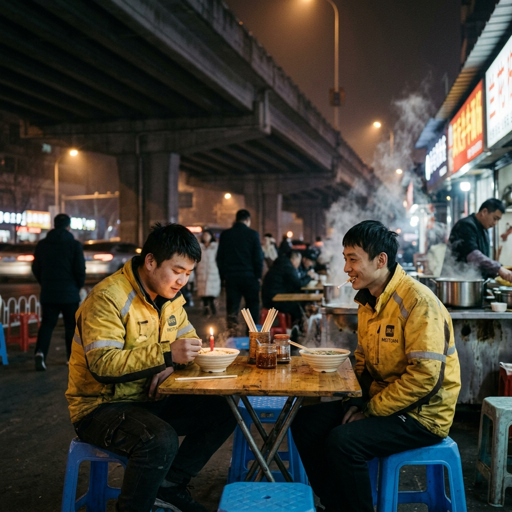
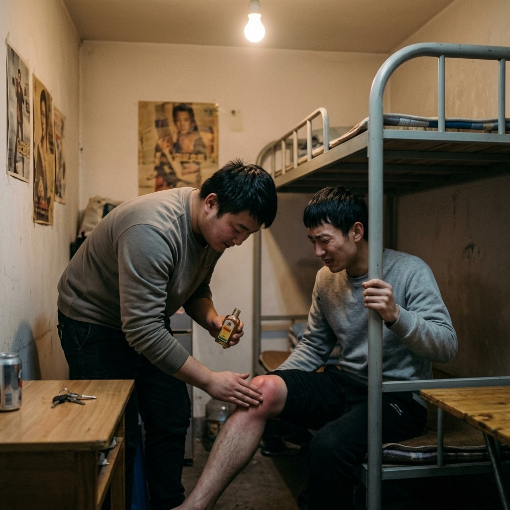
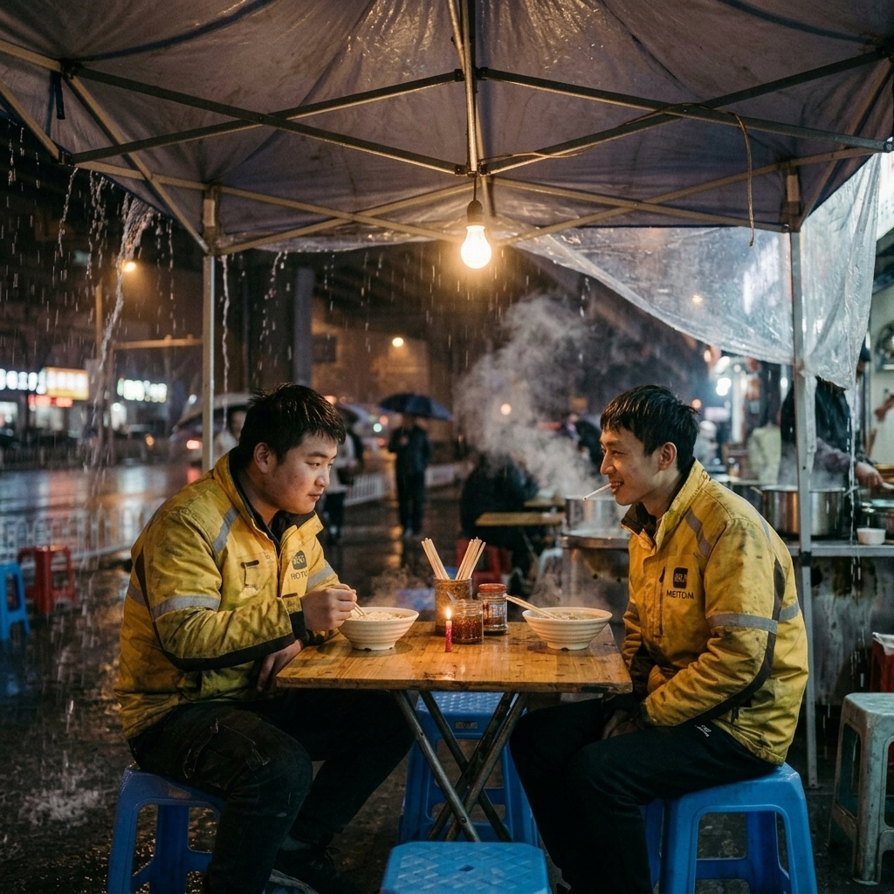
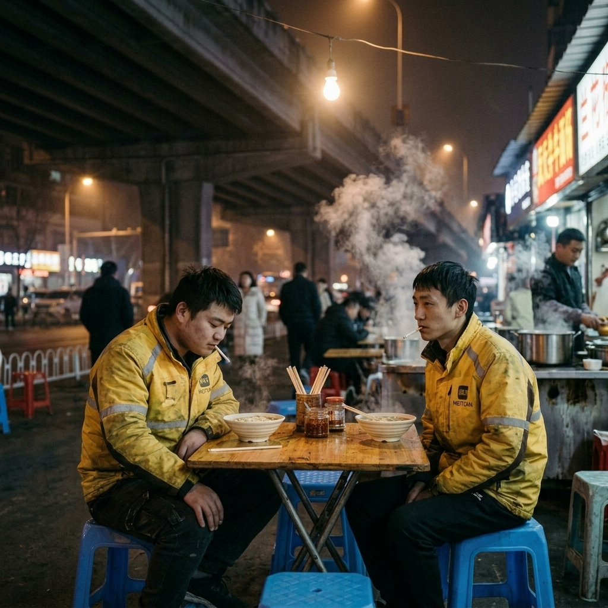
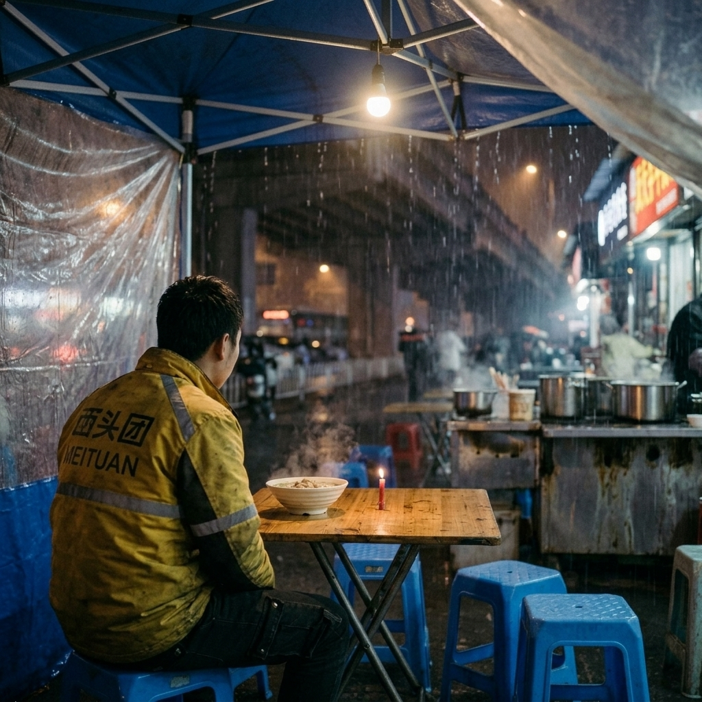

## 第一章：黏在桌角

十一月的風像刀子，順著頭盔下沿往脖子裡鑽，冷得讓人發懵。

小劉把電瓶車停在立交橋底下的避風處，縮起肩膀，將凍得發紫的雙手塞進沾滿油污的護膝裡。車把手上的電量顯示燈已經開始急促地閃著紅光，像是一隻瀕死的眼睛。

手機螢幕亮起，平台警報音刺耳地響了一聲。今天最後一單，送往高檔小區的熱湯麵，因為下班高峰期路段擁堵，超時了整整八分鐘。

顧客接過餐盒時，連防盜門都沒讓小劉踏進前半步。

「冷成這樣，湯都涼了，你們送外賣的能不能有點職業道德？」

隔著防護網，那張精緻的臉上寫滿了嫌惡，隨後「砰」地一聲，門結結實實地關上了。

小劉站在走廊的感應燈下，站了幾秒，才慢吞吞地轉身下樓。他抹了一把臉上的冷汗與灰塵，吐出一口濁氣，嘴唇乾裂得一動就生疼。

回到立交橋下，小陳已經在那兒等著了。小陳蹲在電瓶車旁，耳朵上掛著根廉價香菸，正用一根牙籤剔著牙。

「又被投訴了？」小陳斜著眼看他，語氣吊兒郎當的，「瞧你那張臉，跟家裡死了人似的。」

「滾。」小劉跨上車，聲音沙啞，「下週就我生日。今天又被投訴扣了五十，這特麼就當是生日禮物了。」

小陳剔牙的動作頓了頓，隨即嗤笑出聲：「喲，劉大少爺要過壽呢？怎麼著，要不要兄弟給你辦兩桌滿漢全席？還是去洗腳城點個雙人套餐？」

小劉沒搭腔，只是把電瓶車調了個頭，冷笑了一聲：「老子從小到大連個生日蛋糕長什麼樣都沒見過，更別說吹蠟燭。過個屁。跑單跑得手都沒知覺了，能多送兩單不超時就不錯了。」

小陳把嘴裡的牙籤吐掉，揉了揉被凍得發紅的鼻子，不屑地說：「行了啊，別在老子面前裝可憐，大老爺們矯情個屁。想要蠟燭？行啊，一會兒路過超市，自己花兩塊錢買一包紅蠟燭，天天在家插著玩。」

說完，小陳發動了那輛破爛的電瓶車，引擎發出刺耳的摩擦聲，一溜煙滑進了夜色裡。

三天后的下午，天陰沉得厲害，北風呼呼地刮。

小陳接到了地下一層「莉莉安手工烘焙」的訂單。

蛋糕店裡亮得晃眼，大理石地板反射著潔白的光，精緻的玻璃櫃檯裡陳列著漂亮精美的小蛋糕。在那個溫暖乾淨的空間裡，小陳顯得無比扎眼。

他身上那件黃色的外送防風服袖口已經磨得露出了白棉花，前襟沾著前幾天送餐時濺上的紅油污漬，腳底的運動鞋踩在大理石上，留下一行扎眼的泥印。周圍幾個衣著光鮮的顧客下意識地往旁邊挪了悶。

小陳完全沒有在意那些嫌棄的目光，他快步走到櫃檯前，把手機屏幕遞到店員面前。

「133號。」

店員是個穿著圍裙的年輕姑娘，轉身從後方的櫃子裡提出一個紮著紅絲帶的精美白紙盒。

拿蛋糕的一瞬間，小陳腦袋裡突然閃過前幾天小劉在立交橋下說的那番話。他眼珠子轉了轉，靈機一動，把身子往櫃檯前湊了湊，對店員堆起一個討好的笑臉：

「哎，妹子，那個……跟您商量個事唄。剛才客戶給我發短信，說他家小孩子今天過生日，下單的時候忘了備註要蠟燭了。您看，能不能給兄弟幫個忙，順手塞根蠟燭？就一根，普通的就行。」

店員姑娘看了看他，倒也沒怎麼在意。畢畢竟一根普通的小細蠟燭不值幾個錢，她便隨手拉開櫃檯底下的抽屜，摸出一根用紅色塑料紙包著的細小蠟燭，順手塞進了包裝盒的側邊縫隙裡。

「拿去吧。」店員隨口說道。

小陳對著姑娘連連點頭笑笑，抱著蛋糕盒子開心地走出了商場。

深夜十一點半，市區的喧囂漸漸退去，只剩下刺骨的冷風在空曠的街道上呼嘯。

立交橋洞底下，由一對老夫婦經營的流動麵攤還亮著一盞昏黃的鎢絲燈。

小劉和小陳圍坐在塑料小凳子上。兩碗素湯麵，幾片發黃的白菜葉，連一滴香油都沒有，卻是他們這一天裡唯一能吃上的熱乎飯。

小劉吸著鼻涕，捧著麵碗喝湯，試圖用升起的蒸汽暖一暖凍僵的臉。

小陳在兜裡掏了掏，隨後「啪」地一聲，將一樣東西扔在了小劉的麵碗旁邊。

小劉定睛一看，是一根細細的、約莫小指長短的紅色蛋糕蠟燭。因為放在口袋裡被電瓶車鑰匙擠壓過，蠟燭稍微有些彎曲，外面的塑料包裝紙也有些皺。

小劉愣住了，抬起頭看著小陳。

小陳從兜裡摸出那包已經壓扁的廉價香菸，抽出一根點燃，吐出一口青煙，沒好氣地說：「看屁看？趕緊的，立起來。」

「你幹嘛？」小劉皺眉。

「過生日啊。老子下午送單跟人要的，要不要一句話。」

小劉看著那根彎曲的紅色蠟燭，笑罵了一句：「神經病。這又沒蛋糕，立哪兒？」

「嘿，你這人真不知好歹！」小陳瞪了瞪眼，劈手奪過蠟燭，掏出塑料打火機點燃火苗，對著蠟燭屁股烤了烤，等紅色的蠟油滴了幾滴在油膩的木頭桌面上，順勢把蠟燭底座往上一按，穩穩地黏在了桌面上。

他再次按響打火機，「啪嗒」一聲，點燃了那根細細的棉芯。

一抹微弱的火光在冬夜的冷風中搖曳起來。它那麼小，隨便一陣風吹過似乎就能將它熄滅，但在這昏暗、冰冷、充斥著尾氣與泥沙的立交橋底下，這抹光亮卻顯得異常刺眼。

小劉看著那團小小的火光，手緊緊捏著竹筷子。

「許願啊，愣著幹嘛。」小陳催促道，嘴裡叼著菸，眼睛被煙霧熏得微微瞇起，神情卻少見地沒了平日裡的那種輕浮。

小劉搖了搖頭，盯著那火光：「許個屁，許願平台能不扣錢？不吹了，就這麼看著吧。」

「成，不吹就不吹，亮堂一會兒是一會兒。」小陳嘿嘿一笑。

他們沒有吹滅蠟燭。那根細小的紅色蠟燭在冬夜的冷風中搖曳著，一點點縮短，最後徹底燃盡，化作了一小灘熱乎乎的紅蠟，覆蓋在油膩的桌角上，隨即在寒風中凝固成了一塊扁平的暗紅色蠟痕。

小劉伸出大拇指，用指甲蓋頂住桌面上凝固的蠟痕邊緣，用力一推，將這整灘燃盡的紅色蠟油連同燒焦的黑色棉芯一起摳了下來。他用手指抹掉上面的油污，小心翼翼地放進防風服口袋深處。

「中彩票？」小陳猛吸了一口菸，把菸頭扔在腳下踩滅，眼神有些發亮，「哎，你說，要是咱們明天真中了五百萬，第一件事幹嘛？」

小劉拿起筷子，夾起那片白菜，大口嚼著：「買輛新車，再也不用擔心半路沒電。天天躺在出租屋裡睡覺，睡到自然醒。」

「沒出息。」小陳嗤之以鼻，一隻腳踩在塑料凳的橫檔上，手舞足蹈起來，「要是我中了，老子先去買輛奔馳，天天開著去送外賣，專門去送那些給過我差評的爛客戶，送到了我就當著他們的面，把湯汁澆他們大理石地板上，然後甩給他們一千塊錢，說：『不用找了！』」

小劉忍不住笑了起來，嘴裡的麵差點噴出來：「你專程去送，這不還是送外賣嗎？」

「那能一樣嗎？老子那叫體驗生活！」小陳大聲反駁，笑得眼淚都快出來了。

冷風在頭頂的鋼筋混凝土高架橋上呼嘯過，車流的轟鳴聲沉悶如雷。在昏黃的鎢絲燈下，兩個人吸著鼻涕，一邊大口吃著發乾的麵條，一邊為了不會中的五百萬爭得臉紅脖子粗。

---

## 第二章：紅花油

春末一過，北京的天氣就跟著火了似的，悶熱得像個巨大的蒸籠，偶爾又毫無徵兆地下起悶雨。

「外賣車不許停大門口！推到後邊去！」

寫字樓門口的保安戴著大沿帽，一隻手按著腰間的警棍，神色冰冷地揮手驅趕。

小劉只得捏緊剎車，調轉車頭，將電瓶車塞進後街那個塞滿了共享單車與垃圾桶的狹窄過道裡。他一路小跑著衝回大廳，胸口劇烈起伏，汗水順著額頭流進眼睛，辣得生疼。

大廳裡冷氣開得很足，吹得他身上的汗毛一根根豎了起來。小劉快步往客梯走去，卻被保安一把攔住：「送外賣的走後面貨梯，客梯不給上。」

小劉看了一眼手機螢幕上只剩四分鐘的紅色倒計時，心急如焚，卻也只能咬了咬牙，轉身往陰暗的後通道跑去。

貨梯前已經圍了一圈穿著各色外送服的同行。每個人都死死盯著手機，臉上的肌肉緊繃著。電梯門慢吞吞地打開，又慢吞吞地關上，每一次停靠，都伴隨著幾聲壓抑的咒罵。

小劉的手心全是冷汗。手機螢幕上，平台的紅色計時器像催命符一樣跳動：3分鐘、2分鐘、50秒……

當貨梯終於停在二十八樓時，手機螢幕上的紅色超時數字已經定格在了「9分40秒」。

小劉像條被瘋狗追趕的野狗一般，在鋪著厚重地毯的走廊裡狂奔，鞋底與地毯摩擦發出沉悶的沙沙聲。他一邊跑一邊順著門牌號找，只希望能少超時幾十秒，少一點被投訴的機率，汗水已經把背後的衣服濕透了一大片。

「您的外賣……」

小劉站在一家裝修奢華的金融公司門口，氣喘吁吁地將餐盒遞過去。

接單的是個穿著修身西裝、戴著金絲眼鏡的年輕白領。他看了一眼手機，又嫌惡地看了一眼滿頭大汗、身上散發著汗酸味的小劉，眉頭緊緊鎖了起來。

「超時了整整十分鐘，湯都灑出來了。」白領的聲音不大，卻帶著高高在上的冰冷，「我點的是熱湯，現在都涼了。我會申請退款並投訴你。」

「不好意思，哥，實在不好意思。」小劉低著頭，腰彎得極低，聲音裡帶著幾分低聲下氣的哀求，「今天電梯實在太慢了，您行行好，千萬別投訴，我給您賠一盒湯的錢成不？真對不起，哥……」

「砰。」

公司沉重的玻璃大門在面前重重關上，把小劉後面的話生生切斷。

小劉在門外站了一會兒，大口喘著粗氣，胸口憋悶得像壓了一塊大石頭。他慢慢轉過身，面無表情地按下了電梯下行鍵。這一單，他不僅白跑，還要面臨扣分和平台幾十塊錢的超時罰款。

與此同時，幾公里外的老舊商業街上，天空突然破了個窟窿，暴雨傾盆而下。

小陳騎著電瓶車在積水中艱難前行。前方的綠燈開始閃爍，為了搶在紅燈亮起前衝過去，他稍微加了點油門。

輪胎在積水下的鐵製井蓋上猛地一滑。

「砰！」

連人帶車摔倒在泥水裡。電瓶車在濕滑的路面上滑行了幾米，車頭的塑料外殼碎裂開來，輪胎在半空中無力地空轉，發出刺耳的嗡嗡聲。

小陳重重摔在地上，膝蓋狠狠撞在馬路牙子上，疼得他瞬間倒吸了一口冷氣，整個人蜷縮成了一團。外賣箱在摔車的瞬間飛了出去，裡面的兩盒熱湯麵毫無懸念地摔碎了，濃郁的湯汁混著泥水在馬路上蔓延。

暴雨砸在他身上，雨水順著脖子灌進防風服裡，冷得發黏。

小陳躺在泥水裡，抱著膝蓋緩了好一陣，才咬著牙爬起來。他顧不上拍掉身上的泥水，第一時間去摸水裡的手機。螢幕裂了幾道縫，但還能亮。

電話立刻響了起來，是顧客打來催餐的。

小陳抹了一把臉上的雨水，深吸一口氣，接起電話時，聲音已經換上了平日裡那種油滑而討好的調子：「喂，老闆，不好意思啊……對對對，我剛才在路上摔了車，麵全灑了。實在對不起啊，老闆！您別著急，這單算我的，我這就把麵錢微信轉給您，您千萬別給差評，這邊給您賠不是了……好咧，好咧，謝謝老闆體諒！」

掛了電話，小陳看著泥水裡泡著的麵條，狠狠往地上吐了一口帶血的唾沫，膝蓋疼得發抖。

---

深夜，六環外的一間老舊合租房裡。

房間小得只能放下一張高低床和一張油膩的書桌，牆角隱隱發霉，空氣中瀰漫著腳臭味、濕衣服的霉味以及紅花油的辛辣氣味。

小陳坐在床沿上，右腿褲管高高捲起，露出一個青紫腫脹、破了皮滲著血水的膝蓋。

小劉站在桌旁，扭開一瓶紅花油，將黃色的藥水倒在自己滿是老繭的手掌心裡，用力揉了揉。

「忍著點。」小劉面無表情地走過去。

「哎，你輕點……啊！！我操你大爺小劉！你謀殺啊！」

小劉布滿老繭的掌心狠狠按在小陳紅腫的膝蓋上，用力旋轉揉搓。小陳疼得整個人往後一彈，雙手死死抓著鐵床架子，臉上的五官扭曲成了一團，眼淚差點流了出來。

「叫個屁。不揉開，明天你連油門都擰不動。」小劉手上的力道絲毫沒減，一邊用力按一邊冷冷地罵，「騎個破車能摔成這樣，你腦子被豬拱了？為了一單幾塊錢的配送費，連命都不要了？」

「你懂個屁……老子要是不拼，這週的房租就特麼湊不齊了。」小陳一邊倒吸著涼氣，一邊疼得直哼哼。

上完藥，小劉去水龍頭下洗掉手上的藥水。紅花油的溫熱感在手掌上蔓延，空氣裡全是那股刺鼻的藥味。

小劉走回來，從兜裡摸出那包已經壓得變形的小蘇煙。裡面只剩最後一根了。

他把煙點燃，深吸了一口，遞給躺在床上的小陳。

小陳接過煙，塞進嘴裡狠狠吸了一大口，煙頭在黑暗中亮起刺眼的微光，隨後吐出一口青煙。

「媽的，今天真特麼背。」小陳把煙還給小劉，揉著自己的膝蓋，看著斑駁的天花板，「小劉，我說真的，我這膝蓋一到下雨天就疼得跟針扎似的。老子這副骨頭，估計再跑個一兩年就徹底廢了。」

小劉接過煙，看著指尖裊裊升起的煙霧，眼神有些放空。他兜裡還裝著半年前摳下來的那根紅色殘蠟，早已被體溫和悶熱的天氣捂得有些發軟，黏糊糊地貼著大腿。

「廢了就滾回老家去，省得天天在我跟前晃悠，看著心煩。」小劉淡淡地說。

「靠，你這人真沒同情心。」小陳翻了個身，扯了扯發潮的被子蓋住肚子，突然又嘿嘿笑了起來，「不過等明天老子中了五百萬，第一件事就是買套帶電梯的豪宅，天天躺在裡面吃香的喝辣的。到時候我賞你一間廁所住，收你半價房租，夠意思吧？」

小劉走過去，一巴掌拍在小陳的腦袋上，順手把剩下的半截煙頭按滅在空易拉罐裡。

「睡你的大頭覺吧，傻逼。明天早上六點早高峰，鬧鐘別起不來，到時候可沒人去撈你。」

小劉爬上去自己的床，拉過被子蓋過頭頂。

屋外的夜雨打在破爛的鐵皮雨棚上，發出劈里啪嗒的雜亂聲響。在這間充滿了汗水與紅花油辛辣氣味的屋子裡，小陳躺下後翻了個身，嘴裡嘟囔了兩句含混不清的髒話，隨後打起了呼嚕。小劉扯了扯發潮的被子，在黑暗中閉上了眼。

---

## 第三章：五百萬

六月的雨說下就下，沉悶的雷聲在城市上空滾過，隨後便是瓢潑大雨。

街道很快積起了沒過腳踝的深水。小劉騎著電瓶車在積水裡破水前行，褲腿早已濕透，緊緊貼在小腿上，冰冷黏膩。

他在搶單介面上滑了滑，碰巧搶到了一單送往附近寫字樓的蛋糕訂單，正好就是半年前小陳去過的那家「莉莉安手工烘焙」。小劉心裡一動，知道這家店能要到那種紅色的小蠟燭。

小劉把電瓶車停在商場大門口，小跑著衝進地下一層。

店裡依然亮得刺耳，冷氣的涼意夾雜著甜膩的香味。小劉站在櫃檯前，雨水順著他的雨衣下沿不斷往下滴，在光潔乾淨的大理石地板上匯成了一小灘水窪。店員姑娘有些嫌惡地看了那水窪一眼，將包裝精美的蛋糕盒遞給他。

小劉接過蛋糕盒，乾裂的嘴唇動了動。他沒有小陳那種天生的油腔滑調，喉嚨像卡了沙子一般，乾巴巴地擠出一句：

「妹子，顧客發短信，說要一根紅蠟燭。下單忘記備註了。」

店員姑娘倒也沒多說什麼，隨手拉開抽屜，摸出一根用紅色塑料紙包著的小細蠟燭，塞進了紙盒縫隙裡。

「謝謝。」小劉低著頭道了謝，抱著蛋糕盒子快步衝出了商場。

深夜十一點半，暴雨依然沒有要停的意思。

立交橋底下的流動麵攤，鐵皮雨棚被暴雨砸得「啪啪」作響，巨大的噪聲像是一陣陣雜亂的鼓點，震得人耳朵發麻。

老夫婦正忙著用塑料布遮擋四處飛濺的雨水。小劉和小陳縮在最裡角的一張小木桌旁，雨水順著棚頂的縫隙滴在他們腳邊，地上積了一層薄薄的水。

兩人都被淋成了落湯雞。小劉脫掉頭盔，揉了揉被雨水泡得有些發白的手指。小陳則在一旁揉著膝蓋，大口吸著冷氣，眉頭緊緊鎖在一起。那條摔傷的腿在這種潮濕悶熱的雨天裡，疼得越發鑽心。

兩碗素湯麵端了上來，冒著稀薄的白氣。

小劉在兜裡掏了掏，隨後「啪」地一聲，將一樣東西扔在了小陳的麵碗旁邊。

那是一根用紅色塑料紙包著的、小指長短 of 蛋糕蠟燭。

小陳盯著那根紅蠟燭，愣了足足三秒鐘，隨即咧開嘴笑了起來，露出一口不太整齊的黃牙：「我靠，小劉，你小子也學會去要飯了？」

「廢話。」小劉拿起竹筷子在碗沿上敲了敲，面無表情地說，「過生日啊。老子下午送單跟人要的，要不要一句話。」

「要！老子這面子比天大，悶油瓶開口，老子能不要嗎？」

小陳嘿嘿笑著，劈手奪過蠟燭。

小劉沒說話，掏出塑料打火機拋給小陳。小陳接過來，撥弄了幾下，打火機因為受潮，按了好幾下才「啪嗒」一聲冒出橘黃色的火苗。

小陳湊近火苗，用火舌烤了烤蠟燭底部。當幾滴紅色的熱蠟油滴落在油膩、斑駁的木桌角時，他順勢將蠟燭底座往上一按，穩穩地黏在了桌面上。

小劉看著那團小小的火光。他們誰也沒提許願或吹滅的事，心照不宣地任由它在冷風暴雨中燃著。

小陳吸了口菸，看著搖曳的火焰，自言自語般地碎碎唸了一句：「這鬼天氣，亮堂一會兒是一會兒吧。」

小劉沒吭聲。他看著小陳那條微微發抖的右腿，默默盯著那一小團搖曳的火光，用極其平淡、隨意的口吻大聲說：「等老子中了五百萬，在老家縣城給你爸媽整套帶電梯的房子。你爸那腿，天天爬五樓太費勁。」

小陳夾著菸的手猛地頓住了。

大雨砸在鐵皮雨棚上發出震耳欲聾的巨響。小陳看著小劉那張面無表情的臉，張了張嘴，似乎想說點什麼，最後卻只是猛吸了一口菸，笑罵著偏過頭去：

「拉倒吧你！還電梯房呢。你還是先買台新的電瓶車吧，天天熄火，看你今天那損樣！」

「愛要不要，不要老子買了自己住。」小劉也點燃了一根菸，吐出一口青煙。

「那不行，房產證得寫老子名字！」小陳大聲喊了回去，眼睛在微弱的燭光下亮晶晶的，不知道是被雨水打濕的，還是被煙霧熏的。

兩人在雨聲的擂鼓中，一邊吸著鼻涕，一邊大口吃著那碗發乾的麵條。

蠟燭燃盡，化作了一灘新的扁平蠟痕，黏在那塊暗紅色的舊蠟疤上。

小劉伸出大拇指，用指甲蓋頂住桌面的蠟底，用力一推，將這根燃盡的紅色蠟油連同底座一起摳了下來。他用手指抹掉上面的油污，小心翼翼地放進防風服口袋裡。

口袋底部的拉鍊夾層裡，那張裹著半年前舊殘蠟的褶皺小票已被體溫捂熱，兩根蠟燭在黑暗中黏在了一起。

小劉戴上頭盔，發動了電瓶車。

雨漸漸小了，路燈在積水裡倒映出五彩斑斕的碎光。小劉擰動油門，電瓶車破開積水，與小陳的電瓶車一前一後，再次衝進了冷清的雨夜中。

---

## 第四章：過完年

六月的暴雨過後，緊接著就是七八月伏天裡透不過氣的悶熱。

整個北京城熱得像個大蒸籠，柏油馬路被毒辣的太陽曬得發軟，電瓶車輪胎壓過去，甚至能留下一道淺印。小劉和小陳換上了被汗水反覆浸透、背部泛起一圈圈白色鹽漬的短袖。有時搶到送蛋糕的訂單，兩人都得提心吊膽，在高溫下只要稍微耽擱幾分鐘，紙盒裡的奶油和巧克力就會化成一灘稀泥。小陳那台裂了屏的手機在陽光直射下燙得幾次自動關機，他只能隨身揣著包濕紙巾，一停下來就貼在手機後蓋上降溫，一邊吐著唾沫笑罵這平台的算法催命。

九月秋風一刮，北京的秋天短得像是一眨眼。

某個清晨出門，風裡突然帶了刺骨的涼意，小劉又從床頭翻出那件洗得褪色、袖口露著白棉花的黃色防風服。他拉開口袋底部的拉鍊，指尖碰到了那團小票紙。經歷了盛夏的體溫與烈日高溫，裡面的兩根紅色殘蠟已經徹底融化，黏成了一個分不清形狀的扁平蠟餅。他捏了捏，蠟餅硬硬的，像塊小塑料。

十月，路邊的楊樹葉黃了又落，被垃圾車掃得乾乾淨淨。他們開始為電瓶車的續航發愁——天冷了，電池掉電特別快，原本能跑六十公里的電瓶，現在跑四十公里就見底。小劉和小陳的生活依然沒什麼變化，依然每天在紅色的超時倒計時裡疲於奔命。

十一月，寒潮裹著西北風呼地一下吹了過來，冷得人措手不及。

進入十一月，北京的冬天冷得像一塊鐵，乾冷的西北風颳得街角枯樹枝喀啦作響。街上的人流稀少，只有偶爾疾馳而過的外送車，排氣管噴出白濛濛的氣霧。小劉拉高了防風服的領子，雙手戴著笨重的防風把套，捏剎車時手指已經麻木得沒有了知覺。

深夜十一點半，正值十一月中旬，小劉生日這天。

兩人在立交橋底下的流動麵攤碰頭。老夫婦正忙著用塑料布遮擋刺骨的寒風，棚頂被風吹得嘩啦啦作響。

兩碗熱氣騰騰的素湯麵端了上來，白氣在寒冷中散得極快。小陳坐在一旁，用肩膀頂了頂那輛發不起來的電瓶車，車子發出沉悶的喀啦聲。

「操，這破車，跟老子一樣，天一冷就跟個太監似的發不起來。」小陳吐出一口熱氣，罵罵咧咧地用鞋底踢了踢車胎。

隨後，小陳把一隻手伸進防風服兜裡掏了掏，嘿嘿樂著，隨手「啪」地一聲，將一樣東西扔在了小劉的麵碗旁邊。

那是一根用紅色塑料紙包著的、小指長短的蛋糕蠟燭。

小劉盯著那根紅蠟燭，愣了一下：「我靠，你從哪弄的？」

「老子今天下午運氣好，搶到一單送蛋糕的，順手又跟店員扯了個謊騙來的。」小陳把塑料打火機拋給小劉，「別廢話，今天你生日。趕緊的，別浪費老子打火機的氣。」

小劉夾麵的竹筷子懸在半空，嘴硬地說：「多大的人了，還玩這個，幼不幼稚。」

但他還是接過打火機，按響火苗，用火舌烤了烤蠟燭底部。當紅色的熱蠟油滴落在油膩、斑駁的木桌角時，他順勢將蠟燭底座往上一按，穩穩地黏在了桌面上。

那個桌角上，前幾次慶生留下的殘蠟痕跡已經層層疊疊，新舊蠟疤重疊在一起，在油膩的木頭桌面上顯得格外扎眼。這第三根紅蠟燭就立在這些印記的最上面。

小劉點燃了棉芯。

一抹微弱的火光在冷風中劇烈地搖曳著，隨時都可能熄滅，卻又頑強地撐著，映亮了兩張凍得發紅的臉。

小陳吸了口菸，看著搖曳的火焰，隨後像是隨口提起明天會下雨一樣，極其平常地說：「哎，小劉，過完年老子不來了啊。」

小劉正準備去點菸的手猛地頓住了。

白濛濛的熱氣騰在兩人中間，有些模糊。小劉看著小陳。

小陳没看他，只是低著頭，用大拇指指甲用力摳著手機螢幕上的一塊頑固污漬，聲音依舊是那副吊兒郎當的調子：

「老家那邊，我媽身體是一天不如一天了，老頭子一個人實在伺候不過來。前天打電話，說是在鎮上的超市幫我謀了個送貨的差事，一個月給三千，管吃管住。還給我張羅了個隔壁村的姑娘相親，聽說人挺老實的。老子也跑夠了，天天在平台算法屁股後面攆，像條狗一樣。這地方跑單能跑一輩子啊？回去混著過唄。」

小劉的胸口像是一下子陷下去一塊，沉甸甸的。

他慢慢縮回手，將雙手插進了防風服的口袋深處。

口袋底部的拉鍊夾層裡，指尖碰到了那張硬硬的、被體溫焐過無數次的殘蠟餅。他用力捏了捏那塊硬梆梆的紅蠟，邊緣頂著指尖，帶起一陣無聲的痛。

「趕緊滾。」小劉抽出一隻手，吸了吸鼻子，聲音乾巴巴的，「早看你煩了。天天在老子眼皮底下搶單，往後少個嘴碎的，老子耳朵能清淨不少。」

小陳聽了，仰起頭哈哈笑了起來，露出那口不太整齊的黃牙。他呼出的白氣在空中聚成一團，隨即被冷風扯碎。

「靠，你這人真沒良心。老子回去了，你就一個人守著這破小平房吧。過年回來可別想我想得哭鼻子。」

「哭個屁。」小劉低頭吃了一大口麵，滾燙的湯汁燙得他直皺眉，「過完年，老子自己搬到大興那邊去，房租還能省兩百。誰特麼有空想你。」

「成啊，省下來的錢多買幾張彩票。要是中了五百萬，記得給老子在縣城買套電梯房啊！」小陳拍了拍那輛死活發不起來的電瓶車，笑嘻嘻地說。

「不買。老子中獎了就裝作不認識你，在街上碰見我都繞著走。」小劉冷笑。

「靠，冷血動物！」

兩人在寒風中，一邊吸著鼻涕，一邊飛快地把碗裡的麵條吃完。

那根紅蠟燭在西北風的拉扯下燃到了盡頭，化作了一小灘熱乎乎的紅蠟，緩緩流淌開來，覆蓋在以前的舊蠟痕上。

麵攤的老闆已經開始收拾鐵架子，鐵器碰撞的聲音在空曠的冬夜裡顯得格外刺耳。

小劉伸出大拇指，用指甲蓋頂住桌面上剛剛凝固的熱蠟底，用力一推，將這團新的紅色殘蠟同底座一起摳了下來。他用手指抹掉上面的油污，小心翼翼地放進防風服口袋的拉鍊夾層裡。

那裡，融化的舊蠟餅與這團剛凝固的新殘蠟在黑暗中靠在一起，硬硬的，隔著布料頂著他的大腿。

他們推著電瓶車在空無一人的馬路邊往回走。小陳的電瓶車徹底沒了電，推起來極沉，小劉推著自己的車，一隻手幫他搭在後座上，兩人在昏黃的路燈下並肩走著，地上影子被拉得極長，又慢慢縮短。

一路上，誰也沒有再說話。

回到六環外的巷子口，小陳推著車往黑漆漆的院子裡走去。小劉站在巷子口，看著他的背影一點點被黑暗吞沒。

風呼呼地刮過，吹起路邊乾枯的落葉，發出沙沙的乾冷聲響。小劉在原地站了幾秒，無意識地捏了捏口袋裡的蠟餅，轉身走向了自己的電瓶車。

---

## 第五章：新疤

過年後，小陳就再也沒回北京。

他的微信頭像換成了老家鎮上超市的藍色招牌，偶爾在朋友圈發幾張模模糊糊的超市貨架照片，或者他大外甥那隻抓著雞大腿的胖乎乎的小手。小劉沒有點過讚，也沒有留言，只是在某個深夜刷到時，手指會停一停，然後迅速滑過去。

小劉退掉了原本合租的小平房，獨自搬到了更偏遠的大興。新租的單間只有原來的一半大，牆角有些發霉，放下一張單人床後，連轉身的地方都局促。他開始了一個人的生活，每天早出晚歸，機械地在龐大的城市地圖裡穿梭。他的防風服口袋拉鍊夾層裡，依然沉甸甸地裝著那團被揉皺的小票紙，裡面是一塊融化在一起的紅色蠟餅，和那一小小團在寒風中凝固、邊緣有些扎手的第三根殘蠟。

日子過得很快，又像是完全停滯了。

轉眼到了第二年的六月。

六月的北京，說下雨就下雨。天空中沉悶的雷聲滾過，隨後便是鋪天蓋地的瓢潑大雨。水汽和熱氣在大街小巷裡瀰漫，柏油馬路被暴雨砸得泛起白煙。

小劉在積水裡破水前行，褲腿和鞋子早已濕透，冰冷黏膩。他在搶單界面上滑了滑，順手搶到了一單送往寫字樓的蛋糕訂單。取貨地址是地下一層的「莉莉安手工烘焙」。

商場地下一層冷氣開得很足，混雜著甜膩的黃油香味。小劉站在光潔的大理石地板上，雨水順著他的雨衣下沿滴滴答答往下掉，匯成了一小灘泥水。店員女孩有些嫌惡地瞥了那灘水一眼，例行公事般將紮著紅絲帶的蛋糕包裝盒遞了過來。

小劉接過蛋糕盒。

那一瞬間，甚至沒有經過大腦，他的喉嚨像是有些生鏽般發乾，嘴唇動了動，一句話本能地溜了出來：

「妹子，訂單備註說多要一根蠟燭。」

店員女孩愣了愣，隨手拉開抽屜，摸出一根用紅色塑料包裝的小細蠟燭，塞進了紙盒側邊的縫隙裡。

「謝謝。」小劉低著頭道了謝，抱著蛋糕盒子快步衝出了商場。

他把蛋糕送到了寫字樓，走出大門時，外面的暴雨依然沒有要停的意思。

小劉沒有回大興。他騎著電瓶車，在大雨中穿過一條條熟悉的街道，最後停在了那座立交橋底下。

雨夜裡，流動麵攤還亮著那盞昏黃的鎢絲燈。鐵皮雨棚被暴雨砸得啪啪作響，四處飛濺的雨水將棚外的地面淋得透濕。

老夫婦正忙著用塑料布遮擋漏雨的角落。小劉在最角上的那張小木桌旁坐了下來。對面的塑料凳子空著，被飛濺的雨水淋得精濕，在昏暗的光線下泛著冰冷的光澤。

一碗熱氣騰騰的素湯麵端了上來。

小劉從雨衣口袋裡摸出那根乾淨、全新的紅蠟燭，扯掉外面的塑料紙。他按響打火機，烤了烤蠟燭底部，隨後穩穩地按在了油膩的木桌角上。

那個桌角上，前幾次留下新舊蠟跡已經層層疊疊黏在一起，在油膩的木頭桌面上凝固成了一個黑紅色、凹凸不平的硬疤。這第四根紅蠟燭就立在最上面。

小劉點燃了棉芯。

一抹微弱的火光在冷風雨氣中劇烈地搖曳起來，隨時都可能熄滅，卻又頑強地撐著。

小劉沒有說話，也沒有許願。他只是拿起竹筷子，大口吃著碗裡那碗發乾的麵條。

大雨砸在鐵皮棚上，發出震耳欲聾的喧囂聲。對座空落落的，只有冰冷的雨水不斷滴落在空凳子上。小劉默默盯著那一小團搖曳的火焰，吸了吸鼻子。

紅蠟燭在冷風的拉扯下，一點點縮短，最後徹底燃盡，化作了一小灘軟乎乎的熱紅蠟，覆蓋在了以前那些層層疊疊的舊蠟痕上。

這一次，小劉沒有伸出指甲去摳它。

他只是任由那一灘新蠟留在桌面上，在潮濕的雨夜裡慢慢凝固，徹底成為了那張小木桌上永久融為一體的新疤痕。

他把雙手插進了雨衣口袋深處，指尖隔著布料，用力捏了捏貼身口袋裡那塊發軟、變形的紅色蠟餅。

隨後，他戴上頭盔，拉下防風面罩，發動了電瓶車。

車前燈射出一束白光，破開密集的雨幕。小劉擰動油門，電瓶車破開積水，濺起一地破碎的水花，迅速融入了夜晚霓虹交錯、冰冷而龐大的車流中。

