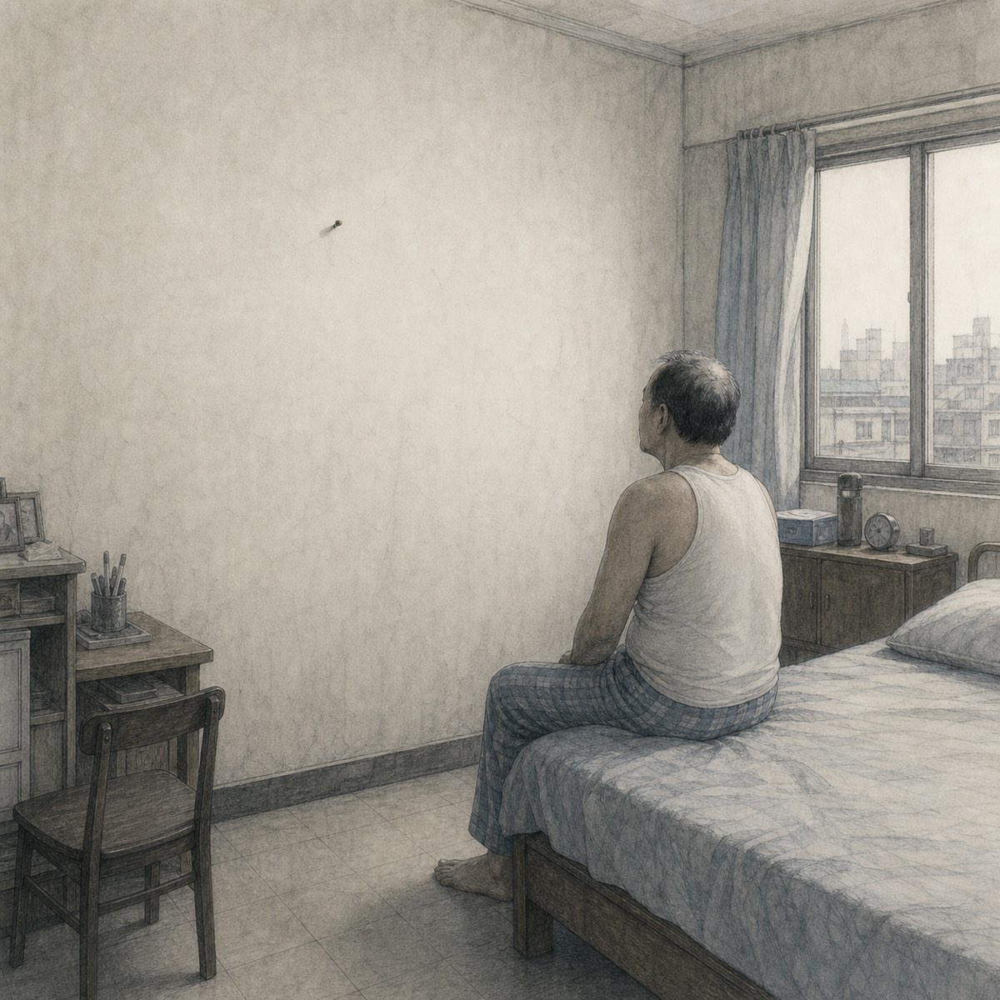
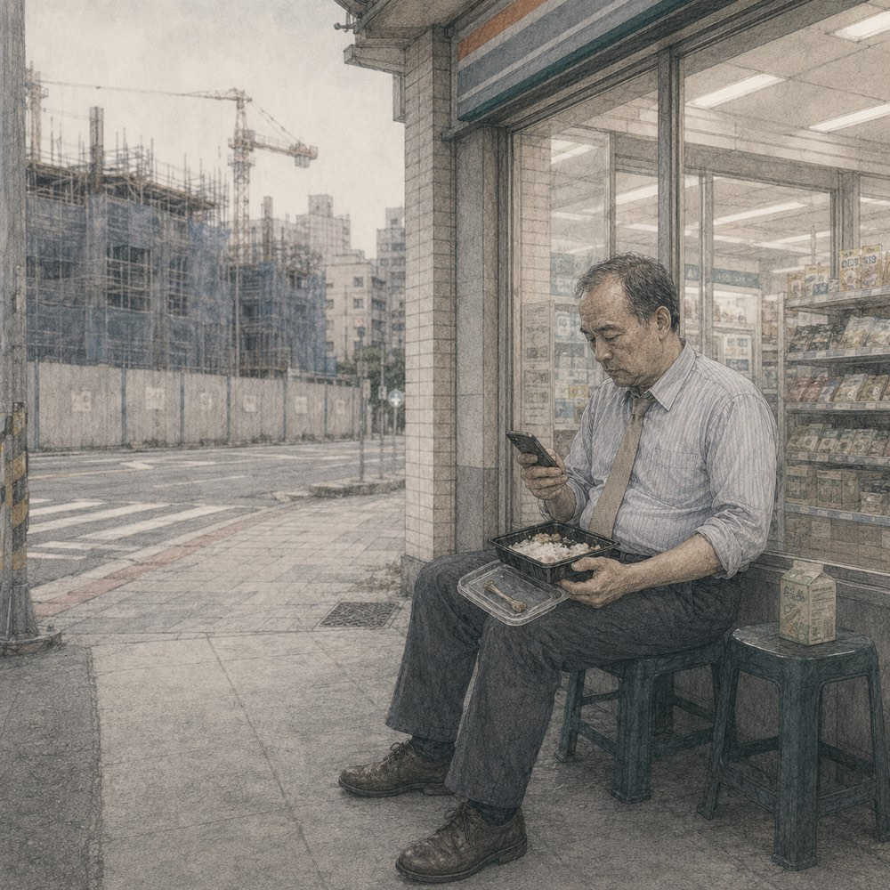
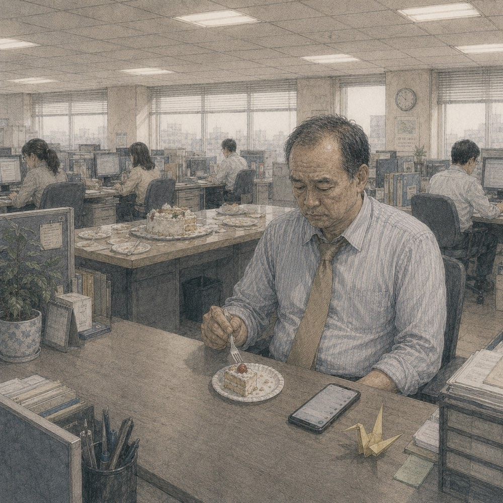
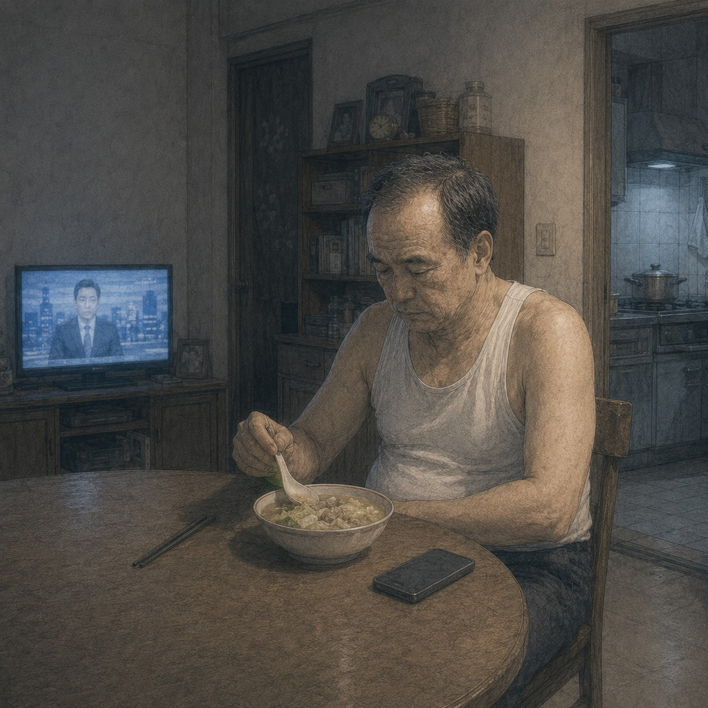

## 第一章：07:15 鬧鐘與牙刷

鬧鐘響的時候，林國平已經醒了。

他閉著眼睛，等鈴聲自己停掉。五分鐘後，第二次鈴聲響起，他伸手按掉，坐到床沿。

對面的白牆上有一根鐵釘，釘子下方有一塊隱約的方形印子，油漆顏色比周圍稍淡一些。

手機在床頭亮了一下。

行事曆提醒：明天，志豪生日。

林國平拿起手機，打開與兒子的對話。

最下面是上個月的訊息。

「爸，收到了，謝謝。」

再往上也是差不多的內容。他傳「已匯」，兒子回「收到」或「謝謝」。有時候是一張貼圖。最近一次與生活費無關的訊息，是去年端午節，兒子問他要不要回老家。

林國平看了一會兒游標，鎖上手機。

他去浴室刷牙。鏡子裡的臉還有睡意，左邊臉頰留著一道枕頭壓出的紅痕。他刷完牙，洗臉，到廚房熱牛奶。

牛奶熱了，他倒進藍色陶瓷杯，站在流理台前喝完，把杯子洗好，放回杯架。

衣櫃裡掛著七件顏色相近的襯衫。他拿了淡藍格紋的那件，配一條棕色領帶。他熟練地打好溫莎結，將衣領折整齊。

出門前，他又看了一眼手機。

行事曆提醒還在通知列上。他把通知往旁邊滑掉，拿起鑰匙，關門。

走廊的感應燈在他推開鐵門時亮起。他走下樓，腳步聲在空蕩的樓梯間裡激起沉悶的回響。

---

## 第二章：08:30 擁擠的區間車

月台上的人已經很多了。

林國平走到第三節車廂門口，站在地板的黃色標線後面。他在同一個位置等了十四年的車。列車進站前，人群向前靠近，他也跟著向前半步。

車門打開，他被推進車廂。裡面沒有座位，他握住扶手，調整好重心。

站在旁邊的兩個大學生正在說話。

「明天晚上六點啦，先去吃燒肉，再看要不要續攤。」

「壽星不用出錢吧？」

「你想太多。」

兩個人笑了。其中一個拿出手機，把餐廳頁面遞給另一個看。

林國平也拿出手機。

桌布是志豪國中畢業那天拍的照片。他穿著短袖制服，站在校門旁邊，因為陽光太亮，眼睛瞇了起來。林國平記得拍完照片後，他們去吃了一間兒子選的燒肉店。那間店後來搬走了。

他打開瀏覽器，在搜尋欄輸入志豪就讀的大學名稱，又加上「附近 餐廳」。

搜尋結果跳出幾家裝潢新潮的餐廳，照片裡多是圍著火爐大笑的年輕人。他看著螢幕，發現自己其實不知道志豪現在還喜不喜歡吃燒肉。

列車到站，廣播報出站名。

林國平關掉頁面，把手機放回口袋，跟著人群下車。

那兩個大學生走在他前面，仍在討論明晚誰會到。他們在出口處往右轉。林國平往左，走向辦公大樓。

---

## 第三章：12:30 超商的排骨便當

十二點半，辦公室裡的人陸續站起來。

「國平，我們去對面熱炒店，要不要一起？」陳明裕一邊穿外套一邊問。

「不用了，你們去吧。」

「好。」

陳明裕轉身去問下一個人。幾分鐘後，辦公室只剩下冷氣與電腦運轉的聲音。

林國平從抽屜裡拿出環保袋，搭電梯到一樓超商。他在便當架前停了一會兒，拿起排骨便當，去櫃檯結帳。

微波完成後，他坐到超商門口的矮凳上。對面的工地每隔幾秒傳來一聲沉響。他打開便當，一口飯，一塊肉，慢慢吃。

以前志豪讀高中補習時，常抱怨超商便當的青菜有一種被塑膠盒悶過的熟菜味。當時林國平總會叮嚀他多喝水。現在他自己吃著，那股微弱的悶味在嘴裡散開，他覺得其實也沒那麼難以下嚥。

他把便當裡的排骨吃完，骨頭乾乾淨淨地碼在盒蓋邊緣。

手機放在褲子口袋裡。他拿出來，打開與志豪的對話框。

他的大拇指懸在注音鍵盤上方。游標在空白的輸入欄裡閃爍。

工地又傳來一聲沉響。

林國平坐了一會兒，終究沒有把手指按下去。他鎖上螢幕，把便當盒蓋好，丟進旁邊的垃圾桶。

回到辦公室時，同事們還沒回來。他坐下，螢幕上停著午休前尚未完成的報表。

林國平把游標移到下一格，繼續輸入。

---

## 第四章：16:00 生日快樂

下午四點，廖姐把一個白色蛋糕盒放到辦公室中央的大桌上。

「佩琪，過來一下。」

林佩琪從座位上站起來。看見蛋糕時，她捂住嘴，說你們幹嘛這樣。有人開始拍照，有人把還在會議室裡的同事叫出來。蠟燭點起來後，辦公室的燈關了。

大家唱生日快樂歌。

林國平站在人群後面，也跟著唱。他的聲音不大，被其他人的聲音蓋過去。

林佩琪吹熄蠟燭。燈重新亮起，廖姐開始切蛋糕。

「佩琪，生日快樂。」林國平說。

「謝謝國平哥。」

她接過別人遞來的手機，低頭看剛才拍的照片。林國平拿了一小塊蛋糕，回到座位。

他的辦公桌右上角放著一個褪色的藍色塑膠馬克杯，筆筒裡插著幾支寫不出水的原子筆。搬家與換辦公桌時，他都把它們放進同一個紙盒，到了新地方再拿出來。

林國平吃了一口蛋糕，拿起手機。

與志豪的對話仍停在上個月。

辦公室另一頭有人問林佩琪晚上要去哪裡慶生。她說訂了餐廳，爸媽也會來。旁邊的人說二十八歲了還跟爸媽過生日，她笑著說他們自己要來的。

林國平看著螢幕，沒有動作。他把手機螢幕朝下反扣在桌上，繼續吃蛋糕。

四點十二分，大家回到各自的座位。大桌那邊漸漸安靜下來，紙盤被收進垃圾袋，剩下切得不整齊的蛋糕留在盒子裡，邊緣的奶油有些乾縮。

林國平把報表打開。今天還有三份要整理。

---

## 第五章：19:30 單人餐桌的熱湯

下班後，林國平在市場買了半顆高麗菜和一盒豬肉片。

回到家，他換下襯衫，把米放進電鍋，開始煮湯。水滾後，他放入高麗菜與肉片，加鹽，試了一口。

他在餐桌前坐下。桌上擺著一副碗筷，電視播著晚間新聞。他沒有看，只把聲音留著。

手機震動了一下。

志豪傳來訊息。

「爸，這個月生活費可以早一點嗎？這週要繳系費。」

林國平把湯匙放下。

他本來以為兒子會在明天生日後才提。他算了一下日期，距離平常匯款還有六天。

游標在輸入框裡跳動。他打下：

「明天生日有」

他看著那五個字。電視主播正在報氣象，明天北部降雨機率百分之四十，中南部多雲到晴。

他停頓了兩秒，按住刪除鍵，字一個個消失。最後他回覆：

「好」

志豪很快傳來一張點頭的貼圖。

林國平把手機螢幕朝下，繼續吃飯。

湯已經沒有剛盛起來時那麼熱。他吃完一碗，又去廚房盛了半碗。鍋裡還剩下明天的份量。

洗碗完，他坐到沙發上，打開銀行的應用程式。他登入帳號，看著轉帳頁面。手指在確認鍵上方停了一會兒，最後還是登出了程式。他想等晚一點，等時間更接近明天。

電視播完新聞，接著開始播談話節目。林國平坐在原來的位置，直到節目進廣告，才起身去洗澡。

---

## 第六章：23:30 已匯

十一點半，林國平把明天要穿的襯衫掛到椅背上，關掉房間的燈。

他躺下後沒有立刻睡。手機放在床頭，螢幕朝下。過了一會兒，他伸手拿起來。

銀行應用程式要求他重新登入。

他輸入密碼，選擇常用帳戶。志豪的名字排在第一個。轉帳金額欄裡顯示著每個月固定的數字。林國平看著那個數字，把千位數的「8」刪掉，改成了「10」，湊成一萬。

比平時多出兩千元。

他按下確認。驗證碼傳來，六個數字。他照著輸入。

轉帳成功。

林國平截下畫面，打開與志豪的對話框，把截圖傳過去。

他在輸入框裡打字：

「生日快樂，多的是給你買點好吃的。」

螢幕的藍光照著他臉上的皺紋。他看著那行字，手懸在發送鍵上方。房間裡非常安靜，只有除濕機在牆角發出規律而低沉的嗡嗡聲。

他終究沒有按下去。他把游標移到最前面，按住刪除鍵。字一個個在框裡消失，像什麼都沒發生過。

他重新輸入了兩個字：

「已匯」

訊息送出。已讀，幾乎是立刻。

一分鐘後，志豪傳來一張貼圖。一個卡通人物彎著腰說謝謝。

林國平看著那張貼圖，沒有再回覆。他把手機螢幕朝下放回床頭櫃，閉上眼睛。

窗外傳來遠處公路隱約的車流聲。午夜十二點過去了。今天是星期四，志豪的生日。