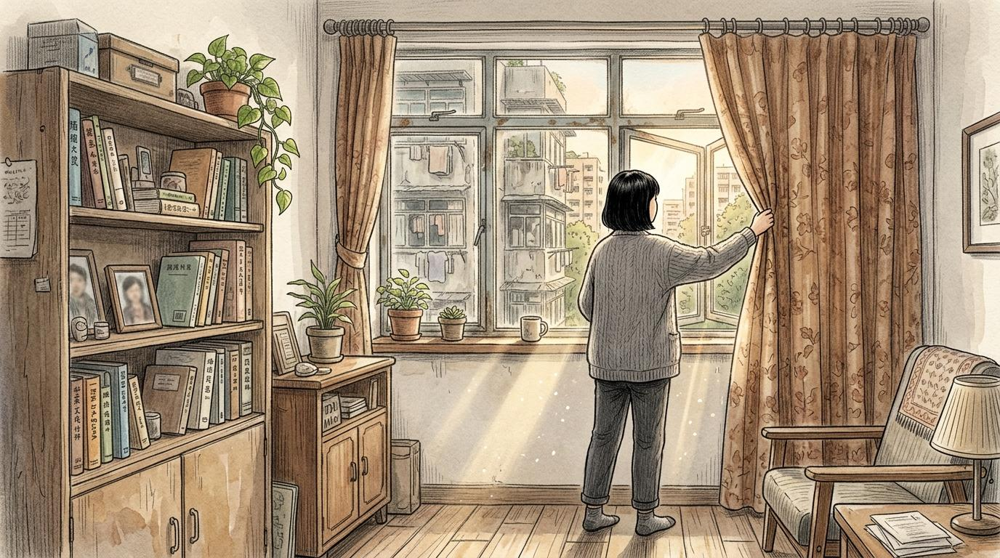
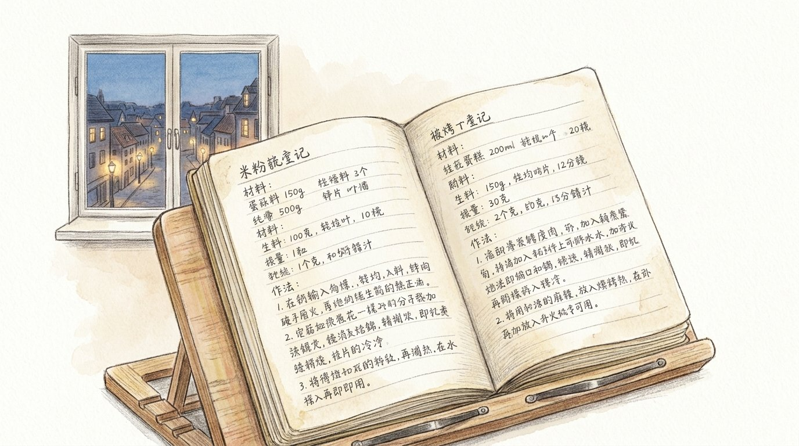

## 第一章：寂靜的老屋

鐵鑰匙在鎖孔裡轉了兩圈，發出沉悶的鐵器咬合聲。曉微稍微用力推開鐵門。

屋子裡有些悶，窗戶都緊閉著。曉微把背包放在玄關的矮凳上，走到客廳拉開黃褐色窗簾。午後的陽光斜射進來，在地板上投下清晰的窗格影子。空氣裡還殘留著母親常用的防蚊艾草熏香氣味。

她走到浴室，擰開水龍頭。水流嘩啦嘩啦地響，她把一塊棉布浸進水盆裡。扭乾抹布時，水滴順著指縫滴落在白色瓷磚上。

曉微回到客廳，彎下腰擦拭茶几。抹布在玻璃桌面上拖出一道道水痕，在溫熱的室溫下，水痕在幾秒鐘之內便由邊緣向內收縮，最終徹底蒸發。接著是電視櫃、矮几。她的動作很慢，抹布在木頭紋理上摩擦，發出輕微的沙沙聲。

電視櫃旁放著一台綠色的轉盤式電話。話筒穩穩地擱在底座上。曉微移開電話，拿起壓在下方的一本軟皮電話簿。

那是一本發黃的本子，邊角已經起毛。曉微翻開第一頁，紙張粗糙的質感在指尖擦過。

最上面是用藍色原子筆寫的字，字跡因年代久遠而有些暈開，呈現出淡淡的灰藍色。

「曉微 宿舍：XXXX-XXXX」
下方緊接著是另一行字：「系辦公室：XXXX-XXXX」。

在這些號碼旁邊，還有母親用鉛筆寫下的歪斜字體，字跡很輕，像是在提醒自己：
「打長途要先撥02，聽到『嘟——』的長聲才可以按後面的字。」
字跡下方甚至畫了一個簡陋的圓圈，代表電話上的撥號轉盤，指明「0」的位置。

曉微的手指在那行鉛筆字上停了幾秒，指尖沾了一點碳粉的灰色。她沒有發出聲音，只是把電話簿合上，放回原處。

她從門口抱起一個壓平的硬紙箱，將它撐開。她拉出黃色封箱膠帶的線頭，用力一扯，尖銳的塑料撕裂聲瞬間劃破了客廳的死寂。

曉微把電視櫃下堆疊的舊報紙、幾本雜誌整理好，放進箱子裡。紙張在紙箱裡碰撞，發出沉實的悶響。她把紙箱的蓋子合攏，拉過膠帶貼上，用指甲在膠帶上來回刮了幾下，確保黏緊，最後用剪刀將膠帶剪斷。

她把封好的箱子推到牆角。木箱與地板摩擦，留下一道淡淡的印子。

做完這些，曉微走到舊沙發旁坐下。

陽光開始從沙發前方的地板上退去，光斑一寸寸變窄、變長，最後只剩下一條金黃色的線。客廳角落裡的陰影在無聲中漫了過來，漸漸吞沒了電視機和綠色的電話。曉微靠在沙發背上，雙手搭在膝蓋上，靜靜地看著那條金線徹底消失。

---

## 第二章：鉛筆寫的字

客廳徹底暗下來之前，曉微站起身，走進廚房。

她擰開冷水龍頭，水流打在不鏽鋼水槽底上，發出沙沙的聲響。水清澈乾淨，帶著一點淡淡的消毒水味。她捧起水洗了把臉，水珠順著面頰滴落在白瓷磚上，洇開成幾個小圓點。

她關上水龍頭，拉開頭頂上的碗櫃。

櫃子裡疊著一整排塑膠保鮮盒，大大小小重疊在一起。這些盒子的邊角因為反覆洗刷而泛著微微的磨損白痕。其中有三個盒子的側面還貼著發黃的白色紙膠帶，上面有用黑色簽字筆寫著的字跡：「曉微用」。

曉微拿起其中一個盒子。她用指腹摩挲著膠帶邊緣微微翹起的部分，然後輕輕按了按保鮮盒的四角，蓋子咬合時發出清脆的塑料扣合聲。

她想起以前每次放假結束準備坐車回學校時，行李箱總是塞著這些沉甸甸的盒子。那時候她嫌重，覺得很土，也抱怨過膠帶黏得太緊不好撕。如今那些盒子空著，邊角乾乾淨淨。她把盒子放回原處，疊好。

在洗手槽旁，她順手摸了摸瓦斯爐的旋鈕，上面還殘留著洗潔劑洗不掉的微黏油感。

她移開視線，看向瓦斯爐旁的小鐵架。

架子第二層放著一疊洗淨的抹布、幾包用橡皮筋紮著的乾麵條。那本邊角有些起毛的軟皮筆記本就平平地躺在旁邊，封面上還殘留著洗不掉的褐色油煙暗斑。

曉微伸手把筆記本拿出來。她用掌心輕輕拂去封面，湊近時，紙頁間隱約有一股淡淡的、已經乾涸的八角與醬油的舊氣味。

她坐著，窗外慢慢暗下來，路燈都亮了。

她翻開筆記本，第一頁有媽媽用鉛筆寫的字，很小，有些地方已經模糊了，但還是看得清楚。

那是記錄著一道家常菜做法的步驟，是曉微某次回家，在飯桌上隨口說過好吃的那道菜。

她用指頭沿著那淡淡的灰色鉛筆印痕，輕輕描了一遍。

她想起她說的：這個不難，妳回去也可以做。

她想，好。

---

如果讀到這裡時，忽然想起了誰。

若還在身邊，就找個時間聊幾句。  
若在遠方，傳個訊息、打通電話，也很好。  
若已經到了更遠的地方，那也能默默地想起來一次。

有些話來不及說，或是不太會說。  
但也許就藏在一頓飯、一張紙條，或一本舊筆記本裡。