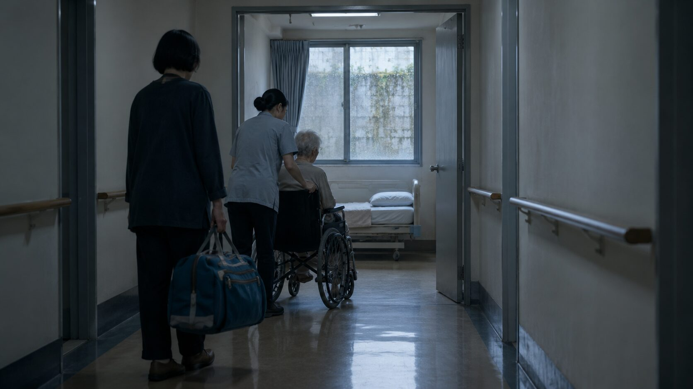
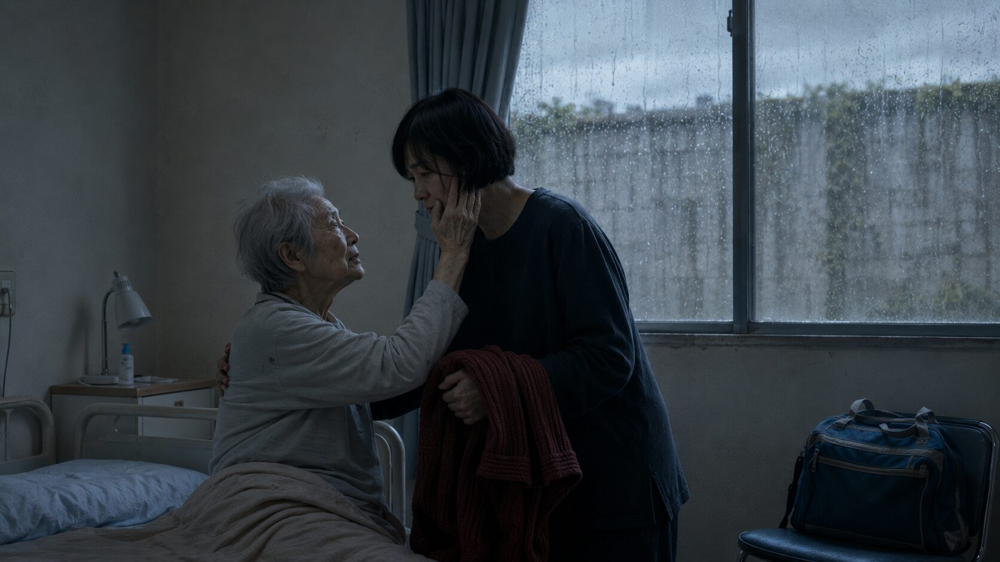
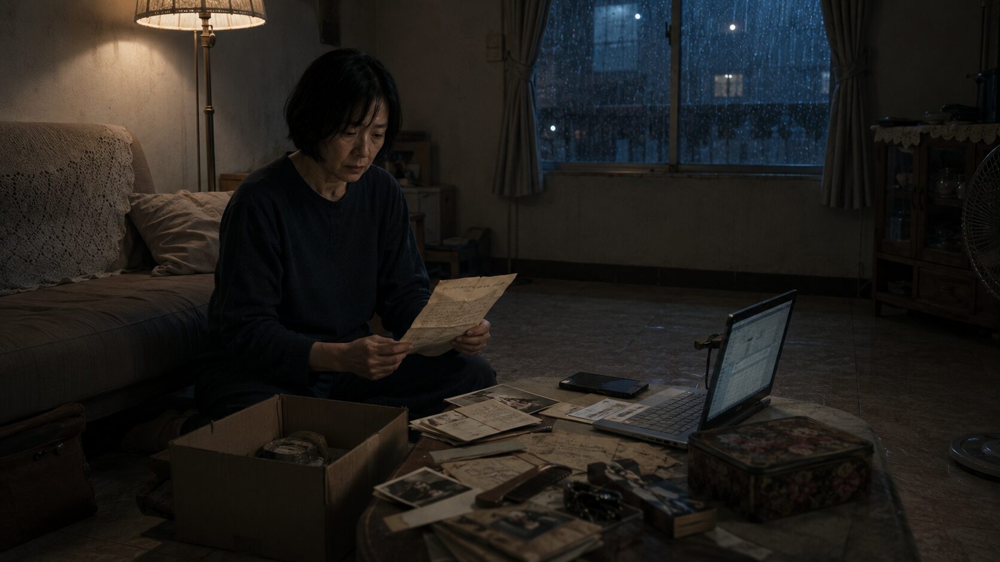
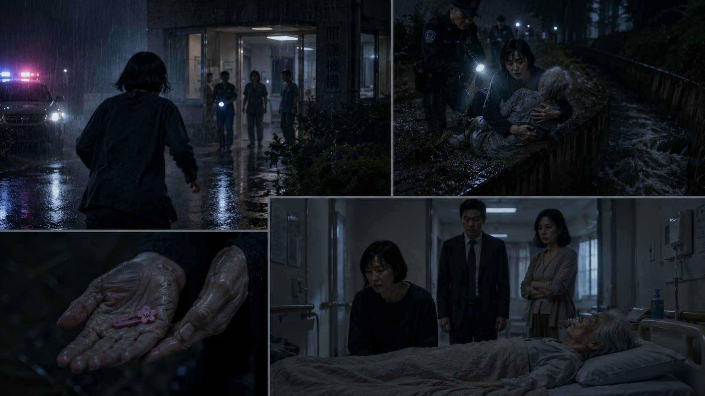
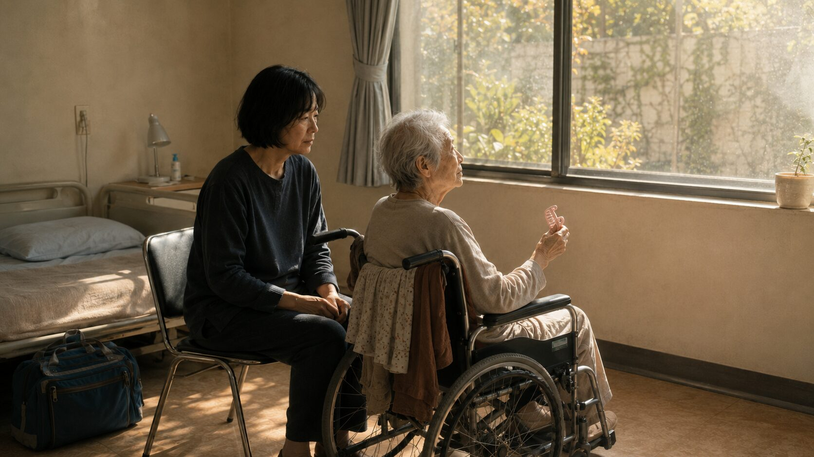

## 第一章：向北的房間

簽字筆在三聯單的複寫紙上畫下最後一筆時，發出沙沙的乾澀聲響。

何曼把筆還給櫃檯的行政人員，轉身看著停在走廊上的輪椅。母親坐在灰色防滑坐墊裡，肩膀垮著，頭微微往右傾斜，銀白稀疏的頭髮沒精打采地貼在頭皮上。她的雙手擱在膝頭的棉被裡，手指神經質地捏著棉被的一角，指甲縫裡還殘留著早晨出門前剝橘子的黃色汁液痕跡。何曼下意識地揉了揉自己的大拇指指腹，那裡彷彿還殘留著早晨幫母親更換尿布時，黏貼膠帶殘留的微弱黏性，以及老人身上那股混雜著藥油與微熱體溫的乾癟氣味。

護理技術員推著輪椅，輪子在亮得發光的塑膠地板上發出沉悶的低鳴。何曼跟在後面，提著那個裝滿了母親舊衣服的藍色旅行袋，走進了一樓走廊盡頭的房間。

這是她挑選的、向北的房間。

因為預算限制，向北的房間比向南的每個月便宜了整整九千元。窗外是一道高聳的灰色防爆牆，牆上長滿了斑駁的青苔。陽光永遠照不進來，即便在正午，屋裡也瀰漫著一股陰涼的霉味。牆壁上刷著過於潔白的防霉漆，在北向天光的照射下顯得有些慘白。

技術員熟練地將母親抱上窄小的單人床，拉起護欄。「何小姐，如果沒有其他問題，您就可以去大廳辦理入住最後的確認了。」

「好，謝謝。」何曼應了一聲。

她站在床邊，看著母親那雙渾濁的眼睛漫無目的地盯著天花板。母親的喉嚨裡發出微弱的咕嚕聲，像是想說什麼，卻最終只是偏過頭，望向窗外那面陰冷的高牆。何曼的胸口像壓了一塊濕漉漉的棉花，沉重得讓她無法呼吸。她感到一陣深刻的愧疚——她把操勞了一生的母親，送進了這個永遠沒有陽光的角落。但與此同時，一股更深沉的、近乎殘忍的解脫感從心底最深處升起。

這十年間，她被困在老家公寓裡，日夜聽著母親因為失智而產生的啼哭、咒罵與無休止的懷疑，她覺得自己已經快要瘋了。把母親送進這裡，她終於能睡一個完整的覺。

這間向北的冷冰冰的房間，是她用母親的餘生，為自己換取的喘息之所。

## 第二章：沒有列進去的帳

何曼沒想到，住進機構的三天後，弟妹就約她再次見面。

那天早晨的日光被厚重的雲層濾成一片鉛灰，風從北邊的空地吹過來，帶著一股即將下雨的潮濕與泥土味。何曼剛幫母親整理好抽屜，走出房間，就看見何嶺與何蘋已經在會客室坐著了。

會客室設在走廊盡頭，窗戶同樣朝北。天空陰沉沉的，室內沒有開燈，只有走廊的日光燈管漏進來幾縷慘白的光。桌上放著幾份影印的財產清冊和房屋鑑價報告，紙張邊緣微微捲起。

「大姊，坐吧。」何嶺按了按原子筆的按鈕，發出清脆的「喀噠」聲。他在銀行上班，談起數字時總是帶著一種公事公辦的冷靜，「我們算過了，媽在這裡一個月的開銷，加上紙尿褲、看護墊和零用金，一年起碼要六十萬。老家那間公寓雖然舊，但因為靠近捷運站，開價一千二的話，應該能拿到一筆不錯的現金。這筆錢放進信託，夠媽在這裡住上十幾年。」

何曼坐了下來，視線落在那些表格上。她的目光在幾行手寫的數字間來回移動，心口像被什麼東西重重撞了一下。她指尖有些發涼，捏著皮包的帶子，深吸了一口氣，聲音極力放得平穩，卻仍帶了一絲不易察覺的顫抖：「這份清單上，是不是漏了什麼？過去這三年，媽進出醫院急診六次，兩次住院的手術費、看護費，還有每個月固定拿的自費藥，這些都是我先刷卡墊的。一共是四十二萬八千。我之前把收據都拍給你們了，這裡怎麼沒有列進去？」

何蘋在旁邊一邊剝著指甲邊的死皮，一邊輕聲笑了笑，聲音裡帶著幾分黏糊的敷衍：「大姊，現在是在談媽以後的安置費，那些過去的帳，大家一家人，計較得那麼清楚，多傷感情。再說，妳這幾年住在家裡，房租、水電也都是媽的退休金在付，真要算起來，這帳哪裡算得完？」

「媽的退休金一個月只有一萬八，光是她的伙食和吃藥都不夠，水電費一直是我帳戶自動扣款的……」何曼急切地想把皮包裡的記帳本拿出來，拉鍊拉到一半，手卻在何嶺不耐煩的目光下僵住了。

何嶺抓了抓稀疏的頭髮，打斷了她：「大姊，妳也體諒一下我們的處境。我每個月房貸、車貸，還有兩個小孩上雙語私立學校的學費，薪水一進帳就空了。分行這幾年裁員風聲不斷，我每天在主管面前裝孫子，頭髮都快掉光了。妳沒有家庭，一個人吃飽全家飽，過去多付一點，就當是幫媽盡孝心。我們現在最重要的事是把房子賣了，不然下個月的月費誰來出？」

「二哥說得對，大姊，妳別擺出一副只有妳最委屈的樣子。」何蘋拍了拍何曼的手背，聲音有些發冷，「前年妳生病住院那一週，我把媽接到我家住，結果呢？媽半夜起來鬧，把我婆婆驚醒不說，還差點把廚房燒了。隔天妳出院，第一件事不是謝謝我，而是當著媽的面把我痛罵一頓，說我沒給她按時吃藥、衣服穿錯了。在妳眼裡，只有妳的照顧才是對的，我們做什麼都是錯。妳這種強烈的控制欲，早就把我們推開了，現在倒過來怪我們不出力？妳既然想把什麼都抓在手裡，我們想幫忙也插不上手啊。」

會客室裡一瞬間只剩下日光燈管微弱的嗡嗡聲。何曼把手從何蘋的手掌下抽了回來，放在膝蓋上，死死地揪著自己的裙角。她想反駁，想告訴她們母親發病時連洗澡都會打人，想說她根本沒有力氣送母親去上什麼課。可是看著眼前這兩張理所當然的臉，那股衝到嘴邊的話又被生生壓了回去，化成胃裡一陣翻攪的酸澀。

何嶺看了看錶，拉了拉西裝袖口，開始動手收桌上的報告：「那就先這樣吧，我等等還要回分行開會。大姊，房仲那邊我會先聯絡，委託書下週拿給妳簽。」

何蘋跟著站起身，一邊從包包裡拿出防曬外套套上，一邊對何嶺低聲說：「你順路送我到捷運站吧，今天阿偉安親班半天，我要趕著回去煮飯。」

「大姊，那我們先走了。」何嶺提起公事包，拍了拍褲子上的摺痕，腳步聲在空曠的走廊上顯得格外響亮。何蘋跟在後面，高跟鞋在地磚上敲出急促的碎響，兩人低聲商量著晚上的行程，聲音漸漸消失在轉角。

何曼獨自坐在沙發上，看著空無一物的茶几。指甲掐進大拇指的軟肉裡，有些發白。

過了好一會兒，她才提起那個巨大的藍色旅行袋，慢吞吞地穿過狹窄的走廊，來到母親的房間。北向的房間即使在下午也顯得昏暗，空氣裡飄散著淡淡的消毒水與尿騷味。母親躺在床上，雙眼盯著天花板，嘴唇微微張合。

何曼把旅行袋放在椅子上，拉開拉鍊，將裡面洗得發軟的舊衣服一件件拿出來。這些都是母親穿慣了的純棉開襟衫，上面還殘留著家裡慣用的柔軟精味道。

「控制欲。」

何蘋剛才說的話像一枚尖銳的小釘子，突兀地卡在何曼的腦子裡。每當她折疊起一件衣服，那三個字就跟著在太陽穴裡跳動一下。她不明白，自己這十年的退讓與困守，怎麼在妹妹嘴裡，就成了一種不願放手的霸佔。

她提起一件暗紅色的針織衫，走到床邊，輕聲喚道：「媽，我幫妳帶衣服來了。」

母親沒有反應。何曼伸手扶起母親單薄的肩膀，想幫她翻個身。就在她的手碰到母親肩膀的那一刻，母親的身子突然微微一震。那雙原本渾濁、焦距散亂的眼睛，突然定定地落在了何曼的臉上。

那眼神裡沒有平日的驚恐與迷茫，反而亮得有些刺人。

「阿曼？」母親的聲音沙啞。

何曼的肩膀僵住，手掌貼在母親溫熱而瘦骨嶙峋的背部，感覺到衣物下肋骨的起伏。

母親看著她，眉頭微微皺起。那隻枯乾如柴的手，慢慢從被子裡探出來，摸了摸何曼臉頰旁散落的幾縷白髮，輕聲問道：

「妳怎麼在這裡？今天不用去公司嗎？妳為什麼還不回去上班？」

何曼的手指在暗紅色針織衫的布料上猛地攥緊，指甲陷進棉線的縫隙裡。

母親的眼神只清醒了十幾秒。很快地，那抹光亮又熄滅了下去，眼睛重新變得空洞，轉頭看向窗外，指著灰濛濛的天空咕噥著：「水……水要流過來了……」

何曼維持著扶著母親的姿勢，手裡的舊針織衫被抓得變了形。窗外，烏雲終於支撐不住，細密的雨絲開始無聲地撞擊在朝北的窗玻璃上，留下一道道冰涼而曲折的水痕。

## 第三章：家裡需要有人留下

雨在黃昏時分徹底落了下來。

何曼回到老家時，屋子裡一片漆黑。十幾年來，她習慣了進門第一件事就是開燈、喊一聲「媽」，然後在玄關換鞋時側耳傾聽客房裡有沒有動靜。而現在，玄關只有她脫下的濕皮鞋，軟塌塌地倒在腳踏墊上。

客廳裡瀰漫著一股霉味與未燃盡的香灰氣息。自從三天前把母親送走，這間公寓就顯得太空、太大，家具的輪廓在黑暗中像是一隻隻蹲伏的巨獸。

何曼沒有開大燈，只扭開了客廳角落的一盞立燈。橘黃色的光暈照亮了沙發旁的一疊舊報紙和一個紙箱。那是她下午從母親房裡整理出來的雜物，本來打算直接丟掉，但最後還是提了回來。

她坐在地板上，雙腿因為長時間的站立與緊繃而微微發麻。她木然地將紙箱裡的物件一件件拿出來：母親用了大半輩子的木梳、斷了齒的髮夾、幾本邊角破損的通訊錄，還有幾張早就失效的定期存款單。

在箱子最底部，壓著一個用紅色橡皮圈箍著的鐵盒。鐵盒是舊式的喜餅禮盒，上面的牡丹花圖案已經生鏽剝落。何曼把橡皮圈取下，橡皮圈已經老化，在她指尖「啪」的一聲斷成兩截。

鐵盒裡裝著一些發黃的信件和單據。大部分是父親在世時的醫療收據，還有幾封字跡僥草的信。何曼抖開了其中一封信，那是父親的字跡，用的是藍色原子筆，寫在早已停產的格子信紙上。

信的日期是二十五年前，正是父親離家出走的那一年。

信是寫給母親的，但顯然沒有寄出去，或者被母親收了起來。

「……阿玉，我實在過不下去了。這個家像口井，每天睜開眼就是算不完的債和吵不完的架。我要走，但我帶不走三個孩子。我想帶走阿曼，她大一點，懂事，能幫我做點事，我也能照顧她。但妳不肯。妳說阿曼是長女，家裡需要有人留下。妳說弟弟妹妹還小，如果我把阿曼帶走，妳一個人撐不住這個家。

妳留下了她，可妳看看妳是怎麼對她的？妳把她當成妳的拐杖，妳的盾牌。我走了，她就成了這個家裡的另一個我。阿玉，妳不是需要一個女兒，妳只是需要一個人留下來陪妳一起爛在泥潭裡……」

信紙在何曼的指尖發出乾裂的沙沙聲。

窗外的雨聲突然變得極大，劈劈啪啪地打在陽台的鐵皮雨遮上。

何曼捏著信紙，整個人像是被釘在原地。她盯著那行「家裡需要有人留下」，紙面上的格子在昏黃的燈光下微微晃動。

原來不是她選擇留下來的。

原來，那不是愛，也不是依賴。那是母親在父親走後，為自己打造的另一根拐杖。

但讀完這封信後，何曼沒有立刻爆發。她看著桌上那堆凌亂的單據，深吸了一口氣，決定試著像以前一樣，用溫和理性的方式與弟妹溝通。

她打開筆記型電腦，將這三年來一筆筆記在帳本上的醫療收據整理進 Excel 表格。看著最後滾出來的那筆龐大卡債與信用貸款數字，她的胸口像壓著一塊鐵。她小心翼翼地把表格和收據的照片發進了三人的家庭群組，並打下一段文字：

「阿嶺，阿蘋，這是我整理的媽過去三年的醫療與看護墊明細，一共是四十二萬八千元。我現在手頭真的很緊，信用卡額度已經快刷爆了。我知道大家最近開銷都大，但能不能先幫忙分攤一部分？我們一起想辦法解決。」

發送成功後，何曼盯著螢幕，心跳有些急促。

十分鐘後，何嶺在群組裡回覆了：「大姊，現在大家都難，別老發這些製造焦慮。老家的房子早點配合簽字賣了，不就什麼都解決了？」

緊接著，是何蘋傳來的語音訊息，語氣裡帶著不耐煩與防衛：「大姊，二哥說得對，妳現在一筆一筆算得這麼清楚，那我們以前回老家帶的水果、補品，是不是也要折成現金算給妳？大家都是一家人，妳這樣真的讓人壓力很大。」

何曼看著螢幕上的字句，手指在鍵盤上懸空了很久，最終，她感覺到大腦裡有根緊繃的弦「啪」的一聲斷了。長久以來的隱忍、妥協和委屈在這一瞬間被這冷冰冰的回覆徹底撕碎。她盯著那封父親二十五年前寫的信，又看著自己滿是卡債警告的帳戶，眼神逐漸冷了下來。

她把那封信拍照存檔，連同整理好的 PDF 帳目，一起發到了群組。

接著，她拿起手機，直接撥給了何嶺。

電話響了很久，終於接通了，何嶺不耐煩的聲音傳來：「大姊？我現在在開會，有什麼急事嗎？」

「何嶺。」何曼的聲音有些發乾，但每一個字都無比清晰，「老家的房子我不賣了。除非，賣掉的錢，必須先扣除我這幾年墊付的四十二萬八千元醫療費。剩下的，我們三個人平分。媽以後在機構的費用，三個人平分，一人一萬二。下週開始，每週六輪到你或何蘋去探視，我只負責週日。」

「大姊，妳在說什麼胡話？」何嶺的聲音沉了下來，「我們昨天不是都說好了？爸媽的房子本來就是要留給媽當養老金的，妳現在要分走一部分，媽以後的錢不夠用怎麼辦？而且我和阿蘋都有家庭，時間哪有妳那麼自由？」

「我的時間不自由，我只是沒有家庭。」何曼冷冷地打斷他，「信和付款證明我已經發到群組了。如果你們不同意分攤，我明天就會去法院申請撫養費裁決。我沒在開玩笑。」

「何曼！妳是不是瘋了？」何嶺的聲音猛地拔高，帶著被冒犯的憤怒，「大家一家人，妳竟然要鬧到法院去？」

何曼直接按了紅色的掛斷鍵。

不到兩分鐘，何蘋的電話打了進來。何曼直接切斷。隨後群組裡跳出何蘋尖銳而帶著哭腔的語音：「大姊，妳怎麼能這樣威脅我們？媽病了這幾年，我們難道沒有盡孝心嗎？妳現在拿爸以前不要我們的信來要挾，妳到底要把這個家拆到什麼地步才甘心？」

何嶺則傳來一行字：「房仲那邊我先暫停。既然大姊要算帳，那我們找律師談。」

隨後，何曼的手機徹底安靜了下來。她試著再撥過去，電話響了兩聲便被直接掛斷。

她們開始避接她的電話。何曼站在漆黑的客廳裡，聽著北邊窗外漸漸變大的雨聲，胃裡翻江倒海地難受。

## 第四章：北邊的水

雨下得又急又密，把夜色沖刷得更加黏稠。

何曼接到機構電話時，剛過半夜十二點。電話那頭的護理長聲音緊繃，夾雜著走廊上混亂的腳步聲與呼喊：「何小姐，妳母親不見了！十點查房時人還在，剛才巡房，發現床是空的。我們已經報警，監視器拍到她往北邊的後門出去了……」

「後門？後門不是有感應鎖嗎？」何曼的心猛地提到嗓子眼。

「今天晚上有大批成人紙尿褲和看護墊送達，物流人員為了搬運方便，把後門推開了一道縫。後勤大夜班人員疏忽了，沒有立刻關上。監視器的紅外線感應器在十點十五分就拍到了人影，但值班安全人員當時在睡覺，直到剛才十一點半大夜班交接查房，才發現人丟了！」

何曼甚至不記得自己是怎麼套上外套、怎麼衝下樓招計程車的。

雨夜的照護機構外拉起了一道道微弱的手電筒光束。警車的藍紅警示燈無聲地在黑暗中旋轉，將周遭的雨絲染得一片詭異。何曼推開車門衝進雨裡。

她甚至顧不得護理長的阻攔，轉身就往機構北側的那條小路跑去。那裡是一片尚未開發的荒地，荒地邊緣緊鄰著一條水泥砌成的灌溉排水溝。老家北側的那條溝渠，早已在都市更新中被填平，但母親記憶裡的那條水溝顯然還活著。

泥濘的草地讓她滑倒了一次，膝蓋重重撞在石頭上，她手腳並用地爬起來。

「找到了！在這裡！」遠處傳來警察的呼喊。

何曼衝過去。手電筒的光暈下，母親單薄的身軀正縮在一棵枯木旁，半個身子幾乎懸在排水溝的護欄外。暴雨將她稀疏的銀髮黏在臉上。她渾身發抖，雙眼空洞地盯著下方湍急的黑色水流，嘴裡細碎地念叨著：「水要流過來了……收衣服……阿曼還沒回來……阿玉……」

這是一段被埋在失智症底層的記憶。三十年前，老家北邊的灌溉溝渠曾在颱風天暴漲，當時年幼的何曼還沒放學，母親曾在暴雨中慌亂地沿著水溝尋找她。

「媽！」何曼喉嚨嘶啞地喊了一聲。

在警察和醫護人員合力拉住母親的瞬間，何曼衝上去，伸手抱住了母親冷冰冰的身軀。母親沒有掙扎，只是像個脫水的木偶般任由她抱著。

當她們把母親抬上擔架時，何曼注意到母親的右手一直死死捏著拳頭。她輕輕掰開母親凍得發青的手指。

掌心裡，是一枚老舊的粉紅色塑料小髮夾，上面的小花圖案早已磨損褪色。那是何曼小時候，父親在夜市買給她的。她都忘了自己什麼時候丟了它，卻沒想到一直被母親收在衣櫃最深處的角落裡。

回到機構時，天已經快亮了。

何嶺與何蘋在凌晨三點多趕到。何蘋一進門就紅著眼眶抱怨機構的安全防護有漏洞，何嶺則鐵青著臉跟護理長交涉，威脅要打官司。

「大姊，這家機構的管理顯然有問題，我們會要她們賠償。」何嶺走過來，壓低聲音說，「另外，房子的事，我們還是要坐下來談，妳不能意氣用事……」

「我不怪她們。」何曼平靜地打斷何嶺。她的聲音很輕，卻帶著一種前所未有的冷硬。

「今天中午，幫媽辦轉房。」何曼看著病床上安靜的母親，「轉到三樓向南的那間單人房。那一間陽光好，下午曬得到太陽。」

「那一間一個月要五萬二！」何嶺眉頭緊鎖，「我們原先的預算只有三萬六，多出來的一萬六誰出？老家不賣，根本撐不下去！」

「房子賣。」何曼直視著何嶺的眼睛，「委託書我今天就會簽。但我說過，賣掉的錢，先扣除我墊付的四十二萬八千。剩下的平分。媽以後每個月五萬二的費用，除以三，每人一萬七千多。你們答應，我們就去公證；如果不答應，我今天就去法院。」

何嶺與何蘋對視了一眼，臉色陰沉得可怕。

## 第五章：向南的陽光

賣房的過程並不像何曼預想的那般順利。

委託書送出後的第三天，何曼就收到了何嶺委託銀行法務律師寄來的律師函。信函中聲稱，何曼過去二十年與母親共同居住於老家公寓，並未使用市場租金，若要追討代墊之醫療費，應先扣除這二十年來「相當於租金之利益」。

接到律師函的那天，何曼看著那行冰冷的字句，手在桌上微微顫抖。

但這一次，她沒有退縮。她前往法律扶助基金會諮詢了律師，並翻出了自己這二十年來帳戶自動扣款的水電、瓦斯、房屋稅單，以及母親生前多次簽名同意她無償居住以方便照料的記帳本字跡。

兩週後，在公證處召開的調解會上，氣氛緊繃得像拉滿的弓。

「大姊，這四十二萬八千裡，有幾筆去急診的計程車費和自費營養品，根本沒有醫療收據憑證。」何嶺坐在桌對面，拿著明細，眼神冰冷，「在法律上，這些不能算是代墊撫養費用，頂多是妳個人贈與。」

「那是我帶媽去醫院急診的交通費，每一筆我都記在帳本上。」何曼平靜地看著他，聲音很低，但無比堅定，「如果這點錢你們也要算，那我們就走訴訟。我可以申請法院暫時處分，凍結老家公寓的產權交易。反正我手頭已經這樣了，我不急著用錢。但阿嶺，我記得你的二胎房貸下個月就要到期了吧？阿蘋，妳兒子私立學校的下學期註冊費，是不是也等著這筆錢？」

何嶺的臉色瞬間變得鐵青，咬著牙不說話。何蘋則在一旁不安地動了動身體，小聲對何嶺嘀咕了幾句。

她們知道何曼已經不是以前那個可以隨意拿捏的大姊了。如果真的走上法庭，產權被凍結，這場官司打上一年半載，她們根本拖不起。

最終，在公證人的見證下，她們簽署了正式的公證協議：房屋賣得的款項扣除仲介費後，優先償還何曼代墊之四十二萬八千元，餘款由三人平分；母親之每月機構費用五萬二千元，由三人按月等額匯入專戶。

老家公寓在簽約後的一個月順利過戶。

款項撥下來的那天，何曼站在銀行大廳，看著帳戶裡多出來的數字。

她立刻在櫃檯將四十二萬八千元轉入了另一個私人戶頭，並撥通了信用卡客服的電話，將這幾年為了照護母親而滾出來的卡債與信用貸款一次性全部結清。

電話掛斷的那一刻，手機連續震動，跳出一條條餘額歸零的通知。

何曼長長地舒了一口氣。她走出銀行，午後的陽光有些刺眼，但她感覺到肩膀上那股壓了十幾年的無形重擔，終於在這一瞬間消散了。她的身體變得無比輕盈，甚至有些陌生。

她坐捷運回到機構。

三樓的向南房間此時正灑滿了午後的陽光。橘黃色的光線溫暖地鋪在木質地板上，空氣裡少了一絲消毒水的冷冽，多了一絲暖烘烘的乾淨氣味。

母親坐在陽光裡的輪椅上，手裡依舊捏著那個粉紅色的塑料髮夾。她的眼睛看著窗外街道上往來的車輛，臉上的神情安詳而遲鈍。

「媽。」何曼走過去，在旁邊的靠背椅上坐下。

母親沒有轉頭，也沒有認出她，只是用那隻枯乾的手指，無意識地撥弄著髮夾上的塑料花瓣。

何曼看著母親。她知道母親可能再也不會清醒過來問她為什麼不去上班，也知道何嶺與何蘋此後大概只會把她當成每個月催繳月費的債權人，群組裡除了每月的對帳單外再無其他對話。但這一切似乎都不再那麼重要了。

她靠在椅背上，閉上眼睛，任由溫熱的陽光照在自己的臉上。

以前在向北的房間裡，她總是看著錶，心裡盤算著菜市場的關門時間、燉湯的火候，以及母親隨時可能爆發的焦躁。而現在，陽光暖洋洋地照著，她把手搭在扶手上，第一次沒有急著站起來，也沒有急著回家。

