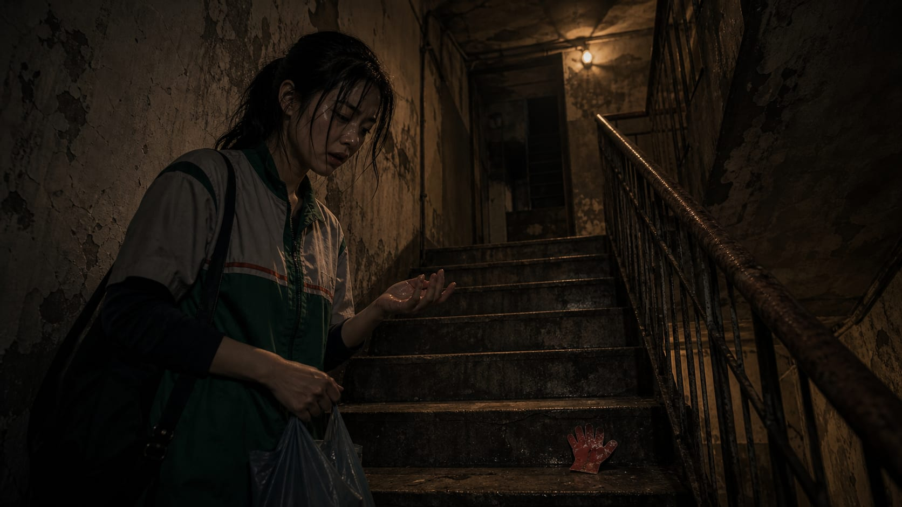
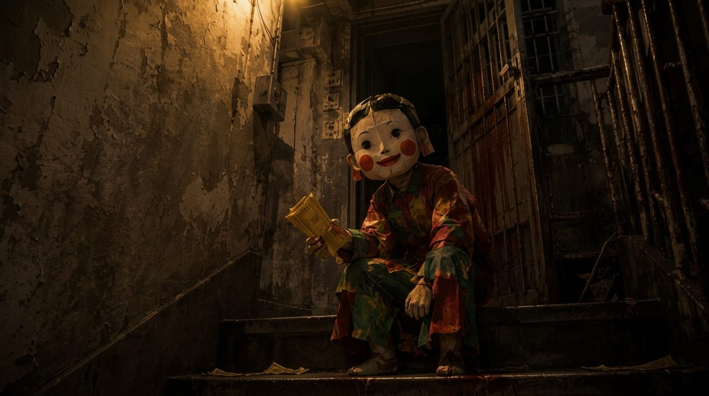
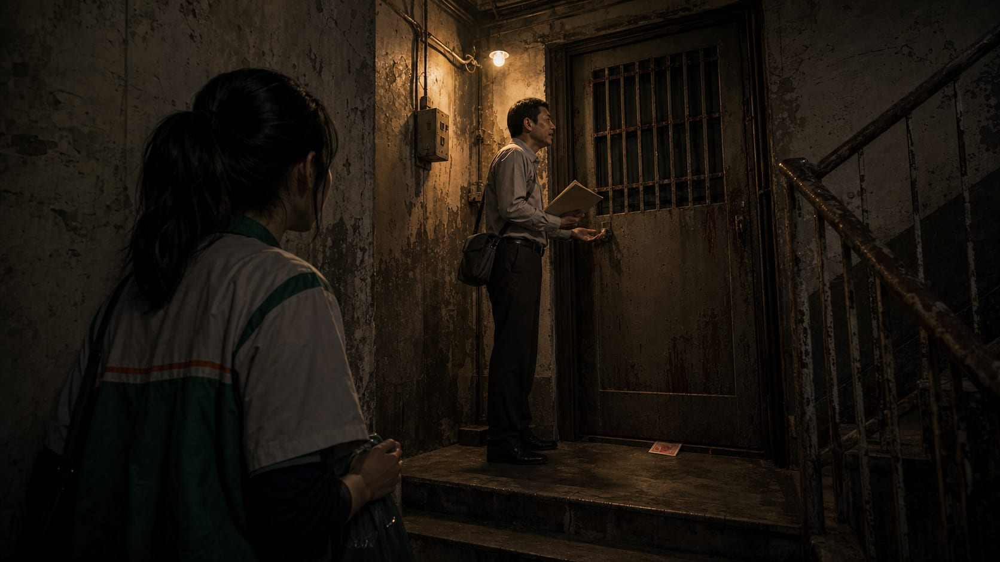
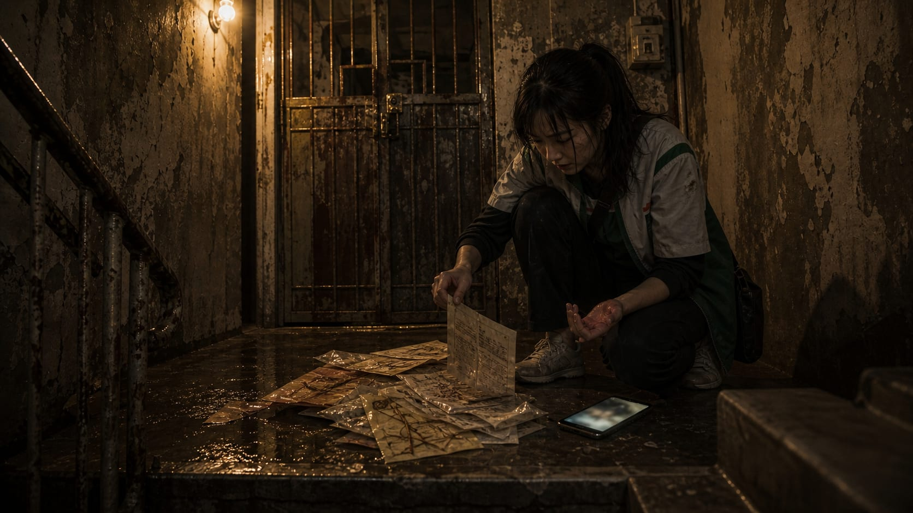
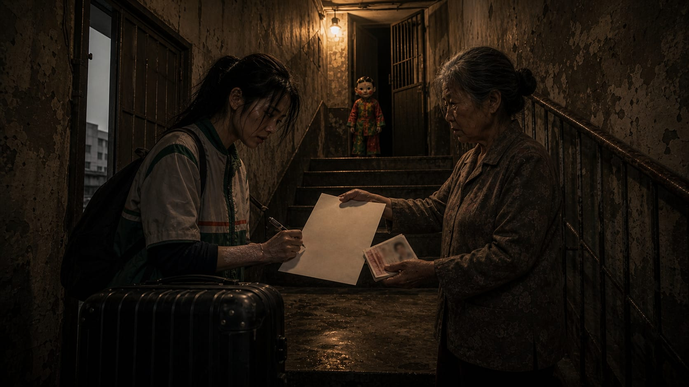

## 第一章：深夜的怪音與紅紙

周念揉了揉發脹的太陽穴，眼前的收銀機螢幕正閃爍著冷冰冰的綠光。便利商店的自動門每隔十幾分鐘就會「叮咚」一響，迎進冷清的夜風，隨後又歸於沉寂。身為夜班店員，她的生活被切割成無數個機械式的動作：刷條碼、找零、微波加熱。長期失眠讓她的視線邊緣總是帶著一層毛邊，像是一張洗不乾淨的舊照片。

清晨五點半，周念拖著灌了鉛似的雙腿回到租屋處。這是一棟屋齡將近四十年的五層老公寓，外牆的磁磚早已剝落大半，露出底下發黑的魚骨水泥。

她住在二樓。自從上週開始，三樓就陷入了一種奇特的忙碌。

每天凌晨三點左右，頭頂的木質地板就會傳來木凳在地上拖曳的「吱呀」聲，緊接著是沉重箱子落地的悶響。那聲音沉悶、緩慢，不像是活人搬家時的慌亂，反而像某種刻意放慢速度的儀式。

周念站在窄小的玄關，抬頭盯著發黃的油漆天花板。那聲音又來了，沉重的拖地聲，像是有人正拖著一具沒有關節的木偶，從客廳一端走到另一端。

「搬個家能搬一個禮拜？」周念低聲嘟囔。她上樓下樓無數次，卻從未在窄小的樓梯間遇見過這家新鄰居，甚至連一片掉落的打包膠帶或紙箱碎片都沒看見過。

但也有些微小而古怪的痕跡，開始悄無聲息地滲透進她的日常。

那天傍晚下樓上班時，周念的掌心剛扶上樓梯的鐵欄杆，便摸到了一抹黏濕的觸感。收回手一看，指尖黏著一層未乾的半透明麵糊，湊近一聞，散發著淡淡的生竹篾味與漿糊發酸的微酸氣味。

再往下走了兩階，她又在積灰的水泥踏階上，看見了一張剪得粗糙的紅色紙片。周念俯身撿起，發現那紙質極為乾硬，形狀歪歪扭扭，竟像是一隻嬰兒的手掌，五根短粗的手指朝空中張開。她皺了皺眉，以為是附近小孩的惡作劇，便隨手將它塞進口袋，沒再多想。

## 第二章：樓梯間的紙童子

隔天夜裡，周念提著一袋垃圾下樓準備丟棄。

樓梯間的黃色鎢絲燈泡因為電壓不穩而微微閃爍，將扶手的陰影拉得像一排瘦長的人肋骨。走到二樓與三樓交界平台時，她猛地煞住了腳步。

一個矮小的身影正蹲在水泥階梯上。

那是一個小孩，身上穿著大紅大綠的馬褂，顏色鮮豔得有些刺眼，但在昏暗的燈光下卻顯得無比乾癟。孩子背對著她，一動不動。

「小朋友，你怎麼一個人在這裡？」周念試探性地問了一句。

對方沒有回答，只是緩慢地將身體轉了過來。

周念的呼吸瞬間卡在喉嚨裡。

那根本不是一個活生生的小孩。它是一個紙紮的童子，紙張模糊的邊緣還帶著未乾的模糊糨糊痕跡。它的臉是用粉白色的粗糙紙張糊成的，腮幫子塗著兩團極其圓潤、甚至有些對稱得詭異的腮紅。那張嘴是用粗紅筆畫上去的，嘴角直直往上勾，裂開一個極大、極扁的笑容。

最讓周念毛骨悚然的，是它的眼睛。那雙眼睛是用黑墨水畫的兩個圓點，沒有瞳孔，卻直勾勾地對著周念。

更荒謬的是，這個紙紮小孩扁平的竹篾右手中，還死死捏著幾張印有「冥通銀行」字樣的黃色紙錢。

紙童子就這樣蹲在陰暗的台階上，一動不動，臉上的朱紅笑意在閃爍的燈光下顯得無比黏稠。

周念幾乎是連滾帶爬地衝回了二樓的租屋處。她死死抵住木門，聽著自己胸腔裡如擂鼓般的心跳，然而門外除了老舊公寓水管偶爾發出的「咕嚕」聲，再沒有其他動靜。

後半夜，她睜著眼在床上躺到天亮。清晨第一縷陽光穿透鐵窗時，她終於鼓起勇氣，手裡拿著一把美工刀，輕手輕腳地拉開門上樓查看。

台階上空無一人。那個大紅大綠的矮小身影不見了。

然而，在昨天紙童子下蹲的水泥踏階上，卻留下了幾點乾硬發白的漿糊痕跡，在水泥地上乾縮成幾片薄薄的死皮。在旁邊的欄杆縫隙裡，還卡著一角碎掉的黃色紙錢，上面隱約殘留著「銀行」兩個紅字。

這不是幻覺。

## 第三章：冷漠的鄰居與和諧

隔天下午，她頂著青黑的黑眼圈敲開了一樓房東太太的房門。房東太太正坐在沙發上剝著毛豆，電視裡播著無聊的八點檔。

「三樓啊？」房東太太連頭都沒抬，手指靈活地一擠，豆子便落入塑膠盆中發出清脆的聲響，「人家租約正常，押金付得比誰都痛快。我管人家長什麼樣子？現在景氣這麼差，按時給錢的就是好房客。周小姐，妳上夜班太累了，沒事別疑神疑鬼去打擾鄰居。」

周念張了張嘴，想說那根本不是長相奇特，那是紙紮人，但房東太太已經轉過身去，顯然不想再談。

更讓周念感到荒謬的是四樓的住戶。

四樓住著一個在附近開國中數學補習班的陳老師。那天傍晚，周念出門上班時，剛好在樓梯間遇見陳老師。他手裡拿著幾份考卷，正熱情地對著三樓緊閉的鐵門說話：「小明媽媽，這本講義先拿給孩子看。這孩子真的很乖，上課從不吵鬧，安靜得像不存在一樣。現在這種專心的孩子不多了，下週的補習費再麻煩您了。」

三樓的鐵門沒有開，但門縫底下塞出了一張紅色的百元鈔票。陳老師熟練地撿起鈔票放進口袋，朝著鐵門微微彎腰，臉上掛著客氣而滿意的笑容。

周念站在樓梯轉角，看著陳老師轉身下樓。她忍不住拉住他，聲音壓得極低：「陳老師，你剛剛是在跟……誰說話？」

陳老師有些詫異地看著她：「三樓的家長啊。一位戴眼鏡的女士，人挺客氣的，她孩子就站在她身後，穿著件紅綠相間的外套。怎麼了？周小姐，鄰里之間要多點包容。」

周念全身的血流彷彿瞬間凍結。戴眼鏡的女士？穿著紅綠外套的孩子？

可她剛剛分明只看見一扇緊閉的鐵門，以及門縫裡塞出的一角乾癟紙片。

這棟樓的人都被某種古怪的障眼法矇住了雙眼，還是因為她長期失眠、氣火低落，才得以剝開這層偽裝，看見紙紮的骨架？

半個月過去了，三樓成了這棟老公寓裡最受歡迎的鄰居。他們按時交管理費，從不製造噪音，鄰居們提起三樓，臉上都掛著滿足的微笑。這座冷漠的公寓因為三樓的「懂事」，甚至多了一絲奇特的和諧。

## 第四章：地下室的祕密與反擊失敗

但周念卻一天比一天消瘦。她開始在公寓周圍尋找線索。

她先是在一樓的回收桶裡，發現了幾封被撕碎的催繳信，撕裂處竟然都被人用漿糊仔細地重新拼貼過，散發著酸澀的氣味。

接著，在一個週三的午後，她下班回樓時，看見房東太太拖著沉重的麻布袋往地下室走去。袋子裡發出竹篾碰撞的清脆乾癟聲，以及刺鼻的竹青味。周念放慢腳步，悄悄跟了下去。

地下室的木門沒有鎖緊，露出一條指寬的縫隙。裡面的日光燈發出刺耳的電流聲。

周念透過縫隙看過去，胃部頓時一陣痙攣。

陰暗潮濕的地下室裡，堆滿了乾枯的竹篾、鐵絲，以及一袋袋發霉的麵粉。正中央的木桌上，躺著一個用竹條紮好的人形骨架。而房東太太正站在桌旁，手裡捧著一個大鐵罐，用刷子將黏稠發酸的漿糊，一下又一下地刷在竹架上。

桌旁放著一個木箱，裡面塞滿了歷代退租房客留下的身份證影本、欠租催繳單，以及按了指紋的合約書。箱子上用紅漆噴著四個字：「三樓備料」。

房東太太邊刷邊低聲自語，語氣裡帶著滿意的笑意：「二樓那丫頭最近天天睡不好，看樣子也撐不了多久了……等她退租，剛好能用她的合約糊個更老實的，二樓也能多收一份租……」

周念嚇得死死咬住手背，才沒有叫出聲來。她踉踉蹌蹌地逃回二樓，鎖緊房門，整夜都不敢合眼。

直到一個大雨磅礴的清晨。

周念下班回來，雨水將公寓樓梯間的牆壁浸得潮濕發霉。走到三樓時，她注意到那扇鐵門依然緊閉，但門口卻堆放著幾個準備丟棄的廢紙堆。最上面的一張紙因為吸飽了濕氣，邊緣正微微捲起。

那是一張沾了糨糊的廢紙，上面隱約有手寫的字跡。

周念鬼使神差地蹲下身，伸手指將那張紙扯了出來。

紙張已經半濕，上面的糨糊還黏著幾根竹篾的碎屑。周念抹掉上面的灰塵，當看清上面的字時，她的瞳孔猛地收縮。

那是一份租約。承租人那一欄，用原子筆歪歪斜斜地寫著一個名字——那是前年因為付不出房租而被房東太太趕走的一位成衣廠女工。

周念顫抖著手，又翻開底下壓著的其他紙片。

有一張是三年前四樓住戶聯名投訴二樓漏水的投訴信，字跡因為受潮而顯得有些模糊；還有一張是用原子筆寫在日曆紙背面的辭職信，字裡行間充滿了對老闆的怨恨與無奈，但這封信顯然從未被寄出，邊角沾著已經乾涸的醬油漬。

這些原本應該躺在垃圾桶或碎紙機裡的隱私，此時卻變成了三樓住戶的「皮膚」。

周念抬頭看著三樓的鐵門，門縫裡隱約飄出一股陳舊的竹篾香與劣質糨糊的酸味。那些紙人不是新搬來的鄰居，他們是用這棟樓裡所有被遺棄的怨氣、焦慮與隱私糊出來的。

周念決定反擊。她拿起手機上樓，試圖對著三樓門口的廢紙堆和緊閉的鐵門拍照。然而，不論她如何調整焦距，手機螢幕裡拍出來的，都只是一張模糊不清的普通灰色鐵門，那堆廢紙在鏡頭裡也變成了正常的報紙堆。

她不死心，翻出第一天撿到的那片紅色紙手掌。她拿打火機在陽台試圖將它燒掉。火苗剛觸碰到紙片，空氣中竟瞬間瀰漫開一股刺鼻的焦黑皮肉味，周念感到自己的右手掌心傳來一陣火辣辣的劇痛，低頭一看，掌心竟然憑空紅腫起了一大塊。她嚇得連忙掐熄火苗，不敢再試。

她又去找了里長投訴，可里長一聽是三樓，便直搖頭：「周小姐，三樓那戶人家上週才自費幫大樓修好了頂樓的漏水，還捐了巡守隊的基金，全樓的人都謝他們呢。妳說那些胡話，會被大家當成瘋子的。」

絕望中，周念衝回房間，撥通了警局的電話。

「大安分局，您好。」

「我要報警！我們公寓三樓有非法聚眾，他們……他們偷竊別人的隱私信件！」周念換了個說法，聲音顫抖。

「小姐，對方有具體威脅到妳的安全，或者有偷竊的直接證據嗎？」

「他們把前租客的合約拿去糊紙人……」

「小姐，這不屬於刑事案件。如果沒有人身危害或具體的盜竊報案人，我們無法派警。請不要占用報案專線，謝謝。」

電話被掛斷了。

周念聽著話筒裡的忙音，看著自己掌心那塊紅腫的灼傷。這棟樓的規則已經把她死死扣住，每一步反抗都像是反作用在自己身上。牆角發霉的斑塊像是在對她嘲笑。

## 第五章：退租白紙與同化結局

兩天後，周念遞交了退租申請。

搬家那天，天空陰沉沉的。她把最後一個行李箱搬下一樓時，房東太太正站在玄關等著她。

房東太太一手捏著兩萬塊的押金現金，另一手拿著周念的身份證影本，以及一張空白的A4紙。

「周小姐，把這份空白同意書簽了，是例行程序。」房東太太語氣平淡。

周念看著那張什麼都沒寫的白紙，往後退了一步，咬著牙拒絕：「這上面什麼都沒寫，我不簽。您先把押金和身份證還我。」

房東太太臉上的笑意一點一點地沉了下去。她沒有說話，只是用那雙毫無生氣的眼睛死死盯著周念。

與此同時，二樓轉角處傳來一聲乾癟的「沙沙」聲。

周念猛地抬頭。那個穿著紅綠馬褂的紙童子，不知何時已經站在二樓的台階上，漆黑的墨水圓眼直勾勾地端詳著她。在它的身後，三樓緊閉的鐵門「吱呀」一聲，裂開了一條細縫，濃郁的酸澀漿糊味與竹篾香如潮水般湧下樓道。

房東太太捏著身份證影本的手指漸漸用力，那張影印紙在她的指尖下竟然發出紙張撕裂的痛苦微鳴。周念只覺得自己掌心被灼傷的地方像火燒一樣劇烈痛了起來，額頭冷汗直流。

「周小姐，」房東太太的聲音變得有些空洞、沙啞，「不簽，押金退不了，妳人也走得不安穩。這樓梯陡，搬東西容易摔著。」

這不是威脅，這是最後通牒。如果她不留下這張帶有親筆簽名的白紙做「材料」，這棟樓今天就會把她拆碎。

周念的手顫抖得握不住筆。她死死盯著那張白紙，最終走上前，奪過筆，在白紙右下角飛快地簽下了自己的名字。

「周念。」

房東太太那張乾癟的臉瞬間又堆起了笑容，將押金和身份證扔給她，滿意地收起紙張。紙張在她的手裡輕輕一抖，發出清脆的「沙沙」聲。

新租的套房在市區的另一端，採光很好，陽光能直直照進客廳。

周念花了一整天的時間把行李整理好。雖然換了新環境，但長期累積的失眠依然像附骨之疽般纏著她。傍晚，她疲憊地癱坐在沙發上，正準備閉上眼睛休息一會。

「叩、叩。」

門外傳來兩聲極輕的敲門聲。

周念猛地睜開眼，警惕地走到門邊。她透過防盜貓眼往外看，走廊上空無一人，走廊地毯上躺著一封沒有郵戳、也沒有寄件人地址的白色信件。

她遲疑了很久，才緩緩打開門，將信封撿了起來。

信封很輕，摸起來有些粗糙。

周念撕開信封，裡面沒有信紙，只有一片被剪成人形的白紙。

那張白紙的質地非常熟悉，邊角還帶著剪刀剪過的毛邊。在人行紙片的右下角，用藍色原子筆工整地寫著兩個字——周念。

那是她兩天前在房東太太那裡，親手簽在空白同意書上的名字。

她沒有叫喊，也沒有流淚。

周念只是沉默地走到書桌旁，拉開抽屜，將那片寫著自己名字的紙人平整地放了進去。

就在她準備推上抽屜的那一瞬間，她注意到，那張原本扁平的人形紙片，邊緣竟然微微向上拱起，像是在緩慢地吸氣。一絲極淡的、發酸的糨糊味從抽屜的陰影裡飄散出來，而她右手掌心被灼傷的紅腫處，不知何時已經乾癟下去，皮膚變得如同宣紙般乾硬、死白。

周念面無表情地推上抽屜，將那聲細微的「喀噠」鎖定在黑暗中。

