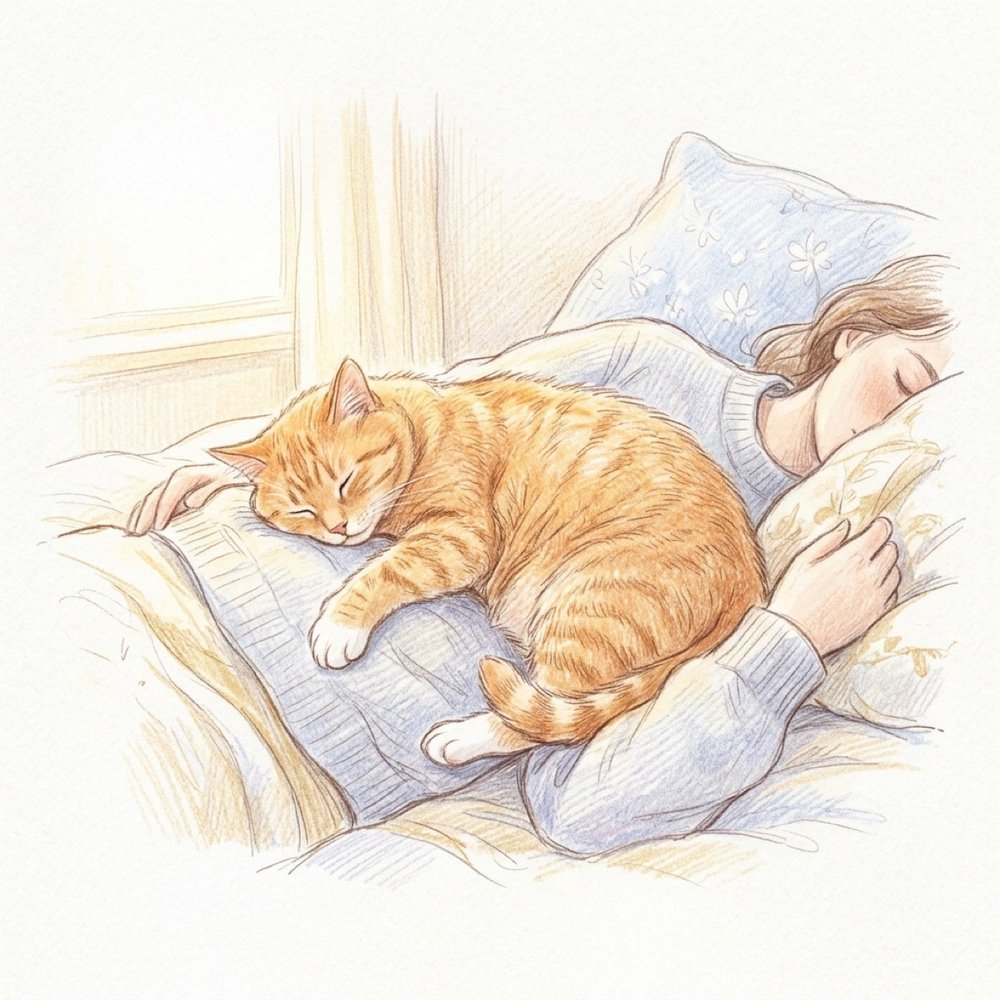
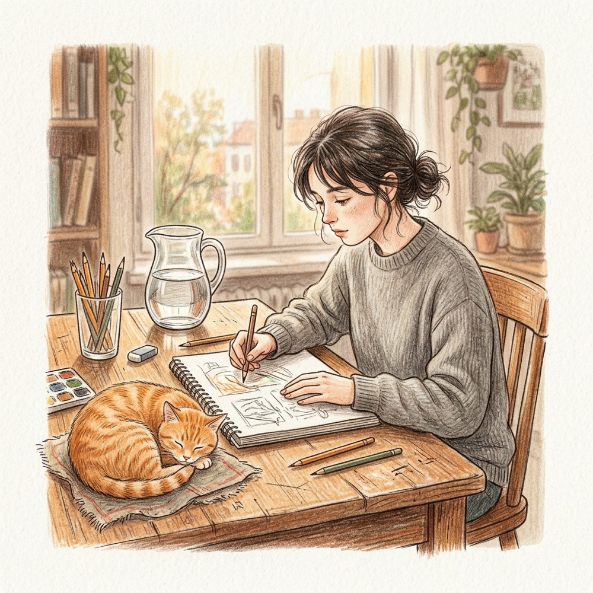
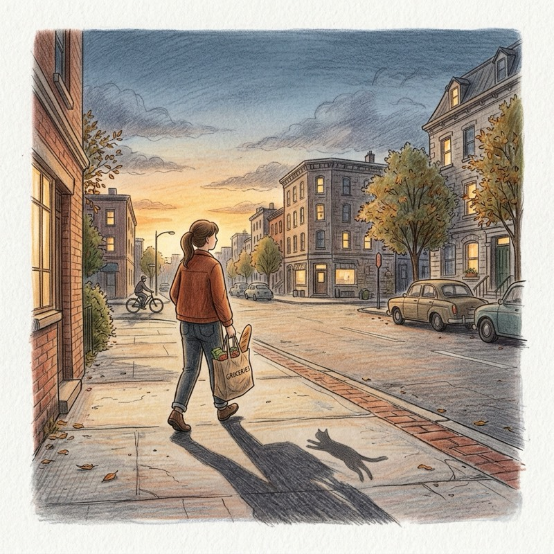
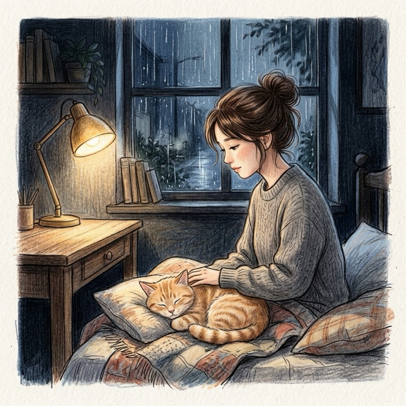
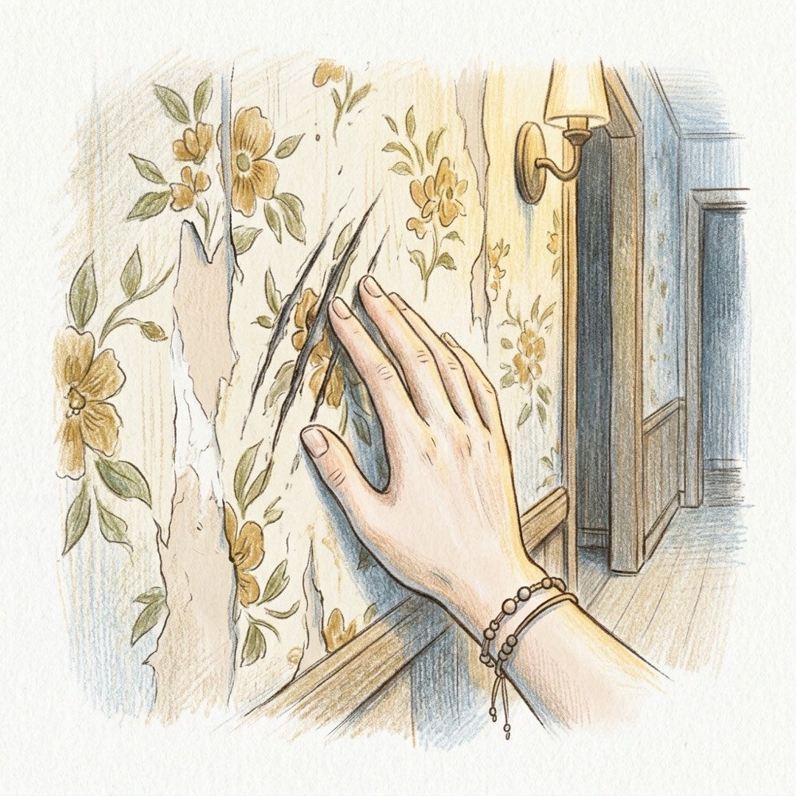
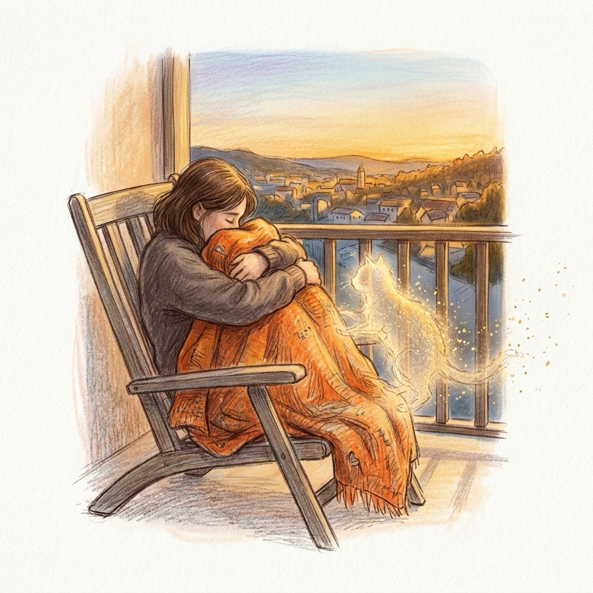

## 第一章：晨光與柔軟的重量

秋天清晨的陽光總是帶有一種乾淨的金色，像融化的焦糖一樣，溫柔地從百葉窗的縫隙斜射進來，在地板上畫出一道道亮黃色的光軌。

我是被一陣沉甸甸的重量壓醒的。

那股重量壓在我的胸口，隨著規律的起伏，散發著源源不絕的微溫。我睜開眼，迎面而來的是一張圓滾滾的毛茸茸大臉。阿橘正半趴在我的胸前，一雙亮晶晶的琥珀色大眼睛一眨不眨地盯著我，喉嚨裡發出「咕嚕、咕嚕」的低沉震動。

「早啊，阿橘。」我沙啞地笑了笑，從被窩裡伸出手，順著牠圓潤的後腦勺一路摸到牠胖乎乎的後背。

掌心下是極其細緻柔軟的觸感，暖烘烘的。當我的指尖順著牠的脊椎下滑時，無意間碰到了沙發邊角那條起毛球的舊橘色羊毛毯。粗糙的羊毛纖維與阿橘的毛髮摩擦著，帶起一絲微弱的靜電，劈啪作響。阿橘舒服地瞇起眼睛，用濕漉漉的鼻尖蹭了蹭我的下巴，逗得我發癢。

我輕輕將牠挪到一旁，掀開被子下床。腳底接觸到冰涼的木地板時，我忍不住打了個哆嗦。

「今天有點冷呢，阿橘。」我一邊走向廚房，一邊嘀咕著。

身後沒有傳來任何腳步聲。貓咪的肉墊總是這樣，走在橡木地板上就像踩在雲朵上一般，寂靜無聲。整個公寓安靜得有些空曠，只有咖啡機開始運作時發出的低沉運轉聲，以及濾滴器「答、答、答」規律的水滴落入玻璃壺的聲音。

我給自己的杯子倒滿黑咖啡，接著在平底鍋裡打了顆蛋。煎蛋在熱油中發出滋滋的聲響，香氣立刻在溫暖的廚房裡瀰漫開來。

阿橘不知道什麼時候已經蹲在我的腳邊，小腦袋隨著我鏟蛋的動作一上一下地晃動著，尾巴尖端那圈可愛的白毛輕輕擺動。當我把煎好的培根裝盤時，牠突然立起後半身，兩隻前爪搭在我的小腿上，朝我發出一聲極其嬌嗔的喵喵聲。

「不行，這個太鹹了，你不能吃。」我蹲下身，用手指輕輕點了點牠濕潤的粉紅色鼻頭。牠有些不滿地甩了甩頭，轉身跳回沙發上，將自己縮成一個橘色的大毛球。

這時，門口傳來了規律的敲門聲。

「陳默？你在家嗎？」隔壁林佳瀅那清脆開朗的聲音隔著門板傳來。

我拍了拍手，走過去將大門拉開一條剛好容納半身交談的縫隙。秋天早晨的冷風順著門縫吹進來，吹散了屋裡的咖啡香。

佳瀅穿著一件暖黃色的針織外套，手裡捧著一個精緻的瓷盤，上面放著兩個剛烤好、正散發著麥香的紅豆麵包。

「早安！我自己烤的，剛出爐還熱著呢，拿給你當早餐。」她笑得眼睛彎成了月牙，將盤子遞了過來。

「謝謝，看起來很好吃。」我接過盤子，有些不好意思地笑笑。

佳瀅一隻手扶著門框，探著頭試圖朝門縫裡望去，臉上寫滿了好奇：「對了，阿橘今天乖不乖？我剛才敲門的時候，裡面好安靜，我還以為你還在睡呢。我都搬來這裡一年多了，每次敲門你都只開個縫，我都還沒親眼見過牠呢！下次有機會，一定要讓我進去坐坐，陪牠玩玩好不好？」

「牠……牠比較怕生，聽到陌生人的聲音就會躲到床底下。」我有些侷促地往後退了半步，抓緊了門邊，「等牠適應一點，一定請妳進來喝咖啡。」

「好啦，開玩笑的。貓咪嘛，本來就很有個性。」佳瀅溫柔地笑了笑，眼神裡閃過一絲淡淡的、不易察覺的疼惜，「那你慢慢吃，我先回去準備上班了。記得趁熱吃喔！」

「好的，拜拜。」

我輕輕合上大門，轉動鎖匙鎖好。

回到客廳，阿橘依然安安靜靜地縮在沙發角落的舊毛毯裡。陽光正好灑在牠的身上，將那一身橘色的毛髮照得閃閃發亮。我坐回沙發上，將麵包盤子放在茶几上，再次伸出手，隔著那條溫暖的舊羊毛毯，輕輕拍撫著阿橘圓滾滾的身軀。

「阿橘，隔壁的林小姐說妳很神祕呢。」我喝了一口黑咖啡，對著毛毯溫柔地說道。

阿橘趴在我的膝蓋上，喉嚨裡的呼嚕聲再次規律地響起，與我的心跳節奏重疊在一起，一下，又一下。

---

## 第二章：午后的光影與畫筆

午後兩點，陽光透過百葉窗的縫隙被篩成了一道道溫暖的金斑，靜靜地橫跨在我的工作桌上。空氣中漂浮著細小的微塵，在光束中慢吞吞地旋轉，像是一場無聲的微縮舞會。

我握著勾線筆，專注地在畫板上描摹著新合約的插畫底稿。

「喵嗚。」

一聲黏糊糊的貓叫聲在耳邊響起。阿橘胖乎乎的身體輕巧地跳上桌面，肚皮貼著冰涼的木質桌面挪動，最後在我的水彩畫紙旁舒舒服服地趴了下來。牠用兩隻前爪墊著下巴，大眼睛一眨不眨地盯著我移動的筆尖。

「阿橘，別亂動喔，這張圖今天就要交了。」我騰出左手，輕輕抓了抓牠那肉感十足的下巴。

阿橘發出舒服的呼嚕聲，尾巴在桌面上輕輕掃動，掃過我剛調好的一小碟橘色顏料。我失笑，連忙將顏料碟挪開，阿橘則趁機伸出粉嫩的小舌頭，去舔舐我剛放在桌面上的濕畫筆。

「不准吃顏料，這是有毒的。」我把畫筆拿高，牠有些不服氣地下伏身體，爪子微微張開，作勢要撲。

就在這時，放在桌上的手機突然劇烈地震動起來，發出嗡嗡的聲響。來電顯示是「張宇軒」。

我滑開接聽鍵，順手開了免提，一邊繼續在畫紙上落筆。

「喂，陳默！合約你看過了嗎？那家出版社催得急，說只要底稿沒問題，下週就能簽約了。」宇軒那活力過剩的聲音立刻塞滿了安靜的工作室。

「在畫了，底稿下午就能傳給你。」我一邊說，一邊用筆尖在調色盤上蘸了點清水。

「哈哈，我就知道你效率高。阿橘呢？牠沒有在旁邊搗亂吧？我上次買的那包魚乾牠愛不愛吃？」宇軒在電話那頭笑著問，背景裡隱約傳來辦公室鍵盤敲擊的雜音。

「牠啊，現在就趴在我的畫紙旁邊呢，剛才還想咬我的筆。」我轉頭看了看阿橘，阿橘正用爪子試探性地拍打著水彩罐的邊緣。

「阿橘真的是你的靈感繆思耶！」宇軒笑著調侃道，「說真的，我認識你這麼多年，自從你三年前搬進這家公寓後，我就再也沒進去過你家門了。每次送文件都只能在走廊吹冷風。下週簽約完，我不管，我一定要去你家坐坐，親手餵阿橘吃零食，聽到了沒有？」

「好，下週再說吧。」我含糊地應了一聲，隨口敷衍過去。

「那就這麼說定啦！我等你的底稿，拜拜！」

掛斷電話後，工作室又恢復了先前的寂靜。

我伸出筆，想在桌上那個裝滿清水的玻璃水罐裡洗筆。清澈的水中正倒映著整張工作桌的光影：暖黃色的陽光、堆疊的畫冊、我握著畫筆的手，以及玻璃水罐後方空蕩蕩的、被陽光曬得發白的一小塊木地板。

我揉了揉有些乾澀的眼睛，再次睜開眼。阿橘依然趴在那裡，用好奇的眼神看著我，尾巴輕柔地在木地板的光斑上掃來掃去。

「阿橘，下週宇軒要來，你可別又躲起來了。」

我微微一笑，將筆浸入水中，激起一陣藍綠色的水花，打碎了水罐裡那片寧靜而空無一物的倒影。

---

## 第三章：雜貨店的黃昏暖色

落日將老社區的紅磚牆染成了一片溫潤的焦橘色，路邊的電線桿拉出長長的黑影，橫切過泛黃的街道。空氣中瀰漫著鄰家炒菜的油煙香氣與黃昏特有的泥土溫熱。

我慢吞吞地走下公寓樓梯，向街道對角的「王記雜貨店」走去。

店門口的老舊大電風扇正發出呼呼的聲響，吹散著熱氣。老闆娘王大姐正坐在藤椅上搖著蒲扇，一看到我，立刻熱情地站起身，臉上的皺紋笑得像朵花。

「小默啊！下班啦？今天想買點什麼？大姐這裡剛進了新鮮的小白菜，嫩得很呢。」

「好啊，大姐，給我一把小白菜，再拿一盒雞蛋。」我笑了笑，從貨架上挑了些麵條和鹽。

在收銀台結帳時，我的目光落在旁邊的寵物用品專櫃上。那裡放著幾款平價的貓罐頭。我順手拿了兩罐阿橘最喜歡的鮪魚鮮蝦口味。

王大姐一邊幫我把小白菜裝進塑料袋，一邊看著我拿的貓罐頭，笑瞇瞇地說：「小默啊，你家阿橘最近是不是又胖啦？上次看你朋友圈發的照片，那肚子都快貼到地上了。貓咪胖了是可愛，但也要注意身體，不能吃太多啊。」

「對啊，牠最近特別黏人，一到吃晚飯的時間就繞著我的腳打轉。」我接過塑料袋，從口袋裡掏出零錢遞過去。

「哎呀，養隻貓作伴真的好。不像我那兒子，出國工作一年到頭不打幾通電話。有貓陪著，家裡才熱鬧。」王大姐一邊數著零錢，一邊溫柔地叮嚀：「過幾天要是天氣熱了，貓咪不愛洗澡，你可別硬洗，貓最怕水了。有空的話，多拍點阿橘的影片給大姐看啊！」

「好，大姐，那我先回去了。」我接過零錢和重甸甸的袋子，道了謝，朝公寓走去。

回到家，玄關一片安靜。

我換上拖鞋，把買來的蔬菜和雞蛋放進冰箱。接著，我拿著那兩罐剛買的鮪魚貓罐頭走到廚房側面的儲藏櫃前。

我拉開櫃門。

櫃子裡面整整齊齊、塞得滿滿當當的，全都是同一個品牌、同一種口味的鮪魚貓罐頭，甚至還有幾個落了厚厚灰塵的塑料逗貓棒與貓抓板。那些罐頭一排排地碼放著，像是一堵沉默的牆，最裡面的罐頭包裝紙甚至已經因為時間久遠而有些泛黃，邊角沾黏著長年未動的細小蛛網與灰塵。

我神色自然地把這兩罐新買的罐頭塞進最外側的空隙裡，合上櫃門。

「阿橘，今天買了你最喜歡的罐頭，不過你剛才好像睡著了，我們先放著，晚點再吃吧。」

我轉過身，阿橘正蹲在客廳沙發的靠背上，伸出粉紅色的小舌頭舔著前爪，琥珀色的眼睛在昏暗的暮色中閃爍著溫柔的光芒。

我走過去，抱起牠圓滾滾的身軀，坐在漸漸被黑暗吞沒的沙發上，閉上眼睛，感受著懷裡傳來的、那份沉靜而熟悉的溫暖。

---

## 第四章：雨天的舊毛毯

深夜，窗外下起了暴雨。

狂風捲著雨絲猛烈地拍打著玻璃窗，發出啪啦啪啦的急促聲響。雷聲隱隱約約從遠處的雲層滾滾而來，隨後是一道雪亮的閃電，將客廳瞬間照得慘白，又迅速沉入更深的黑暗中。

阿橘最怕雷聲了。

當第一聲春雷炸響時，牠就已經敏捷地鑽進了沙發角上那條舊橘色羊毛毯下面，縮成了一個微微顫抖的小鼓包。

我合上筆記本電腦，揉了揉酸痛的肩膀，坐到沙發上。我將羊毛毯輕輕往上拉了拉，連同那個鼓包一起抱進了懷裡。

「沒事了，阿橘，只是打雷而已。」我隔著毛毯，輕柔地一下又一下地撫摸著。

手掌下的質地有些奇特。當我的手指隔著毯子往下按壓時，指尖觸碰到的，是有些粗糙、起了一粒粒小毛球的羊毛纖維。那種略微扎手的毛線質感，在手指的撫摩下發出極細微的沙沙聲。我可以感受到毯子下貓咪那因為驚嚇而急促跳動的心跳，那微弱的脈搏在我的掌心下有節奏地躍動著，熱烘烘的。

就在這時，玄關的大門傳來了輕輕的敲門聲。在暴雨聲中，那敲門聲顯得有些模糊。

我起身走到門口，將門拉開一條小縫。

隔壁的林佳瀅正穿著睡衣站在走廊上，手裡拿著一把手電筒，神色有些擔憂：「陳默，你沒事吧？這棟舊樓的頂層好像有點漏水，我上來看看你有沒有受影響。」

「我這裡沒事，謝謝妳，佳瀅。」我隔著門縫，有些疲憊但感激地朝她笑了笑。

「那就好。這雷聲太嚇人了，連我都覺得有點心慌，阿橘應該嚇壞了吧？貓咪對雷聲最敏感了。」佳瀅透過門縫往屋裡看了看，雖然走廊的燈光很暗，但她依然笑得很溫柔：「外面好冷，你快回去吧，幫我給阿橘一個溫暖的擁抱喔，晚安！」

「好，妳也早點休息，晚安。」

我關上門，反鎖好。

客廳裡只剩下窗外的雨聲。我重新坐回沙發上，將那條橘色的舊羊毛毯拉過來，緊緊地抱在胸前。

我閉上眼睛，將臉頰貼在毯子起毛球的表面上。那粗糙卻溫暖的毛線纖維磨蹭著我的臉頰，帶來一陣令人安心的微溫。在黑暗與雨聲中，我能感覺到懷裡的小生命正在慢慢平靜下來，呼吸變得綿長而安穩。

「沒事了，阿橘……」我抱緊了懷裡的毛毯，低聲喃喃著，「沒事了，我們都在家呢。」

屋外的雨勢漸漸小了下去，只剩下屋簷水滴落下的單調聲響，在空無一人的客廳裡迴盪。

---

## 第五章：樓梯間的談笑與指甲痕

週末的午後，老舊公寓的樓梯間少見地熱鬧了起來。

陽光從樓梯轉角的小窗斜斜射入，將水泥台階照得一片金黃。住在一樓的老管理員老陳搬了張塑料小凳子坐在那裡摘菜，隔壁的林佳瀅剛好下樓扔垃圾，三人在樓梯間碰個正著，便隨口聊了起來。

「小默啊，最近看你天天悶在家裡畫畫，也要多出來曬曬太陽啊。」老陳一邊摘著豆角，一邊抬頭關心地笑著說。

「有啊，老陳，我偶爾也會抱阿橘在陽台曬太陽。」我扶著樓梯扶手，微微笑了笑。

「哎呀，提到阿橘，」佳瀅轉過身，扶著垃圾袋，眨了眨眼睛笑著問：「你上次在微信上說阿橘把玄關的壁紙給抓破了？牠真的那麼調皮啊？」

「是啊，前幾天我工作太忙沒理牠，牠就一直圍著玄關大門那塊壁紙抓個不停。等我發現的時候，那塊印著小碎花的壁紙已經被抓得一條一條垂下來了。」我有些無奈地嘆了口氣，語氣裡卻滿是寵溺。

老陳哈哈大笑，手裡的蒲扇晃了晃：「貓咪嘛，就是欠管教！不過這也是養貓的樂趣啦。小默，改天真的要請我們進去坐坐，讓我見識見識那隻拆家的大橘貓！」

「一定，老陳。」我笑著點點頭。

告別了熱情的鄰居，我轉身上樓，用鑰匙打開大門。

一進玄關，我就看向大門右側的那面牆壁。原本貼得平整的小碎花壁紙，此時在接近地板的高度被撕扯開了好幾道長長的豁口，碎紙片無力地耷拉下來，露出了裡面粗糙的灰色水泥牆面。

那些抓痕很深，一條條縱向排列著。我蹲下身，伸出右手，用指尖輕輕撫摸著那些撕裂的痕跡。

在粗糙的水泥邊緣，黏附著幾抹已經乾涸的、暗紅色的細小血跡。

當我的手指劃過那些痕跡時，右手食指和中指的指甲縫傳來了一陣隱隱的刺痛。我縮回手，看了看自己的右手。因為長年握筆和乾燥，我食指和中指的指甲邊緣開裂得厲害，指甲縫裡殘留著昨晚因為焦慮而無意識抓撓牆壁留下的乾血塊，傷口的寬度與牆上那幾道抓痕的痕跡完美地契合在一起。

「阿橘，你看看你做的好事。」

我轉過頭，阿橘正坐在玄關的鞋櫃上，歪著小腦袋，睜著大眼睛無辜地看著我，尾巴在半空中畫著圓圈。

我溫柔地笑了笑，用那隻指甲開裂的手輕輕摸了摸牠的小腦袋，隨手將鞋櫃上的灰塵抹去。

「下次不能再抓了喔，不然王大姐送的罐頭就沒你的份了。」

阿橘發出一聲甜甜的喵喵聲，彷彿在向我保證。我站起身，關上玄關的門，將外界所有的喧囂與人聲徹底隔絕在門外。

---

## 第六章：露台的落日餘暉

那是一個美得有些不可思議的黃昏。

整片天空像是一塊巨大的調色盤，從地平線的深金黃色逐漸過渡到半空中的粉橘色，最後融進頭頂那一抹沉靜的紫羅蘭。微風是溫熱的，帶著秋天特有的落葉香氣，輕輕吹動著陽台上的綠植葉片，發出沙沙的細語。

我坐在陽台的竹躺椅上，身體隨著躺椅微微搖晃。

阿橘就趴在我的懷裡。牠那肥嘟嘟的身體團成了一個溫暖的大火球，毛茸茸的尾巴懶洋洋地搭在我的手臂上，喉嚨深處發出「咕嚕、咕嚕」的震動。那震動貼著我的胸膛傳導進來，與我的心跳節奏融為一體，一下，又一下，安穩而緩慢。

我閉上眼睛，右手有一下沒一下地拍撫著牠的背脊。那粗糙卻暖烘烘的觸感透過指尖傳來，讓我的內心感到了一種久違的、徹底的寧靜。

「阿橘，」我貼著牠的小耳朵，用極輕的聲音說道，「謝謝你一直陪著我。如果沒有你，我真的不知道該怎麼在這間空房子裡度過這三年……」

懷裡的橘黃色毛球動了動，換了個更舒服的姿勢，將腦袋深埋進我的臂彎裡。那股熟悉的微溫透過衣物滲透進來，像是在無聲地回應我：我一直在這裡，陳默。

「我們會一直在一起的，對吧？」我睜開眼，看著那漸漸沉入高樓大廈背後的最後一抹夕陽，嘴角浮起一絲幸福而平靜的微笑。

「喵嗚。」

那是一聲極其輕柔的貓鳴，在溫熱的微風中漸漸散去。

夕陽那金橘色的餘暉此時將整個露台染得一片通紅。如果這時有一個人從對面的大樓望向這個陽台，他會看見一副極其安詳卻安靜的畫面：

老舊的公寓陽台上，陳默一個人坐在竹躺椅上，閉著眼睛，雙手以一種極其溫柔、環抱著貓咪的姿勢緊緊地交疊在胸前。

而在他雙臂環抱的中間，只有一條已經洗得發白、起了無數毛球的舊橘色羊毛毯。

陽台的木地板上，只留有一雙屬於人類的、孤零零的拖鞋。在躺椅旁邊的白色小圓桌上，擺放著一隻精緻的陶瓷貓食碗，碗底乾乾淨淨，沒有任何飼料的殘渣，只有這三年來，在歲月光影中靜靜落下的、一層薄薄的、 undisturbed 的灰塵。

風停了。

陳默摟緊了懷裡的橘色毛毯，在漸漸沉入夜色的溫暖陽光中，沉沉睡去。