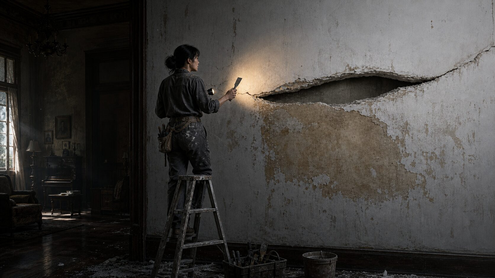
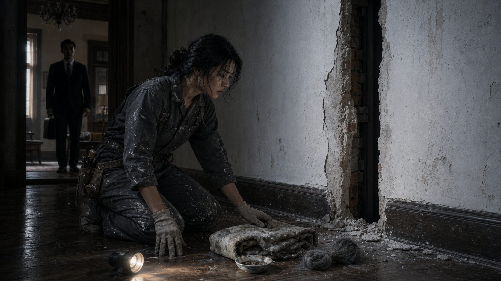
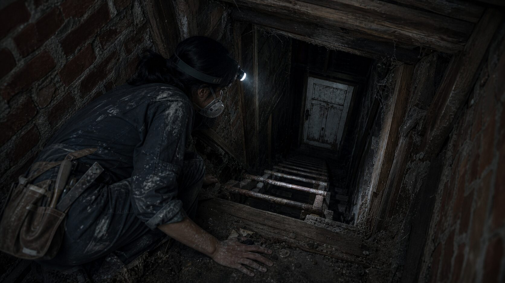

## 第一章：白牆裂縫

老宅的空氣裡混雜著未乾油漆的刺鼻與陳年木頭的霉味。

許苓站在客廳正中央，仰頭看著那面高聳的白牆。牆面很大，被漆成近乎病態的純白，但在距離地面約莫一人高的地方，卻有一道半米長的裂縫，像是一隻半睜半閉的灰色眼睛，冷冷地窺視著這間新房。

她是三天前和沈澤一起搬進來的。這棟位於市郊的沈家老宅，是沈澤家族傳下來的產業。雖然重新粉刷過，但踏在木地板上時，腳底總能感受到一股揮之不去的陰冷。

「苓苓，這面牆就交給妳了。」沈澤從身後摟住她的肩膀，溫熱的呼吸噴在她耳廓上，「媽說，妳既然是專業的修復師，交給妳弄，總比請外面的工匠細緻。這裂縫看著怪礙眼的。」

許苓轉過頭，看著丈夫溫和的笑臉，輕輕點了點頭。沈澤是個體貼的丈夫，這棟屋子雖然大得有些空曠，但能有一間屬於自己的工作室，對她來說已經是難得的平靜。

下午，沈澤去公司後，客廳只剩下許苓一個人。

她換上工作服，搬來了折疊梯，將工具箱在腳邊排開。作為一名壁畫與古物修復師，她習慣了與時光剝落的痕跡對話。她伸出食指，輕輕撫摸著那道裂縫。

奇怪的是，這道裂縫並不是因為房屋結構下陷產生的自然龜裂。裂口處的石膏呈粉末狀往外翻，更像是裡面的東西膨脹，或者有外力從內部頂開了漆面。

許苓拿起刮刀，熟練地在裂縫周邊點了點，發出沉悶的「空空」聲。

這後面是空的？

她眉頭微蹙，順著裂縫邊緣，小心翼翼地開始刮除表層的白色乳膠漆。隨著刮刀的沙沙聲，白色的漆皮像雪花一樣紛紛飄落，露出底下老舊的黃褐色底漆。

然而，當她刮開大約十公分寬的區域時，刮刀的尖端突然卡在了縫隙中。

許苓停下動作，用毛刷掃去粉塵。底漆上赫然出現了一道人工刻劃的痕跡。

那不是隨意的刮痕。她湊近過去，調整了手電筒的角度。強光直射下，幾行歪歪斜斜、深淺不一的字跡在牆體的水泥基底上顯現出來。

字是用尖銳的硬物刻上去的，字跡細小而凌亂，帶著某種神經質的顫抖。

「五月十四，陰。今天他們又少煮一份飯。」

許苓的呼吸微微一滯。

她順著那行字往下刮，動作不由自主地加快。隨著更多表漆落入掌心，底下的字跡層層疊疊地露了出來。

「五月十七。今天他們又少煮一份飯。」
「六月三。今天他們又少煮一份飯。」
「六月九。今天他們又少煮一份飯。」
「六月十二。今天他們又少煮一份飯。」

相同的日期格式，同樣令人毛骨悚然的短句，重複了不下十次。最後一處字跡刻得很深，水泥甚至被摳刨得露出了沙礫，彷彿寫字的人在極度驚恐或飢餓的狀態下，用盡了全身的力氣。

許苓站在梯子上，只覺得一股寒意從腳底板直衝脊椎。

這棟房子在他們搬進來之前，除了沈澤的母親沈太太，就只有幾位幫傭和屋管住過。這段話是什麼意思？「他們」指的是誰？「少煮一份飯」又是什麼意思？

「苓苓？」

她猛地回頭，發現沈澤不知何時已經站在了客廳門口，手裡提著公事包，正靜靜地看著她。他的臉半隱在黃昏的陰影裡，看不清表情。

「阿澤……你走路怎麼沒聲音。」許苓拍了拍胸口，試圖讓狂跳的心臟平息下來。

沈澤換了鞋走過來，看了看梯子，又看了看被刮開一大片的白牆，語氣裡滿是關切：「苓苓，妳怎麼刮了這麼大一塊？妳手臂本來就有舊傷，太累了怎麼辦？」

「這牆後面有東西。」許苓指著那些字跡，低聲說道：「你過來看。這上面刻了字，好奇怪……」

沈澤走上梯子，順著許苓的手指看了過去。當他看清那幾行重複的「今天他們又少煮一份飯」時，他的身體停頓了一下，隨即輕輕嘆了口氣，用溫柔的聲音安撫道：

「我當是什麼呢。苓苓，這大概是梅姨以前留下的。」

「梅姨？」

「嗯，以前的老屋管。」沈澤走下梯子，拉著許苓的手示意她也下來，一邊用濕紙巾幫她擦去手上的粉塵，一邊溫和地解釋道：「這老宅是磚木結構，後面有些是承重老牆，如果隨便大面積刮除，很可能會引發結構下陷或者牆體崩塌。我媽當初找人重新刷漆，就是為了做結構加固。梅姨在我們家做了快十年，後來年紀大了，有些嚴重的失智與被害妄想傾向，總是覺得每個人都不給她飯吃，還疑心有人要害她。我媽為此頭疼了很久。八年前她辭職回鄉下養病，這大概是她那時候精神不穩定，背著人胡亂刻在牆底的。聽我的話，這牆就交給外面的工匠來填平，妳就別再動它了，好嗎？」

他的語氣極其誠懇、關切，眼神裡全是一個丈夫對妻子的疼惜，完全看不出任何陰翳。這反而讓許苓有些將信將疑，感到是自己多心了。

她沉默了片刻，最後輕輕點了頭。「好。」

當天晚上，夜深人靜。

許苓躺在臥室的床上，翻來覆去無法入眠。沈澤在她身旁發出均勻的呼吸聲，顯然已經熟睡。

月光穿過窗簾的縫隙，在天花板上投下一道狹長的白光，像極了客廳裡那道被刮開的裂縫。

「今天他們又少煮一份飯。」

這行字在她的腦海裡反覆盤旋。如果梅姨只是個精神不穩的瘋子，為什麼她要用這種方式，把字跡藏在牆壁的最深處？

就在這時，寂靜的深夜裡，隔著臥室的木門，外面隱隱約約傳來了極其輕微的聲響。

「咚。咚。咚。」

那聲音沉悶、緩慢，帶著某種規律的節奏，像是從很遠的地方傳來，又像是在隔壁的牆壁深處，有人正在一下、一下地，用指關節輕敲著牆面。

## 第二章：牆後的夾層

那一夜的敲擊聲在天亮時分消失得無影無蹤，只留下許苓太陽穴深處的一陣酸脹。

沈澤出門上班後，沈太太照例在早上九點來了老宅。她穿著一身剪裁得體的深灰色針織衫，手裡提著一盒剛從市中心買來的糕點，優雅地踩著細碎的步伐走進客廳。

許苓站在客廳的梯子旁，手裡還捏著昨天那把沾著些許石膏粉的刮刀。

「苓苓啊，昨晚睡得好嗎？」沈太太將糕點放在餐桌上，視線在半空中轉了一圈，最後落在了那面被刮開一角的白牆上。她的眼角微微抽動了一下，但隨即換上了平日裡那副慈祥的笑容。

「媽，早。」許苓走下梯子，指了指牆上那道裂縫，「昨晚起風，屋裡總有些奇怪的聲音。對了，這面牆……我刮開之後發現底下的水泥有些鬆脫，我想再往深處清理一下，免得以後重新上漆又裂開。」

沈太太走上前，目光在那些歪斜的字跡上停留了幾秒，隨即嘆了口氣，語氣裡滿是無奈與悲憫：「阿澤昨天跟我提到這事了。唉，梅姨這人，後半輩子也是可憐。我們家看她無依無靠，收留了她那麼多年，沒想到她臨走前那兩年，腦子壞得那麼厲害。總是疑神疑鬼，覺得每個人都在算計她。這些字……妳別放在心上，抹平了就是。」

許苓端詳著沈太太的側臉，輕聲問道：「媽，這棟老房子，以前除了梅姨，還住過其他人嗎？」

沈太太轉過身，拉起許苓的手，溫柔地拍了拍。「這老宅子大，沈家以前寬裕的時候，確實常做些善事。以前街坊鄰里有些無家可歸的老人家，我公公在世時，總會讓他們來家裡後院的廂房歇腳，給口熱飯吃。不過那都是幾十年前的事了，後來政府規劃，老人家們也陸續被安置了。怎麼突然問起這個？」

「沒什麼，只是覺得這房子格局有些特別。」許苓笑了笑，沒有繼續追問。

沈太太又叮嚀了幾句「注意身體」、「別太累」之類的話，便藉口要回去做禮拜離開了。

老宅再次安靜下來。

許苓回到梯子上。她看著那道裂縫，沈太太的解釋聽起來合情合理，但許苓長年從事古物修復的直覺告訴她，這面牆的構造不對勁。

她用刮刀的木柄輕輕敲擊裂縫周邊的牆面。

「空、空。」
「啪、啪。」

聲音的沉悶程度在逐漸改變。到了字跡正下方約三十公分處，聲音變得極為清脆，幾乎沒有任何實心水泥的厚重感。

修復古物的直覺在催促她。她深吸了一口氣，決定不再只是刮除表漆。她換上了細鑿子與小鐵槌，避開了字跡，在聲音最清脆的地方，順著一道橫向的磚縫，小心翼翼地鑿了下去。

「沙……」

一塊鬆脫的古老紅磚被她撬了出來。

隨著紅磚被抽離，一股混雜著極度濃郁的霉味、塵土以及某種難以言喻的陳舊腥氣，從那個露出的空洞裡噴湧而出。

許苓用手掩住口鼻，偏過頭去咳了幾聲。等氣味稍微散去，她拿起強光手電筒，將光束照進了那個黑漆漆的洞口。

牆體內部並不是實心的隔間牆。在兩層紅磚結構之間，竟然有一處夾層空隙。這道窄小的空間垂直延伸，像是一條隱藏在老宅骨架裡的幽暗通道。

而在這個洞口正下方的夾層底部，靜靜地躺著幾樣東西。

許苓的呼吸變得急促。她放下鐵槌，戴上工作用的乳膠手套，將手伸進了那個冰冷狹窄的牆縫中。

她的指尖首先碰觸到了一個粗糙的硬物。拿出來一看，是一只邊緣已經崩了角的小瓷碗。碗底積著一層厚厚的黑褐色汙垢，像是乾涸多年的湯汁留下的殘渣。

接著，她摸到了布料。那是一條被折疊得極小、塞在縫隙裡的舊棉被。棉被早已霉爛不堪，表面佈滿了黃綠色的霉斑，棉絮從破損的破口處擠了出來，散發著令人作嘔的酸臭味。

最後，許苓的指尖碰到了一件黏膩、柔軟卻又帶著一絲堅硬質感的東西。

當她把那件東西拿出來，放在掌心時，她的頭皮猛地一炸。

那是一捆被粗糙的棉線綁在一起的頭髮。頭髮被剪得很短，長度不過三四公分，髮色枯黃乾燥，夾雜著大量的銀絲。

這是一個人被剪下來的頭髮。

許苓死死盯著手中的小碗、霉爛的棉被和那一捆枯髮。這絕不是什麼無家可歸之人的暫住痕跡。沒有人會把碗、棉被和自己的頭髮，塞進只有幾十公分寬、連轉身都困難的牆體夾層裡。

除非，曾有人像牲口一樣，被關在這個黑暗的夾層中生活。

「苓苓。」

沙啞的聲音毫無預兆地在客廳角落響起。

許苓嚇得身體一抖，手中的小瓷碗差點脫手摔碎。她猛然轉頭，看見沈澤不知何時已經回來了。他站在玄關處，手裡提著公事包，正死死地盯著她，以及她腳邊的舊棉被與枯髮。

他的西裝外套有些凌亂，額頭上帶著細微的汗珠，眼神裡閃爍著一種許苓從未見過的焦躁與冰冷。

「你……你今天怎麼這麼早回來？」許苓下意識地用身體擋住牆上的洞口，將拿著瓷碗的手藏在身後。

沈澤沒有回答，他快步走過來，目光越過許苓，直勾勾地看著地面上那團霉爛的棉被和那捆頭髮。他的呼吸變得粗重，臉上的溫和笑容徹底消失了。

「我不是說過，不要再碰這面牆了嗎？」沈澤的聲音壓得很低，帶著一絲壓抑的憤怒。

「阿澤，這牆壁裡面有夾層。」許苓試圖讓自己的聲音聽起來平靜，「這裡面藏著這些東西。這不可能是梅姨的惡作劇，這看起來……」

「夠了！」沈澤猛地低吼一聲，一把奪過許苓手中的瓷碗，連同地上的棉被和頭髮，一股腦地塞進了一個塑料袋裡。

他轉過身，背對著許苓，胸口劇烈地起伏著。過了幾秒，他似乎在極力克制自己的情緒，轉過頭來時，臉上勉強擠出了一抹扭曲的溫柔：「苓苓，對不起，我有些失控了。我只是……我不希望妳把時間浪費在這些陳年垃圾上。這房子太老了，以前的租客或傭人留下什麼都不奇怪。聽我的話，明天我找工匠來，直接把這面牆用木板封死，妳不要再管了。」

沈澤提著塑料袋，轉身走向了後院的工具間。

許苓跟了過去。她看見沈澤將塑料袋丟進工具間的角落，然後拉上鐵門，從口袋裡掏出一把黃銅掛鎖，將工具間的大門牢牢鎖上。

那把鎖是嶄新的，金屬表面在昏暗的走廊光線下泛著冰冷的光。沈澤將鑰匙收進內側口袋，回頭對許苓笑了一下，那笑容空洞而疲憊：「好了，去洗手吧，我們今晚出去吃。」

那天晚上，餐桌上的氣氛壓抑得令人窒息。沈澤不停地給許苓夾菜，絮絮叨叨地說著公司的瑣事，但許苓一句也聽不進去。她的腦海裡全是那一捆夾雜著銀髮的枯草，以及沈澤鎖上工具間時，那冷漠而防備的眼神。

深夜。

窗外下起了毛毛細雨，雨水拍打在玻璃上，發出沙沙的聲響。

許苓躺在床上，睜大著眼睛看著天花板。身旁的沈澤呼吸沉重，甚至發出輕微的鼾聲，但許苓知道，自己今晚註定無法入眠。

黑暗中，所有的感官都被無限放大。

老舊木地板因溫度變化而產生的微弱吱呀聲、雨水順著屋簷滴落的聲音……

然後，那個聲音又出現了。

「咚。」

沉悶的撞擊聲，這一次比昨晚更加清晰，彷彿發聲源就靠在臥室床頭貼著的那面牆壁正後方。

許苓屏住呼吸，整個人僵硬在被窩裡。

「咚。咚。」

那節奏緩慢而精準。敲擊兩下後，停頓了約莫三秒，接著又是三下。

「咚。咚。咚。」

這不是隨意的風聲，也不像房屋結構變形的異響。那種一下、一下，帶著刻意留白的停頓，在寂靜的黑夜中，像極了某個看不見的人，正用指節頂著牆板，在黑暗中無聲地數著數。

「一……二……三……」

許苓拉起被子，死死地覆住自己的耳朵，但那規律的敲擊聲，卻像是有穿透力一般，順著床板、順著空氣，一聲聲直接震動著她的耳膜。

## 第三章：失蹤的梅姨

雨聲在後半夜漸漸停了，只剩下屋簷偶爾滴落的餘響。

天剛矇矇亮，許苓便悄悄下了床。沈澤還在熟睡，昨晚那沉重的鼾聲此時聽來，多了一分令人不安的偽裝感。她沒有驚動他，換上便服，拿了外套，輕手輕腳地走出老宅。

她沒有去工作室，而是走向了市區的圖書館與地方文獻館。

許苓利用自己修復師的身份，以「研究沈氏老宅建築歷史與裝飾演變」為由，順利申請調閱了老街區的舊戶籍檔案與鄰里報紙微縮膠卷。

她將微縮膠卷裝上閱讀器，手動旋轉著旋鈕，冰冷的光幕在黑暗的閱覽室裡閃爍，快速掠過一頁頁泛黃的版面。

「沈家老宅……屋管……」許苓一邊翻找，一邊在筆記本上寫下時間線。

沈澤說梅姨是八年前「辭職回鄉下養病」。如果真是這樣，鄰里間或沈家的往來帳目、甚至街坊的閒聊中，應該會留下一些痕跡。然而，當許苓將時間定位在八年前時，她發現了一條夾雜在地方報紙社會版角落的尋人啟事。

那是一則非常不起眼的尋人啟事，刊登日期是八年前的十月。

畫面上是一張黑白大頭照，照片裡的老婦人頭髮花白，面容慈祥，眼神裡帶著一絲常年操勞的疲態。那張臉，許苓在沈澤給她看過的照片裡見過。

是梅姨。

尋人啟事的聯絡人是梅姨在外地的侄子，上面寫著：「尋找姑姑梅秀琴，女，五十八歲，於市郊沈氏住宅附近走失，走失時身穿藍色工作服。家人焦急萬分，如有線索請聯絡……」

這條啟事連續刊登了三天，之後便銷聲匿跡。

如果梅姨是失蹤，為什麼沈澤和沈太太要異口同聲地撒謊，說她是辭職回鄉？

許苓合上筆記本，指尖冰涼。她將微縮膠卷退了出來，交還給管理員。

回到老街區時，已是下午兩點。老宅周圍有些寂靜，許苓在巷口碰見了正在給桂花樹澆水的老鄰居陳婆婆。陳婆婆看她臉色蒼白，便關切地問了幾句。

許苓心中一動，試探性地問起八年前梅姨的事。

陳婆婆嘆了口氣，有些忌憚地壓低聲音說：「哎呀，梅秀琴那時候哪是辭職啊？她是突然不見了。她侄子還來找過，但沈太太說她早就走了。說起來，那幾年沈家後院住過好幾個無親無故的老頭老太太，張老頭、李婆婆，後來都不知去向。沈太太說把他們送去省城的安老院了，但張老頭失蹤前，還常在巷口跟我抱怨，說沈家天天少給他做飯，逼他簽什麼字……後來那些人一個都沒再露過面。」

這段話，與客廳牆底刻著的「今天他們又少煮一份飯」和梅姨的失蹤交織在一起，在許苓腦海中串成了一條令人毛骨悚然的線。

回到老宅時，已經是下午三點。沈澤去上班了，沈太太也沒有來。整棟大房子像是一具巨大的木質棺槨，安靜得能聽到空氣中塵埃飄落的聲音。

許苓站在客廳那面被重新封上的白牆前。沈澤今天早上出門前，特地用一塊木板和幾根釘子將那個破洞臨時封了起來，木板上還殘留著新木料的氣味。

許苓看著那塊木板，昨晚那陣「咚、咚、咚」的規律敲擊聲再次在耳邊回響。

那聲音不是幻聽，那節奏是在引導她。

她沒有去動客廳的木板。她轉身走上二樓，憑著自己對這棟房子結構的直覺，尋找那個夾層的延伸方向。老宅的二樓走廊有一處細長的儲藏夾道，平時只堆放著一些不用的舊紙箱。

這是老房子為了檢修管線留下的通道。

她戴上防塵口罩和頭燈，用螺絲起子撬開木栓。隨著木門被拉開，一股比昨天更濃烈、更壓抑的霉味與木頭腐朽的氣味撲面而來。

通道裡面極其狹窄，寬度僅容一人匍匐前進。兩側是粗糙的紅磚牆與支撐房屋的木骨架，上面佈滿了蛛網與厚厚的灰塵。

看著那深邃黑暗的夾層，許苓感到一陣沒來由的恐慌。她想了想，拿出手機給同在修復行當的朋友小林發了條訊息：「小林，我發現阿澤家老宅的牆壁內部是空的，我聽見有奇怪的敲擊聲。我現在進去探查一下，如果晚上七點我沒有回覆妳，請立刻報警並帶人來沈家老宅找我。」

發送成功後，她沒有猶豫，側著身子，一點一點地爬了進去。

頭燈的光束在黑暗中搖晃，照亮了前方狹窄的通道。這裡就是牆壁的夾層。她一邊往前爬，一邊能摸到身側冰冷的紅磚。當她爬行了約莫五米，來到客廳白牆正上方的位置時，她注意到身下的木板上，有著長年被拖曳、磨損的痕跡。

這裡曾有人頻繁地爬行過。

許苓繼續往前，通道開始呈直角往下傾斜，出現了一條近乎垂直的鐵梯，隱藏在兩面雙層磚牆的縫隙之中。這條鐵梯直通老宅的最底層。

她順著鐵梯小心翼翼地踩踏下去，手心全是冷汗。

當她的腳底終於踩到實地時，四周的空氣變得更加陰冷潮濕。頭燈的光束往前一掃，她發現自己站在一個狹小的水泥平台上，而前方，赫然是一扇用鐵栓扣住的低矮木門。

木門上漆成了與牆體相同的白色，但在這無光的地下，那白色顯得無比詭異。

許苓伸手拉開鐵栓，推開了木門。

門軸發出乾澀的「吱呀」聲，在地下室顯得刺耳無比。

她矮身走了進去。這是一個隱藏在老宅地基下方的地下儲藏室，面積不大，牆壁沒有粉刷，露著潮濕的青灰色水泥，地上積著一層淺水。

屋裡空蕩蕩的，只剩下一張鏽鐵折疊床，上面散落著發霉的草蓆碎片。在牆角的一堆廢紙堆裡，許苓注意到了一些燒毀大半的灰燼，殘存的幾片焦黑紙角上，隱約能看見「自願贈與」、「產權讓渡」等印刷字樣。顯然，沈家已經清理過現場，並將絕大多數文件燒毀了。

但在鐵床床頭，放著一張粗糙的木凳，木凳上有一台落滿灰塵的舊式雙卡錄音機。

許苓的視線落在錄音機上。錄音機背面的電池蓋被透明膠帶死死封住了。她走過去，撕開膠帶，撬開電池蓋。裡面並沒有電池，而是塞著一張折疊得極小、用塑料薄膜包著的紙條。

梅姨為了防備沈家人，特意將最關鍵的日記與錄音藏在了這個錄音機內部的死角。

許苓抖著手展開那張紙條，上面字跡凌亂、神經質，與客廳牆上的刻字如出一轍：

「十月三日。張老先生的存摺昨天被太太拿走了。他今天一直哭。我知道我不該看，但我看見了。沈家人是鬼。」
「十月九日。我把張老先生藏進了夾層，我想帶他走，但沈澤發現了。他看我的眼神不對。我走不掉了，他們不會讓我走。如果有人看到這個……救救我們。我把證明錄在磁帶裡，就藏在卡帶槽內。」

許苓將紙條握在掌心，看向木凳上那台落滿灰塵的舊錄音機。她快步走過去，顫抖著手按下了錄音機的艙門鍵。

「咔噠。」

艙門彈開，裡面靜靜地躺著一盤磁帶。磁帶的標籤上用原子筆寫著兩個字：

「證明」。

## 第四章：牆裡的證明

許苓將那盤寫著「證明」的磁帶緊緊攥在掌心，冰冷的塑料外殼像一塊烙鐵，激得她整個手掌微微發麻。

她必須立刻離開這裡，報警。

然而，還沒等她轉身走向那扇低矮的木門，頭頂上方突然傳來一陣沉重而急促的腳步聲。那聲音並非來自二樓的走廊，而是直接在地下室上方的地板上震動，沉悶地迴盪在密閉的空間裡。

「苓苓？」

沈澤的聲音透過狹窄的通風管道傳了下來，帶著一種異樣的、空洞的乾澀。

許苓的心臟猛地一縮。她立刻關上手電筒，將磁帶塞進外套口袋，試圖將錄音機的艙門重新按回去。但在極度慌亂中，她的指尖撞到了按鍵，在死寂的地下發出清脆無比的「咔噠」聲。

上方的腳步聲瞬間停了。

短暫的死寂過後，鐵梯方向傳來金屬受重而發出的刺耳摩擦聲。有人在下來，速度極快，甚至帶著一絲氣喘。

許苓顧不得原路返回，環顧四周，這個潮濕的水泥儲藏室根本沒有其他出口。她只能咬牙鑽回那扇低矮的木門，順著鐵梯往上爬。但她剛爬了三格，手電筒的餘光就看到下方漆黑的陰影裡，一隻粗壯的手已經搭在了鐵梯的底端。

「苓苓，妳在那裡做什麼？」沈澤的聲音從下方傳來，因為空間狹窄而顯得扭曲。

許苓沒有回答，用盡全身力氣往上爬。二樓那個維修口的亮光就在頭頂，那是她唯一的生路。然而，當她氣喘吁吁地爬到鐵梯頂端，準備鑽進水平的夾層通道時，一隻冰冷的手猛地抓住了她的腳踝。

「放開我！」許苓尖叫，另一隻腳拼命往後踢。

腳尖似乎踢中了沈澤的臉，下方傳來一聲悶哼，抓著她腳踝的力量鬆了些。許苓趁機手腳並用地往前爬，鑽進了那條僅容一人匍匐的通道。

身後的腳步聲如影隨形。沈澤的體型比她高大，在狹窄的通道裡行動受限，但他拉扯木骨架和紅磚的聲音在許苓耳邊如同野獸的咆哮。

「苓苓，聽話，別動！」沈澤在後面喘著粗氣，「妳什麼都不知道，這一切都是為了沈家！如果這件事暴露，沈家就全毀了！」

許苓不顧一切地往前爬，雙手在粗糙的木板和紅磚上磨得鮮血淋漓。終於，她看到了二樓走廊微弱的光線。她撐起身體，半個身子已經探出了維修口。

但就在這時，沈澤追了上來。他一把抱住了許苓的雙腿，將她往黑暗的通道深處拖。

「放手！阿澤，你瘋了！這是犯罪！」許苓大喊，雙手死死扣住維修口邊緣的木框。

「我沒瘋！瘋的是梅姨，還有那些老傢伙！」沈澤的臉色在黑暗中顯得無比猙獰，他將許苓拖回通道中，隨後猛地合上了維修口的木門。

「砰！」

黑暗瞬間將許苓吞沒。

隨後是木栓被插上、甚至有重物被推過來擋住木門的沉悶聲響。

許苓被困在客廳白牆正上方的夾層死角。這裡高度極低，她只能側躺著，四周是冰冷的磚牆，空氣稀薄得讓人窒息。

「阿澤！放我出去！」許苓拼命捶打著木門，但厚實的木板只傳回沉悶的聲響。

牆壁外，沈澤的聲音隔著板壁傳來，顯得有些遙遠而神經質：「苓苓，妳先在這裡待著。等媽把下面的事情處理好，我會放妳出來。妳是我的妻子，只要妳不說，沒人會知道。我們會像以前一樣好好過日子。」

許苓大口喘著氣，眼淚終於奪眶而出。她摸了摸口袋，那盤磁帶還在，但她的手機在爬進通道前留在了臥室的床頭櫃上。

她沒有任何與外界聯絡的工具。

時間一分一秒過去，夾層裡的溫度越來越低，潮濕的霉味不斷吸入肺部，讓她大腦發昏。她知道，一旦沈太太把地下室清空，抹去所有生活痕跡，她就再也沒有機會揭發這一切，甚至可能成為下一個被「安置」的人。

許苓強迫自己冷靜下來。她是一名修復師，她對這棟房子的牆體結構瞭如指掌。

她趴下身子，順著通道摸索，找到了客廳白牆正上方的位置。這裡的紅磚牆因為她昨天鑿開了一個洞，結構已經不再穩固。

許苓從工作服的口袋裡摸出了那把隨身攜帶的修復刮刀。

這把精鋼打造的刮刀是她最熟悉的工具。她將手電筒咬在嘴裡，藉著微弱的光線，找準了兩塊紅磚之間的縫隙，開始用力地刮刨水泥。

「沙、沙、沙……」

在寂靜的牆體內，金屬與水泥摩擦的聲音異常清晰。許苓一下又一下地刨著，手掌被震得生疼，甚至磨出了血泡，但她不敢停下來。

「沙、沙……」

不知道過了多久，一塊鬆動的紅磚被她用刮刀生生撬了出來。接著是第二塊、第三塊。

客廳天花板上方的磚牆被她挖出了一個口子。許苓透過口子往下看，那是客廳的白牆，沈澤用木板臨時釘住的地方就在下方不遠處。

她用刮刀猛烈地敲擊著木板與磚牆的交界處，同時扯開喉嚨大喊：

「救命！救命啊！」

這棟老宅雖然位於市郊，但此時已近晚上七點半。

老宅外面傳來了急促的腳步聲和拍門聲。許苓的朋友小林因為一直聯絡不上她，察覺到異樣，已經帶著派出所的執勤民警趕到了沈家大門外。

「沈先生！開門！我們接到報警，說有人在屋內被限制人身自由！」民警在大聲敲門。

而在花園裡的鄰居也聽到了白牆處傳來的撞擊聲，指著客廳高窗大喊：「警察同志！那面外牆裡面有動靜！我聽到有人在喊救命！」

許苓用盡最後的力氣，將刮刀插進木板縫隙，狠狠一撬。

「咔嚓！」

木板斷裂，一大片白色的漆皮伴隨著碎石膏轟然倒塌，露出了夾層裡許苓滿是塵土與血跡的臉，以及她伸出牆外求救的雙手。

民警隨即強行破門而入，將驚慌失措的沈澤當場控制。

半小時後，許苓被民警和消防員從夾層中救了出來。

她站在大雨滂沱的院子裡，身上披著毛毯，雙手纏著繃帶。幾名警察正從地下室走出來，為首的警官搖了搖頭，對旁邊的記錄員說道：「底下什麼都沒有，只有一張空床架，連灰塵都被打掃乾淨了。」

許苓轉過頭，看見沈太太站在走廊下，身上依舊穿著那件得體的灰色針織衫，面容冷靜，甚至配合地向警方提供著老宅「以前租客留下雜物」的說明。

許苓咬著牙，顫抖著從口袋裡掏出了那盤磁帶。

「這是在底下找到的。這是梅姨留下的。」

隨著播放鍵被按下去，錄音機喇叭裡傳來沙沙的磁帶雜音，隨後是梅姨那略帶顫抖卻無比清晰的聲音：

『……我知道他們總能把白牆重新刷好，就像什麼都沒發生過一樣。但我把證據留在這裡了。沈澤，沈太太，你們藏不住的……』

這段錄音，成了揭開這棟大宅秘密的最後一把鑰匙。

半年後。

沈澤因涉嫌非法限制他人人身自由、故意傷害及協助侵占他人財產等多項罪名被起訴，最終被判入獄。然而，正如梅姨在錄音中所擔心的那樣，沈太太在警方破門前，早已將地下室所有涉案文件與老人的日常用品付之一炬，甚至將名下相關的空頭養老基金迅速註銷。沈澤為了保護母親，在庭審中一口咬定所有囚禁與財產轉讓都是自己一手策劃，聲稱母親常年吃齋念佛、毫不知情。最終，因為切斷了所有直接參與的證據鏈，加上地下室已被清空，沈太太因證據不足而免於起訴，全身而退。

許苓與沈澤辦妥了離婚手續。她放棄了所有財產分配，隻身搬離了那個讓她夜夜噩夢的市郊老宅。

她成為了警方的關鍵證人，但漫長的訴訟程序讓她精疲力竭。

新租的公寓位於市中心一棟普通的公寓樓裡。房間不大，採光很好，牆壁刷著乾淨的、毫無雜質的白漆。

黃昏。

許苓坐在沙發上，手裡捧著一杯熱茶。屋子裡很安靜，只有窗外大街上隱約傳來的車流聲。

她放下茶杯，視線習慣性地在房間的四壁上掃過。

突然，她的目光定格在了沙發對面的那面牆上。

在距離地面約莫一人高的地方，乳膠漆的表面有一道約十公分長的、微微凸起的痕跡。那裡的顏色比周圍的純白稍微暗淡一些，泛著一絲不易察覺的灰色。

那是一道新補上去的白痕。

許苓緩緩站起身，一步步走到牆邊。她伸出纏著淡色疤痕的手指，輕輕撫摸著那道凸起。

這只是一道普通的、因為牆體乾燥而產生的微小裂縫，被房東用膩子隨手抹平了而已。

還是說……

許苓將耳朵貼在冰冷的牆面上。

寂靜中，她分不清耳畔傳來的，是自己逐漸加速的心跳聲，還是那道白痕背後，又開始了新一輪緩慢而規律的敲擊。

