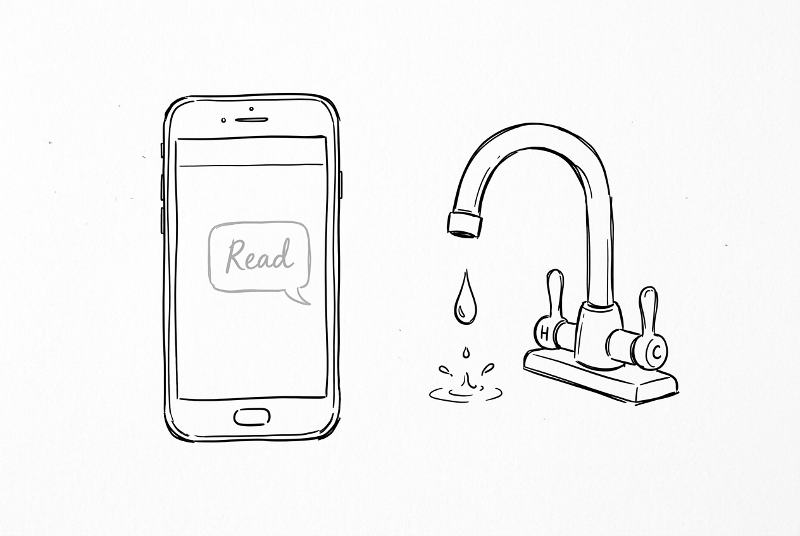
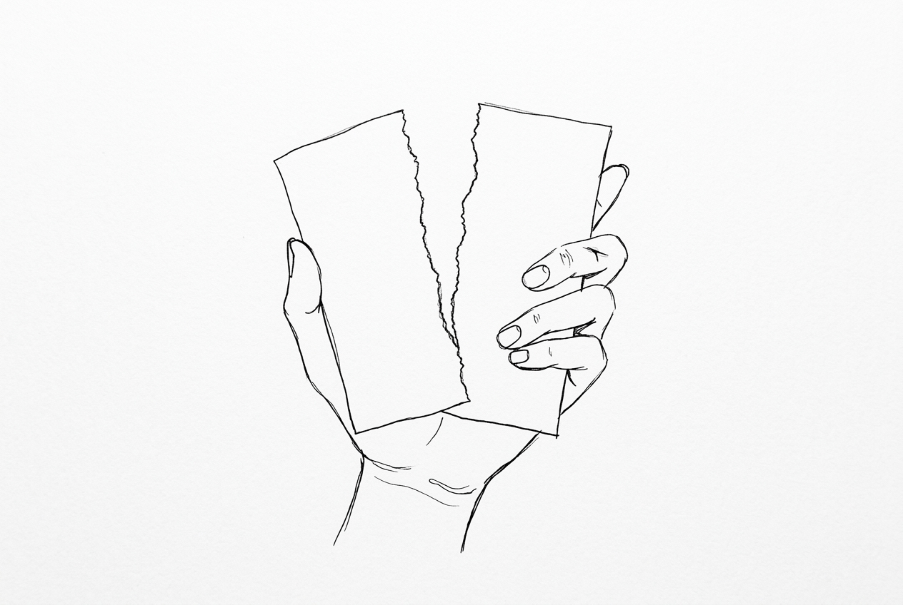
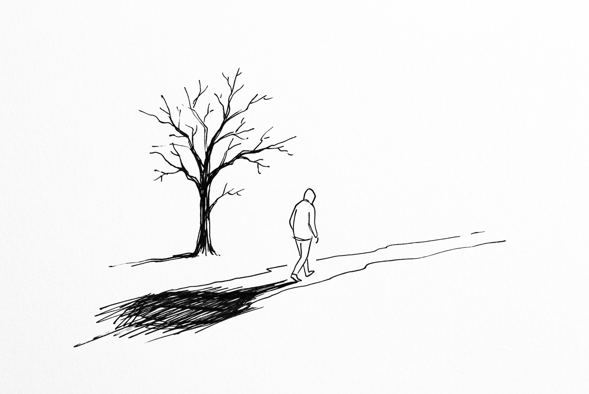

## 第一章：已讀不回與洗澡三年

洗澡洗了三年：所以，人是可以在一瞬間消失的對吧。

我尿急抖一下而已：不然呢？你以為他是在拍科幻片，被外星人綁架了？

洗澡洗了三年：我只是覺得……他可能剛好手機摔壞了。或者出差去訊號不好的地方？或者是家裡突然有急事？

我尿急抖一下而已：笑死。這年頭連去喜馬拉雅山都有 5G 了。手機壞了，他是不會借路人的手機發個訊息，還是他家窮得沒有第二台能登入帳號的裝置？醒醒吧，人家只是單純覺得你連這三秒鐘的敷衍都不配得到。

洗澡洗了三年：你說話一定要這麼難聽嗎？

我尿急抖一下而已：難聽？這叫事實。你非要給自己找點安慰，去美化一個把你當垃圾丟掉的人，那是你自己的問題。

洗澡洗了三年：我只是……不知道該怎麼辦。我甚至不知道是哪一天開始出問題的。上週聊天還好好的，怎麼這週就突然……

我尿急抖一下而已：這就是最無聲的離別。有些離別是根本沒有告別的。只是某一天開始，你的訊息不再被回覆，你的話題不再被接住，連見面都變成一種尷尬。你甚至不知道該從哪一句開始追問，更不知道對方是從哪一天開始決定離開。

洗澡洗了三年：對……就是這種感覺。我很想問，但又怕顯得自己太卑微。

我尿急抖一下而已：等你察覺到的時候，這段關係已經像一間被搬空的房子了。裡面什麼都沒剩下，空蕩蕩的，只有你還傻傻地站在門口，以為裡面應該有人。

洗澡洗了三年：房子……已經被搬空了嗎。

我尿急抖一下而已：空得連根毛都沒剩下。別傻站在門口了，半夜冷風吹多了容易腦殘。

洗澡洗了三年：你為什麼懂這麼多？你經歷過？

我尿急抖一下而已：懂？我？哈哈，我的故事可不是洗個澡這麼簡單。我的那段離別，可比你這高級多了。

---

## 第二章：撕碎的紙與割破的手

洗澡洗了三年：你的離別是怎樣的？比已讀不回還慘？

我尿急抖一下而已：我的那個離別不是安靜的，是難堪的。帶著無窮的責怪、誤會、羞辱，甚至滿滿的惡意。話說得太重，門關得太響。

洗澡洗了三年：吵架？

我尿急抖一下而已：是互撕。把最難看、最下流的話都砸在對方臉上。最後留下的不是什麼懷念，而是一種咬牙切齒的記憶。你想起那個人時，不是想哭，而是覺得胸口發硬。你不是捨不得，而是不甘心。

洗澡洗了三年：不甘心……

我尿急抖一下而已：不是因為愛還在，而是因為那段關係結束得太粗暴了。就像有人把一頁紙從你手裡生生撕走，還順手割破了你的手。你流了一地的血，疼得齜牙咧嘴，對方卻連頭都沒回。

洗澡洗了三年：聽起來真的很痛。這種離別……確實沒辦法被寫進歌裡。

我尿急抖一下而已：這種離別很少被歌頌。因為它不浪漫，它沒有任何美感，也不適合被放進慢鏡頭裡。它比較像新聞裡的當街爭執，像深夜裡吵到失控的電話，像一段被刪除的對話紀錄。像你事後反覆想起，仍然覺得自己當時應該說得更狠、走得更早、不要那麼愚蠢地去相信。

洗澡洗了三年：可是，大家聊起前任，不都是說「都過去了，祝他幸福」嗎？

我尿急抖一下而已：那是裝出來的高尚。人們不愛談論這些難堪的離別，並不只是因為它們醜陋，更可能是因為它們讓我們看見了自己不想承認的樣子：曾經那麼卑微、那麼失控、那麼期待對方回頭解釋，曾經在心裡排練過無數次質問。

洗澡洗了三年：我這幾天……也一直在心裡排練質問他的話。

我尿急抖一下而已：對吧。那些不漂亮的情緒，讓人無法把自己放在一個高尚的位置上。所以我們寧願對外人說「都過去了」，好像只要閉口不提，那些狼狽就不算存在。

---

## 第三章：從冰冷的地方走回來

洗澡洗了三年：可是，就算不提，那些狼狽就真的不存在了嗎？

我尿急抖一下而已：怎麼可能。但不提，並不代表它們沒有留下痕跡。那些讓你咬牙切齒的離別，常常比溫柔的告別更深地改變一個人。

洗澡洗了三年：改變了什麼？

我尿急抖一下而已：它們讓你學會懷疑，學會收起熱情，學會在下一段關係裡先退半步。它們也讓你變得刻薄一點、清醒一點，甚至疲倦一點。這未必是成長。有時候只是受傷之後的結痂，被誤認成了成熟。

洗澡洗了三年：聽起來真悲哀。難道我們就只能這樣了？

我尿急抖一下而已：這就是代價。不是每一次失去都會變成詩。有些失去就只會變成一根刺，平時不痛，碰到的時候才提醒你：你曾經在這裡被人狠狠傷過。

洗澡洗了三年：那離別的意義到底是什麼？

我尿急抖一下而已：離別不一定要美，才有被書寫的資格。有些離別的意義，不在於它教會我們珍惜，而在於它逼我們承認一件事。

洗澡洗了三年：承認什麼？

我尿急抖一下而已：承認不是所有關係都值得善終，不是所有人都配得到體面的告別，也不是所有回憶都需要被整理成溫柔的形狀。有些人離開時，沒有帶走愛，而是帶走了你對某些事情的天真。

洗澡洗了三年：帶走了天真……

我尿急抖一下而已：多年以後，你也許不再咬牙切齒。但你仍然會記得。不是因為放不下，而是因為你知道，那個離別曾經把你推到一個更冷的地方。你從那裡獨自走回來，花了很長、很長的時間。而傷害你的人，過得可好著呢，早就把你忘乾淨了。

洗澡洗了三年：……

我尿急抖一下而已：怎麼，哭了？

洗澡洗了三年：沒有。

洗澡洗了三年：我剛才把他刪了。

我尿急抖一下而已：喲，手腳挺快。

洗澡洗了三年：既然他不配得到體面的告別，那我也沒必要站在空房子門口等了。

我尿急抖一下而已：行了。我要去上廁所了。你也早點睡。

洗澡洗了三年：好。晚安。

我尿急抖一下而已：晚安。

