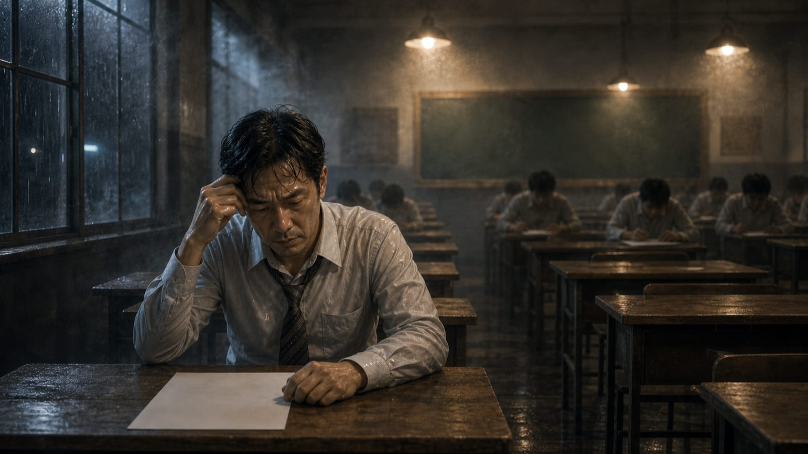
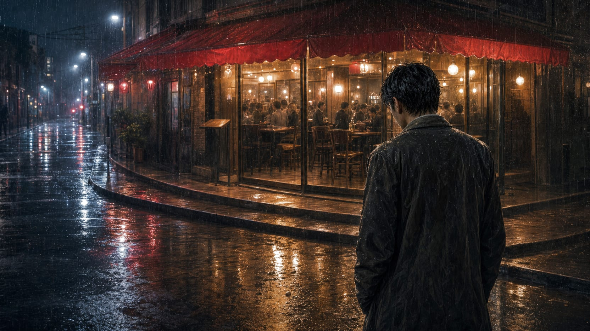

## 第 1 章：陌生人的夢

睜開眼時，世界浸泡在一種濃稠而溫熱的暮色裡。

起初，他以為這只是另一個宿醉的黃昏，直到他試圖抬起手臂，卻發現自己沒有重量，也沒有形體。他像是一抹憑空依附在半空中的意識，既落不到地面，也無法飄散。他試圖對周圍發聲，喉嚨卻發不出任何波長，只能無聲地看著眼前的一切。

這是哪裡？這條鋪滿碎石的窄巷、帶著濕氣的紅磚牆，還有半空中那抹揮之不去的夕陽，都透著一股強烈的陌生感。他的大腦一片空白，搜遍記憶，也找不到任何與這裡相符的片段。他甚至想不起自己的名字。這個穿著黃裙子的小女孩是誰？這隻看不見的狗又是什麼？他滿腹疑惑，卻得不到任何解答，只能被動地停留在這個怪誕的空間裡。

前方不遠處，站著那個穿黃裙子的小女孩。她蹲在地上，手裡緊緊攥著一根明亮的黃色絲線，絲線的另一端沒入虛無的半空中。她一邊抹著眼淚，一邊對著空無一物的半空呼喚著：「貝貝，快回來……對不起，我不該放開繩子的……」

那條街上刮起了一陣帶有鹹味的海風。小女孩的哭聲中有一種極度強烈的、被遺棄的自責。正是這種劇烈的「未竟的遺憾」，像一塊磁鐵，將他毫無防備的意識強行拽進了這個夢境。

他試圖走過去拍拍女孩的肩膀安慰她，或者幫她拉住那根絲線。然而，當他伸出無形的雙手，他的指尖只是輕飄飄地穿過了女孩的身軀。他張開嘴大喊，發出的也只有寂靜。不論他如何焦急、如何用力，這個夢境世界都與他徹底隔絕。他只是一個靈魂般的旁觀者，無能為力。

小女孩手中的黃色絲線突然在風中崩斷，斷裂的絲線末端在半空中飛舞，最後，那一截斷線竟像是被他的意識吸引，緩慢地纏繞在了他無形的指尖上，散發出淡淡的、微溫的光芒。

## 第 2 章：空白考卷

小女孩的身影與那抹溫熱的暮色悄然淡去。意識在短暫的失重後，並未沉入黑暗，而是被另一股無形的力量拽入了另一個截然不同的世界。

急促的沙沙聲當先傳來，那是鉛筆尖在粗糙紙張上摩擦的聲音。空氣中浮動著細微的粉筆灰，伴隨著陳舊木頭課桌散發出的乾燥氣味。

他發現自己飄浮在一間黑壓壓的教室後半部。講台上的老式掛鐘發出沉重的滴答聲，每一次擺動都帶著冰冷的壓迫感。底下的課桌排列得整整齊齊，幾十個穿著制服的背影正埋頭苦幹，四周安靜得只能聽見呼吸聲與寫字聲。

他的注意力不由自主地被倒數第二排的一個男人吸引。

那人的背影異常寬闊，此時卻因為極度的緊張而微微蜷縮。當那人忍不住轉過頭，試圖用眼角去瞥身旁同學的考卷時，無形的意識裡泛起一陣驚詫的漣漪。

那是張熟悉的臉。即使少了平日裡那副精緻的金絲眼鏡，眼角沒有那種高高在上的審視感，取而代之的是密密麻麻的汗珠與驚恐。但他認得那道深陷的法令紋，還有那總是抿成一條直線的薄唇。這是每天在辦公室裡穿著一絲不苟的西裝、用最冷酷挑剔的語氣否決他企劃案的副總。

然而在此時，這位中年男子額頭上的汗水正順著臉頰滑落。在他面前的考卷上，除了用黑筆寫下的「周國賢」三個字外，一片空白。那三個字寫得極重，力道幾乎要劃破紙張，正如副總辦公室門口那塊冰冷的銅牌。

「時間到，所有人停筆，起立。」講台上，面無表情的監考老師拍了拍手。

周副總的肩膀猛地一顫，死死按著考卷，指甲幾乎要在紙上抓出裂痕。他試圖寫下點什麼，但手中的筆卻重如千鈞，任憑他如何用力也無法落下半個字。周圍那些面目模糊、如同石膏像般的同學紛紛站起身，唯有他那張寫滿挫敗與恐慌的臉無比清晰。他像是一個被當場捕獲的罪犯，絕望地看著那張白卷被無情地收走。

白卷離開桌面的瞬間，他第一次明白，白天最擅長評分的人，夜裡也可能被某個無形的標準壓得無法呼吸。

課桌椅在黑暗中如沙般解體，鉛筆的沙沙聲被一陣突如其來的寒冷氣流捲走。

## 第 3 章：沒有搭上的火車

耳邊響起沉悶的哐噹聲，金屬與軌道的撞擊聲在空曠的空間裡迴盪，伴隨著刺鼻的煤煙與雨水氣味。

他發現自己正站在一個被夜色籠罩的露天月台上。天空中下著細雨，泛黃的街燈將月台拉出長長的黑影。一列綠皮火車正緩緩啟動，鋼鐵車輪在軌道上沉重地滾動著。

月台邊緣，站著一個年輕的女子。她穿著一件洗得有些褪色的藍花洋裝，雙手緊緊提著一個沉重的藤編行李箱。

起初，他只覺得那背影有些眼熟。直到女子因為遠處傳來的汽笛聲而微微轉過頭，露出一半被雨水打濕的側臉。

那是一張只存在於家裡相簿最深處的臉孔。那時她的眼角還沒有密布的皺紋，頭髮也沒有斑白，眼神裡還閃爍著一種他從未見過的、近乎燃燒的渴望。那是他的母親，在還未成為「母親」之前的模樣。

火車的速度漸漸加快，車窗裡透出溫暖的黃光，伴隨著乘客們模糊的談笑聲。那列火車正駛向大城市，駛向她曾無數次在深夜提起、卻最終未曾踏足的遠方。

無形的寒意在空間中蔓延，他默默注視著她。

但年輕的母親只是站在那裡，雙腳沉重得如同與水泥月台澆築在了一起。她的目光追隨著那點漸漸遠去的火車尾燈，直到它徹底消失在夜色與迷霧之中。她緩緩放下行李箱，肩膀垮了下來，整個人籠罩在一種近乎死寂的妥協裡。

看著母親那近乎死寂的妥協，許之遠的意識裡爆發出一股無法遏制的衝動。他不要她放棄。他衝上前，伸出雙手試圖去推她，試圖幫她提起那個藤編箱子，一邊用盡全身力氣大喊：「走啊！媽！提起箱子走啊！去妳想去的地方！」

然而，他的手只是穿過了藤箱，他的嘶吼在夢境的暴雨中沒有留下半點波瀾。母親毫無所覺，她只是在雨中低下頭，轉過身，放下了藤編箱，走上了那條回頭的路。

無能為力的絕望像潮水般淹沒了他。他意識到，自己不過是個靈魂般的幽靈，無法改變別人的遺憾，也無法拯救任何人。

火車的尾燈最終被黑暗吞噬。

## 第 4 章：訂不到位子的餐廳

雨聲漸漸變得嘈雜，夾雜著杯盤碰撞與男女交談的嗡嗡聲。腳下的碎石月台化為濕漉漉的柏油路面，街燈拉長，變成了無數交織的霓虹光影。

這是一條繁華的商業街，冷風中飄散著烤肉與香水的混合氣味。

在一間亮著溫暖燭光的精緻法式餐廳門前，一個男人正侷促地站在台階下。

他穿著一套顯得有些寬大、布料泛著廉價光澤的西裝。他一邊說話，一邊焦躁地用手指刮著眉角——那是他在現實中極度焦慮時才會出現的下意識動作。

那是阿誠。那個在朋友圈裡總是貼著跑車照片、吹噓自己又簽下百萬合約的兒時玩伴。

但夢裡的阿誠，背脊微微弓著，對著門口那位身穿燕尾服的領檯經理露出近乎討好的卑微笑容：「經理，真的沒有位子了嗎？我三個月前就預訂了，我可以用雙倍的價格……」

領檯經理掛著無懈可擊卻冰冷無比的微笑，翻看著手中那本厚厚的預約簿：「抱歉，先生，您的名字不在名單上。本店今天、明天，以及未來的每一天，都已經客滿了。」

「可是我必須進去，她還在裡面等我……」阿誠指著窗內某個模糊的女性身影，焦急地想要往前跨一步。

然而，幾名身材高大的保安瞬間擋在了他面前。阿誠被粗暴地推下台階，踉蹌地跌坐在冰冷的人行道上。周圍走過的行人都用冷漠且鄙夷的目光看著他，彷彿他只是一堆無足輕重的空氣。

阿誠跌坐在冰冷的人行道上，西裝褲腿沾上了黑色的泥水。他沒有站起來，只是死死盯著自己那雙起皺的皮鞋，肩膀一聳一聳地抽動著。

周圍的霓虹燈火開始在水窪裡擴散、溶解，像是一幅被水抹開的油畫。

主管顫抖的鉛筆、母親在月台上鬆開藤箱的手、阿誠沾了泥水的褲腳……這些畫面在黑暗中交錯浮現，最終歸於一片死寂。

這個只能在他人夢境裡流浪的無形意識，在黑暗中再次失重，像是一顆沒有軌道的塵埃，繼續向著下一個未知的深淵墜落。

## 第 5 章：自己的空房間

無休止的墜落不知在何時靜止了。

沒有風聲，沒有雨絲，也沒有課桌椅解體時的沙沙聲。世界安靜得近乎死寂，只剩下一種沉重而緩慢的律動——那是他自己的心跳。伴隨著冰冷、乾燥的空氣被吸入肺部，氣管傳來微微的刺痛。

他緩緩低下頭，看見了自己的雙手。五指在半透明的微光中逐漸凝實，指甲縫裡還殘留著某種虛幻的灰燼。他的雙腳實實地踩在冰冷、粗糙的木地板上。每動一下，木板就發出乾澀的吱呀聲，在空曠中激起微弱的迴響。

他終於重新擁有了形體，也重新感受到了重力帶來的疲憊。

他抬起頭，打量著眼前的空間。

這是一間完全封閉的房間。沒有窗，沒有門，沒有一件桌椅或床鋪，甚至分不清光源的起點，只有一束從未知的上方投射下來的微弱白光，將四面高聳、灰白的牆壁照得一片慘淡。

然而，牆上並非一無所有。

無數零碎的物件像標本般被釘在灰白的牆面上，有些在微光中微微顫動。

他走向最近的一面牆，伸手撫摸。

那是一截沾著泥土的黃色絲線；再旁邊，是一枚斷裂的、幾乎要將紙張壓穿的鉛筆芯；還有一瓣乾枯的藍色小花，散發著濕冷的煤煙味；以及一小塊沾了黑色泥水、起縐的皮革。

這些是他剛剛流浪過的夢境碎片。他看著這些東西，腦海中浮現出巷子裡的小女孩、考場上顫抖的周副總、月台上的母親，還有跪在雨地裡的阿誠。

但在這些碎片的空隙間，還釘著更多看似雜亂卻分量沉重的物件。他走近一步，微弱的光線照亮了一張被鋼針釘死在牆上的員工證。

證件上的照片有些磨損，印著一張溫吞、甚至有些模糊的年輕臉孔，旁邊寫著他的名字：「許之遠」。而在這張員工證的下方，層層疊疊地壓著十幾張業績評估表。每一張表的右上角都用紅筆寫著刺眼的評語：「需更符合部門預期」、「工作態度溫和但缺乏主導性」。落款的簽名極為用力，力道幾乎劃破紙張，正是「周國賢」三個字。

在員工證旁，是一張邊角泛黃的舊相片。相片裡，阿誠正靠在一輛租來的跑車旁，笑得張揚。而相片角落裡，有一個穿著不合身西裝、幫忙拎著相機包的影子。那人的臉隱沒在相機焦距之外，模糊不清，但那微微弓著的肩膀，與許之遠此刻的姿態一模一樣。

再往右看，是一疊用粗麻繩綑綁的信件。最上面那一封信的字跡清秀卻顯得有些倉促，那是母親寫給他的信。信紙上堆疊著無數次重複的叮嚀：「阿遠，媽媽這輩子沒能去成大城市，你一定要在那裡站穩腳步。媽媽所有的希望都放在你身上了……」

牆角還貼著一張沒有貼照片的履歷表，上面的學歷、經歷與證照欄位都填得滿滿當當，完美得像是一份標準範本。然而，在「個人特質」與「志趣」那一欄，卻是徹底的空白，只留下一片乾淨得有些刺眼的紙質纖維。

許之遠伸出手指，輕輕觸碰那張空白的履歷表。

指尖傳來冰冷而乾燥的觸感。他看著那張寫滿別人簽名、充滿他人叮嚀與評語的牆面，心口沉沉地陷下去一個缺口。

他終於明白，為什麼他在別人的夢裡能認出那些人。

因為他的整個人生，本來就是由這些人的期許拼湊而成的。

他沒有自己的夢。因為這間原本屬於他的空房間，早就塞滿了別人的行李。周副總對完美下屬的壓迫、母親對未竟人生的寄託、阿誠對虛榮同伴的索求……他像是一個面目模糊的收納箱，妥協地接納了所有人的期盼與遺憾，卻唯獨忘了把自己放進去。

為了成為別人眼中的「許之遠」，他削足適履地塞進那件標準的西裝，任由那些紅色的預期指標勒緊自己的呼吸。他太習慣去承載別人的重量，以至於當他閉上眼，自己的靈魂根本無處可棲，只能像一具空殼，流浪在他人夢境的邊緣，在別人的遺憾裡一次次醒來。

## 第 6 章：承認那是我的房間

牆上的物件在此時彷彿感受到了他的注視，開始微微蠕動。員工證上的紅色批改痕跡像是有生命般蠕動起來，母親信件上的粗麻繩微微收緊，發出緊繃的摩擦聲。無形的重壓排山倒海般襲來，逼得他想往後退。

他的本能叫囂著要他閉上眼，重新沉入那種無形的、沒有重量的狀態。只要再次閉上眼，他就能逃進另一個陌生人的夢裡，繼續當一個安全的旁觀者，不需要去面對這個一無所有的自己。

然而，當他退後一步，背部卻抵上了冰冷、堅硬的灰白牆壁。

沒有退路了。

許之遠看著那些雜亂的期待，又低下頭，看著自己空無一物的雙手。

承認這間房間的荒蕪，承認自己活成了一片空洞，比想像中還要痛苦。這意味著他必須承認，過去那些為了迎合別人而做出的努力、那些被讚許的時刻，其實都與他無關。

冷汗順著他的額角滑落。他沒有像之前那樣恐慌地嘶吼，也沒有試圖去撕扯那些牆上的物件。

他只是慢慢地、順著牆壁坐了下來。

他把雙手放在膝蓋上，感受著身下木地板傳來的冰冷與粗糙。他抬起頭，安靜地看著那面貼滿他人期許的牆壁，然後輕輕地吸了一口氣。

「這是我自己的房間。」

他的聲音很輕，在空曠的房間裡甚至沒有激起任何迴響。但他沒有移開視線，而是用那雙疲憊卻清亮起來的眼睛，直視著牆上的每一個物件。

「就算什麼都沒有……這也是我的房間。」

隨著這聲輕柔的承認，牆上的員工證邊角微微捲起。

沒有刺眼的強光，也沒有驚天動地的崩毀。那些被鋼針死死固定在牆上的業績評估表，開始像秋天的枯葉一般，失去黏性，一張張滑落下來。那綑綁著家書的粗麻繩，在寂靜中發出纖維斷裂的沙沙聲，信件隨之散落在地板上。

周副總的字跡在紙上漸漸褪色，阿誠相片裡的跑車輪廓也變得模糊，最後化為一片普通的白紙。

那些重壓在他肩頭的、來自他人的目光與期待，在此時失去了支撐的力量，輕飄飄地落入地面的塵埃中。

房間裡的灰白牆壁開始像晨霧一樣，在微風中緩緩變淡、稀釋。

許之遠閉上眼睛。

這一次，他沒有感受到墜落。

他感受到了一股真正的、溫暖的重量。那是棉被蓋在身上的踏實感，是晨光穿過窗簾投射在眼瞼上的微熱，還有窗外遠處隱約傳來的公車引擎聲。

他動了動手指，觸摸到的是實實在在的純棉床單。

許之遠深吸了一口氣，在晨光的微溫中，緩緩睜開了雙眼。

