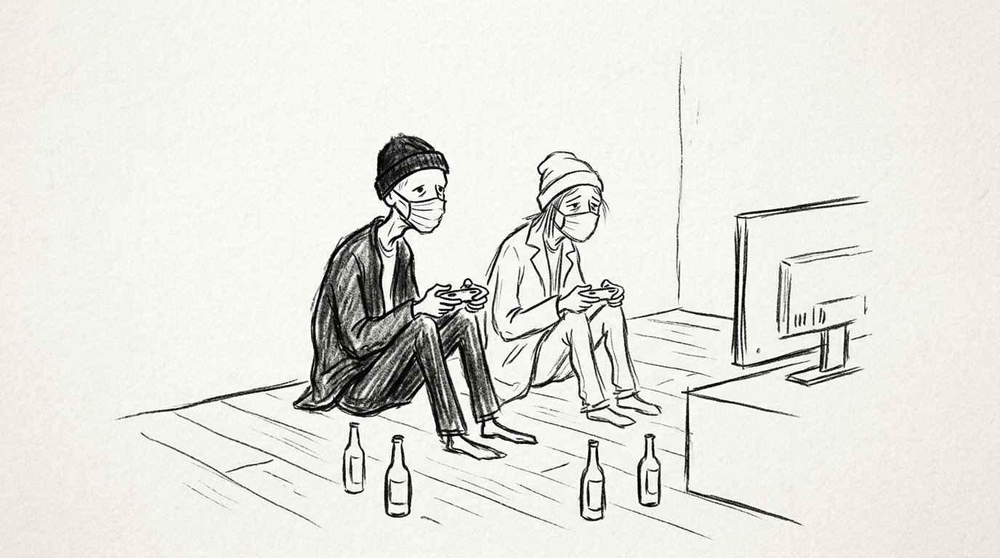
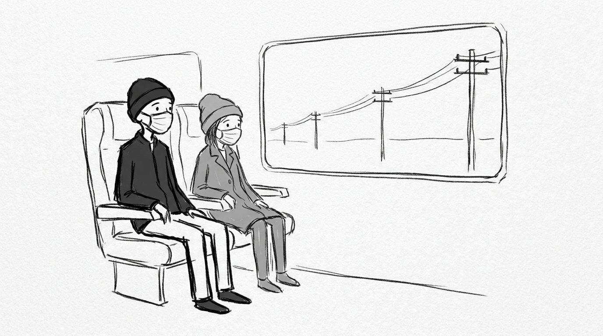
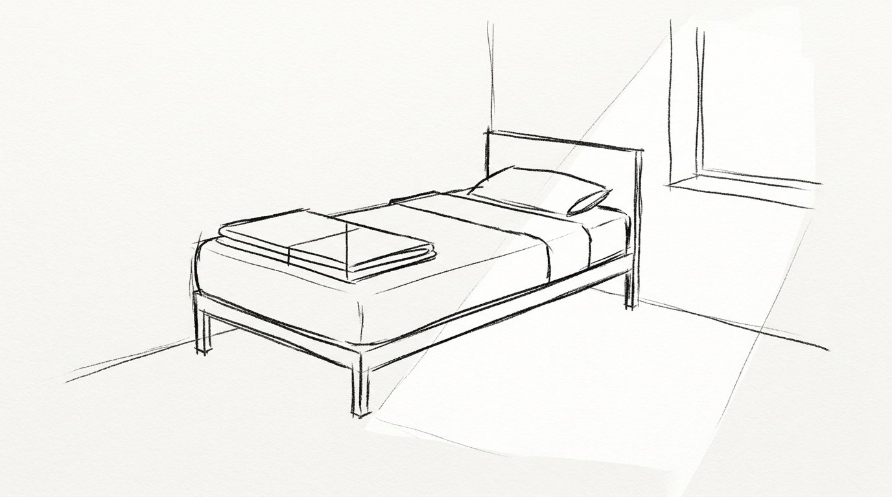
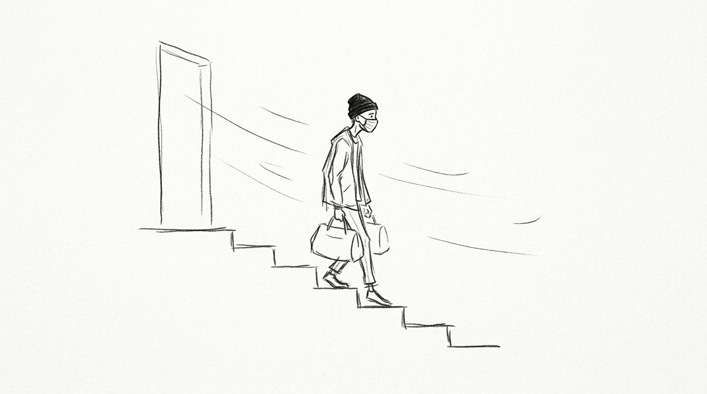

## 第一章：白灰色的日光燈與「不治了」

白灰色的牆壁反射著天花板上明亮的日光燈。走廊的地板打蠟打得很乾淨，定時有清潔員推著拖把走過，留下一股淡淡的松香水味。牆上掛著一台液晶電視機，屏幕上正播著天氣預報，藍色的氣象圖在一閃一閃。

這裡的條件並不差，窗外還能看到後面小花園裡修剪整齊的綠植。周圍排椅上坐著幾位病友，有的在低頭看報紙，有的在安靜地看著電視上的畫面。

「如果一切順利，三十多歲的時候，肝臟就撐不住了。」醫生指著屏幕上的圖表，語氣很平靜。

坐在旁邊的夥伴戴著灰色的毛帽和棉質口罩。外套套在身上顯得稍微寬鬆，肩膀窄窄地垂著。膝蓋上的雙手手背上貼著針孔膠布。夥伴聽完醫生說的話，沒有說話，只是看著自己的手指，輕輕點了點頭。

那天晚上，走廊的燈光調暗了。我們坐在走廊末端的休息區裡，看著落地窗外被路燈照亮的花園樹影。

「我不想治療了。」夥伴低著頭，聲音很輕。

「好。」我說。

第二天早上，我們去護理站辦理手續。護士給了兩張單子，我們在上面簽了字。手續辦得很順利，沒有人多問什麼，護士把單子收進檔案夾，把我們的行李袋遞了過來。

推開玻璃大門，外面的風迎面吹過來，口罩貼緊了嘴唇。外面的空氣很新鮮，稍微有些涼。

我們在離康復中心幾公里遠的住宅區租了一間普通的一居室。客廳裡有沙發、木製茶幾，我們還買了一台遊戲機接上電視。客廳很乾淨，窗戶擦得很明亮，陽光能直接照進來。

我們在那個出租屋裡住了兩個多月。

大部份時間我們都窩在沙發上。因為手心會一直出虛汗，塑料手柄握在手裡有些發滑。我們的反應很慢，視線聚焦在閃爍的屏幕上變得很吃力，遊戲裡的小人很快就會死掉。玩不上半個小時，眼睛和太陽穴就會開始酸痛。

我們不出門，三餐都點外賣，送來後都得放涼。因為食量都不大，我們通常兩個人分一盒飯，勉強吞嚥下幾口後，胃裡就開始頂著發脹。

我們偶爾會開罐啤酒來喝。每次第一口酒精喝下去，嘴裡留著很濃的啤酒苦味，胃裡像是有團火在慢慢燒起來，隨之而來的是一陣牽扯著神經的隱痛。夥伴通常只喝了一兩口就放下了，剩下的都是我喝。

某一天下午，那天太陽很大，曬得客廳晃眼。電視屏幕上正在介紹某個海邊的城市。

「我想出去晃晃。」夥伴突然轉過頭對我說。

「去哪裡？」我問。

「不知道。」對方看著電視屏幕，「隨便哪裡，坐車能到就行。」

我盯著屏幕上退回主選單的畫面，把手柄放在木桌上。

「好。」我說。

第二天，我們直接去了高鐵站。在巨大的廣播噪音中，我們提著各自的包，隨著排隊的人流，一步一步朝著檢票口走去。

---

## 第二章：車窗外的電線桿

車廂裡的冷氣很強，出風口的風不斷的吹過我們的頭頂。車窗玻璃反光，外面是大片平坦的農田，灰灰的一直延展到天邊。每隔幾秒鐘，就有一根高壓電線桿或是水泥立柱從視線裡飛速掠過去。

我們並排坐著，誰都沒有說話。高鐵車身晃動的頻率很小，但震動透過座位傳到骨頭裡，讓肩膀後方的關節泛起一陣酸痛。夥伴靠在椅背上，口罩遮住了大半張臉，頭上的灰色毛帽壓得很低，閉著眼睛，也不知道是不是在睡覺，雙手交叉揣在袖子裡，衣服空鬆地起伏。

抵達了旅途中的第一座城市。我們在車站附近的快捷酒店登記入住。房間很普通，兩張鋪著白色床單的單人床，空氣裡殘留著一點空氣清新劑的橙子味。我們把提包放在地上，各自在床上躺了兩個小時，聽著窗外街道上偶爾經過的汽車喇叭聲。

晚飯是在酒店後面的一家小餐館解決的。店裡亮著白光，幾張貼了仿木紋貼皮的桌子，空氣裡飄著炒菜的油煙。角落裡有兩個喝啤酒的人，說話聲音有些響。

我們點了兩道普通的家常菜。服務員把菜端上來，盤子落在塑料桌布上發出沉悶的聲響。

「吃一點。」我把一雙一次性筷子掰開，遞過去。

夥伴接過筷子，把口罩拉到下巴，露出的下半張臉有些蒼白。

夥伴吃得很慢，把盤子裡的配菜一點一點撥開，勉強嚥下了半小碗米飯。夾菜的時候，筷子尖端有些細微地發抖，碰到盤子邊緣，發出極輕的脆響。吃了幾口後，對方把筷子擱在盤子邊緣，手收回桌子下面，用手掌按著胃部。

桌上的菜在空氣裡慢慢散掉熱氣，表面蒙上了一層暗淡的光澤。

我沒有看著對方，也沒有說話。我伸手拿過桌上的啤酒，打開瓶蓋，在我們面前的玻璃杯裡倒滿。

酒滿了，泡沫沿著杯壁慢慢爬上來。我端起杯子，把裡面的黃色液體一口喝乾。苦澀的酒精順著食道滾下去，胃裡在幾秒鐘後像是被火鉗燙了一下，傳來一陣熟悉而尖銳的抽痛。

夥伴也端起了杯子。那隻手依然在發抖，杯子裡的液體晃動著，灑了兩滴在木紋貼皮的桌面上。對方張開嘴，勉強嚥下了一口，隨後眉頭緊緊皺在一起，把杯子放回原處。

剩下的酒，都是我喝完的。

兩天後，我們再次上了火車。這次的車廂更空一些，陽光穿過車窗，斜斜地照在我們空著的腳邊。火車一路向東，高壓電線桿漸漸消失，地平線的盡頭開始出現灰藍色的水面。

列車在終點站停下。

出站口很小，只有一個值班的鐵路員工。外面的風從空曠的廣場上吹過來，風裡帶著一股潮濕的、微鹹的冷意。我們拉緊了外套的領口，提著包走下台階。看到不遠處的沙灘，浪很小，平緩地漫上來，然後退下去。

---

## 第三章：海邊與假裝睡著的夜晚

小鎮的街道很空，兩旁的店舖大多拉著鐵捲門。我們沿著海邊的柏油路慢慢走著，鞋底踩在路面上，發出單調的沙沙聲。風從海面吹過來，帶著一股淡淡的鹹腥味，黏在臉上涼冰冰的。我們走下石階。退潮後的沙灘是深灰色的，上面散落著幾片被海浪沖上來的黑色碎海藻。浪很小，白色的泡沫平緩地湧上來，浸濕了鞋底的邊緣，又無聲地退回去。每一步踩下去，濕冷的沙子都冷冷地裹住鞋幫，陷得很深。

酒店是普通的連鎖酒店，房間在三樓，透過玻璃窗能看到下面亮著幾盞路燈。

夜深了，街上的車聲徹底消失。

夥伴站在窗前。灰色毛帽已經摘了下來，露出有些雜亂的頭髮。口罩垂在脖子上。窗玻璃上映出模糊的輪廓，窗外是一片漆黑，只有海浪拍擊沙灘的聲音，規律而沉悶，一聲接著一聲。

「我想死。」夥伴看著窗外，聲音極輕。

我平靜地躺在被窩裡。我沒有坐起來，雙眼盯著漆黑的天花板，瞳孔裡反射不出一點光亮。

「嗯。」我說。

兩人都沒有再說話。幾分鐘後，窗邊傳來衣服摩擦的窸窣聲。夥伴回到了另一張單人床上，拉上被子。房間裡重新歸於死寂，只剩下窗外一遍遍重覆的浪潮聲。

後半夜，屋子裡很冷。

隔壁床傳來微弱的動靜。隨後是布料摩擦的沙沙聲。我看著黑暗中的天花板，聽著夥伴輕手輕腳地穿上外套，拉好拉鏈，拿起了放在床頭的灰色毛帽和口罩。

鞋底踩在塑料拖鞋上的啪嗒聲在房門前停住。接著，是門鎖軸承轉動的微弱刮擦聲，房門推開，走廊微弱的光線漏了進來，隨後門輕輕合上，鎖舌卡入鎖眼，發出細微的咔嗒聲。

在金屬摩擦聲響起的第一秒，我的眼睛就已經睜開了。但我沒有動。

我重新閉上眼睛，右手死死抓著被子的邊緣，指甲陷進棉被的纖維裡。我躺在枕頭上，胸口有規律地起伏著，吸氣，呼氣，在黑暗中維持著平穩而穩定的呼吸節奏。

窗外的海浪聲還在重覆。

天亮了。光線穿過窗簾的縫隙，斜斜地照在客房的木地板上。

我翻過身。隔壁的單人床上空無一人，被子被折疊得整整齊齊，枕頭擺在正中間，看起來就像沒被使用過一樣。

---

## 第四章：走廊的衝撞與海邊的風

家屬是在第二天下午趕到的。

在當地派出所辦事窗口前，鋼筆在表格上劃出刺耳的沙沙聲。工作人員蓋下紅色的印章，發出沉悶的一聲。空氣裡有一股乾燥的紙張和油墨味道，周圍很安靜，能聽到隔壁辦公室隱約的說話聲。

配合做完筆錄並對接完遺物後，我提著包，獨自穿過辦公區外狹窄的水泥走廊，準備去出口處。走廊很窄，上方亮著一盞微弱的白熾燈。

夥伴的姐姐抱著一個牛皮紙袋從走廊那端迎面走過來，裡面裝著厚厚的證明材料。

在與我擦肩而過的那一秒，對方沒有停步，也沒有開口，而是迎面直直地走過來，用肩膀極重地撞在我的肩膀上。

我的身體歪了一下，腳步朝旁邊趔趄了半步，肩膀那處的骨頭傳來一陣沉悶而結實的隱痛。我沒有出聲，也沒有站過去解釋，只是扶著牆壁慢慢站穩。對方沒有回頭，皮鞋踩在水泥地上的聲音在狹窄的走廊裡漸漸走遠。

我站在那裡，隔著口罩重重地吐出一口氣。肩膀隱痛，但我什麼也沒說。

領完所有遺物並辦完交接後，沒有人跟我說話，也沒有人提起後續的葬禮安排。

我提著自己的包，獨自走出了派出所的大門。

天空很晴朗，明亮的陽光照在空曠的石板廣場上。空氣很乾，沒有下雨，風從大門外的街道上刮過來，吹得外套的下擺輕微擺動。

我提著包，走下最後一級石階。

我知道，自己這一生，再也不會回到這個海邊。

---

## 附註

整篇文章的靈感來自 B 站影片《一個縣城青年，逃跑的十年》下方的一則觀眾留言。本文並非對留言內容的紀實改寫，而是基於那段敘述延伸出的虛構創作。

關於留言本身的真實性，已有不少討論與爭辯。這裡無意判斷它是真是假，或其中有多少真實與誤差。真正讓我留下深刻印象的，是那種在極端處境裡無法回答的問題：如果人生真的走到那一步，我不知道自己會起身阻止，還是選擇裝睡。

以下附上影片連結與留言的原始內容：

https://www.bilibili.com/video/BV1mVSUBrEz5

--- 

关于东北佬与我自身经历

不知道大伙知不知道，但是很多抑郁症的药物是会影响肝脏的，会引发肝衰竭

接下來是我自己和小猴的故事

我是一名抑郁症患者（重度抑郁，重度焦虑，双向情感障碍和一些其他轻重不同的别的），小猴是我在上海精神卫生中心认识的朋友（重度抑郁，重度焦虑，双向情感障碍，幻听，幻视，妄想，狂躁，严重厌食）

他瘦瘦的小小的，所以我有时会叫他小猴。他的情况比我严重很多，接受了专家组的實驗項目吃的藥和接受的治療比我激進很多（包括但不限於電擊，顱磁共振等）。他身體很差（168cm/63斤）因為軀體化，也因為治療

醫生的說法是他如果治療順利的話會在三十多歲左右死於肝衰竭之類的器官衰竭併發症，於是他在上精衛住院了。

條件很差，12人的病房和各種瘋的病友，沒有手機等電子設備，唯一的娛樂是公用的電視，還要擔心被狂躁症發作的病友砸壞。後來他出院了，我恰巧也不再住院了。

他說他不想治了，我說好。於是我們一起打遊戲一起吃飯一起喝酒。

他說他想出去玩，我說走。於是我們去了長沙、鄭州、青島最後是威海。

他說他想死，我說嗯，於是在他半夜一個人從酒店離開的時候我假裝睡著了。

最後我和他家人一起把他送進火葬場。他姐姐給了我一巴掌，很痛。

最後的最後我參加了他的葬禮

我想我再不會去威海

云-_-清-

