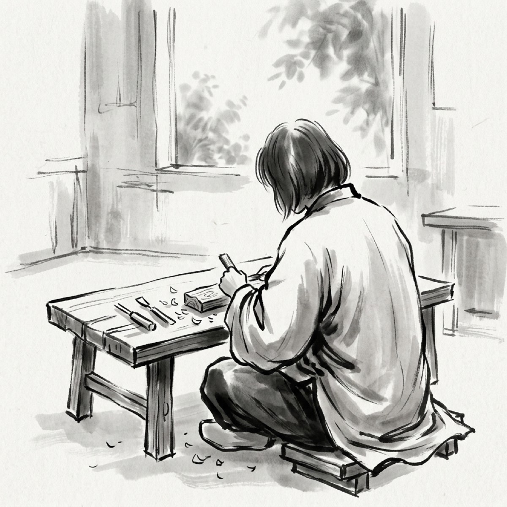
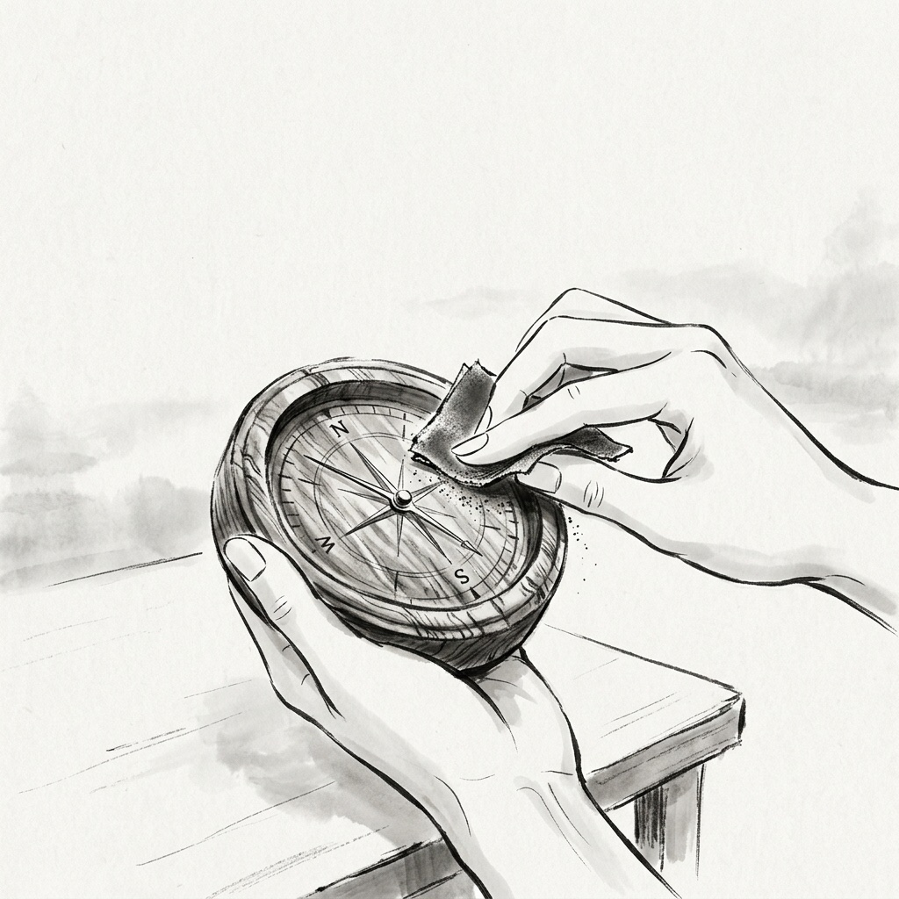
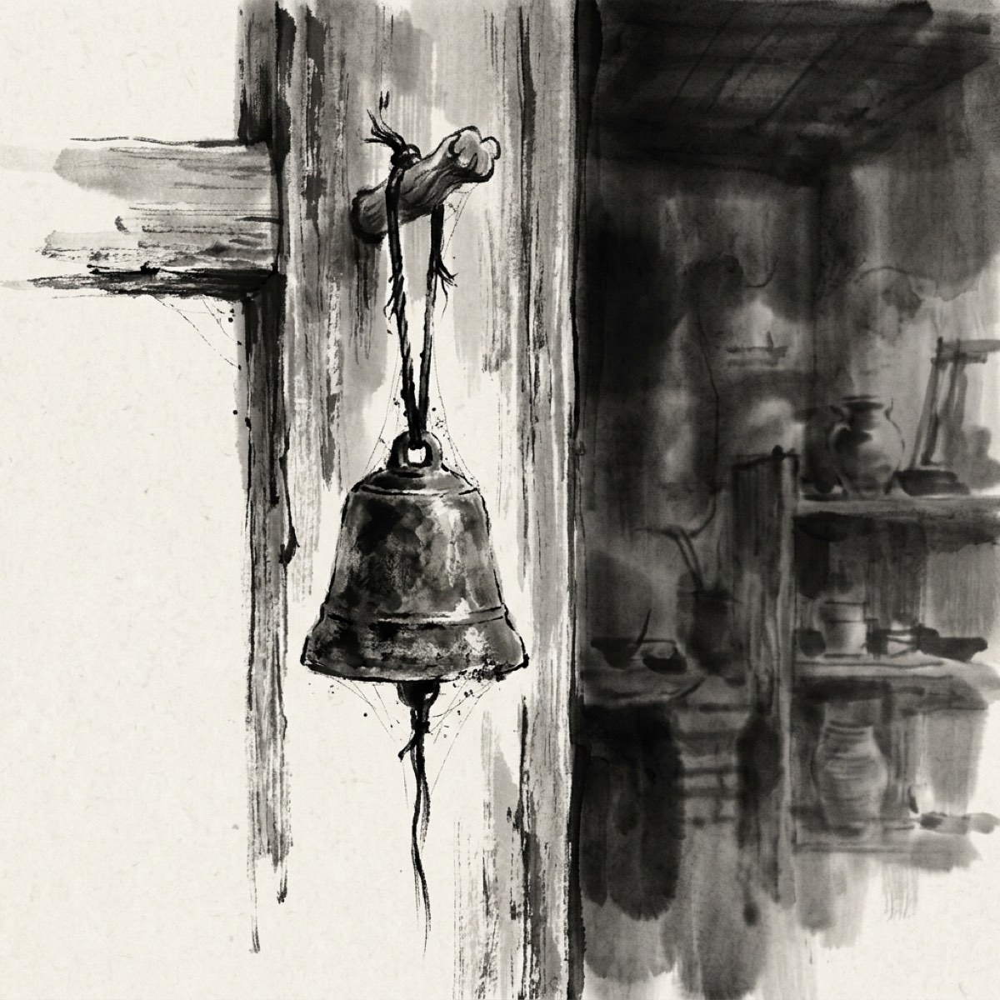
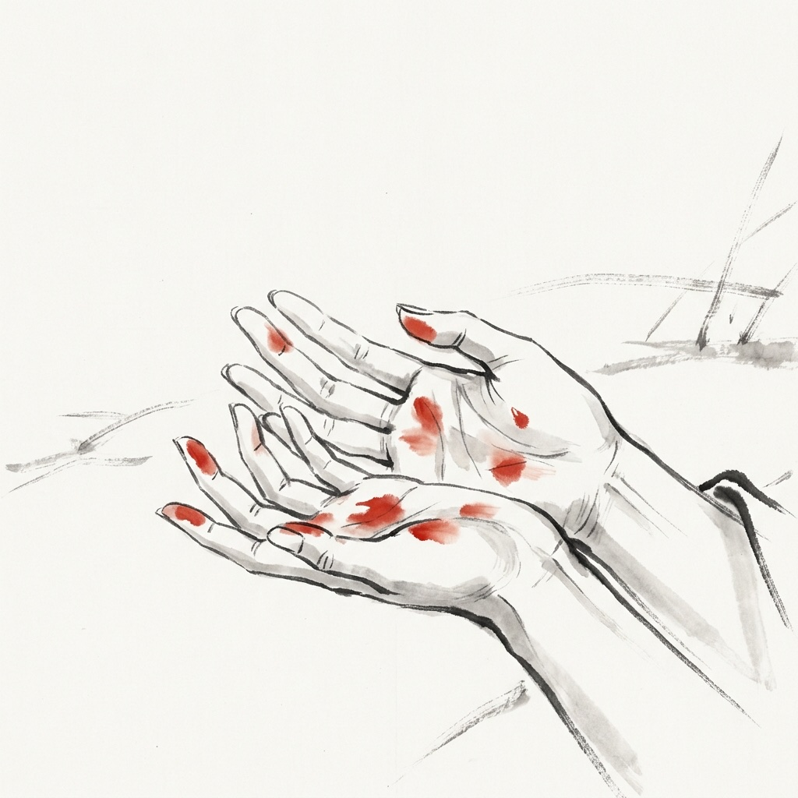
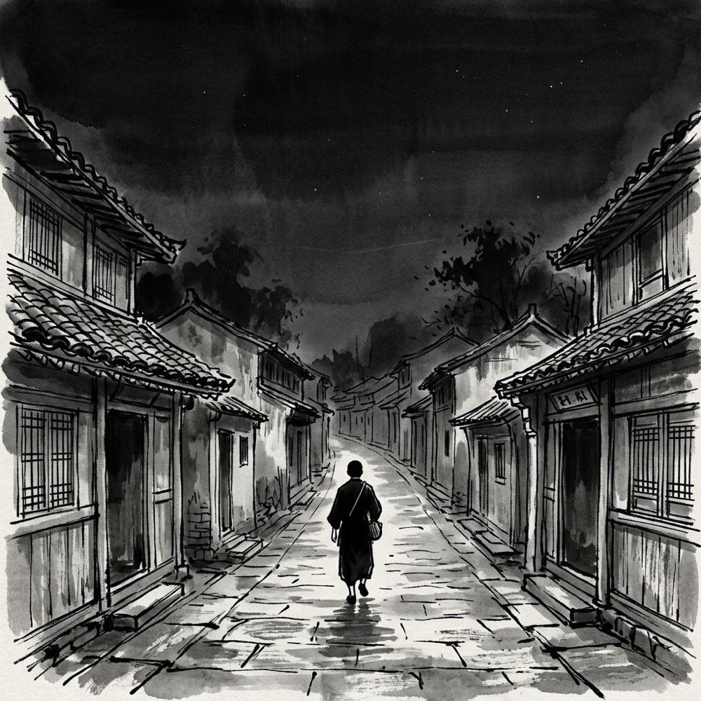
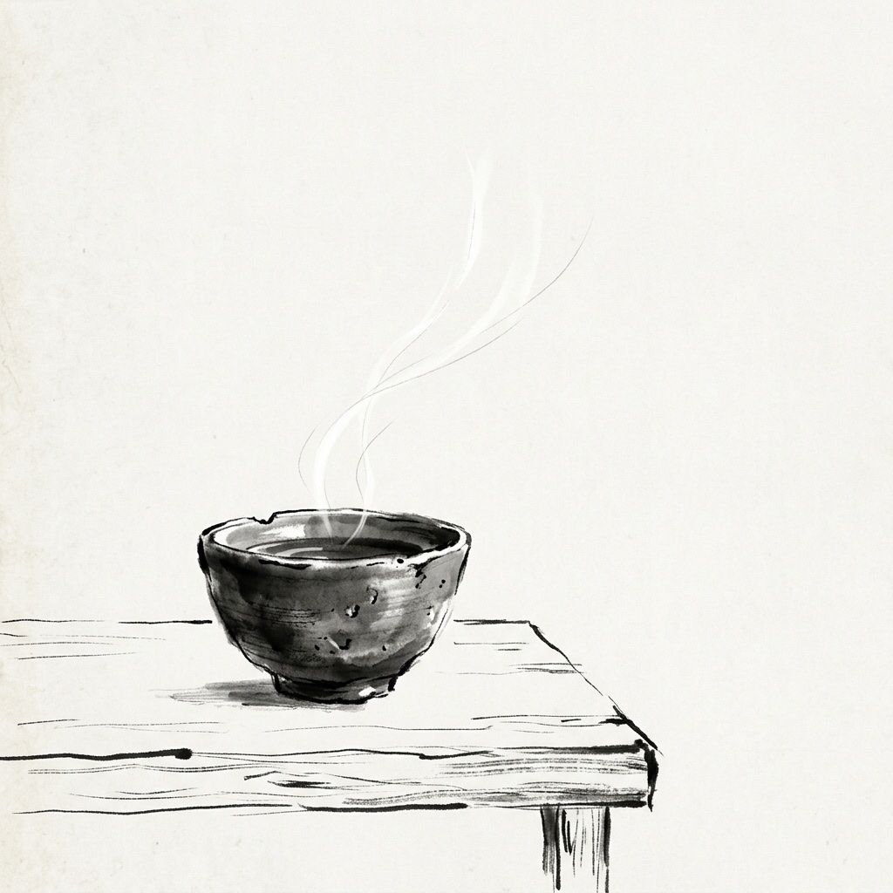
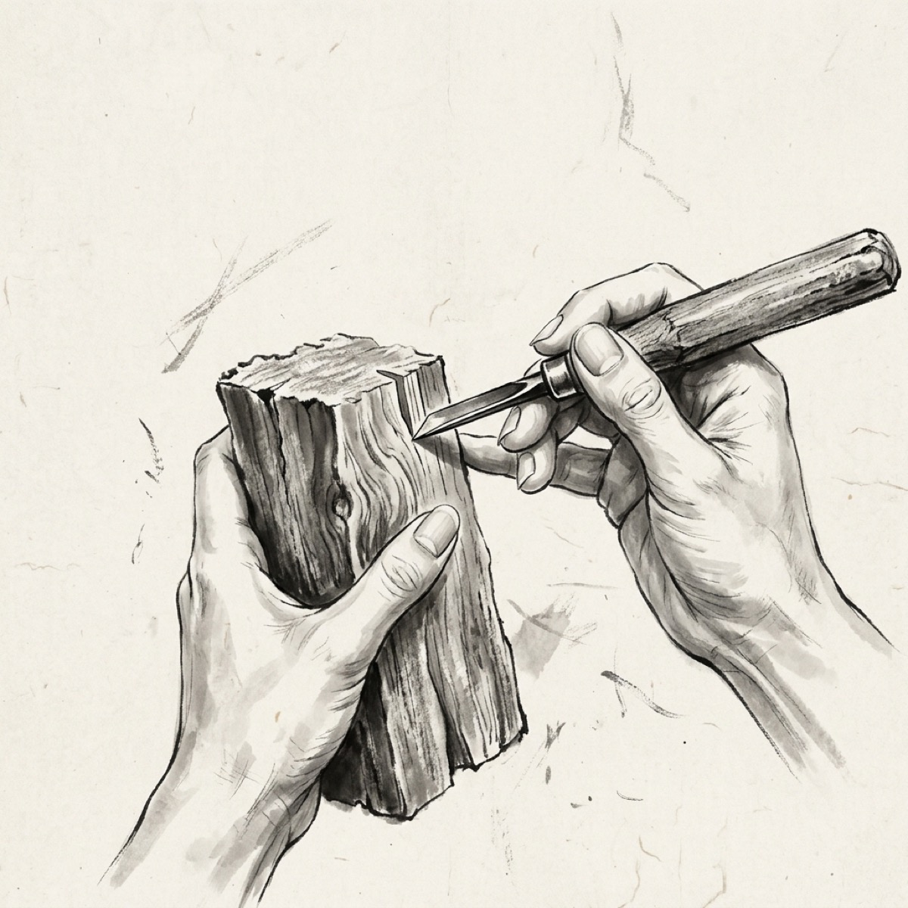
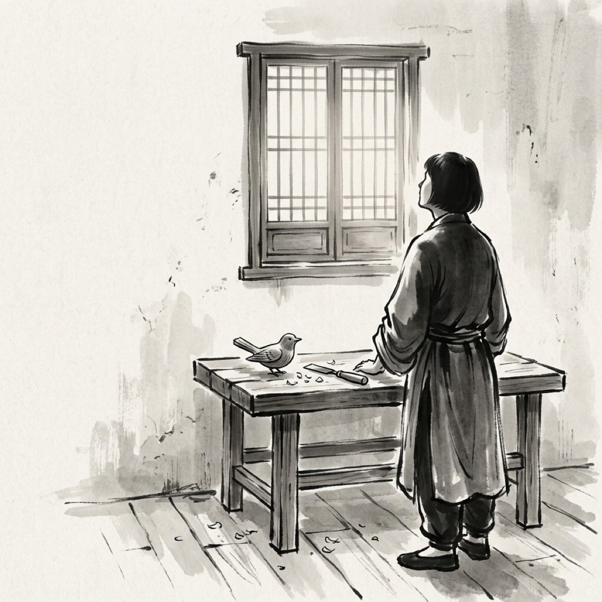
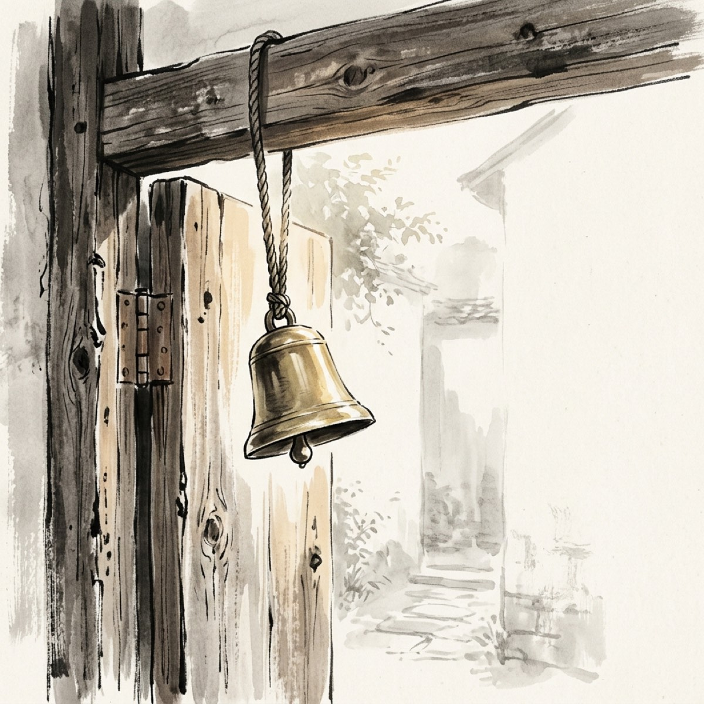

## 第一章：亮燈的櫥窗

晨光落下來的時候，街角依然安靜。

我推開木門，清晨略帶寒意的空氣隨之湧入。門後的舊銅鈴在上方發出一聲短促的悶響，隨即又歸於平息。我側身進屋，將那扇樸素的實木門重新合上，手掌觸碰到木質紋理的粗糙感，未插上門閂，只任由它維持著輕觸門框的解鎖狀態。

室內的空氣還沉澱著昨日木屑的微香。我走到展示櫥窗前，將沾了些許塵埃的布展平，隔著透明的櫥窗玻璃看向門外。清晨的街道還沒有多少行人，只有遠處的環衛車發出低沉的嗡鳴。我用軟布順著櫥窗玻璃的邊緣緩緩擦拭，抹去夜間凝結的一層稀薄水氣。

展示櫥窗的架子上，此時空無一物。

我轉身走到工作檯前。檯燈沒有開，但在自櫥窗投射進來的晨光中，昨晚完成的那支木匙正靜靜躺在木屑堆旁。那是用一整塊胡桃木雕刻出來的長柄匙，邊緣被砂紙反覆打磨出溫潤的弧度，木紋如同流動的深色水流，在柄部交織出細密的年輪。我伸出粗糙的指尖，輕輕撫過它微涼的表面。

我拿起木匙，再次走向展示櫥窗，小心翼翼地將它置於架子的中央。

透過櫥窗玻璃看過去，那支胡桃木長柄匙在晨曦的微光中投射出一段柔和的影子。它安靜地立在那裡，彷彿在等待著什麼。

我回到工作檯前坐下。檯燈的黃色光暈在桌面鋪開，照亮了那塊尚未成形的櫻桃木料。我拿起刻刀，刀鋒抵住木料邊緣，微微用力，削下一片薄薄的木屑。木屑落在桌面，發出極輕的沙沙聲。

這是我最熟悉的節奏。刀鋒滑過，木頭的紋理在手掌下逐漸展現。然而，在雕刻的間隙中，我的目光總會不自覺地越過檯燈的光暈，落在木門上方那只舊銅鈴上。

它掛在門內側，由一根泛著黑色的棉繩懸吊著，銅身斑駁，在晨光中沒有一絲晃動。

門外的街弄漸漸有了聲音。匆忙的腳步聲隔著木門傳來，混雜著自行車的鈴聲與遠處的交談。偶爾有幾道模糊的剪影在櫥窗玻璃上掠過，有的走得極快，有的微微偏了偏頭，但沒有任何人停下腳步。

我握緊了手中的刻刀，將注意力重新收回到櫻桃木料上。刀尖在木料上刻出一道圓潤的弧線。

門依然閉合著，舊銅鈴安靜懸掛。我一邊雕刻，一邊聽著門外的喧囂漸漸將這個街角填滿，心中默默等待著那扇木門被推開、銅鈴清脆響起的一瞬間。

---

## 第二章：櫥窗外的過客

正午時分，投射在青石板路上的影子被縮得極短。

工作檯前的檯燈依然關著，大片白晝的光線穿過展示櫥窗的玻璃，將半個檯面照得明晃晃。我稍微側過身，避開直射的強光，專注於手中的那塊櫻桃木。

雕刻刀在指間沉穩地推進，木料的碎屑細密地飄落在桌面。今天要做的是一隻圓形的木羅盤。指針與刻度的線條極為繁複，需要用極細的斜刀一筆一筆挖出淺淺的凹槽。木紋呈淡粉色，質地比胡桃木更為緊密，每一刀下去，都能感覺到木料傳來的堅韌阻力。

我時不時抬起眼，透過櫥窗玻璃看著門外的街道。

街上的行人漸漸多了起來。穿著深色風衣的男人行色匆匆，皮鞋敲擊路面發出急促的聲響；抱著沉重紙箱的店員低著頭，快步避開街角的積水。他們的剪影隔著櫥窗玻璃交錯掠過，帶著白晝特有的忙碌節奏。

此時，一個戴著寬檐麥稈帽的婦人緩緩走過。她的腳步在經過小店時稍微慢了下來。

她的目光微微一轉，隔著擦拭乾淨的櫥窗玻璃，在展示櫥窗的架子上停留了下來。

那架子的正中央，昨晚雕刻好的那支胡桃木長柄匙正靜靜躺在那裡。晨光此時已經移走，只剩下一抹柔和的陰影覆蓋在匙勺的凹面。婦人的視線在木匙上停留了約莫兩秒鐘，寬檐帽下露出一角若有所思的側臉，隨後她拉了拉帽簷，再次融入了匆匆的人流之中。

雖然只是短暫的兩秒，但我握著木料的手指微微緊了緊。

空氣中似乎有一種無形的絲線，在她的目光與櫥窗內的木匙接觸的那一瞬間被拉起，隨即又在人群的流動中無聲地崩斷。我低下頭，看著手中已經初具雛形的羅盤。羅盤的邊緣已經被打磨得圓潤，指針的軸心也已裝配妥當，只需最後的拋光。

我將自己此時的專注與方才那兩秒鐘的想像，一同打磨進了這隻羅盤裡。

我拿出一張細砂紙，指尖抵住砂紙，沿著羅盤的邊緣反覆摩挲。櫻桃木的質地在指尖的摩擦下微微發熱，泛出淡淡的木質香氣，表面呈現出如玉石般柔和的微光。

下午的光線漸漸變得傾斜，街道上的喧囂也開始染上黃昏的灰色調。木門一整天都緊閉著，門內側上方懸掛的舊銅鈴也始終保持著原樣，沒有發出半點聲響。

我吹掉羅盤上的最後一縷木屑。

起立走到展示櫥窗前，我將這隻剛完工的櫻桃木羅盤擺在展示櫥窗的架上，與那支胡桃木長柄匙並列在一起。兩件木雕在逐漸暗下來的光線中，靜靜地靠在一處。

門外，夕陽將路人的影子拉得極長。我退回到工作檯後，看著櫥窗裡並排的兩件作品，以及依然靜止的木門與銅鈴。

---

## 第三章：風鈴未響的店鋪

日子在木屑的沙沙聲中無聲無息地流逝，季節悄然換了幾輪。

展示櫥窗的架子上，除了最初的胡桃木長柄匙與櫻桃木羅盤，後來陸續雕刻的十多件作品也已並排躺了很久。白晝的光線每天依舊照常投射進來，但漸漸地，光線裡開始夾雜著飛舞的微細顆粒。當我再次走向櫥窗時，發現這些木雕深色的輪廓上，都已經覆蓋了一層薄薄的、灰白色的微塵。

我伸出指尖，輕輕撫過木匙的柄部。指尖帶走了一道乾淨的木色，卻也在邊緣留下了灰塵堆積的痕跡。

我拿起抹布，細緻地拂去這些作品表面的積灰，隨後將架子上的塵土也拭淨。木雕重新露出了原本的紋理與光澤，但在這座安靜得近乎凝固的屋子裡，它們卻顯得有些落寞。

門外的街道上，人群依舊如潮水般湧動。喧囂的聲音隔著木門傳進來，沉悶而遙遠。我隔著櫥窗玻璃看去，行人的剪影在白光中快速閃過，他們或是低頭看著手機，或是彼此低聲交談，所有的步履都帶著明確的目的地，卻沒有任何一個目的地是這扇木門。

我的目光緩緩向上移動，落在門內側上方懸掛的舊銅鈴上。

那隻舊銅鈴依然安靜地吊在棉繩下，銅鈴表面覆蓋著厚厚的暗灰色氧化層，邊緣甚至積著幾縷蛛網。除了我自己進出時那幾聲沉悶的撞擊，自從將它掛上的那天起，它便一次也沒有真正為來客響起過。它像是一具乾枯的鐘擺，在沒有風的室內徹底死去了。

我退回工作檯前，看著手中握著的刻刀，指關節因為用力而有些發白。

胸口沉積著一種沉悶的重量，隨之而來的是揮之不去的自我懷疑。每一件作品，我都曾傾注了無數個夜晚的專注與心血，但它們躺在展示櫥窗的架子上，卻如同被這個街角拋棄的孤島。我雕刻的這些東西，對這個世界而言，到底有沒有任何存在的必要？

為什麼沒有人願意推開這扇木門？哪怕只是讓那隻舊銅鈴發出一次聲響。

街道上的嘈雜聲在門口翻滾，將這間小店的死寂反襯得更加刺耳。我重新低下頭，看著桌面上被陰影覆蓋的木料，卻遲遲無法落下第一刀。

展示櫥窗裡，剛被拂去灰塵的十多件木雕在微光中泛著冷清的光澤。門口的舊銅鈴如同一塊沉重的鐵，無聲地懸掛在昏暗中，拒絕給予我任何回音。

---

## 第四章：浮華的陳列

那種被街道遺忘的死寂，最終擊垮了我的堅持。

我從展示櫥窗的架子上，將那支胡桃木長柄匙、櫻桃木羅盤，以及後來陸續雕刻的十多件作品一一取下。把它們放進木箱時，木雕之間發出沉悶的碰撞聲。我合上箱蓋，也合上了那些專注而安靜的夜晚。

接下來的幾天，工作檯上堆滿了彩色的漆罐、咬合的齒輪與亮晃晃的金屬發條。我不再計較木料原本的紋理，而是在表面塗上俗麗的大紅與翠綠。我做了一隻會拍打翅膀的木鴨，和一隻裝著發條、會反覆翻跟頭的小丑泥偶。當發條被擰緊時，金屬齒輪會發出刺耳的尖叫聲。

我將這些上了色、裝著發條的玩具擺在了展示櫥窗的架上。

扭緊發條，木鴨開始笨拙地扇動翅膀，發出啪嗒啪嗒的機械撞擊聲；小丑泥偶在紅綠相間的底座上翻滾，發出咯吱咯吱的咬合聲。

門外的街道上，匆忙的腳步聲第一次開始成群地停下。

人們隔著櫥窗玻璃指指點點，幾個孩童興奮地把臉貼在玻璃上，看著裡面搖擺喧鬧的玩具，眼睛裡閃爍著亮光。櫥窗前第一次聚集了這樣多的人影，折射在玻璃上的剪影重重疊疊，喧雜的笑鬧聲隱約透過木門縫隙傳進來。

在人聲最嘈雜的時候，我的目光越過人群的肩膀，落在那扇木門與內側懸掛的舊銅鈴上。我想像著或許會有人分出一隻手，推開那扇未鎖的門。然而，玻璃外的喧囂就像一場隔岸的焰火，火光映在玻璃上，卻照不進門內。人群指點著、笑著，卻始終隔著那一層透明的冰冷介質，沒有人向木門邁出一步，舊銅鈴依然死寂如初。

我看著櫥窗外那些被吸引的目光，胸口卻沒有感到一絲溫度。

這就只是用金屬齒輪與流水線彩漆堆砌出來的把戲，它們沒有靈活的線條，也沒有砂紙反覆摩挲出的自然光澤。我坐回工作檯前，看著雙手上沾染的大紅色油漆，只覺得黏膩而刺眼。

不久後，金屬發條的機械聲漸漸慢了下來。

木鴨的翅膀無力地下垂，啪嗒聲沉寂下去；小丑泥偶歪斜地倒在底座邊，齒輪發出最後一聲乾癟的呻吟，徹底停擺。

人群見沒有了熱鬧，便成群地散去。櫥窗玻璃外的剪影迅速稀疏，街道再次恢復了平日的冷清。

我走到展示櫥窗前，看著這幾隻色彩斑駁卻毫無生氣的玩具。沒有了發條的驅動，它們只是一堆塗了厚重油漆的廢木與鐵片，雜亂而庸俗地堆在架子上。這間小店比以往更加安靜，而我的內心，如同這隻停擺的木鴨，空洞得只剩下一片虛無。

---

## 第五章：合上的木門

喧囂散去後的夜晚，小店顯得比以往任何時候都要冷清。

展示櫥窗裡，那隻彩繪木鴨無力地低著頭，翻滾的小丑泥偶也歪斜在一旁，它們身上的紅綠油漆在昏暗的夜色中顯得黯淡而滑稽。我坐在工作檯前，看著自己指甲縫裡殘留的乾涸漆斑，試圖用木屑去擦拭，卻只擦出了一陣刺痛。

這幾天來，我像是一個在街角雜耍的丑角，用金屬齒輪的刺耳摩擦聲和刺眼的塗料，去乞求路人施捨幾秒鐘的目光。

可當發條停擺，人群散去，留在這間屋子裡的，只有滿地的落漆和更加沉重的死寂。那扇木門依舊緊閉，門內側上方懸掛的舊銅鈴也依然如一塊廢鐵般靜止。我用盡了辦法去迎合外面的街道，到頭來，卻只是給自己平添了一座堆滿滑稽玩具的荒島。

長達數月的等待，加上這場空洞的熱鬧，終於化作一種深入骨髓的疲憊。

我看著這間小店，雙手無力地下垂。我熄滅了工作檯上的檯燈。

小店瞬間被門外的黑暗吞噬。我推開木門，默默地走了出去。

我將實木門緊緊拉上，木質與木質碰撞，在空曠的夜裡發出沉悶的聲響。我取出鐵鑰匙，將工作檯角那把舊銅鎖掛在門扣上。金屬機關合攏，在黑暗中發出一聲冷硬的「咔噠」聲。

深夜的街坊很冷，吸入肺部的空氣帶著刺骨的霜雪涼意。

我低著頭，沿著青石板路緩緩走著。街道兩旁的房屋皆是一片漆黑，每一扇木門都關得極緊，連最細微的縫隙裡也透不出一絲光亮。整條街安靜得如同荒野，黑色的影子在微弱的路燈下被拉得極長。

我停在一盞路燈下，將雙手揣進衣兜。

手指在兜裡碰到了那把冰冷的鐵鑰匙。我握緊它，金屬的稜角用力硌著掌心。我把手抽出來，就著昏黃的燈光，看著指甲縫裡那抹殘留的刺眼紅漆。我用拇指指甲用力刮著那些紅漆，直到指甲縫生疼，紅色的漆片細碎地掉落在地上。

漆皮退去後，露出了掌心與指側那一層厚厚的、略顯粗糙的老繭。

那是無數次握刀與磨木留下的痕跡。我用食指輕輕摩挲著這些凸起的老繭，掌心隨之產生了微微的溫熱感。寒風中，我的手指無意識地微微彎曲，拇指下壓，做出了握著刻刀時的姿態。

我的手在半空中虛空地划動了一下，像是在削去一塊無形的木屑。

我抬起頭，看著前方無盡的黑暗與道路兩旁緊閉的木門。隨後，我轉過身，順著原路往回走。

我回到小店門前，拿出鑰匙，將那把冰冷的舊銅鎖卸下放入兜裡。

我推門走進黑暗的店內，重新將木門合上，並在黑暗中摸索著插上了木門閂。我沒有開燈，只是在工作檯前坐下，伸手在黑暗中摸索著。片刻後，我的手指觸碰到了一塊尚未雕刻的櫻桃木料，冰冷、乾爽、木紋粗糙而踏實。

我將那塊木料緊緊握在掌心裡，閉上眼睛，在寂靜的店鋪中一動不動地坐著。

---

## 第六章：蒸汽的無形

深夜的店內，寒氣逼人。

我在黑暗中摸索著，點燃了工作檯角那盞小瓦斯爐。藍色的火焰跳躍起來，舔舐著金屬水壺的底部。不久後，水壺裡傳來咕嘟咕嘟的沉悶水聲，壺口隨之噴出一股細長的白霧。

水開了。

我關掉爐火，將熱水倒入工作檯上的粗陶馬克杯中。沸水撞擊杯底，冒出滾燙的熱氣。隨後，我撥開開關，點亮了工作檯上的那盞檯燈。

一束昏黃的光線斜斜地打在桌面上，照亮了那隻粗陶杯。

在檯燈窄窄的光束中，無數縷白色的蒸汽騰空而起。它們如同極細的白色水墨絲線，在光暈裡糾纏、盤旋，隨著細微的氣流緩緩上升。蒸汽的形狀在空中不斷變幻，升到半空時開始朝四周擴散，線條漸漸變淡、變薄，最終無影無蹤地融入了周圍的黑暗裡。

我伸出雙手，將指尖貼在陶杯那粗糙且微涼的壁面上。

源源不斷的熱量從杯壁傳過來，透過老繭，一點一點地浸潤進我有些僵硬的指關節。我微微低俯下身，將臉湊近杯口。滾燙的濕氣撲在臉上，帶著粗陶和木頭的乾爽氣息，將眉眼間殘留的寒意驅散了乾淨。

我抬起眼，看著那束再次歸於清亮的光線。

在光束照不到的角落裡，展示櫥窗的架子上，那些木雕的輪廓依然隱沒在黑暗中。

白色的蒸汽此時已經完全消散，沒有留下任何痕跡。然而，當我深深吸氣時，肺部不再有先前那種冰冷刺骨的刺痛感。空氣變得有些濕潤，屋子裡原本刺骨的寒氣，在看不見的角落裡似乎悄悄軟化了下來。

熱水在杯中漸漸平息，溫度也緩慢地降了下去。

我依然捧著杯子，看著那束空無一物卻溫潤的光束。小店依然如往常般安靜，門上掛著的舊銅鈴依舊沒有動靜，可我的雙肩卻不知不覺地鬆了下來。

我閉上眼睛，在溫熱的杯壁與漸漸回溫的空氣中，感受著這份看不見、卻真實存在的暖意。

---

## 第七章：最初的模樣

清晨，街角的路燈還沒有熄滅。

昏黃的街燈光線穿過展示櫥窗的玻璃，在小店內的地面與工作檯上投下一道長長的光束。即便不點燈，這束自門外照進來的光也足夠清晰。我坐在工作檯前，在這片靜謐的微光中俯下身，從檯下的木箱深處翻出了一個長久未動的紙包。

扯開乾癟的細繩，紙包裡露出一隻形狀歪斜的小泥偶。

那是童年時，我在老家後院用黏土捏成的小東西。泥偶的五官早已模糊，一隻手臂短了半截，身上還殘留著當時指壓出的不平整凹槽。在自櫥窗投射進來的街燈光線下，我用拇指輕輕撫過它粗糙的表面，抹去那些陳年的灰塵。

觸感微涼而乾燥，帶著泥土特有的粗砂質感。

看著這隻殘缺的泥偶，我的唇角不自覺地微微泛起一絲弧度。

那時沒有展示櫥窗，沒有精緻的木架，也沒有這扇需要等待顧客推開的木門。我只是蹲在樹蔭下的濕潤泥地旁，雙手沾滿泥漿，為了一隻站立不穩的泥偶而滿心歡喜。那種雙手捏塑黏土時的專注，以及看著它成形時的純粹喜悅，在此刻透過指尖的觸覺，再次回到了我的身體裡。

我將泥偶平穩地放在工作檯上，靠在檯燈旁。

隨後，我站起身，走到那扇緊閉的木門前。

那把舊銅鎖此時正靜靜躺在工作檯角。我伸手拉開了插在門上的木門閂，抵住厚實的實木門板，用力向前推去。

門板緩緩向兩側敞開。

一陣清晨的冷風夾帶著青石板路的潮濕水汽迎面吹來，瞬間將室內沉悶的木屑味與油漆味沖散。我站在門口，感受著涼爽的夜末冷風穿過衣襟，掠過臉頰。門外的街道在拂曉中顯得無比寬廣，空氣自由地在門內與門外之間流動，不再有任何阻隔。

我沒有在門口停留太久。拉回門把，我將木門輕輕合上。

門框相碰，發出極輕的悶響。我沒有插上門閂，只任由這扇實木門維持著解鎖的合攏狀態。

我重新坐回工作檯前。

穿過展示櫥窗的街燈漸漸熄滅，取而代之的是拂曉時分清晨的藍灰色天光。冷白色的微光靜靜地鋪在檯面上，照亮了那塊粗糙的櫻桃木料。我沒有拿起刻刀，只是靜靜地看著它，木料最初的輪廓在我的視線中逐漸浮現出來。

---

## 第八章：意義的誕生

晨光在展示櫥窗的木架上緩緩鋪開。

我站起身，將架子上的彩繪木鴨與小丑泥偶一隻隻拿下來。油漆在早晨的亮光中顯得粗糙，發條鐵片冰冷而沉重。我把它們放進桌下的木箱底，木箱合攏，掩蓋了那些喧鬧的金屬齒輪。展示櫥窗的架子上，重新回復了原本的空曠與乾淨。

我坐回工作檯前，點亮了檯燈。黃色的光暈與從櫥窗斜射進來的晨光交疊，在桌面中央的那塊櫻桃木料上染出一層暖意。

我拿起刻刀，抵住木料的邊緣。

第一刀切下去，微紅的木皮順著刀刃利落地剝落，露出裡面乾爽、泛著微白光澤的新木。我手腕使力，刻刀在指間沉穩地遊走。削下來的木屑成捲地翹起，滑過手背，輕飄飄地落在我的膝頭和腳邊，在地面上鋪了薄薄的一層。

刀鋒削減木質的沙沙聲再次在安靜的店裡響起，規律而綿長。

我的手指因為持刀發力而微微泛紅，指尖在與木料的反覆摩擦中漸漸發熱，那股熱量順著指關節傳導全身，驅散了清晨的微寒。這一次，我的雙眼只緊緊盯著刀尖滑過的軌跡，看著平整的木紋在刀刃下呈現出柔和的弧度。

門外的街道上傳來了清晨的腳步聲，偶爾有幾道晃動的剪影在櫥窗玻璃上掠過。

我沒有抬頭，手上的刻刀沒有一絲遲疑。刀尖輕巧地剜出鳥腹的弧線，再順著木紋削出雙翼展開的邊緣。

沒有發條，沒有繽紛的漆料，也沒有喧囂的機械聲。

只有刻刀遊走時的沙沙聲，和木料在指掌間逐漸圓潤的觸感。當最後一刀落在鳥尾的羽翼上時，我的指尖滾燙，呼吸在清晨乾淨的空氣中顯得平緩而悠長。

我吹掉鳥背上最後一縷細微的木粉。

一隻樸素的木質小飛鳥靜靜地立在我的掌心裡。它的線條極為簡單，表面甚至還留著刻刀切削過後微微起伏的棱角，卻散發著櫻桃木微甜的乾爽氣息。

我捧著這隻小木鳥站起身，緩緩走到展示櫥窗前，將它輕輕放在空無一物的架子中央。

木質小飛鳥在清晨的微光中投下一道沉靜的影子。我退回檯前，看著它，又看了看門內側上方那隻靜止的舊銅鈴。銅鈴在微光中泛著古拙的暗黃，沒有任何晃動，而我只是安靜地看著，面色平靜。

---

## 第九章：敞開的門扉

又是一個清晨，晨光越過街角，漸漸攀上了展示櫥窗的邊緣。

金色的光線穿過櫥窗玻璃，將大片明亮鋪灑在小店內。那隻樸素的木質小飛鳥立在空無一物的展示架中央，在乾淨的木質地面上拉出一道長長的、斜斜的影子。

我靜靜坐著，視線從那道影子移回到桌面上。

我用手掌將工作檯上散落的木屑輕輕撫到一處，撮起倒入木屑桶中。檯面重新露出了原本深褐色的木質紋理，而在檯角的陰影裡，那把卸下的舊銅鎖安靜地躺在舊泥偶旁，鑰匙還插在鎖孔裡，折射出淡淡的冷光。

門內側上方懸掛的舊銅鈴在微光中泛著古意，依然一動不動。

門外的街弄已經徹底醒了過來。車流的鳴笛聲、小販的吆喝聲，隨著漸高的陽光在街道上交織迴響。形形色色的人影在櫥窗玻璃上快速重疊、掠過，他們的步伐依舊匆忙。

這扇大門依然合著。

我沒有站起身，也沒有朝門口張望。我只是坐在檯前，看著那隻舊銅鈴，神色溫和。我伸出手指，輕輕觸摸了一下檯燈旁那隻表面粗糙的童年泥偶。

店內的空氣暖了起來，朝陽的光斑已經移到了我的腳邊。

門鎖就在工作檯角，但我沒有去拿它。那扇實木門維持著原樣，沒有落鎖，只要有人輕輕施力，它就會順暢地向內敞開。

我從身邊的木料堆裡，重新抽出一塊微紅的櫻桃木料，放在了工作檯的中央。

刀鋒再次抵住木紋，劃出了一道輕盈的沙沙聲。朝陽穿過明亮的展示櫥窗，將小店的每一個角落都照得無比通透。在這片明亮的寂靜中，刻刀的韻律在空氣中緩緩流淌，伴隨著街角的塵埃在金色光束中安靜地飛舞。

